## Executive Summary

Ragent is an open-source AI coding agent for the terminal, written entirely in
Rust and distributed as a single statically-linked binary with zero external
runtime dependencies. It orchestrates multiple LLM providers — Anthropic,
OpenAI, GitHub Copilot, Ollama (local and cloud), and any OpenAI-compatible
endpoint — behind a unified streaming interface, giving developers a powerful,
provider-agnostic assistant that runs wherever a terminal does.

### What It Does

Ragent bridges the gap between conversational AI and hands-on software
engineering. An agent can read and write files, execute shell commands, search
codebases, manage Git and GitHub workflows, query language servers, read and
write office documents, and coordinate with other agents — all through a
library of **147+ built-in tools** organised across 18 categories. Every tool
invocation passes through a multi-layered security and permission system that
gives the user full control over what the agent can and cannot do.

### How It Works

At its core, ragent follows a **session → agent → tool** loop. A session
processor manages the conversation with the LLM provider, the agent system
defines personality and capabilities via profiles, and the tool registry
dispatches execution requests. An asynchronous event bus (built on tokio)
connects all components, enabling real-time streaming of tokens, tool results,
and status updates to both the TUI and the HTTP API.

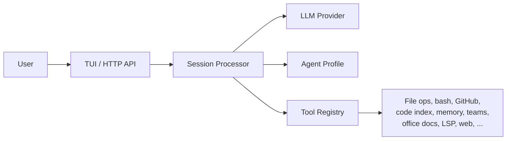

### Key Capabilities

| Capability | Summary |
|-----------|---------|
| **Multi-provider LLM** | 7 providers with automatic model discovery, health monitoring, streaming, vision, and reasoning levels |
| **Terminal UI** | Full-screen ratatui interface with streaming markdown, syntax highlighting, slash commands, and image support |
| **HTTP Server** | REST + SSE API (Axum) for headless operation and external integrations |
| **Tool System** | 147+ tools: file ops, shell, search, GitHub, GitLab, code index, memory, journal, teams, sub-agents, LSP, office/PDF, web, MCP |
| **Code Intelligence** | Tree-sitter parsing (15+ languages), Tantivy FTS, symbol/reference search, and optional LSP integration |
| **Persistent Memory** | Three-tier system — file blocks, structured SQLite store, and optional embedding-based semantic search — with automatic extraction, decay, compaction, and a knowledge graph |
| **Teams & Swarms** | Multi-agent coordination with named teammates, shared task lists, mailbox messaging, and swarm decomposition for parallel work |
| **Security** | Permission rules (allow/deny/ask), 7-layer bash safety, file-path guards, secret redaction, resource limits, and YOLO mode for trusted environments |
| **Skills** | Loadable skill packs (bundled or custom YAML) that inject tools, prompts, and file context into agent sessions |
| **Custom Agents** | OASF-based agent profiles with configurable models, tools, permissions, and personality |
| **Autopilot** | Autonomous operation mode with configurable iteration limits and permission auto-approval |
| **AIWiki** | Project-scoped knowledge base with LLM-powered extraction, multi-format ingestion (MD/PDF/DOCX/ODT/TXT plus supported source code), optional autosync/watch mode, web interface, entity/concept graphs, and agent-accessible search |

### Who It's For

Ragent is designed for software developers and teams who want an AI assistant
that lives in their terminal, respects their security boundaries, and learns
from their workflow over time. It is equally suited to interactive pair-programming
sessions and headless CI/CD integration via its HTTP API.

### Technology

| Aspect | Detail |
|--------|--------|
| **Language** | Rust (edition 2024) |
| **Async runtime** | tokio |
| **TUI framework** | ratatui + crossterm |
| **HTTP framework** | Axum |
| **Database** | SQLite (rusqlite, compiled-in) |
| **Full-text search** | Tantivy |
| **Code parsing** | tree-sitter (15+ grammars compiled-in) |
| **Embeddings** | ONNX Runtime (optional, `all-MiniLM-L6-v2`) |
| **Binary size** | Single static binary, ~50 MB release |
| **Platforms** | Linux, macOS, Windows (cross-compiled) |

### Project Status

Ragent is in **alpha** (v0.1.0-alpha.48). The core architecture, tool system,
TUI, HTTP server, memory system, teams, security layer, and AIWiki knowledge base
are functional and under active development. The specification below documents
the current state of all subsystems.

**Current Release Highlights:**
- **Permission System Milestones Complete:**
  - Milestone 1: Core Permission System (7 tasks, 20 tests passing)
  - Milestone 2: Bash Security — 7 Layers (8 tasks, 27+ tests passing)
- Permission dialog countdown timer now redraws live in the TUI with a 120-second timeout and `EXPIRED` state
- Slash-command autocomplete now closes cleanly on `Esc` while preserving input and clamping the cursor safely
- Config parse errors now report the file path, line, column, problematic line, and a caret marker for faster recovery
- Codeindex tools are hardwired as always-allowed read-only tools and no longer trigger permission prompts
- Workspace crate reorganisation milestones extracted `ragent-types`, `ragent-config`, `ragent-storage`, and `ragent-llm`
- 147+ tools across 18 categories including comprehensive team coordination tools
- Native GitLab integration with issues, merge requests, and CI/CD pipeline management

---


## Table of Contents

- [Executive Summary](#executive-summary)

### Part I: Foundation & Basics

1. [Overview](#overview)
2. [Architecture](#architecture)
3. [Core Features](#core-features)
4. [Terminal User Interface (TUI)](#terminal-user-interface-tui)
5. [HTTP Server & API](#http-server-api)

### Part II: Data & Knowledge Systems

6. [Code Index](#code-index)
7. [Memory System](#memory-system)
8. [AIWiki Knowledge Base](#aiwiki-knowledge-base)

### Part III: Multi-Agent Coordination

9. [Teams](#teams)
10. [Swarm Mode](#swarm-mode)
11. [Autopilot Mode](#autopilot-mode)
12. [Orchestrator & Multi-Agent Coordination](#orchestrator-multi-agent-coordination)

### Part IV: Customization & Extension

13. [Custom Agents](#custom-agents)
14. [Skills System](#skills-system)
15. [Prompt Optimization](#prompt-optimization)
16. [Configuration](#configuration)

### Part V: External Integrations

17. [LSP Integration](#lsp-integration)
18. [GitLab Integration](#gitlab-integration)
19. [MCP Integration (Model Context Protocol)](#mcp-integration-model-context-protocol)

### Part VI: Reference Materials

20. [Tool Reference](#tool-reference)
21. [Office, LibreOffice, and PDF Document Tools](#office-libreoffice-and-pdf-document-tools)
22. [CLI Command Reference](#cli-command-reference)
23. [Testing & CI/CD](#testing-cicd)

### Part VII: Security & Operations

24. [Security & Permissions](#security-permissions)
25. [Auto-Update Mechanism](#auto-update-mechanism)

**Appendices**

- [Appendix A: Version History](#appendix-a-version-history)
- [Appendix B: Documentation](#appendix-b-documentation)
- [Appendix C: Project Contact & Repository](#appendix-c-project-contact--repository)
- [Appendix D: Changelog (2025-01-16)](#appendix-d-changelog-2025-01-16)

### List of Diagrams

| # | Diagram | Section | Description |
|---|---------|---------|-------------|
| 1 | [Core Execution Loop](#how-it-works) | Executive Summary | High-level session/agent/tool flow |
| 2 | [System Architecture](#2-architecture) | Architecture | Full crate and component topology |
| 3 | [Crate Dependency Graph](#22-crate-dependency-graph) | Workspace Crates | Inter-crate dependency relationships |
| 4 | [Event Bus Flow](#23-event-bus-flow) | Architecture | Internal pub/sub message routing |
| 5 | [Session & Tool Execution Flow](#35-session--tool-execution-flow) | Core Features | LLM call → permission → tool dispatch loop |
| 6 | [Provider Selection Flow](#36-provider-selection-flow) | Core Features | Multi-provider routing and health checks |
| 7 | [TUI Component Architecture](#44-tui-component-architecture) | Terminal User Interface | UI layout and event wiring |
| 8 | [HTTP API Request Flow](#54-http-api-request-flow) | HTTP Server & API | REST + SSE lifecycle |
| 9 | [Code Index Pipeline](#62-architecture) | Code Index | File scan → parse → index → search |
| 10 | [Permission Security Layers](#241-permission-security-layers) | Security & Permissions | 5-layer defense-in-depth |
| 11 | [Bash Security — 7 Layers](#242-bash-security--7-layers) | Security & Permissions | Bash command defense flow |
| 12 | [Permission Request Flow](#243-permission-request-flow) | Security & Permissions | From tool call to user decision |
| 13 | [Permission Rules Evaluation](#244-permission-rules-evaluation) | Security & Permissions | Rule matching and resolution |

---


---

# Part I: Foundation & Basics

---

## 1. Overview

Ragent is an AI coding agent for the terminal, built in Rust. It provides multi-provider LLM orchestration, a built-in tool system, terminal UI, and client/server architecture — all compiled into a single statically-linked binary.

### 1.1 Key Characteristics

- **Multi-provider LLM support** — Anthropic, OpenAI, GitHub Copilot, Ollama, and Generic OpenAI-compatible APIs
- **Comprehensive tool system** — 147+ tools covering file operations, code analysis, GitHub/GitLab integration, web access, office documents, memory, teams, and more
- **Built-in TUI** — Full-screen ratatui interface with streaming chat, slash commands, and real-time updates
- **HTTP server** — REST + SSE API for external integrations
- **Zero external dependencies** — Self-contained binary with SQLite, Tantivy, and tree-sitter compiled in

---


## 2. Architecture

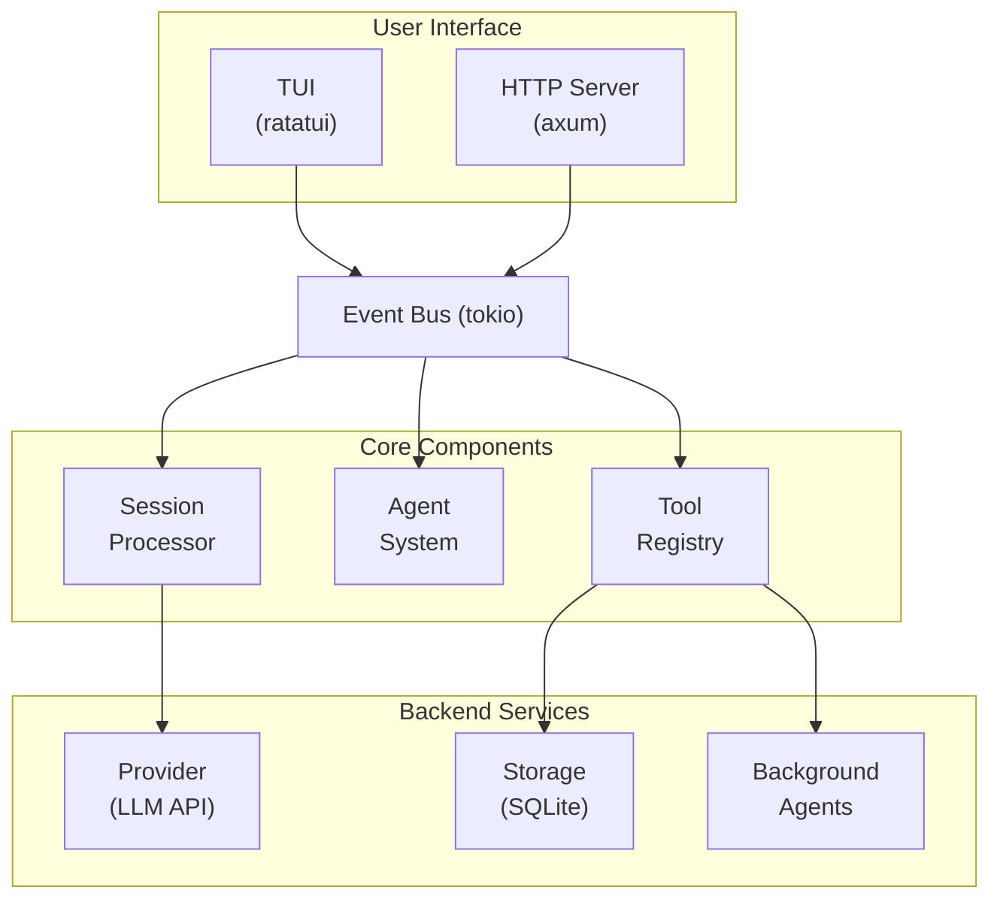

### 2.3 Event Bus Flow

The event bus is a central tokio broadcast channel that connects all subsystems. Every component publishes events and subscribes to events it cares about.

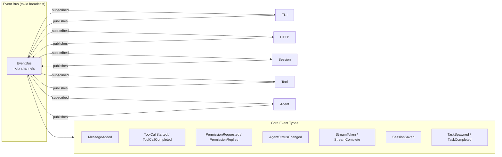

**Event Flow Example — Tool Execution:**
1. `Session` sends tool call request to `Tool`
2. `Tool` publishes `ToolCallStarted` event
3. `TUI` receives event → updates log panel
4. `Tool` executes and publishes `ToolCallCompleted` with result
5. `Session` receives result → adds to conversation history
6. `Session` publishes `MessageAdded` → TUI updates chat panel

---

| Crate | LOC % | Purpose |
|-------|------:|---------|
| `ragent-agent` | 34.61% | Agent/runtime layer: sessions, orchestration, MCP/LSP, memory, tool registry |
| `ragent-aiwiki` | 7.89% | Embedded wiki knowledge base, extraction pipeline, and web interface |
| `ragent-codeindex` | 9.11% | Codebase indexing: tree-sitter parsing, SQLite store, Tantivy FTS, file watcher |
| `ragent-config` | 1.29% | Configuration types, defaults, and parsing |
| `ragent-llm` | 4.04% | Provider clients and model/provider registry |
| `ragent-prompt_opt` | 0.40% | Prompt optimization transformations |
| `ragent-server` | 2.47% | Axum HTTP routes and SSE streaming |
| `ragent-storage` | 1.70% | SQLite storage, snapshots, and encrypted credential persistence |
| `ragent-team` | 3.63% | Team runtime, team state, and team tools |
| `ragent-tools-core` | 3.56% | Core shell/file/search tools |
| `ragent-tools-extended` | 7.08% | Extended document/web/memory/codeindex/LSP tools |
| `ragent-tools-vcs` | 2.08% | GitHub and GitLab tool surface |
| `ragent-tui` | 20.92% | Ratatui terminal interface |
| `ragent-types` | 1.21% | Shared IDs, events, messages, and sanitization primitives |

Percentages are based on a fresh count of current Rust `.rs` lines across workspace crates (167,466 total).

### 2.2 Crate Dependency Graph

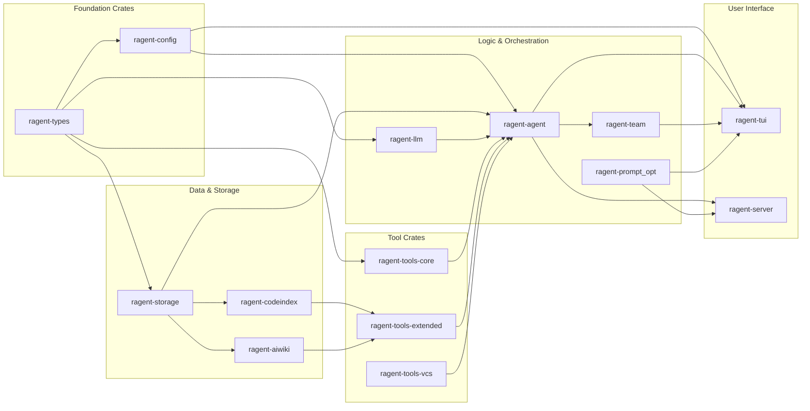

**Dependency Rules:**
- Foundation crates (`types`, `config`) have no internal dependencies
- `storage` depends only on `types`
- `llm` depends on `types` and `config`
- Tool crates depend on `types` (and `codeindex` for extended tools)
- `agent` is the integration layer — it depends on most other crates
- `team` depends on `agent` types
- `tui` and `server` are terminal layers that depend on `agent` and `team`
- Circular dependencies are prohibited; the graph is strictly acyclic

---

---


## 3. Core Features

### 3.1 LLM Providers

#### Supported Providers

| Provider | ID | Authentication | Features |
|----------|-----|---------------|----------|
| **Anthropic** | `anthropic` | `ANTHROPIC_API_KEY` | Streaming, tools, vision, reasoning |
| **OpenAI** | `openai` | `OPENAI_API_KEY` | Streaming, tools, vision |
| **GitHub Copilot** | `copilot` | Auto-discovered from VS Code | Streaming, tools, vision, reasoning levels |
| **Ollama** | `ollama` | No key required | Local models, streaming |
| **Ollama Cloud** | `ollama_cloud` | `OLLAMA_API_KEY` | Remote Ollama servers, dynamic model discovery, vision |
| **Hugging Face** | `huggingface` | `HF_TOKEN` | Streaming, tools, vision, dynamic model discovery |
| **Generic OpenAI** | `generic_openai` | `GENERIC_OPENAI_API_KEY` | Any OpenAI-compatible endpoint |
| **Google Gemini** | `gemini` | `GEMINI_API_KEY` | Streaming, tools, vision, reasoning |

#### Provider Features

- **Health indicators** — Real-time connectivity status (● green/✗ red/● yellow)
- **Model discovery** — Automatic model listing from provider APIs
- **Vision support** — Image attachments for supported models
- **Reasoning levels** — Copilot accepts `reasoning_effort` or `reasoning_level` with `low`/`medium`/`high`/`none`
- **Context window display** — Status bar shows context utilization percentage
- **Extended thinking** — Anthropic extended thinking/reasoning support
- **Usage tracking** — Token usage, quota percentage, and provider plan display where available
- **Dynamic model metadata** — Provider model pickers surface live-discovered context windows, capabilities, and Copilot premium request multipliers

#### Anthropic Models

| Model | Context | Max Output | Capabilities |
|-------|---------|------------|--------------|
| `claude-sonnet-4-20250514` | 200,000 | 64,000 | reasoning, streaming, vision, tool_use |
| `claude-3-5-haiku-latest` | 200,000 | 8,192 | streaming, vision, tool_use |

#### OpenAI Models

| Model | Context | Max Output | Capabilities |
|-------|---------|------------|--------------|
| `gpt-4o` | 128,000 | 16,384 | streaming, vision, tool_use |
| `gpt-4o-mini` | 128,000 | 16,384 | streaming, vision, tool_use |

#### Ollama Cloud Provider

The Ollama Cloud provider connects to remote Ollama servers using native `/api/chat` and `/api/tags` endpoints with Bearer token authentication.

**Configuration:**
- **Environment Variable:** `OLLAMA_API_KEY` — API key for authenticated Ollama Cloud instances
- **Default Endpoint:** `https://ollama.com`
- **Custom Endpoint:** Configurable via `base_url` in `ragent.json`

**Features:**
- **Dynamic Model Discovery** — Automatically fetches available models from `/api/tags` endpoint
- **Context Window Detection** — Queries `/api/show` to retrieve actual context length from model metadata
- **Vision Capability Detection** — Automatically detects vision support from model capabilities
- **Streaming Support** — Native SSE streaming via `/api/chat` endpoint
- **Tool Support** — Compatible with Ollama tool-calling format

**Model Listing:**
```bash
ragent models --provider ollama_cloud
```

**Configuration Example (`ragent.json`):**
```json
{
  "provider": {
    "ollama_cloud": {
      "apiKey": "ollama_api_key_here",
      "models": {
        "llama3.2": { "max_tokens": 8192 }
      }
    }
  }
}
```

#### Ollama (Local) Provider

The local Ollama provider connects to self-hosted Ollama instances (no authentication required for local servers).

**Configuration:**
- **Environment Variable:** `OLLAMA_HOST` (optional) — Custom server URL (default: `http://127.0.0.1:11434`)
- **No API Key Required** — Local Ollama servers run without authentication

**Features:**
- **Local Model Execution** — Run models on local hardware (CPU/GPU)
- **Dynamic Discovery** — Lists locally available models via `/api/tags` at runtime (placeholder defaults are only used as fallback metadata)
- **OpenAI-Compatible API** — Uses `/v1/chat/completions` endpoint
- **Streaming Support** — Full SSE streaming

**Model Listing:**
```bash
ragent models --provider ollama
```

#### Google Gemini Provider

The Google Gemini provider connects to Google's Gemini API for state-of-the-art multimodal models with extensive context windows.

**Authentication:** `GEMINI_API_KEY` environment variable

**Default Models:**

| Model | Context | Cost (Input/Output) | Capabilities |
|-------|---------|---------------------|--------------|
| `gemini-2.5-flash-preview-05-20` | 1,048,576 | $0.15 / $0.60 | reasoning, streaming, vision, tool_use |
| `gemini-2.5-pro-preview-05-06` | 1,048,576 | $1.25 / $10.00 | reasoning, streaming, vision, tool_use |
| `gemini-2.0-flash` | 1,048,576 | $0.10 / $0.40 | streaming, vision, tool_use |
| `gemini-2.0-flash-lite` | 1,048,576 | $0.075 / $0.30 | streaming, vision, tool_use |
| `gemini-1.5-flash` | 1,048,576 | $0.075 / $0.30 | streaming, vision, tool_use |
| `gemini-1.5-pro` | 2,097,152 | $1.25 / $5.00 | reasoning, streaming, vision, tool_use |

**Features:**
- **Streaming** — Real-time token-by-token response streaming
- **Tool Use** — Native function calling for all models
- **Vision** — Image understanding capabilities
- **Reasoning** — Available on Pro and Flash 2.5 models
- **Massive Context Windows** — Up to 2M tokens on 1.5 Pro

**API Base:** `https://generativelanguage.googleapis.com`

#### Hugging Face Provider

The HuggingFace provider connects to the HuggingFace Inference API, which exposes an OpenAI-compatible `/v1/chat/completions` endpoint. Supports both the free/Pro shared Inference API and dedicated Inference Endpoints.

**Authentication:**
- **Primary:** `HF_TOKEN` environment variable (standard HuggingFace token)
- **Legacy:** `HUGGING_FACE_HUB_TOKEN` (older HF token name)
- **Ragent convention:** `RAGENT_API_KEY_HUGGINGFACE` (auto-checked)

**Default Models:**

| Model | Context | Capabilities |
|-------|---------|--------------|
| `meta-llama/Llama-3.1-8B-Instruct` | 128,000 | streaming, tool_use |
| `meta-llama/Llama-3.1-70B-Instruct` | 128,000 | streaming, tool_use |
| `mistralai/Mixtral-8x7B-Instruct-v0.1` | 32,000 | streaming, tool_use |
| `Qwen/Qwen2.5-72B-Instruct` | 128,000 | streaming, tool_use |
| `microsoft/Phi-3-mini-4k-instruct` | 4,096 | streaming |

**Features:**
- **OpenAI-Compatible API** — Uses `/v1/chat/completions` endpoint (same as OpenAI)
- **Streaming Support** — Full SSE streaming with tool call deltas
- **Tool Use** — Function calling for models that support it (Llama 3.1+, Mixtral, Qwen)
- **Dynamic Model Discovery** — Queries HuggingFace Hub API for available text-generation models with warm inference endpoints (up to 50 models)
- **Model Loading Detection** — Detects 503 "model loading" responses with estimated wait time
- **Gated Model Handling** — Clear error messages for models requiring license acceptance
- **Rate Limit Tracking** — Parses `X-RateLimit-Limit`/`X-RateLimit-Remaining` headers
- **Tool Name Compatibility** — Internally prefixes tool names sent to the Hugging Face router to avoid streaming-mode name rejection, then maps responses back to canonical ragent tool names

**Provider-Specific Options:**

| Option | Type | Default | Description |
|--------|------|---------|-------------|
| `wait_for_model` | bool | `true` | Send `x-wait-for-model: true` header to wait for cold models |
| `use_cache` | bool | `true` | Enable server-side response caching |

**Inference Endpoints:**

For dedicated deployments, configure the custom endpoint URL:
```json
{
  "provider": {
    "huggingface": {
      "api": {
        "base_url": "https://my-endpoint.endpoints.huggingface.cloud"
      }
    }
  }
}
```

**Model Listing:**
```bash
ragent models --provider huggingface
```

### 3.2 Tool System

#### File Operations Tools (26)

| Tool | Purpose |
|------|---------|
| `read` | Read file contents with line range support |
| `write` | Create new files |
| `edit` | Replace text in existing files |
| `create` | Create new file (alternative to write) |
| `rm` | Delete single files |
| `move_file` | Move/rename files and directories |
| `copy_file` | Copy files to new location |
| `mkdir` | Create directories (mkdir -p) |
| `append_file` | Append text to end of file |
| `file_info` | Get metadata (size, mtime, type) |
| `diff_files` | Compare two files |
| `glob` | Find files matching glob patterns |
| `list` | List directory contents |
| `multiedit` | Atomic multi-file edits |
| `patch` | Apply unified diff patches |
| `str_replace_editor` | Multi-command file editor |
| `file_ops_tool` | Combined file operations |

#### File Operation Aliases

The following are aliases for commonly requested operations:

| Alias | Maps To |
|-------|---------|
| `view_file`, `read_file`, `get_file_contents`, `open_file` | `read` |
| `list_files`, `list_directory` | `list` |
| `find_files` | `glob` |
| `replace_in_file`, `update_file` | `edit` |
| `search`, `search_in_repo`, `file_search` | `grep` |

#### Execution Tools (10)

| Tool | Purpose |
|------|---------|
| `bash` | Execute shell commands with security restrictions |
| `bash_reset` | Reset bash shell state |
| `execute_python` | Run Python code snippets |
| `run_code` / `execute_code` / `execute_bash` / `run_shell_command` / `run_terminal_cmd` | Aliases for bash/code execution |

#### Interactive Tools (3)

| Tool | Purpose |
|------|---------|
| `question` / `ask_user` | Interactive user prompts |
| `think` | Record reasoning notes (no-op) |
| `todo_read` | Read TODO items |
| `todo_write` | Manage TODO items |

#### Utility Tools (3)

| Tool | Purpose |
|------|---------|
| `calculator` | Evaluate mathematical expressions |
| `get_env` | Read environment variables |

### 3.2.1 Tool System Categories Summary

| Category | Count | Description |
|----------|-------|-------------|
| **File Operations** | 26 | read, write, edit, create, rm, move, copy, mkdir, append, diff, multiedit, patch, etc. |
| **Execution** | 10 | bash, bash_reset, execute_python, aliases |
| **Search** | 4 | grep and aliases |
| **Web** | 3 | webfetch, websearch, http_request |
| **Office** | 6 | office_read/write/info, libre_read/write/info |
| **PDF** | 2 | pdf_read, pdf_write |
| **Code Index** | 6 | codeindex_search, symbols, references, dependencies, status, reindex |
| **GitHub** | 10 | Issues and PR management |
| **GitLab** | 19 | Issues, merge requests, pipelines, and jobs |
| **Memory** | 12 | memory_read/write/replace/store/recall/forget/search/migrate |
| **Journal** | 3 | journal_write, journal_search, journal_read |
| **Team** | 21 | Team lifecycle, tasks, messaging, coordination |
| **Sub-agent** | 5 | new_task, cancel_task, list_tasks, wait_tasks, task_complete |
| **LSP** | 6 | lsp_hover, definition, references, symbols, diagnostics |
| **Plan** | 2 | plan_enter, plan_exit |
| **MCP** | 1 | mcp_tool (McpToolWrapper) |
| **Interactive** | 4 | question, think, todo_read/write |
| **Utility** | 3 | calculator, get_env |
| **TOTAL** | **147+** | All tools including aliases |

#### Team Tools (21)

| Tool | Purpose |
|------|---------|
| `team_create` | Create new team |
| `team_spawn` | Spawn teammate agent |
| `team_cleanup` | Cleanup team resources |
| `team_status` | Get team status |
| `team_idle` | Signal idle state |
| `team_task_create` | Create team task |
| `team_task_claim` | Claim task to work on |
| `team_task_complete` | Mark task complete |
| `team_task_list` | List team tasks |
| `team_assign_task` | Assign task to specific teammate |
| `team_message` | Send message to team member |
| `team_broadcast` | Broadcast to all teammates |
| `team_read_messages` | Read mailbox messages |
| `team_shutdown_teammate` | Request teammate shutdown |
| `team_shutdown_ack` | Acknowledge shutdown request |
| `team_submit_plan` | Submit plan for approval |
| `team_approve_plan` | Approve teammate plan |
| `team_wait` | Wait for teammates to complete |
| `team_memory_read` | Read team memory |
| `team_memory_write` | Write to team memory |

### 3.3 Agent System

#### Built-in Agents

| Agent | Purpose | Tool Groups |
|-------|---------|-------------|
| `general` | General-purpose assistant | All tools |
| `coder` | Code-focused tasks | File, bash, search |
| `task` | Task execution | File, bash |
| `architect` | Design and planning | All tools |
| `ask` | Question answering | Read-only tools |
| `debug` | Debugging assistance | File, bash, search |
| `code-review` | Code review | Read, diff, github |
| `orchestrator` | Multi-agent coordination | All tools |

#### Agent Features

- **Custom agents** — User-defined agents via JSON (OASF format) or Markdown profiles
- **Template variables** — Dynamic injection of context (`{{WORKING_DIR}}`, `{{FILE_TREE}}`, `{{AGENTS_MD}}`, `{{GIT_STATUS}}`, `{{README}}`)
- **Permission rules** — Per-agent access control for file paths and commands
- **Memory scoping** — Project-level and user-level memory for agents

### 3.3.1 GitHub Integration Tools

ragent provides native GitHub issue and pull request tools that auto-detect
the repository owner and name from the local git remote configuration.

#### Issue Tools

| Tool | Description | Parameters |
|------|-------------|------------|
| `github_issues_list` | List issues with filtering | `state` (open/closed/all), `labels`, `limit` |
| `github_issues_get` | Get issue details | `number` |
| `github_issues_create` | Create a new issue | `title`, `body`, `labels`, `assignees` |
| `github_issues_comment` | Add comment to an issue | `number`, `body` |
| `github_issues_close` | Close an issue | `number`, `comment` (optional) |

#### Pull Request Tools

| Tool | Description | Parameters |
|------|-------------|------------|
| `github_pr_list` | List pull requests | `state`, `base`, `limit` |
| `github_pr_get` | Get PR details and diff | `number` |
| `github_pr_create` | Create a new pull request | `title`, `body`, `base`, `head`, `draft` |
| `github_pr_merge` | Merge a pull request | `number`, `method` (merge/squash/rebase) |
| `github_pr_review` | Submit a PR review | `number`, `event` (approve/comment/request_changes), `body` |

#### Auto-Detection

Owner and repository are automatically detected from the git remote:

```text
git remote get-url origin
→ https://github.com/owner/repo.git  → owner="owner", repo="repo"
→ git@github.com:owner/repo.git      → owner="owner", repo="repo"
```

Falls back to explicit `--owner` and `--repo` parameters if detection fails.

### 3.5 Session & Tool Execution Flow

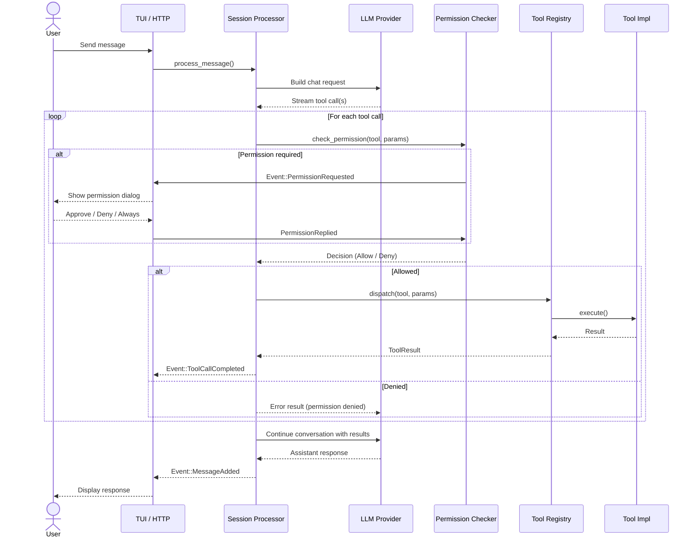

---

### 3.6 Provider Selection Flow

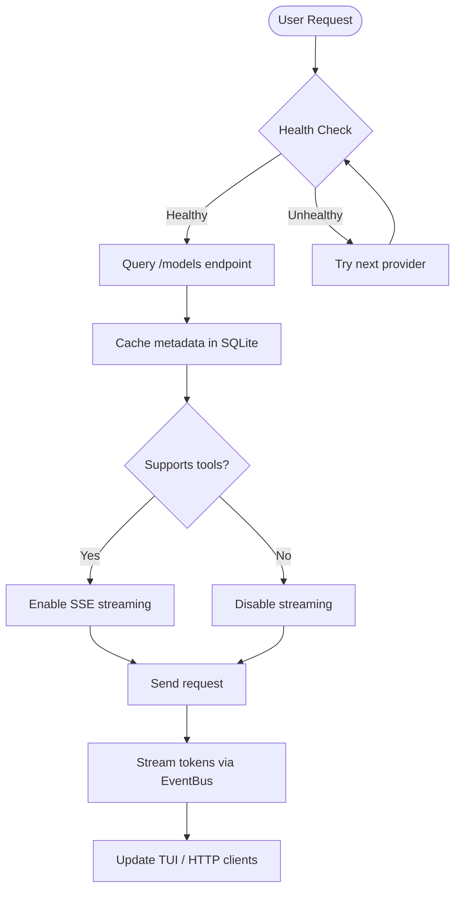

---

- **Persistent storage** — SQLite-backed conversation history
- **Session commands** — `ragent session list`, `resume`, `export`, `import`
- **Step numbering** — Session-prefixed step numbers (`[sid:step]`) for traceability
- **Context compaction** — Automatic pre-send context management near window limits

---


## 4. Terminal User Interface (TUI)

### 4.1 TUI Windows and Overlay Panels

The ragent TUI is built on a multi-layer architecture with a main chat screen, modal overlays, popup windows, and sidebar panels. Each window serves a specific purpose in the user workflow.

#### 4.1.1 Main Screen (Chat)

The primary interface where all conversation happens.

| Component | Description |
|-----------|-------------|
| **Status Bar (Line 1)** | Shows session ID, agent name, working directory, git branch, and current status message |
| **Status Bar (Line 2)** | Displays provider/model, quota or token usage, context utilization, active tasks, and service indicators such as LSP, code index, AIWiki, and AIWiki autosync |
| **Messages Panel** | Scrollable conversation history with syntax highlighting and formatted tool calls |
| **Input Area** | Multi-line text input with autocomplete support for slash commands and file references |
| **Log Panel** | Toggleable panel showing step-numbered tool calls with pretty-printed JSON |
| **Active Agents Subpanel** | Sidebar showing running background agents with progress indicators |
| **Teams Subpanel** | Sidebar displaying team members, their status, and message counts |

**Access**: This is the default screen when ragent starts (after initial setup).

---

#### 4.1.2 Provider Setup Dialog (Modal)

Multi-step wizard for configuring LLM providers.

| Step | Description |
|------|-------------|
| **Select Provider** | Choose from Anthropic, OpenAI, GitHub Copilot, Ollama, Ollama Cloud, or Generic OpenAI |
| **Enter API Key** | Secure input with masked characters and endpoint URL entry for Generic OpenAI |
| **Device Flow** | GitHub Copilot OAuth flow with user code and verification URL |
| **Select Model** | Browse available models with metadata (context window, cost, capabilities, and Copilot premium request multiplier where available) |
| **Select Agent** | Choose default agent personality |
| **Reset Provider** | Remove stored credentials for a provider |
| **Done** | Confirmation screen showing configured provider and model |

**Access**: `/provider` command, or auto-triggered at first startup

---

#### 4.1.4 Agents Popup Window

A floating popup window showing active background agents and their status.

**Purpose**: Monitor and switch between multiple concurrent agent sessions.

**Features**:
- List of active agents with session IDs
- Agent status indicators (running, idle, error)
- Message count per agent
- Click to focus specific agent session
- Close button to dismiss

**Access**: Click "Agents" button or press `a`

---

#### 4.1.5 Teams Popup Window

A floating popup for team coordination when managing multiple teammates.

**Purpose**: Coordinate work across a team of specialized agents.

**Features**:
- Team member list with status
- Message counts (sent/received per teammate)
- Focus indicator for active teammate
- Task assignment interface
- Broadcast messaging capability

**Access**: Click "Teams" button or press `F10`

---

#### 4.1.6 Slash Command Autocomplete Menu

An inline popup menu that appears when typing `/` in the input area.

**Purpose**: Quick discovery and selection of slash commands.

**Features**:
- Real-time filtering as you type
- Command descriptions
- Skill vs. builtin command indicators
- Keyboard navigation (↑/↓) and Enter to select
- `Esc` closes the menu while preserving the partially typed input and keeping the cursor within valid bounds

**Access**: Type `/` in input area

---

#### 4.1.7 File Reference Autocomplete Menu (`@` Menu)

An inline popup for selecting files when using `@` references.

**Purpose**: Quickly reference files in the conversation.

**Features**:
- Fuzzy file search across project
- Directory navigation mode
- Hidden file toggle
- Recently used files prioritized
- Preview of selected file

**Access**: Type `@` in input area, optionally followed by partial filename

---

#### 4.1.8 History Picker Overlay

A scrollable overlay for browsing and reusing previous inputs.

**Purpose**: Quickly recall and resend previous prompts.

**Features**:
- Chronological list of previous inputs
- Search/filter capability
- Enter to insert, Esc to cancel
- Persistent across sessions (stored in SQLite)

**Access**: `/history` command or Up arrow with empty input

---

#### 4.1.9 Permission Dialog (Modal)

Centered modal for approving or denying permission requests.

**Purpose**: Security gate for file writes, shell commands, and external access.

**Features**:
- Permission type indicator (file:write, bash:execute, etc.)
- Target path or command preview
- One-time (y/n) or always allow options
- Question mode with text input for user prompts

**Access**: Auto-triggered when tool requires permission

---

#### 4.1.10 Context Menu (Right-Click)

A small popup menu for text operations.

**Purpose**: Standard text editing operations in any pane.

**Features**:
- Cut selected text
- Copy to clipboard
- Paste from clipboard
- Context-aware (disabled when no selection)

**Access**: Right-click in any pane

---

#### 4.1.11 LSP Discovery Dialog (Overlay)

An overlay listing discovered Language Server Protocol servers.

**Purpose**: Enable code intelligence features by connecting to LSP servers.

**Features**:
- Numbered list of discovered servers
- Server type and command preview
- Number input to select and enable
- Connection status feedback

**Access**: `/lsp discover` command

---

#### 4.1.12 LSP Edit Dialog (Overlay)

Interactive dialog for managing configured LSP servers.

**Purpose**: Enable/disable LSP servers without editing config files.

**Features**:
- Table of configured servers with enabled/disabled status
- Arrow key navigation
- Space/Enter to toggle status
- Persistent changes to ragent.json

**Access**: `/lsp edit` command

---

#### 4.1.13 MCP Discovery Dialog (Overlay)

An overlay for discovering Model Context Protocol servers.

**Purpose**: Extend tool capabilities via MCP servers.

**Features**:
- Numbered list of discovered MCP servers
- Server metadata display
- Number input to connect
- Connection feedback

**Access**: `/mcp discover` command

---

#### 4.1.14 Output View Overlay

A scrollable panel for viewing raw agent or team member output.

**Purpose**: Inspect unformatted output from specific agents or team members.

**Features**:
- Session output viewer
- Team member output viewer
- Scrollable content
- Syntax highlighting for code

**Access**: Auto-triggered for certain tool outputs or team member responses

---

#### 4.1.15 Memory Browser Overlay

A full-panel overlay for browsing memory blocks.

**Purpose**: View and manage persistent memory across sessions.

**Features**:
- List of global and project memory blocks
- Size indicators (with warnings for blocks near limit)
- Expand/collapse to view full content
- Keyboard navigation (j/k, Enter, Esc)
- Search and filter capabilities

**Access**: `/memory` command

---

#### 4.1.16 Journal Viewer Overlay

A full-panel overlay for browsing journal entries.

**Purpose**: Review recorded insights, decisions, and discoveries.

**Features**:
- Chronological list of journal entries
- Tag filtering and search
- Expand to view full entry content
- Add new entries inline
- FTS5 full-text search support

**Access**: `/journal` command

---

#### 4.1.17 Plan Approval Dialog (Modal)

A centered dialog for approving or rejecting plans from the plan agent.

**Purpose**: Human-in-the-loop approval for plan agent proposals.

**Features**:
- Plan text display with scrollable content
- Approve/Reject buttons
- Cursor navigation between options
- On approve: switches to plan agent and executes
- On reject: returns to previous agent

**Access**: Auto-triggered when plan agent submits a plan

---

#### 4.1.18 Force-Cleanup Confirmation Modal

A confirmation dialog for destructive team cleanup operations.

**Purpose**: Prevent accidental data loss when force-cleaning team resources.

**Features**:
- Warning message with team name
- List of active members that will be affected
- Explicit confirmation required
- Cancel option

**Access**: Triggered by `/team cleanup` when team has active members

---

#### 4.1.19 Keybindings Help Panel (Overlay)

A scrollable help panel showing all keyboard shortcuts.

**Purpose**: Quick reference for TUI controls.

**Features**:
- Categorized keybindings
- Context-aware help (shows relevant shortcuts)
- Search within help
- Scroll with arrow keys

**Access**: `?` key when input is empty, or `/help` command

---

#### 4.1.20 Session/Message Widget Overlays

Various inline widgets rendered within the message panel.

| Widget | Purpose |
|--------|---------|
| **MessageWidget** | Renders individual chat messages with markdown formatting, syntax highlighting, and inline tool call summaries |
| **Tool Result Summaries** | Collapsible sections showing tool execution results |
| **File Diff Widgets** | Side-by-side or inline diffs for file edits |
| **Image Widgets** | Renders attached images with dimensions and preview |

---

#### 4.1.21 Window State Summary

| State Field | Window | Access |
|-------------|--------|--------|
| `provider_setup` | Provider Setup Dialog | `/provider`, startup |
| `show_agents_window` | Agents Popup | Click "Agents" button, `a` key |
| `show_teams_window` | Teams Popup | Click "Teams" button, `F10` key |
| `slash_menu` | Slash Command Menu | Type `/`; `Esc` closes without clearing the partially typed command |
| `file_menu` | File Reference Menu | Type `@` |
| `history_picker` | History Picker | `/history`, Up arrow |
| `permission_queue` | Permission Dialog | Auto (tool permission) |
| `context_menu` | Right-Click Menu | Right-click |
| `lsp_discover` | LSP Discovery | `/lsp discover` |
| `lsp_edit` | LSP Edit | `/lsp edit` |
| `mcp_discover` | MCP Discovery | `/mcp discover` |
| `output_view` | Output View | Auto (tool output) |
| `memory_browser` | Memory Browser | `/memory` |
| `journal_viewer` | Journal Viewer | `/journal` |
| `plan_approval_pending` | Plan Approval | Auto (plan submission) |
| `pending_forcecleanup` | Force-Cleanup Modal | `/team cleanup` (with active) |
| `show_shortcuts` | Keybindings Help | `?` (empty input), `/help` |

---

### 4.2 Slash Commands

| Command | Purpose |
|---------|---------|
| **Core** ||
| `/about` | Show application info, version, and authors |
| `/help` | Show available slash commands |
| `/quit`, `/exit` | Exit ragent |
| **Session & Agent** ||
| `/agent <name>` | Switch to specific agent |
| `/agents` | List all agents (built-in and custom) |
| `/clear` | Clear conversation history |
| `/compact` | Summarize and compact conversation history |
| `/resume` | Resume agent from halted state |
| `/system <prompt>` | Override agent system prompt |
| **Provider & Model** ||
| `/model` | Switch active model on current provider |
| `/provider` | Change LLM provider |
| `/provider_reset` | Reset provider and remove stored credentials |
| `/llmstats` | Show LLM response time and token throughput |
| `/cost` | Show token usage and estimated cost |
| **Context & Config** ||
| `/context refresh` | Clear cached file tree, git status, README |
| `/browse_refresh` | Refresh @ file-picker project index |
| `/reload [all\|config\|mcp\|skills\|agents]` | Reload customizations |
| `/init` | Analyze project and write to PROJECT_ANALYSIS.md |
| **Tasks** ||
| `/tasks` | List active background tasks |
| `/cancel_task <id>` | Cancel a background task |
| `/abort` | Abort current running agent |
| **Tools** ||
| `/tools` | List available tools with parameters |
| `/bash allow <cmd>` | Add command to bash allowlist |
| `/bash deny <cmd>` | Add command to bash denylist |
| `/bash reset` | Reset bash shell state |
| **Code Index** ||
| `/codeindex on\|off` | Toggle code indexing |
| `/codeindex reindex` | Force full re-index |
| `/codeindex status` | Show index status |
| **Memory** ||
| `/memory` | Open memory browser |
| **AIWiki** ||
| `/aiwiki init` | Initialize AIWiki for current project |
| `/aiwiki on` | Enable AIWiki |
| `/aiwiki off` | Disable AIWiki |
| `/aiwiki status` | Show AIWiki status |
| `/aiwiki ingest <path>` | Ingest document(s) into AIWiki |
| `/aiwiki sync` | Sync wiki with raw/ folder |
| `/aiwiki clear` | Clear all AIWiki data |
| **Team** ||
| `/team create <name>` | Create new team |
| `/team open <name>` | Open existing team |
| `/team close` | Close team session |
| `/team delete <name>` | Delete team |
| `/team clear` | Clear team state |
| `/team tasks` | Show team tasks table |
| `/team status` | Show team status |
| `/team message <to> <content>` | Send message to teammate |
| `/team broadcast <content>` | Broadcast to all teammates |
| `/team spawn <agent>` | Spawn teammate agent |
| `/team cleanup` | Cleanup team resources |
| **MCP** ||
| `/mcp discover` | Discover MCP servers |
| `/mcp list` | List connected MCP servers |
| `/mcp call <server> <tool>` | Call MCP tool |
| **Optimization** ||
| `/opt <method> <prompt>` | Optimize prompt |
| `/opt help` | Show optimization methods |
| **Swarm & Autopilot** ||
| `/swarm <prompt>` | Auto-decompose goal into parallel subtasks |
| `/swarm status` | Check swarm execution status |
| `/autopilot on [--max-tokens N] [--max-time N]` | Enable autonomous operation |
| `/autopilot off` | Disable autonomous operation |
| `/autopilot status` | Show autopilot status |
| `/yolo` | Toggle YOLO mode (bypass all restrictions) |
| **Agent Modes & Planning** ||
| `/mode <role>` | Set agent role: architect, coder, reviewer, debugger, tester, off |
| `/plan <description>` | Delegate planning to the plan agent |
| **GitHub Integration** ||
| `/github login` | Authenticate with GitHub |
| `/github logout` | Remove GitHub credentials |
| `/github status` | Show GitHub connection status |
| **GitLab Integration** ||
| `/gitlab setup` | Configure GitLab connection (instance URL + PAT) |
| `/gitlab logout` | Remove GitLab credentials |
| `/gitlab status` | Show GitLab connection status |
| **Journal & Todos** ||
| `/journal` | View journal entries |
| `/journal search <query>` | Search journal entries |
| `/journal add <title>` | Add journal entry |
| `/todos` | Show TODO items |
| **LSP & Skills** ||
| `/lsp discover` | Discover LSP servers |
| `/lsp connect <id>` | Connect to LSP server |
| `/lsp disconnect <id>` | Disconnect LSP server |
| `/skills` | List registered skills |
| **Server & Diagnostics** ||
| `/webapi enable` | Enable HTTP REST API |
| `/webapi disable` | Disable HTTP REST API |
| `/doctor` | Run system diagnostics |
| `/update` | Check for updates |
| `/update install` | Install updates |
| **UI & History** ||
| `/log` | Toggle log panel visibility |
| `/history` | Browse previous inputs |
| `/inputdiag` | Input diagnostics |
| `/compact` | Compact context window |
| `/agent_compact` | Compact agent description |

### 4.3 Key Bindings

| Key | Action |
|-----|--------|
| `Enter` | Send message |
| `Ctrl+C` | Interrupt current operation |
| `Esc` | Clear input / Close overlay |
| `Tab` | Cycle focus between panels |
| `↑/↓` | Scroll message/log panels |
| `PgUp/PgDn` | Page scroll |
| `Home/End` | Jump to start/end |
| `Alt+V` | Paste image from clipboard |
| `Right-click` | Context menu (Cut/Copy/Paste) |
| `p` | Open provider setup |
| `?` (empty input) | Show keybindings help |

### 4.4 TUI Component Architecture

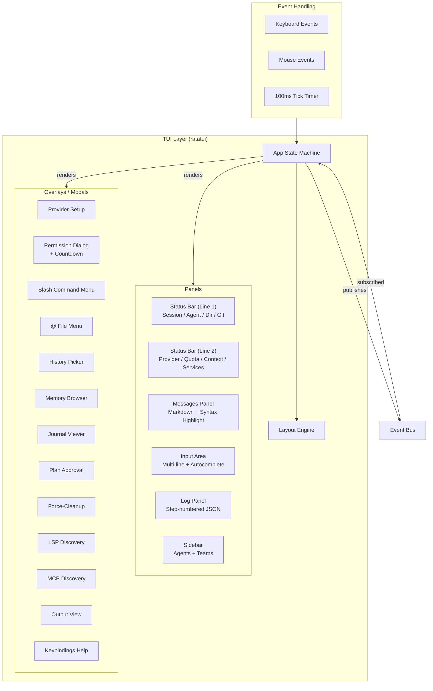

---

- **Streaming responses** — Real-time token streaming from LLM
- **Responsive two-line status bar** — Adapts between full, compact, and minimal layouts based on terminal width
- **Provider-aware usage display** — Shows quota percentage when available, otherwise token totals and context usage; Copilot plan labels and Ollama context labels are surfaced when known
- **AIWiki service indicators** — Status bar shows AIWiki enabled state and optional AutoSync state
- **Step-numbered tool calls** — Cross-session tool call correlation
- **Pretty-printed JSON** — Formatted tool parameters in log panel
- **Image attachments** — Visual support with clipboard paste
- **Mouse support** — Full mouse interaction
- **Auto-complete** — Slash command and agent name completion

---


## 5. HTTP Server & API

### 5.1 Server Commands

```bash
ragent serve              # Start server on default port (9100)
ragent serve --port 8080  # Custom port
```

### 5.2 API Endpoints

#### Health & Status

| Method | Endpoint | Description |
|--------|----------|-------------|
| `GET` | `/health` | Health check - returns "ok" |

#### Configuration & Providers

| Method | Endpoint | Description |
|--------|----------|-------------|
| `GET` | `/config` | Get current application configuration |
| `GET` | `/providers` | List configured provider IDs |

#### Sessions

| Method | Endpoint | Description |
|--------|----------|-------------|
| `GET` | `/sessions` | List all sessions |
| `POST` | `/sessions` | Create new session |
| `GET` | `/sessions/{id}` | Get session details |
| `DELETE` | `/sessions/{id}` | Archive/delete a session |
| `GET` | `/sessions/{id}/messages` | Get messages for a session |
| `POST` | `/sessions/{id}/messages` | Send message (returns SSE stream) |
| `POST` | `/sessions/{id}/abort` | Abort an active session |
| `POST` | `/sessions/{id}/permission/{req_id}` | Reply to a permission request |

#### Tasks (Background Agents)

| Method | Endpoint | Description |
|--------|----------|-------------|
| `GET` | `/sessions/{id}/tasks` | List tasks for a session |
| `POST` | `/sessions/{id}/tasks` | Spawn a new background task |
| `GET` | `/sessions/{id}/tasks/{tid}` | Get task details |
| `DELETE` | `/sessions/{id}/tasks/{tid}` | Cancel a task |

#### Server-Sent Events (SSE)

| Method | Endpoint | Description |
|--------|----------|-------------|
| `GET` | `/events` | Global SSE event stream (all sessions) |
| `GET` | `/sessions/{id}/messages` | Session-specific SSE stream |

#### Agents

| Method | Endpoint | Description |
|--------|----------|-------------|
| `GET` | `/agents` | List available agents |
| `GET` | `/agents/{name}` | Get agent details |

#### Tools

| Method | Endpoint | Description |
|--------|----------|-------------|
| `GET` | `/tools` | List available tools |
| `POST` | `/tools/{name}` | Execute tool |

#### Prompt Optimization

| Method | Endpoint | Description |
|--------|----------|-------------|
| `POST` | `/opt` | Optimize prompt (requires Bearer token) |

#### Memory API

| Method | Endpoint | Description |
|--------|----------|-------------|
| `GET` | `/memory/blocks` | List memory blocks |
| `GET` | `/memory/blocks/{scope}/{label}` | Get specific block |
| `PUT` | `/memory/blocks/{scope}/{label}` | Create/update block |
| `DELETE` | `/memory/blocks/{scope}/{label}` | Delete block |
| `POST` | `/memory/store` | Store structured memory |
| `POST` | `/memory/search` | Search memories |
| `GET` | `/memory/search` | Search memories (query params) |

#### Journal API

| Method | Endpoint | Description |
|--------|----------|-------------|
| `GET` | `/journal` | List journal entries |
| `POST` | `/journal` | Create journal entry |
| `GET` | `/journal/{id}` | Get entry by ID |
| `POST` | `/journal/search` | Search journal entries |

#### Orchestrator API

| Method | Endpoint | Description |
|--------|----------|-------------|
| `POST` | `/orchestrate` | Submit a job to the orchestrator |
| `GET` | `/orchestrate/{job_id}` | Get job status and results |
| `DELETE` | `/orchestrate/{job_id}` | Cancel a running orchestration job |

#### Response Types

**BlockResponse (Memory blocks):**

```json
{
  "scope": "project",
  "label": "conventions",
  "content": "Use snake_case...",
  "read_only": false,
  "created_at": "2025-01-15T10:30:00Z",
  "updated_at": "2025-01-15T12:00:00Z"
}
```

**MemoryResponse (Structured memories):**

```json
{
  "id": "mem_abc123",
  "content": "The project uses PostgreSQL...",
  "category": "tech_stack",
  "confidence": 0.85,
  "tags": ["database", "infrastructure"],
  "created_at": "2025-01-15T10:30:00Z",
  "last_accessed": "2025-01-16T08:00:00Z"
}
```

**JournalEntryResponse:**

```json
{
  "id": "j_xyz789",
  "session_id": "sess_001",
  "entry_type": "decision",
  "title": "Chose PostgreSQL over MySQL",
  "content": "After comparing performance benchmarks...",
  "tags": ["database", "architecture"],
  "created_at": "2025-01-15T10:30:00Z"
}
```

**Search Request Body (`/memory/search`, `/journal/search`):**

```json
{
  "query": "database configuration",
  "limit": 10,
  "semantic": true,
  "filters": {
    "category": "tech_stack",
    "min_confidence": 0.5
  }
}
```

### 5.3 Authentication

- Bearer token generated on server startup
- Token displayed in console: `Server token: {token}`
- Include in requests: `Authorization: Bearer {token}`

---

### 5.4 HTTP API Request Flow

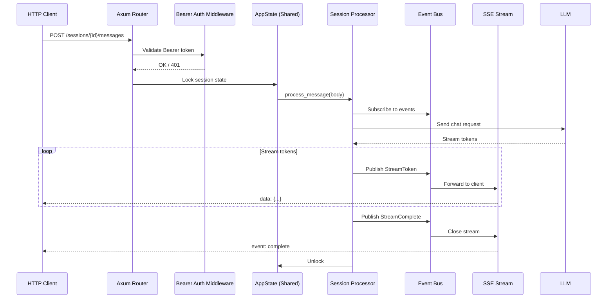

---

---


---

# Part II: Data & Knowledge Systems

---

## 6. Code Index

### 6.1 Overview

The Code Index is a built-in codebase indexing, search, and retrieval system that provides agents with deep, structured understanding of the codebase. Unlike simple text search (grep), it extracts symbols, their relationships, and enables semantic code exploration.

**Key Features:**
- **Zero external dependencies** — Everything compiles into the ragent binary (tree-sitter, SQLite, Tantivy)
- **User-controllable** — Enable/disable at any time via `/codeindex on|off`
- **Non-intrusive** — Zero overhead when disabled
- **Incremental updates** — Only re-indexes changed files using content hashing (Blake3)
- **Real-time file watching** — Automatic re-indexing on file changes
- **Fast search** — Sub-100ms symbol lookup across large codebases

### 6.2 Architecture

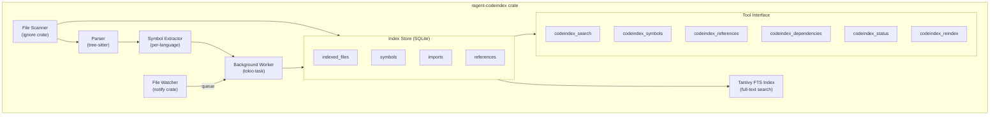

**Components:**
| Component | Purpose |
|-----------|---------|
| **File Scanner** | Walk directory trees, respect `.gitignore`, compute content hashes |
| **File Watcher** | Real-time filesystem change detection via `notify` crate |
| **Parser** | Tree-sitter AST parsing with per-language grammar support |
| **Symbol Extractor** | Per-language AST walkers extract symbols, imports, and references |
| **Index Store** | SQLite persistence for files, symbols, imports, references |
| **Search Engine** | Tantivy full-text index + structured SQLite queries |
| **Tree Cache** | LRU cache of parse trees for incremental re-parsing |
| **Background Worker** | Async indexing worker with debounce, dedup, and batching |

### 6.3 Supported Languages

| Language | Extensions | Symbols Extracted |
|----------|------------|-------------------|
| **Rust** | `.rs` | Functions, structs, enums, traits, impls, modules, consts, statics, type aliases, macros |
| **Python** | `.py` | Functions, classes, methods, decorators, imports, async functions |
| **TypeScript** | `.ts`, `.tsx` | Functions, classes, interfaces, types, enums, namespaces, imports |
| **JavaScript** | `.js`, `.jsx` | Functions, classes, methods, arrow functions, imports |
| **Go** | `.go` | Functions, structs, interfaces, methods, imports, type definitions |
| **C/C++** | `.c`, `.cpp`, `.h`, `.hpp` | Functions, structs, unions, enums, classes, namespaces, includes |
| **Java** | `.java` | Classes, interfaces, enums, methods, constructors, annotations |
| **OpenSCAD** | `.scad` | Modules, functions, variable declarations, include/use statements, call references |
| **Terraform** | `.tf`, `.tfvars` | Resource blocks, data blocks, module calls, variables, locals, outputs, provider blocks |
| **CMake** | `.cmake`, `CMakeLists.txt` | Functions, macros, blocks, foreach/while loops, if conditions, commands, include/add_subdirectory |
| **Gradle (Groovy)** | `.gradle` | Classes, methods, functions, closures, imports, annotations, DSL block calls |
| **Gradle (Kotlin)** | `.gradle.kts` | Classes, functions, properties, type aliases, imports, companion objects, DSL calls |
| **Maven** | `pom.xml` | Project coordinates, dependencies, modules, plugins, profiles, properties, repositories |

### 6.4 Data Model

#### Indexed Files
```rust
struct FileEntry {
    path: String,          // Relative path from project root
    language: String,      // "rust", "python", "typescript", etc.
    content_hash: String,    // Blake3 hash for change detection
    indexed_at: String,    // ISO 8601 timestamp
    file_size: i64,        // Bytes
}
```

#### Symbols
```rust
struct Symbol {
    name: String,          // Symbol name
    kind: SymbolKind,      // Function, Struct, Enum, Trait, etc.
    visibility: Visibility, // Public, Private, Restricted
    file_path: String,     // Source file path
    start_line: u32,       // 1-based line number
    start_col: u32,        // 1-based column
    end_line: u32,         // End line
    end_col: u32,          // End column
    doc: Option<String>,   // Doc comment / documentation
}
```

**SymbolKind Taxonomy:**
| Kind | Description |
|------|-------------|
| `function` | Named function or method |
| `struct` | Struct or class definition |
| `enum` | Enum type |
| `trait` | Trait or interface definition |
| `impl` | Implementation block |
| `const` | Constant definition |
| `static` | Static variable |
| `type_alias` | Type alias |
| `module` | Module or namespace |
| `macro` | Macro definition |
| `field` | Struct/class field |
| `variant` | Enum variant |

### 6.6 Control

```bash
/codeindex on           # Enable indexing
/codeindex off          # Disable indexing
/codeindex status       # Show current status
/codeindex reindex      # Force full re-index
/codeindex clear        # Delete all indexed data
```

Configuration in `ragent.json`:

```jsonc
{
  "code_index": {
    "enabled": true,
    "index_dir": ".ragent/code_index",  // Custom location
    "max_file_size": 1048576,             // 1MB default
    "extra_exclude_dirs": ["vendor", "node_modules", "target"],
    "extra_exclude_patterns": ["*.min.js", "*.d.ts"]
  }
}
```

### 6.7 Code Index Tools

All tools are available to agents and can be called directly in conversations.
Because they perform local, read-only analysis, the codeindex tool family is
hardwired as always allowed and bypasses interactive permission prompts.

#### `codeindex_search`

Full-text search across symbols, documentation, and code.

**Parameters:**
| Parameter | Type | Description |
|-----------|------|-------------|
| `query` | string | Search query (supports boolean operators) |
| `language` | string? | Filter by language (e.g., "rust") |
| `file_pattern` | string? | Filter by file path pattern (e.g., "src/**/*.rs") |
| `max_results` | integer? | Maximum results (default: 20, max: 100) |

**Example:**
```json
{
  "query": "config parser",
  "language": "rust",
  "file_pattern": "crates/ragent-agent/**/*.rs",
  "max_results": 10
}
```

**Returns:** List of search results with symbol info, file path, and relevance score.

---

#### `codeindex_symbols`

Query symbols from the codebase index with optional filters.

**Parameters:**
| Parameter | Type | Description |
|-----------|------|-------------|
| `name` | string? | Filter by symbol name (substring match) |
| `kind` | string? | Filter by symbol kind ("function", "struct", "enum", etc.) |
| `file_path` | string? | Filter by file path substring |
| `language` | string? | Filter by programming language |
| `visibility` | string? | Filter by visibility ("public", "private", "restricted") |
| `limit` | integer? | Maximum results (default: 50, max: 200) |

**Example:**
```json
{
  "name": "parse",
  "kind": "function",
  "language": "rust",
  "limit": 20
}
```

**Returns:** Structured symbol information with signatures and documentation.

---

#### `codeindex_references`

Find all references to a symbol by name across the indexed codebase.

**Parameters:**
| Parameter | Type | Description |
|-----------|------|-------------|
| `symbol` | string | The symbol name to find references for |
| `limit` | integer? | Maximum results (default: 50, max: 200) |

**Example:**
```json
{
  "symbol": "AgentConfig",
  "limit": 100
}
```

**Returns:** File locations grouped by file, with reference kind (call, type, field_access).

---

#### `codeindex_dependencies`

Query file-level dependencies from the code index.

**Parameters:**
| Parameter | Type | Description |
|-----------|------|-------------|
| `path` | string | File path to query dependencies for |
| `direction` | string? | "imports" (what this file uses) or "dependents" (what uses this file) |

**Example:**
```json
{
  "path": "crates/ragent-agent/src/agent/mod.rs",
  "direction": "dependents"
}
```

**Returns:** List of file paths that depend on (or are imported by) the target file.

---

#### `codeindex_status`

Show current status and statistics of the codebase index.

**No parameters.**

**Returns:**
- Files indexed
- Symbols extracted
- Languages detected
- Index size on disk
- Timestamps

**Example Output:**
```json
{
  "files_indexed": 128,
  "symbols_extracted": 3427,
  "languages": {
    "rust": 89,
    "python": 23,
    "typescript": 16
  },
  "index_size_bytes": 2457600,
  "last_updated": "2026-04-14T09:30:00Z"
}
```

---

#### `codeindex_reindex`

Trigger a full re-index of the codebase. Use after major file changes or when search results seem stale.

**No parameters.**

**Note:** This can take several minutes for large codebases. Progress is shown in the TUI.

---

## 16. Configuration

### 16.1 Configuration Files

| File | Purpose |
|------|---------|
| `ragent.json` | Project-level configuration |
| `ragent.jsonc` | Project-level (with comments) |
| `~/.config/ragent/config.json` | User-global configuration |

### 16.2 Configuration Schema

```jsonc
{
  "provider": {
    "anthropic": {
      "env": ["ANTHROPIC_API_KEY"],
      "api": { "max_tokens": 8192 }
    },
    "openai": { /* ... */ },
    "copilot": { /* ... */ },
    "ollama": { /* ... */ },
    "generic_openai": { /* ... */ }
  },
  "defaultAgent": "coder",
  "permissions": [],
  "skill_dirs": [],
  "code_index": {
    "enabled": true,
    "max_file_size": 1048576
  },
  "memory": {
    "auto_extract": { "enabled": false, "require_confirmation": true },
    "semantic": { "enabled": false, "dimensions": 384 },
    "compaction": { "enabled": true, "block_size_limit": 4096 },
    "eviction": { "auto": false, "stale_days": 30 }
  },
  "aiwiki_autosync": true,
  "hidden_tools": ["github_list_issues", "gitlab_list_mrs"],
  "bash": {
    "allowlist": [],
    "denylist": []
  },
  "hooks": [
    { "trigger": "on_session_start", "command": "echo 'Session started'" }
  ]
}
```

Additional top-level configuration keys:

- `aiwiki_autosync` — When `true` (default), AIWiki auto-syncs on startup and can keep watching configured source folders for changes.
- `hidden_tools` — List of tool names to hide from LLM tool definitions and system-prompt tool listings. Hidden tools remain registered and executable; they are simply not advertised to the model. When configs are merged across layers, `hidden_tools` is unioned so entries from both global and project configs are honoured.

### 16.3 Environment Variables

| Variable | Purpose |
|----------|---------|
| `ANTHROPIC_API_KEY` | Anthropic API key |
| `OPENAI_API_KEY` | OpenAI API key |
| `GENERIC_OPENAI_API_KEY` | Generic OpenAI-compatible key |
| `GITHUB_COPILOT_TOKEN` | GitHub Copilot token |
| `OLLAMA_HOST` | Ollama server URL |
| `RAGENT_LOG_LEVEL` | Log level (trace/debug/info/warn/error) |
| `RAGENT_YES` | Auto-approve all permissions |

### 16.4 Configuration Error Reporting

Configuration parsing errors are surfaced with actionable diagnostics rather than
only a generic parse failure. When JSON or JSONC parsing fails, ragent reports:

- the full config file path,
- the line and column number,
- the problematic source line, and
- a caret (`^`) pointing at the error position.

This applies to normal config loading and explicit `--config` CLI usage, helping
users fix malformed configuration files quickly.

---

# Part V: External Integrations

---

## 17. LSP Integration

### 24.3.1 Permission Request

A `PermissionRequest` is published as an event to the TUI:

| Field | Type | Description |
|-------|------|-------------|
| `id` | String | Unique request identifier |
| `session_id` | String | Session that originated the request |
| `permission` | String | Permission type (e.g. `"bash"`, `"edit"`) |
| `patterns` | Vec<String> | Glob patterns describing target resources |
| `metadata` | JSON | Tool-specific metadata (command text, file path, etc.) |
| `tool_call_id` | Option<String> | Tool call that triggered the request |
| `created_at` | u64 | Unix timestamp when the request was created |
| `timeout_secs` | u64 | Timeout duration in seconds (default: 120) |

**Permission Dialog Timeout:**

Permission requests have a 120-second timeout (2 minutes). The TUI displays a countdown timer in the dialog title (format: `M:SS remaining`) that updates in real time via continuous redraw polling, even when the user is idle. When the timeout expires, the dialog shows `EXPIRED` and the request is automatically denied.

---

# Part VII: Security & Operations

---

## 24. Security & Permissions

### 24.1 Permission Security Layers

The permission system is a multi-layered defense-in-depth architecture that controls every tool invocation.

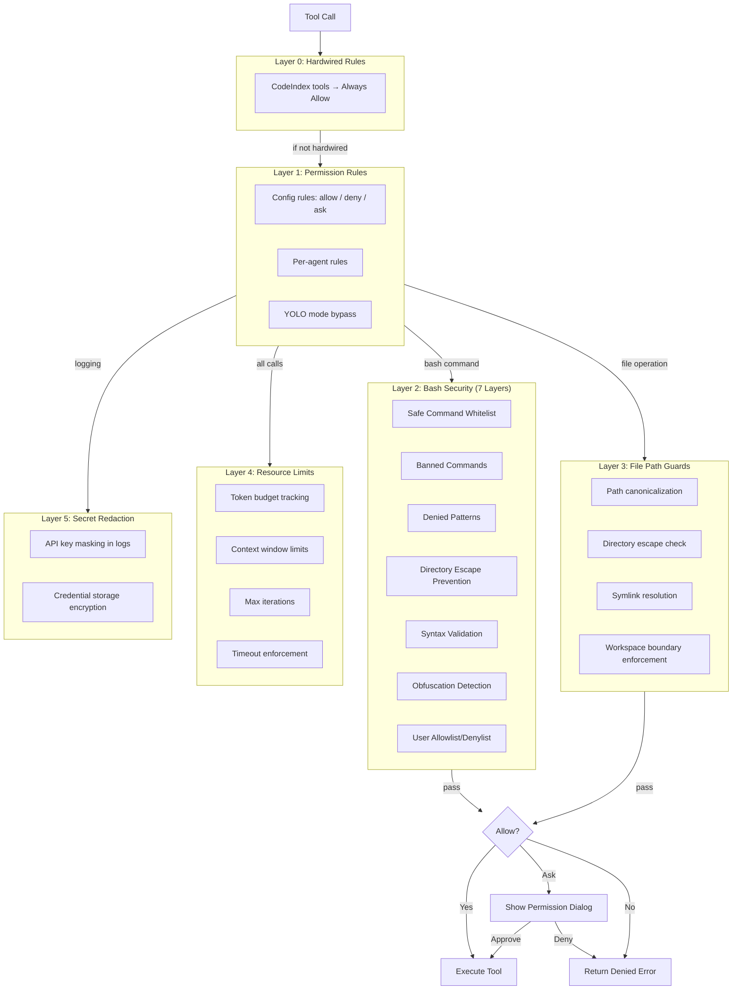

---

### 24.2 Bash Security — 7 Layers

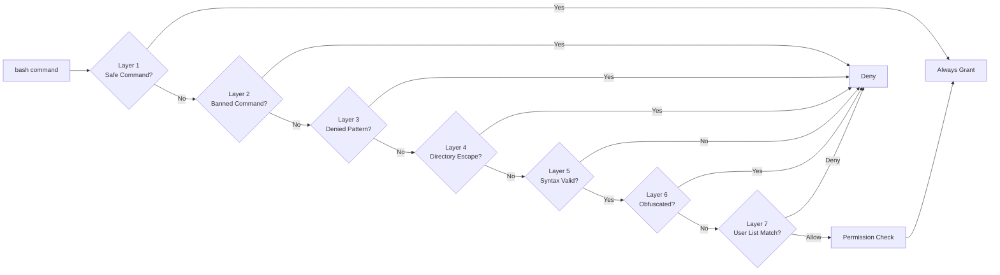

**Layer Details:**

| Layer | Name | Description | Test Count |
|-------|------|-------------|-----------:|
| 1 | Safe Command Whitelist | 51 commands auto-approved (cat, ls, git, cargo, etc.) | 15 |
| 2 | Banned Commands | 22 commands always blocked (mkfs, fdisk, useradd, etc.) | 6 |
| 3 | Denied Patterns | 46 destructive patterns (rm -rf /, fork bombs, etc.) | 8 |
| 4 | Directory Escape Prevention | Blocks cd/pushd outside workspace | 4 |
| 5 | Syntax Validation | Runs `sh -n -c` with 1s timeout | 3 |
| 6 | Obfuscation Detection | Detects base64\|bash, python exec, hex escapes | 5 |
| 7 | User Allowlist/Denylist | User-configurable via `/bash allow/deny` | 4 |

---

### 24.3 Permission Request Flow

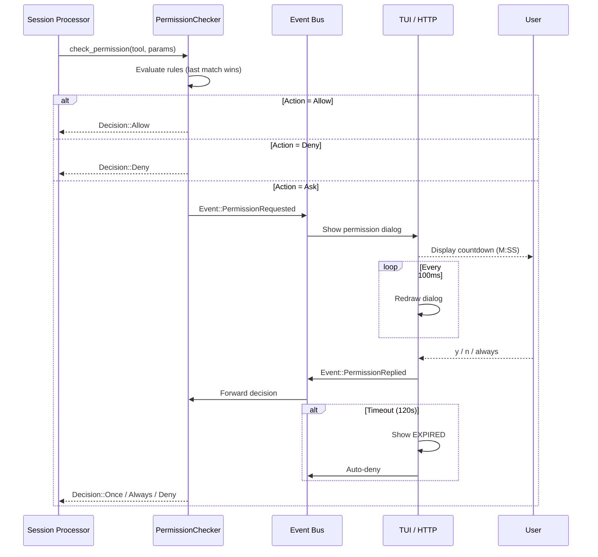

---

### 24.4 Permission Rules Evaluation

Rules are evaluated in order, with **last match wins** semantics:

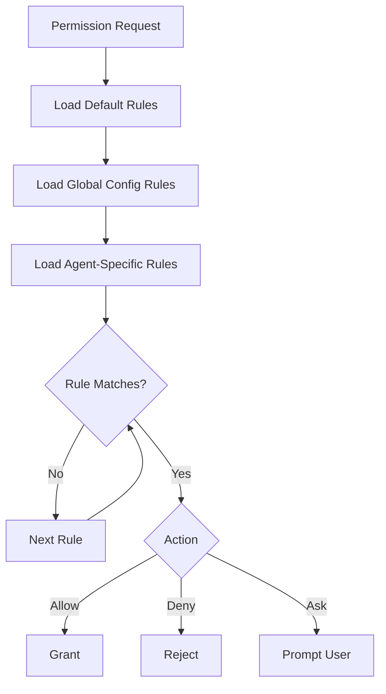

**Default Rules:**
- Read operations → Allow
- Edit operations → Ask
- Bash execution → Ask
- Web access → Ask
- Todo management → Allow

---

## 25. Auto-Update Mechanism

*(To be documented)*

---

# Appendices

---

## Appendix A: Version History

| Version | Date | Highlights |
|---------|------|------------|
| v0.1.0-alpha.49 | 2025-01-17 | Permission dialog live countdown, config parse error enhancement, codeindex hardwired permissions, crate extraction milestones |
| v0.1.0-alpha.48 | 2025-01-17 | Permission milestones complete, bash security layers, more permissions fixes |
| v0.1.0-alpha.47 | 2025-01-17 | Crate reorganisation (ragent-types, ragent-config, ragent-storage, ragent-llm) |

---

## Appendix B: Documentation

All documentation markdown files are located in `docs/` except for these root files:

| File | Purpose |
|------|---------|
| `README.md` | Project overview |
| `QUICKSTART.md` | Quick start guide |
| `SPEC.md` | This specification |
| `AGENTS.md` | Agent guidelines |
| `CHANGELOG.md` | Change log |
| `RELEASE.md` | Release notes |
| `STATS.md` | Project statistics |

---

## Appendix C: Project Contact & Repository

- **Repository:** https://github.com/thawkins/ragent
- **License:** MIT
- **Author:** Tim Hawkins

---

## Appendix D: Changelog (2025-01-16 → 2025-01-17)

### Added
- Permission dialog countdown timer with live TUI updates (120-second timeout)
- Config parse error reporting with file path, line, column, and caret marker
- Codeindex tools hardwired as always-allowed (read-only, no permission prompts)
- Crate extraction milestones: `ragent-types`, `ragent-config`, `ragent-storage`, `ragent-llm`
- `ollama_cloud` provider with dynamic model discovery and vision support
- `gemini` provider with massive context windows (up to 2M tokens)
- `huggingface` provider with dynamic model discovery and rate limit tracking
- GitLab integration with issues, merge requests, pipelines, and jobs
- Team coordination tools (21 tools for team lifecycle, tasks, messaging)
- AIWiki knowledge base with multi-format ingestion and web interface
- LSP integration with hover, definition, references, symbols, diagnostics
- MCP (Model Context Protocol) client support
- Skills system for loadable skill packs
- Custom agent profiles via OASF format
- Autopilot mode for autonomous operation
- Prompt optimization (`/opt` command with 12 methods)
- Memory system with three tiers (file blocks, SQLite store, semantic search)
- Journal system for insights and decisions
- Background agent spawning and management
- Swarm mode for parallel task decomposition
- Plan agent with human-in-the-loop approval

### Changed
- Improved TUI slash-command autocomplete with safe `Esc` handling
- Updated workspace crate organization
- Enhanced bash security with 7 layers and word-boundary matching
- Permission system now supports per-agent rules and YOLO mode

### Fixed
- Permission dialog timeout now correctly uses 120 seconds
- Countdown timer visually decrements in real time
- Bash command name extraction for permission matching
- Denied pattern matching with word boundaries
- Safe command display in `/bash show` output

---
