<div style="page-break-after: always; text-align: center; padding-top: 15em;">

<h1 style="font-size: 3em; margin-bottom: 0.2em;">ragent</h1>
<h2 style="font-size: 1.5em; font-weight: normal; color: #555; margin-top: 0;">Technical Specification</h2>

<p style="margin-top: 4em; font-size: 1.1em;">
      <strong>Version:</strong> 1.0.72</p>
    <p style="font-size: 1.1em;">
      <strong>Date:</strong> 2026-08-31
    </p>
  <p style="font-size: 1.1em;">
    <strong>Author:</strong> Tim Hawkins &lt;tim.thawkins@gmail.com&gt;
  </p>
<p style="margin-top: 6em; font-size: 0.9em; color: #777;">
    <a href="https://github.com/thawkins/ragent">github.com/thawkins/ragent</a>
  </p>

</div>
---

## Executive Summary

Ragent is an open-source AI coding agent for the terminal, written entirely in
Rust and distributed as a single statically-linked binary with zero external
runtime dependencies. It orchestrates multiple LLM providers — Anthropic,
OpenAI, GitHub Copilot, Google Gemini, Hugging Face, Ollama (local and cloud), xAI
Grok, Generic OpenAI-compatible endpoints, Azure AI Foundry, Azure Resource (File),
Amazon Bedrock, and a Model Router provider — behind a unified streaming interface,
giving developers a powerful,
provider-agnostic assistant that runs wherever a terminal does.

### What It Does

Ragent bridges the gap between conversational AI and hands-on software
engineering. An agent can read and write files, execute shell commands, search
codebases, manage Git and GitHub workflows, query language servers, read and
write office documents, and coordinate with other agents — all through a
large built-in tool library organised across multiple categories. Every tool
invocation passes through a multi-layered security and permission system that
gives the user full control over what the agent can and cannot do.

### How It Works

At its core, ragent follows a **session → agent → tool** loop. A session
processor manages the conversation with the LLM provider, the agent system
defines personality and capabilities via profiles, and the tool registry
dispatches execution requests. An asynchronous event bus (built on tokio)
connects all components, enabling real-time streaming of tokens, tool results,
and status updates to both the TUI and the HTTP API.

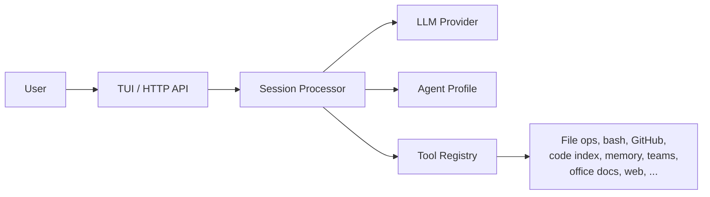
```mermaid
graph LR
    User[User] --> TUI[TUI / HTTP API]
    TUI --> SP[Session Processor]
    SP --> LLM[LLM Provider]
    SP --> AP[Agent Profile]
    SP --> TR[Tool Registry]
          TR --> Tools[File ops, bash, GitHub,<br/>code index, memory, teams,<br/>office docs, web, ...]

```

**Figure 1:** Core Execution Loop — High-level session/agent/tool flow

### Key Capabilities

| Capability | Summary |
|-----------|---------|
| **Multi-provider LLM** | 12 providers with automatic model discovery, health monitoring, streaming, vision, and reasoning levels |
| **Terminal UI** | Full-screen ratatui interface with streaming markdown, syntax highlighting, slash commands, and image support |
| **HTTP Server** | REST + SSE API (Axum) for headless operation and external integrations |
| **Tool System** | Broad tool coverage across file ops, shell, search, GitHub, GitLab, code index, memory, teams, sub-agents, office/PDF, web, and MCP |
| **Code Intelligence** | Tree-sitter parsing (15+ languages), Tantivy FTS, symbol/reference search, and code index queries |
| **Persistent Memory** | Three-tier system — file blocks, structured SQLite store, and optional embedding-based semantic search — with automatic extraction, decay, compaction, and a knowledge graph |
| **Teams & Swarms** | Multi-agent coordination with named teammates, shared task lists, mailbox messaging, and swarm decomposition for parallel work |
| **Security** | Permission rules (allow/deny/ask), 7-layer bash safety, file-path guards, secret redaction, resource limits, and YOLO mode for trusted environments |
| **Skills** | Loadable skill packs (bundled or custom YAML) that inject tools, prompts, and file context into agent sessions |
| **Custom Agents** | OASF-based agent profiles with configurable models, tools, permissions, and personality |
| **Autopilot** | Autonomous operation mode with configurable iteration limits and permission auto-approval |

### Who It's For

Ragent is designed for software developers and teams who want an AI assistant
that lives in their terminal, respects their security boundaries, and learns
from their workflow over time. It is equally suited to interactive pair-programming
sessions and headless CI/CD integration via its HTTP API.

### Technology

| Aspect | Detail |
|--------|--------|
| **Language** | Rust (edition 2024) |
| **Async runtime** | tokio |
| **TUI framework** | ratatui + crossterm |
| **HTTP framework** | Axum |
| **Database** | SQLite (rusqlite, compiled-in) |
| **Full-text search** | Tantivy |
| **Code parsing** | tree-sitter (15+ grammars compiled-in) |
| **Embeddings** | ONNX Runtime (optional, `all-MiniLM-L6-v2`) |
| **Binary size** | Single static binary, ~50 MB release |
| **Platforms** | Linux, macOS, Windows (cross-compiled) |

### Project Status

Ragent is in **beta** (v1.0.58). The core architecture, tool system,
TUI, HTTP server, memory system, spec management, skills system, research system,
multi-agent coordination, security layer, telemetry, code index semantic graph,
and release packaging are
functional and under active development. The specification below documents the
current state of all subsystems.

**Current Release Highlights (v1.0.44 → v1.0.58):**
- **Code index semantic graph** — New `codeindex_godnodes`, `codeindex_path`,
  `codeindex_explain`, and `codeindex_communities` tools; typed edge graph with
  `calls`, `imports`, `inherits`, `references`, `mixes_in`, `implements` edges;
  community detection via label propagation; `/codeindex graph build` sub-command
  (v1.0.43)
- **Bang commands** — Prefix any prompt with `!` to run a shell command and
  have the model review its output; works in TUI and `ragent run` (v1.0.42)
- **Compaction fix** — `select()` now forces at least one message into the head
  when there are 2+ messages, preventing the "nothing to summarise" stuck state
  (v1.0.43)
- **Research panic fixes** — Vendored `html2text` with `saturating_sub` patches;
  `extract_pdf_text` now runs on a dedicated OS thread with `panic_guard` (v1.0.40)
- **Stocks & currency tools** — `stock_quote`, `stock_history`,
  `stock_fundamentals`, `stock_search`, `stock_options`, `stock_recommendations`,
  `currency_rate`, `currency_history` (v1.0.36)
- **Start-of-turn compaction** — Uses persisted provider-reported input token
  count so it aligns with the TUI usage percentage (v1.0.34)

---


## Table of Contents

- [Executive Summary](#executive-summary)

### Part I: Foundation & Basics

1. [Overview](#overview)
2. [Architecture](#architecture)
3. [Core Features](#core-features)
4. [Security & Permissions](#security-permissions)
5. [Configuration](#configuration)

### Part II: User Interface & API

6. [Terminal User Interface (TUI)](#terminal-user-interface-tui)
7. [HTTP Server & API](#http-server-api)

### Part III: Data & Knowledge Systems

8. [Code Index](#code-index)
9. [Memory System](#memory-system)
10. [Spec Management](#spec-management)
11. [Research System](#research-system)

### Part IV: Agent Customization & Extension

11. [Custom Agents](#custom-agents)
12. [Skills System](#skills-system)
13. [Prompt Optimization](#prompt-optimization)

### Part V: Multi-Agent Coordination

14. [Teams](#teams)
15. [Swarm Mode](#swarm-mode)
16. [Autopilot Mode](#autopilot-mode)
17. [Orchestrator & Multi-Agent Coordination](#orchestrator-multi-agent-coordination)

### Part VI: External Integrations

18. [GitHub & GitLab Integration](#18-github--gitlab-integration)
19. [MCP Integration (Model Context Protocol)](#mcp-integration-model-context-protocol)

### Part VII: Operations & Reference

20. [Auto-Update Mechanism](#auto-update-mechanism)

**Appendices**

- [Appendix A: Version History](#appendix-a-version-history)
- [Appendix B: Documentation](#appendix-b-documentation)
- [Appendix C: Project Contact & Repository](#appendix-c-project-contact--repository)
- [Appendix D: Changelog (v0.1.0-alpha.104 → v0.1.0-alpha.116)](#appendix-d-changelog-v010-alpha104--v010-alpha116)
- [Appendix E: Earlier Changelog (2025-01-16 → 2025-04-21)](#appendix-e-earlier-changelog-2025-01-16--2025-04-21)
- [Appendix F: Changelog (v0.1.0-beta.1 → v0.1.0-beta.28)](#appendix-f-changelog-v010-beta1--v010-beta28)

### List of Diagrams

| # | Diagram | Section | Description |
|---|---------|---------|-------------|
| 1 | [Core Execution Loop](#how-it-works) | Executive Summary | High-level session/agent/tool flow |
| 2 | [System Architecture](#2-architecture) | Architecture | Full crate and component topology |
| 3 | [Crate Dependency Graph](#22-crate-dependency-graph) | Workspace Crates | Inter-crate dependency relationships |
| 4 | [Event Bus Flow](#23-event-bus-flow) | Architecture | Internal pub/sub message routing |
| 5 | [Session & Tool Execution Flow](#35-session--tool-execution-flow) | Core Features | LLM call → permission → tool dispatch loop |
| 6 | [Provider Selection Flow](#36-provider-selection-flow) | Core Features | Multi-provider routing and health checks |
| 7 | [TUI Component Architecture](#44-tui-component-architecture) | Terminal User Interface | UI layout and event wiring |
| 8 | [HTTP API Request Flow](#54-http-api-request-flow) | HTTP Server & API | REST + SSE lifecycle |
| 9 | [Code Index Pipeline](#62-architecture) | Code Index | File scan → parse → index → search |
| 10 | [Permission Security Layers](#41-permission-security-layers) | Security & Permissions | 5-layer defense-in-depth |
| 11 | [Bash Security — 7 Layers](#42-bash-security--7-layers) | Security & Permissions | Bash command defense flow |
| 12 | [Permission Request Flow](#43-permission-request-flow) | Security & Permissions | From tool call to user decision |
| 13 | [Permission Rules Evaluation](#44-permission-rules-evaluation) | Security & Permissions | Rule matching and resolution |
| 14 | [Agent Execution Loop Phases](#37-agent-execution-loop-phases) | Core Features | One complete turn from input to response |

---


---

# Part I: Foundation & Basics

---

## 1. Overview

Ragent is an AI coding agent for the terminal, built in Rust. It provides multi-provider LLM orchestration, a built-in tool system, terminal UI, and client/server architecture — all compiled into a single statically-linked binary.

### 1.1 Key Characteristics

| Characteristic | Description |
|----------------|-------------|
| **Single binary** | Statically linked, zero runtime dependencies beyond OS libraries |
| **Multi-provider** | 13 first-class LLM provider IDs with auto-discovery and health checks |
| **Tool-rich** | ~150 registered tools across 18 categories |
| **Local-first** | SQLite, Tantivy, and tree-sitter compiled in; no external services required |
| **Streaming** | Real-time token, tool, and event streaming via TUI and HTTP SSE |
| **Extensible** | Custom agents, skills, MCP servers, and provider modules |
| **Secure by default** | Permission system, bash safety, file guards, secret redaction |

### 1.2 Terminology

| Term | Meaning |
|------|---------|
| **Session** | A single conversation/run with an agent, persisted to SQLite |
| **Agent Profile** | A named configuration of model, system prompt, tools, and permissions |
| **Tool** | A typed, invokable capability (file ops, shell, search, etc.) |
| **Event Bus** | Tokio broadcast channel used for cross-component real-time updates |
| **Code Index** | Tree-sitter + Tantivy index of the project codebase |
| **Memory** | Three-tier persistence: file blocks, structured SQLite, optional embeddings |
| **Skill** | A YAML pack that injects tools, prompts, and file context |
| **Team** | A named multi-agent workspace with shared tasks and mailbox messaging |
| **Swarm** | Parallel task decomposition across spawned agents |
| **Autopilot** | Autonomous mode with auto-approval and iteration limits |
| **Initiative** | Durable project-scoped goal with milestones |
| **Telemetry** | OpenTelemetry metrics export for operator observability |

---

## 2. Architecture

Ragent is organised as a Cargo workspace of focused crates. Each crate owns a
single concern, and the top-level `src/main.rs` wires them together behind a clap
CLI.

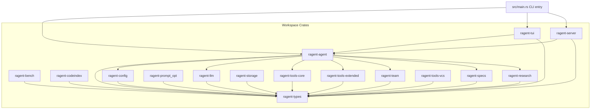
```mermaid
graph TB
    subgraph "Workspace Crates"
        A[ragent-agent]
        B[ragent-bench]
        C[ragent-codeindex]
        D[ragent-config]
        E[ragent-llm]
        F[ragent-prompt_opt]
        G[ragent-server]
        H[ragent-specs]
        I[ragent-storage]
        J[ragent-team]
        K[ragent-tools-core]
        L[ragent-tools-extended]
        M[ragent-tools-vcs]
        N[ragent-tui]
        O[ragent-types]
        P[ragent-research]
    end

    Q[src/main.rs CLI entry]
    Q --> A
    Q --> N
    Q --> G
    A --> O
    A --> D
    A --> E
    A --> K
    A --> L
    A --> J
    A --> H
    A --> P
    N --> A
    N --> O
    G --> A
    G --> O
    J --> O
    K --> O
    L --> O
    M --> O
    C --> O
    I --> O
    E --> O
    D --> O
    F --> O
    B --> O
    H --> O
    P --> O
```

**Figure 2:** System Architecture — Full crate and component topology

### 2.1 Workspace Crates

| Crate | Responsibility | Approx. Lines |
|-------|----------------|---------------|
| `ragent-types` | Shared IDs, events, messages, errors, sanitisation | ~2,700 |
| `ragent-config` | Configuration loading, defaults, permission rules | ~1,850 |
| `ragent-storage` | SQLite persistence, snapshots, encrypted credentials | ~2,800 |
| `ragent-llm` | Provider clients and model/provider registry | ~6,700 |
| `ragent-tools-core` | File, shell, search, and utility tools | ~4,100 |
| `ragent-tools-extended` | Memory, code index, office/PDF, web tools | ~4,300 |
| `ragent-tools-vcs` | GitHub and GitLab tool surface | ~5,200 |
| `ragent-agent` | Session processor, agent resolution, tool registry, memory, MCP | ~12,500 |
| `ragent-team` | Team runtime, shared tasks, mailbox messaging | ~3,900 |
| `ragent-codeindex` | Tree-sitter parsing, SQLite/Tantivy index, file watcher | ~4,000 |
| `ragent-server` | Axum HTTP routes and SSE streaming | ~2,400 |
| `ragent-tui` | Ratatui terminal interface | ~8,900 |
| `ragent-bench` | Criterion benchmarks shared between TUI and CLI | ~900 |
| `ragent-specs` | Spec lifecycle management, SDD artifact generation, consistency validation, constitution parsing | ~3,200 |
| `ragent-prompt_opt` | Prompt optimization templates | ~1,200 |
| `ragent-research` | Research types, gatherers, and plan-dep parser | ~1,600 |

### 2.2 Crate Dependency Graph

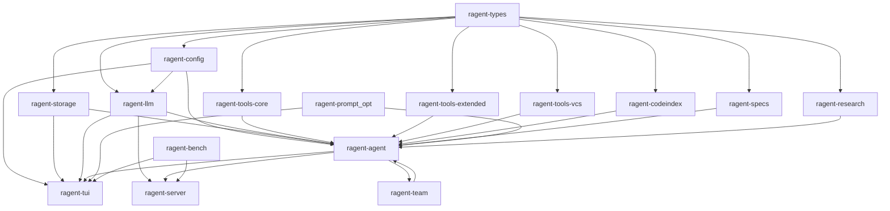
```mermaid
graph TD
    T[ragent-types]
    D[ragent-config]
    S[ragent-storage]
    L[ragent-llm]
    TC[ragent-tools-core]
    TE[ragent-tools-extended]
    TV[ragent-tools-vcs]
    A[ragent-agent]
    TM[ragent-team]
    CI[ragent-codeindex]
    SV[ragent-server]
    TU[ragent-tui]
    SP[ragent-specs]
    PR[ragent-prompt_opt]
    RS[ragent-research]
    B[ragent-bench]

    T --> D
    T --> S
    T --> L
    T --> TC
    T --> TE
    T --> TV
    T --> CI
    T --> SP
    T --> RS
    D --> L
    D --> A
    D --> TU
    S --> A
    S --> TU
    L --> A
    L --> TU
    L --> SV
    TC --> A
    TE --> A
    TV --> A
    A --> TU
    A --> SV
    A --> TM
    TM --> A
    CI --> A
    SP --> A
    PR --> TU
    PR --> A
    RS --> A
    B --> TU
    B --> SV
```

**Figure 3:** Crate Dependency Graph — Inter-crate dependency relationships

### 2.3 Event Bus Flow

The event bus is a tokio broadcast channel (`tokio::sync::broadcast`). Every
component can publish and subscribe to strongly-typed events.

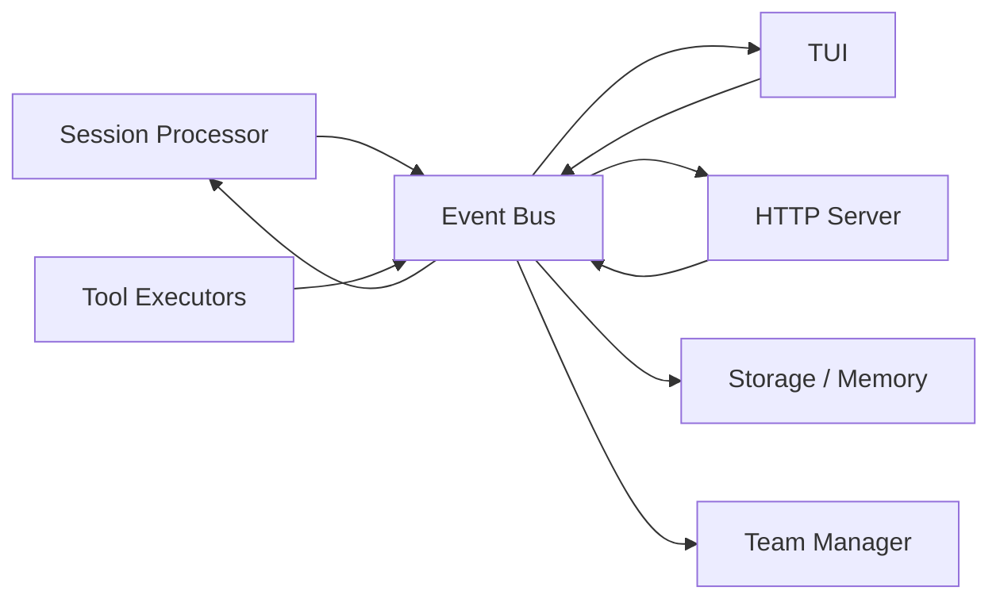
```mermaid
graph LR
    SP[Session Processor] --> EB[Event Bus]
    TUI[TUI] --> EB
    HTTP[HTTP Server] --> EB
    Tools[Tool Executors] --> EB
    EB --> SP
    EB --> TUI
    EB --> HTTP
    EB --> Storage[Storage / Memory]
    EB --> Teams[Team Manager]
```

**Figure 4:** Event Bus Flow — Internal pub/sub message routing

Key event types include:

| Event | Purpose |
|-------|---------|
| `AssistantChunk` | Streaming LLM token or reasoning block |
| `ToolRequested` / `ToolExecuted` | Tool call lifecycle |
| `PermissionRequested` / `PermissionReplied` | Permission dialog flow |
| `QuestionRequested` / `QuestionAnswered` | User question tool |
| `AgentNotice` | Non-blocking status/information message |
| `CompressionStarted` / `CompressionFinished` | Context compaction lifecycle (auto pre-send summarisation and emergency overflow compaction) |
| `TeammateIdle` / `TeammateFailed` / `TeammateResumed` | Team coordination |
| `SubagentSpawned` / `SubagentCompleted` / `SubagentKilled` | Background agents |
| `RouterClassification` / `RouterTierSelected` | Model-router routing decisions |
| `RunCostSummary` | Per-run token/cost summary emitted at session run end |
| `FromFileBodyPreview` | Preview of text extracted from a `--from-file` research seed |
| `SynthesizeResult` | Research LLM synthesis outcome (success/fallback/error) |

---

## 3. Core Features

### 3.1 LLM Providers

Ragent supports multiple providers through a common trait interface. Providers
are registered in a runtime registry, and the session processor selects one
based on the active agent/model.

#### Supported Providers

| Provider | Local/Cloud | Discovery | Streaming | Vision | Tools | Notes |
|----------|-------------|-----------|-----------|--------|-------|-------|
| `anthropic` | Cloud | Static catalog | Yes | Yes | Yes | Claude models, thinking blocks |
| `openai` | Cloud | Static + dynamic | Yes | Yes | Yes | GPT-4o, o1, etc. |
| `copilot` | Cloud | Static | Yes | No | Yes | GitHub Copilot token-based |
| `gemini` | Cloud | Static + dynamic | Yes | Yes | Yes | Google Gemini, up to 2M context |
| `huggingface` | Cloud | Dynamic | Yes | Yes | Some | HF Inference API |
| `ollama` | Local | Dynamic | Yes | Yes | Yes | Local Ollama server |
| `ollama_cloud` | Cloud | Dynamic | Yes | Yes | Yes | Managed Ollama endpoints |
| `generic_openai` | Either | Config-driven | Yes | Yes | Yes | Any OpenAI-compatible endpoint |
| `azure_foundry` | Cloud | Dynamic | Yes | Yes | Yes | Microsoft Azure AI Foundry |
| `azure_resource` | Cloud | File-based | Yes | Yes | Yes | Reads `azureresources.json` |
| `xai` | Cloud | Static | Yes | Yes | Yes | xAI Grok API |
| `bedrock` | Cloud | Dynamic | Yes | Yes | Yes | AWS Bedrock, SigV4 signing |
| `openrouter` | Cloud | Dynamic | Yes | Yes | Yes | OpenAI-compatible model aggregator; single API key unlocks 100+ upstream models |
| `router` | Cloud | Static | Yes | Yes | Yes | Model Router with 15-dimension classifier |

(The registry exposes 14 provider IDs; the `router` is a virtual provider that
selects a downstream model based on request characteristics.)

#### Provider Features

| Feature | Description |
|---------|-------------|
| **Health checks** | `Provider::health()` returns `Healthy`, `Degraded`, or `Unhealthy` |
| **Model discovery** | `Provider::discover_models()` returns available models with capabilities |
| **Streaming** | All providers emit `StreamEvent::Chunk` and `StreamEvent::Done` |
| **Tool calling** | Providers that support function calling receive tool schemas |
| **Vision** | Image inputs passed when the model reports vision capability |
| **Reasoning levels** | Anthropic/OpenAI thinking blocks map to `low`/`medium`/`high` |
| **Model routing** | `router` provider classifies prompts and picks a downstream provider/model/tier |
| **OpenRouter integration** | `openrouter` provider discovers and streams from 100+ OpenAI-compatible models with a single API key |

#### Anthropic Models

| Model | Context | Notes |
|-------|---------|-------|
| `claude-sonnet-4-20250514` | 200k | Default reasoning model |
| `claude-opus-4-20250514` | 200k | High capability |
| `claude-haiku-4-20250514` | 200k | Fast/cheap |

#### OpenAI Models

| Model | Context | Notes |
|-------|---------|-------|
| `gpt-4o` | 128k | General purpose, vision |
| `o3-mini` | 200k | Reasoning |
| `o1` | 200k | High reasoning |

#### Ollama Cloud Provider

- Endpoint configured via `OLLAMA_CLOUD_HOST` or `ragent.json`
- Dynamic model discovery against `/api/tags`
- Supports vision models when the Ollama model reports `vision`

#### Ollama (Local) Provider

- Default endpoint `http://localhost:11434`
- Dynamic discovery; no API key required
- Vision support depends on the pulled model

#### Google Gemini Provider

- API key via `GEMINI_API_KEY`
- Massive context windows (up to 2M tokens)
- Discovery via Gemini models API

#### Hugging Face Provider

- Token via `HF_TOKEN` or `HUGGING_FACE_HUB_TOKEN`
- Public `/v1/models` discovery; falls back to static catalog on empty results
- Rate-limit tracking

#### Azure AI Foundry Provider

- API key via `AZURE_AI_FOUNDRY_API_KEY` (or `AZURE_AI_FOUNDRY_API_KEY`)
- Base URL via `AZURE_AI_FOUNDRY_BASE`
- OpenAI-compatible endpoints with `api-key` header
- Dynamic model discovery, tool calling, vision, reasoning levels
- HTTP 429 retries with `Retry-After` and exponential backoff

#### Azure Resource (File) Provider

- Reads endpoint definitions from `azureresources.json` in `~/.config/ragent/` or `.ragent/`
- Supports per-endpoint API keys, custom context windows, capability tags, thinking config
- Can route to Anthropic Messages (`/anthropic/v1/messages`) or OpenAI (`/openai/v1/chat/completions`) API shape via `api_type`

#### OpenRouter Provider

- API key via `OPENROUTER_API_KEY` or `ragent auth openrouter <key>`
- Single `GET /api/v1/models` discovery call returns all 100+ upstream models
- OpenAI-compatible `POST /api/v1/chat/completions` streaming with tool-call and reasoning deltas
- Per-model metadata (context window, pricing, vision/reasoning flags) mapped from discovery
- Supports vendor-slug model ids such as `openrouter/anthropic/claude-sonnet-4`

### 3.2 Tool System

The tool system is the primary way agents interact with the world. Each tool
has a JSON schema, a permission category, and an async `execute` method.

#### File Operations Tools (16)

| Tool | Purpose |
|------|---------|
| `apply_patch` | Apply a Codex-style patch with add/delete/update and file moves |
| `read` | Read file contents with line-range support |
| `write` / `create` | Create or overwrite a file |
| `edit` | Replace one exact string occurrence; optional `collapse_whitespace` relaxes matching (whitespace-run collapse + `\t`/`\n`/`\r`/`\\` escape decoding) |
| `multiedit` | Apply multiple edits atomically across one or more files; each edit honours its own `collapse_whitespace` flag |
| `patch` | Apply a unified diff |
| `rm` | Delete a single file |
| `move` / `move_file` | Move or rename a file/directory |
| `copy` / `copy_file` | Copy a file |
| `mkdir` / `make_directory` | Create directories |
| `append_to_file` | Append text to the end of a file |
| `file_info` | File/directory metadata |
| `diff_files` | Unified diff between files or strings |
| `glob` | Find files matching a glob pattern |
| `list` | List directory contents |

#### File Operation Aliases

| Alias | Maps to |
|-------|---------|
| `read_file` | `read` |
| `write_file` | `write` |
| `update_file` | `write` |
| `delete_file` | `rm` |
| `apply_patch` | `patch` |
| `multiedit` | `multi_edit` (legacy parameter normalisation) |

#### Execution Tools (5)

| Tool | Purpose |
|------|---------|
| `bash` | Run a shell command with 7-layer safety |
| `run_code` | Alias for `bash`; accepts `code`/`command` |
| `bash_reset` | Reset persistent shell state |
| `calculator` | Evaluate mathematical expressions |
| `open` | Open/reveal files, folders, or URLs in the desktop environment |

#### Interactive Tools (2)

| Tool | Purpose |
|------|---------|
| `ask_user` | Ask the user a question (text or multiple-choice) |
| `think` | Record a reasoning note |

#### Task Management Tools (4)

| Tool | Purpose |
|------|---------|
| `task_create` | Create a session-scoped task with subject, description, optional owner, active_form, metadata, and blocked_by dependencies |
| `task_update` | Update a task's status (pending, in_progress, completed), subject, owner, metadata, or dependencies; auto-evaluates blocked tasks on completion |
| `task_get` | Retrieve the full record of a single task by ID |
| `task_list` | List all session tasks, optionally filtered by status |

#### Utility Tools (2)

| Tool | Purpose |
|------|---------|
| `get_env` | Read non-sensitive environment variables |
| `calculator` | Evaluate mathematical expressions |

### 3.2.1 Tool System Categories Summary

| Category | Tools | Count |
|----------|-------|-------|
| File operations | `read`, `write`/`create`/`update_file`, `edit`, `multi_edit`/`multiedit`, `apply_patch`, `patch`, `rm`, `move`, `copy`, `mkdir`, `append`, `file_info`, `diff`, `glob`, `list` | 18 |
| Shell / execution | `bash`, `run_code`, `bash_reset`, `calculator`, `open` | 5 |
| Search | `grep`, `codeindex_*` | 6 |
| Web / MasterFetch | `webfetch`, `websearch`, `http_request`, `browser`, `mf_fetch`, `mf_crawl`, `mf_search`, `mf_screenshot`, `mf_cache_clear`, `mf_version` | 10 |
| Memory | `memory_read`, `memory_write`, `memory_replace`, `memory_store`, `memory_recall`, `memory_forget`, `memory_search`, `memory_migrate`, `conversation_search`, `session_search` | 10 |
| Code index | `codeindex_search`, `codeindex_symbols`, `codeindex_references`, `codeindex_dependencies`, `codeindex_status`, `codeindex_reindex` | 6 |
| Code graph | `codeindex_explain`, `codeindex_path`, `codeindex_communities`, `codeindex_godnodes` | 4 |
| Teams | 19 team lifecycle/task/message tools | 19 |
| Sub-agents | `new_agent`, `cancel_agent`, `list_agents`, `wait_agents`, `agent_complete` | 5 |
| VCS | 48 Git local, GitHub, and GitLab issue/PR/MR/pipeline tools | 48 |
| Office / PDF | `office_read/write/info`, `libre_read/write/info`, `pdf_read/write` | 8 |
| External messaging | `gmail`, `send_channel_message` | 2 |
| MCP | `mcp_tool` | 1 |
| Planning | `plan_enter`, `plan_exit` | 2 |
| Background tasks | `bg` | 1 |
| Initiatives / skills | `initiative`, `skill_manage` | 2 |
| Interactive | `ask_user`, `think` | 2 |
| Task management | `task_create`, `task_update`, `task_get`, `task_list` | 4 |
| Utility | `get_env`, `calculator` | 2 |

#### Team Tools (19)

| Tool | Purpose |
|------|---------|
| `team_create` | Create a named team |
| `team_spawn` | Spawn a teammate for a single task |
| `team_status` | List team members and progress |
| `team_message` | Send a direct message |
| `team_broadcast` | Message all active teammates |
| `team_read_messages` | Read unread mailbox messages |
| `team_memory_read` / `team_memory_write` | Team-scoped memory access |
| `team_submit_plan` | Submit a plan for lead approval |
| `team_approve_plan` | Lead approve/reject a plan |
| `team_task_create` | Add a team task |
| `team_task_claim` | Claim a task |
| `team_task_complete` | Mark a team task done |
| `team_assign_task` | Lead assigns a task directly |
| `team_idle` | Signal no more work |
| `team_shutdown_teammate` | Request teammate shutdown |
| `team_shutdown_ack` | Acknowledge shutdown request |
| `team_wait` | Block until teammates finish |
| `team_cleanup` | Delete team on-disk state |

#### Background Shell Task Tool (1)

| Tool | Purpose |
|------|---------|
| `bg` | Spawn, monitor, tail, and cancel long-running shell commands in the background. Actions: `spawn`, `list`, `status`, `output`, `tail`, `cancel`, `wait`, `cleanup`. |

#### Agent Search Tool (1)

| Tool | Purpose |
|------|---------|

#### External Messaging Tools (2)

| Tool | Purpose |
|------|---------|
| `gmail` | Gmail search/read/draft/send via REST API with encrypted OAuth2 token storage. |
| `send_channel_message` | Send notifications to Telegram/Discord channels. |

#### Durable Initiatives & Skill Management Tools (2)

| Tool | Purpose |
|------|---------|
| `initiative` | Create, checkpoint, list, and close durable project-scoped goals with milestones. |
| `skill_manage` | List, read, load, and reload skill packs at runtime. |

#### Browser Automation Tool (1)

| Tool | Purpose |
|------|---------|
| `browser` | Browser automation via Chrome DevTools Protocol (CDP). Actions: `open`, `snapshot`, `click`, `type`, `fill_form`, `select`, `wait`, `eval`, `scroll`, `upload`, `press`, `screenshot`, `status`, `setup`. Requires a running Chrome/Chromium with `--remote-debugging-port=9222` (use `action=setup` to launch one). Configurable via the `browser` config block in `ragent.json`. |

### 3.3 Agent System

Agents are typed profiles that define what model, system prompt, tools, and
permissions a session uses.

#### Built-in Agents

| Agent | Role |
|-------|------|
| `general` | General-purpose assistant |
| `coder` / `rust-coder` / `python-coder` / `go-coder` / `typescript-coder` | Code specialist |
| `architect` | High-level design |
| `ask` | Question-answering |
| `debug` | Debugging assistant |
| `code-review` | Review-focused |
| `orchestrator` | Multi-agent coordination |
| `plan` | Planning and decomposition |
| `explore` | Codebase exploration |
| `title` / `summary` | Short-lived helper agents |

#### Agent Features

- **Model binding** — Each agent can specify a `provider/model` or auto-resolve the first available model
- **Tool visibility** — Agents can restrict which tool categories are exposed
- **Permissions** — Per-agent permission rules merge with global config
- **Custom prompts** — Markdown/OASF profiles in `~/.ragent/agents/` or `.ragent/agents/`

### 3.3.1 Git Platform Integrations

| Platform | Coverage |
|----------|----------|
| **GitHub** | Issues, pull requests, comments, reviews, pipelines |
| **GitLab** | Issues, merge requests, pipelines, jobs, projects |

Authentication uses environment tokens (`GITHUB_TOKEN`, `GITLAB_TOKEN`) or
configured credentials, with auto-detection from the local git remote.

### 3.5 Session & Tool Execution Flow

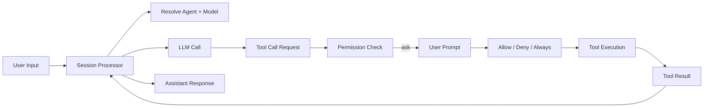
```mermaid
graph LR
    Input[User Input] --> SP[Session Processor]
    SP --> Agent[Resolve Agent + Model]
    SP --> LLM[LLM Call]
    LLM --> ToolCall[Tool Call Request]
    ToolCall --> Permission[Permission Check]
    Permission -->|ask| UI[User Prompt]
    UI --> Decision[Allow / Deny / Always]
    Decision --> Execute[Tool Execution]
    Execute --> Result[Tool Result]
    Result --> SP
    SP --> Output[Assistant Response]
```

**Figure 5:** Session & Tool Execution Flow — LLM call → permission → tool dispatch loop

### 3.6 Provider Selection Flow

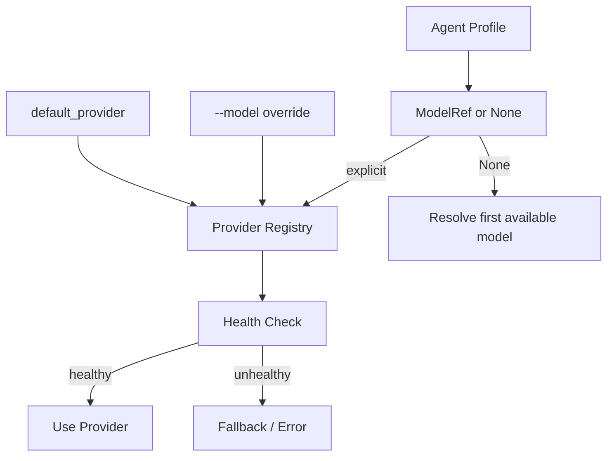
```mermaid
graph TD
    Agent[Agent Profile] --> ModelRef[ModelRef or None]
    ModelRef -->|explicit| Registry[Provider Registry]
    ModelRef -->|None| DefaultResolver[Resolve first available model]
    CLI[--model override] --> Registry
    Config[default_provider] --> Registry
    Registry --> Health[Health Check]
    Health -->|healthy| Use[Use Provider]
    Health -->|unhealthy| Fallback[Fallback / Error]
```

**Figure 6:** Provider Selection Flow — Multi-provider routing and health checks

### 3.7 Agent Execution Loop Phases

```mermaid
graph LR
    A[Start Turn] --> B[Build Context]
          B --> C[Compact if Over Threshold]    C --> D[Send to LLM]
    D --> E[Stream Tokens / Tool Calls]
    E --> F[Execute Tools]
    F --> G[Record Results]
    G --> H[End Turn]
    H -->|next turn| A
```

**Figure 7:** Agent Execution Loop Phases — One complete turn from input to response

#### Phase Descriptions

| Phase | Responsibility |
|-------|----------------|
| Build Context | Assemble system prompt, memories, code index, conversation history |
| Compact | Summarise conversation history when estimated request tokens exceed the configured percentage of the model's context window (`threshold`, default 70%) or, when `threshold` is null, `context_window - max(output_tokens, compaction.buffer)` (FR-003); emergency compaction on provider context-overflow errors (FR-004) |
| LLM Call | Send request to selected provider |
| Stream | Emit assistant chunks and tool call events |
| Execute Tools | Check permissions, run tools, record results |
| Record | Append assistant message + tool results to SQLite |

### 3.8 Autonomous Loop Tools

| Tool | Use |
|------|-----|
| `new_agent` | Spawn a background sub-agent |
| `cancel_agent` | Cancel a running sub-agent |
| `list_agents` | Inspect active sub-agents |
| `wait_agents` | Block until sub-agents finish |
| `agent_complete` | **Terminal signal** that ends the autonomous loop |

`agent_complete` takes **only** `summary`. `team_task_complete` takes `team_name` + `task_id`.

---

## 4. Security & Permissions

### 4.1 Permission Security Layers

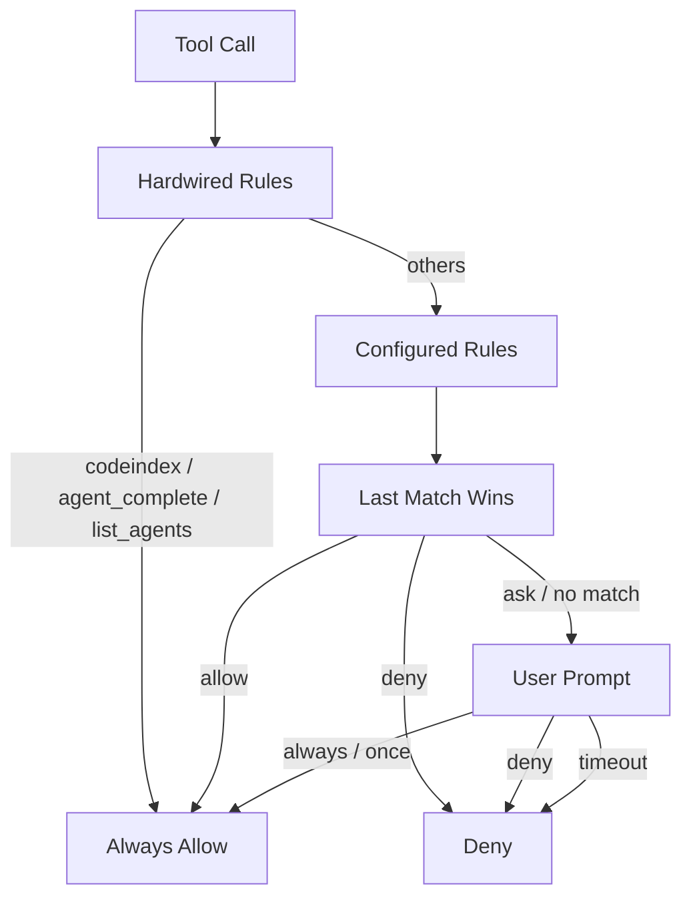
```mermaid
graph TD
    ToolCall[Tool Call] --> Hardwired[Hardwired Rules]
    Hardwired -->|codeindex / agent_complete / list_agents| Allow[Always Allow]
    Hardwired -->|others| Rules[Configured Rules]
    Rules --> Match[Last Match Wins]
    Match -->|allow| Allow
    Match -->|deny| Deny
    Match -->|ask / no match| Prompt[User Prompt]
    Prompt -->|always / once| Allow
    Prompt -->|deny| Deny
    Prompt -->|timeout| Deny
```

**Figure 10:** Permission Security Layers — 5-layer defense-in-depth

### 4.2 Bash Security — 7 Layers

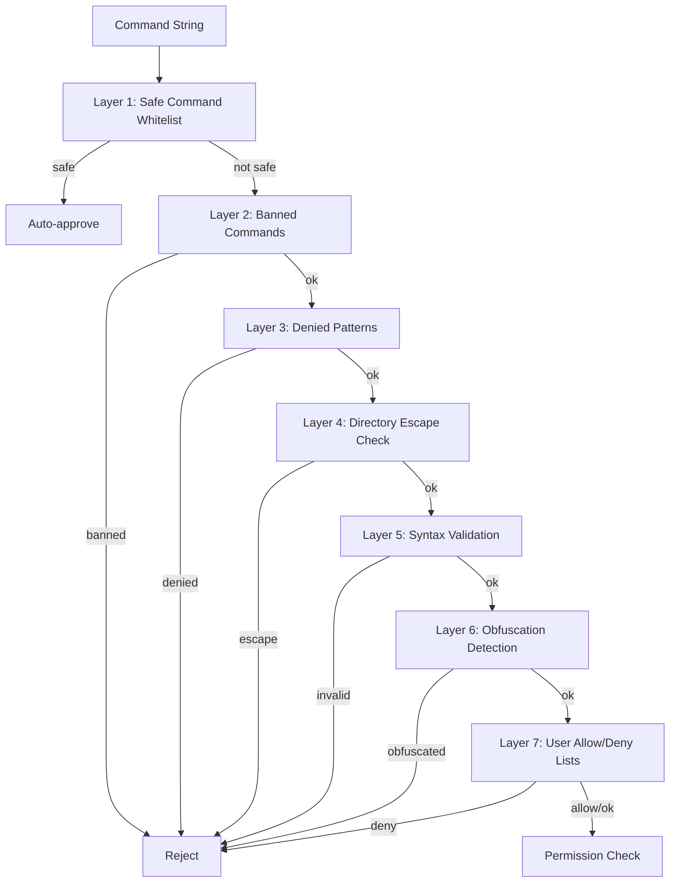
```mermaid
graph TD
    Cmd[Command String] --> L1[Layer 1: Safe Command Whitelist]
    L1 -->|safe| Auto[Auto-approve]
    L1 -->|not safe| L2[Layer 2: Banned Commands]
    L2 -->|banned| Reject
    L2 -->|ok| L3[Layer 3: Denied Patterns]
    L3 -->|denied| Reject
    L3 -->|ok| L4[Layer 4: Directory Escape Check]
    L4 -->|escape| Reject
    L4 -->|ok| L5[Layer 5: Syntax Validation]
    L5 -->|invalid| Reject
    L5 -->|ok| L6[Layer 6: Obfuscation Detection]
    L6 -->|obfuscated| Reject
    L6 -->|ok| L7[Layer 7: User Allow/Deny Lists]
    L7 -->|deny| Reject
    L7 -->|allow/ok| Permission[Permission Check]
```

**Figure 11:** Bash Security — 7 Layers — Bash command defense flow

### 4.3 Permission Request Flow

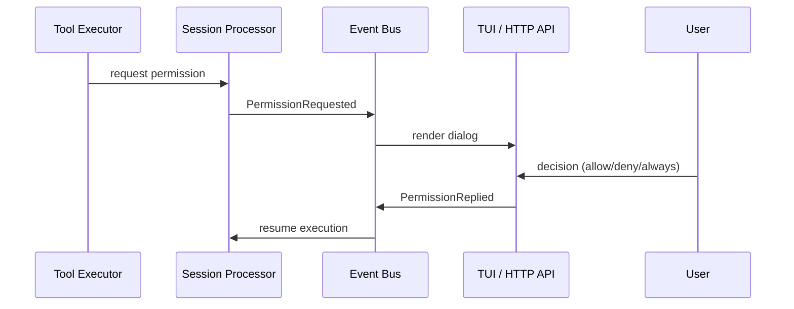
```mermaid
sequenceDiagram
    participant Tool as Tool Executor
    participant SP as Session Processor
    participant Bus as Event Bus
    participant UI as TUI / HTTP API
    participant User as User
    Tool->>SP: request permission
    SP->>Bus: PermissionRequested
    Bus->>UI: render dialog
    User->>UI: decision (allow/deny/always)
    UI->>Bus: PermissionReplied
    Bus->>SP: resume execution
```

**Figure 12:** Permission Request Flow — From tool call to user decision

Permission requests include:

| Field | Description |
|-------|-------------|
| `id` | Unique request ID |
| `permission` | Permission type (`file:write`, `bash`, etc.) |
| `action` | Requested operation description |
| `path` | Target path (for file operations) |
| `command` | Command string (for bash) |
| `created_at` | Unix timestamp |
| `timeout_secs` | Timeout before auto-deny (default 120 s) |

### 4.4 Permission Rules Evaluation

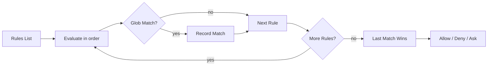
```mermaid
graph LR
    Rules[Rules List] --> Iterate[Evaluate in order]
    Iterate --> Match{Glob Match?}
    Match -->|yes| Record[Record Match]
    Match -->|no| Next[Next Rule]
    Record --> Next
    Next --> More{More Rules?}
    More -->|yes| Iterate
    More -->|no| Last[Last Match Wins]
    Last --> Action[Allow / Deny / Ask]
```

**Figure 13:** Permission Rules Evaluation — Rule matching and resolution

Rules are evaluated top-to-bottom; the last matching rule determines the action.
Built-in default rules include:

| Default | Action |
|---------|--------|
| `read` | allow |
| `edit`, `bash`, `web`, `plan_enter` | ask |
| `todo` | allow |

### 4.5 File Path Guards

- File-write tools must target paths inside the working directory unless the user
  explicitly allows escaping.
- Path normalization resolves `..` and symlinks before permission checks.
- The `dirs` config block can whitelist additional writable roots.

### 4.6 Secret Redaction

Environment variables matching `*KEY*`, `*SECRET*`, `*TOKEN*`, `*PASSWORD*`
are redacted from tool outputs and logs.

### 4.7 YOLO Mode

YOLO mode bypasses Layers 2, 3, and 6 of bash security and auto-approves all
permissions. It is intended for trusted local environments and is persisted
to `ragent.json`.

```bash
/yolo        # toggle in TUI
--yes        # CLI flag
```

---

## 5. Configuration

### 5.1 Configuration Sources

Ragent loads configuration from (highest priority first):

1. `--config <PATH>` CLI argument
2. `.ragent/ragent.json` (or `ragent.jsonc`) in the working directory
3. `~/.config/ragent/config.json`
4. Built-in defaults

The format is compatible with OpenCode's `opencode.json`.

### 5.2 Configuration Schema

```jsonc
{
  "provider": {
    "anthropic": {
      "env": ["ANTHROPIC_API_KEY"],
      "thinking": { "enabled": true, "level": "low" },
      "models": {
        "claude-sonnet-4-20250514": {
          "thinking": { "enabled": true, "level": "high", "budget_tokens": 16000 }
        }
      }
    },
    "router": {
      "enabled": true,
      "tiers": {
        "SIMPLE": { "models": [{"provider": "ollama", "model": "phi4"}] },
        "MEDIUM": { "models": [{"provider": "anthropic", "model": "claude-sonnet-4-20250514"}] },
        "COMPLEX": { "models": [{"provider": "openai", "model": "gpt-4o"}] },
        "REASONING": { "models": [{"provider": "anthropic", "model": "claude-opus-4-20250514"}] }
      }
    },
    "azure_resource": {
      "env": ["AZURE_RESOURCE_API_KEY"]
    }
  },
  "defaultAgent": "coder",
  "permissions": [
    { "permission": "file:write", "pattern": "src/**", "action": "allow" }
  ],
  "memory": {
    "enabled": true,
    "structured": { "enabled": true },
    "semantic": { "enabled": false, "dimensions": 384 }
  },
  // OpenCode-derived summarisation compaction (recommended).
  // Compaction triggers when estimated request tokens exceed the configured
  // percentage of the model's context window. `threshold: 0.7` means the
  // summarisation runs once usage crosses 70 % of the available context,
  // regardless of the model's absolute context size. When `threshold` is
  // null, the fraction-based fallback `context_window - max(output_tokens,
  // buffer)` is used instead.
  "compaction": {
    "auto": true,
    "threshold": 0.7,
    "buffer": 0.10,
    "keep": { "tokens": 0.20 }
  },
  // Deprecated legacy Headroom compression block. Still parsed for
  // one-release migration: `compression.enabled` maps to
  // `compaction.auto` when `compaction.auto` is not set explicitly.
  "compression": {
    "enabled": true,
    "mode": "default",
    "auto_threshold": 0.80
  },
  "tool_visibility": {
    "office": true,
    "github": true,
    "gitlab": true,
    "teams": true,
    "agents": true,
    "plan": true,
    "codeindex": true,
    "masterfetch": true,
    "browser": true
  },
  "yolo": false,
  "stream": {
    "timeout_secs": 120,
    "initial_response_timeout_secs": 300
  },
  "dirs": {
    "allow_write": ["target/temp/**"]
  }
}
```

### 5.3 Environment Variables

| Variable | Provider / Purpose |
|----------|--------------------|
| `ANTHROPIC_API_KEY` | Anthropic |
| `OPENAI_API_KEY` | OpenAI |
| `GITHUB_TOKEN` | GitHub / Copilot |
| `GEMINI_API_KEY` | Google Gemini |
| `HF_TOKEN`, `HUGGING_FACE_HUB_TOKEN` | Hugging Face |
| `AZURE_AI_FOUNDRY_API_KEY`, `AZURE_AI_FOUNDRY_BASE` | Azure AI Foundry |
| `AZURE_RESOURCE_API_KEY` | Azure Resource |
| `AWS_ACCESS_KEY_ID`, `AWS_SECRET_ACCESS_KEY`, `AWS_SESSION_TOKEN`, `AWS_PROFILE`, `AWS_REGION` | Amazon Bedrock |
| `XAI_API_KEY` | xAI Grok |
| `RAGENT_FOUNDRY_LOCAL_FORCE_WEB` | Force Foundry Local web-service path |
| `LANGSEARCH_API_KEY` | Web search (LangSearch) |
| `TAVILY_API_KEY` | Web search (Tavily) |

### 5.4 Compaction Configuration

The `compaction` block controls OpenCode-derived summarisation-based context-window
compaction, which replaces the older Headroom `compression` scheme. It satisfies
FR-008 (auto toggle) and FR-011 (user-overridable threshold, buffer, keep-tokens,
and summary output-token values).

```jsonc
{
  "compaction": {
    // Enable automatic pre-send summarisation. When false, only emergency
    // overflow compaction runs on provider context-overflow errors (FR-008).
    "auto": true,
    // Fraction of the model's context window at which automatic pre-send
    // compaction triggers (0.0–1.0). Default: 0.7 (70 %). This is the
    // recommended, model-independent trigger: 70 % of a 32k window is 22.4k
    // tokens, while 70 % of a 200k window is 140k tokens. The threshold is
    // never below 70 %, even when a fraction-based fallback is used.
    "threshold": 0.7,
    // Response/safety buffer as a fraction of the model's context window.
    // Only used when `threshold` is null. Compaction then triggers when
    // estimated request tokens exceed context_window - max(output_tokens,
    // buffer). Default: 0.10 (10 %, FR-011).
    "buffer": 0.10,
    // Recent conversation turns kept verbatim after compaction.
    "keep": {
      // Fraction of the context window reserved for recent user/assistant/tool turns to preserve.
      // Default: 0.20 (20 %, FR-011).
      "tokens": 0.20
    }
  }
}
```

| Field | Type | Default | Description |
|-------|------|---------|-------------|
| `auto` | bool | `true` | Enable automatic pre-send compaction (FR-008) |
| `threshold` | f64 | `0.7` | Fraction of context window that triggers compaction; model-independent |
| `buffer` | f64 | `0.10` | Fallback response/safety buffer as a fraction of the context window when `threshold` is null (FR-011) |
| `keep.tokens` | f64 | `0.20` | Fraction of context window reserved for recent turns preserved verbatim (FR-011) |

The compaction trigger threshold is always raised to at least 70 % of the
model's context window, so automatic pre-send compaction never fires on routine
prompts that fill less than 70 % of the available context. Emergency overflow
compaction is not subject to this floor.

The compaction summary output length is fixed at `4096` tokens and tool outputs
are truncated to `2000` characters before being serialised into the summarisation
prompt, matching OpenCode's defaults.

The legacy `compression` block (`compression.enabled`, `compression.mode`,
`compression.auto_threshold`) is still parsed for one-release migration:
`compression.enabled` is treated as `compaction.auto` when `compaction.auto` is
not set explicitly. New configurations should use `compaction`.

Trigger the one-shot compaction manually with the `/compact` slash command
(`/compress` is a deprecated alias — FR-009).

### 5.5 Thinking Configuration

Thinking/reasoning is configured per model:

```jsonc
{
  "provider": {
    "anthropic": {
      "models": {
        "claude-sonnet-4-20250514": {
          "thinking": { "enabled": true, "level": "medium" }
        }
      }
    }
  }
}
```

Levels: `auto`, `off`, `low`, `medium`, `high`. `budget_tokens` is optional.

---

## 6. Terminal User Interface (TUI)

### 6.1 TUI Layout

The TUI is a ratatui full-screen interface with these panels:

| Panel | Purpose |
|-------|---------|
| Chat | Conversation stream with markdown and syntax highlighting |
| Log | Step-numbered tool calls with pretty-printed JSON |
| Status bar | Provider/model, context usage, compression indicator, YOLO state |
| Input | Command-line with slash-command autocomplete |
| Permission dialog | Modal approval dialog with live countdown (120 s) |
| Question dialog | Modal user question (free-text or multiple-choice) |

### 6.2 Slash Commands

| Command | Description |
|---------|-------------|
| `/quit` / `/q` | Exit ragent |
| `/provider` | Open provider setup dialog (always allows editing the stored key) |
| `/model` | Select model (jumps to model list when a provider is already configured) |
| `/agent` | Select agent |
| `/agents` | List loaded agents and diagnostics |
| `/websearch show` | Show web-search engine diagnostics (enabled / in-use / failed) |
| `/websearch help` | Show `/websearch` subcommand help |
| `/websearch test` | Test configured web-search backends |
| `/webapi enable\|disable\|help` | Manage the HTTP REST API |
| `/tools` | Toggle tool visibility |
| `/codeindex on\|off` | Enable/disable code index |
| `/codeindex lang <language>` | Filter code index by language |
| `/compact` | Summarise and compact the conversation history (one-shot LLM summarisation; FR-009). `/compress` is a deprecated alias |
| `/memory` | Memory management commands |
| `/yolo` | Toggle YOLO mode |
| `/todo` `/task` `/tasks` | Open the TASKS side panel (also Alt+T); subcommands delegate to task tools |
| `/team create <name>` | Create a team |
| `/team open <name>` | Re-open existing team |
| `/team close` | Close current team |
| `/team clear` | Reset current team state |
| `/team delete <name>` | Delete team on disk |
| `/team cleanup` | Tear down current team |
| `/team message ...` | Send team message |
| `/swarm <prompt>` | Decompose prompt into parallel subtasks |
| `/swarm status` | Show active swarm tasks |
| `/swarm kill` | Cancel active swarm |
| `/autopilot on\|off` | Toggle autonomous mode |
| `/spec create\|specify\|plan\|tasks\|update\|add\|feedback\|jtbd\|list\|search\|show\|validate\|status\|task\|impl\|coverage\|activate\|deactivate\|delete` | Spec lifecycle and SDD commands |
| `/research create\|list\|show\|search\|delete` | Research commands; `create` supports `--from-file`, `--from-url`, `--use-low-relevance` |
| `/config show` | Show resolved configuration |
| `/config save` | Snapshot global `ragent.json` to `saves/` (atomic, timestamped) |
| `/config list` | Interactive picker to restore a saved backup |
| `/init config` | Create a default `ragent.json` in the global config directory |
| `/startup` | Show per-stage startup timing instrumentation |
| `/telemetry help\|on\|off\|setup\|counters` | Manage OpenTelemetry metrics export |
| `/dirs` | Show configured writable directories |
| `/profile` / `/theme` / `/status` / `/mouse` | UI preferences |
| `/skill` / `/skills` | Load or inspect skill packs |
| `/mcp discover\|list\|call` | MCP server commands |
| `/opt <method> <prompt>` | Optimize a prompt |
| `/update` / `/update install` | Auto-update (reserved; not implemented) |

### 6.3 TUI Component Architecture

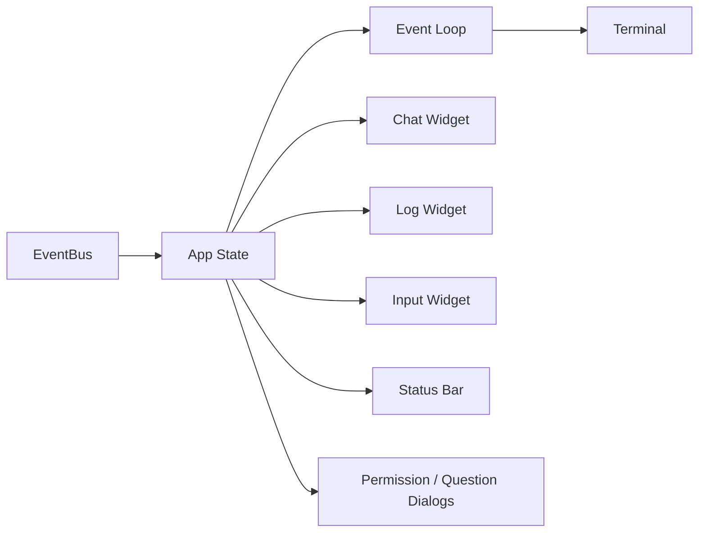
```mermaid
graph LR
    App[App State] --> EventLoop[Event Loop]
    EventLoop --> Terminal[Terminal]
    App --> Chat[Chat Widget]
    App --> Log[Log Widget]
    App --> Input[Input Widget]
    App --> Status[Status Bar]
    App --> Dialogs[Permission / Question Dialogs]
    EventBus --> App
```

**Figure 7:** TUI Component Architecture — UI layout and event wiring

### 6.4 Permission Dialog Countdown

The permission dialog displays a live countdown:

- Format: `M:SS` (e.g., `1:45`)
- Shows `EXPIRED` when the 120-second timeout is reached
- The event loop redraws continuously so the timer decrements without requiring keyboard input

---

## 7. HTTP Server & API

### 7.1 Starting the Server

```bash
ragent serve --port 9100 --host 127.0.0.1
```

### 7.2 REST Endpoints

| Method | Endpoint | Description |
|--------|----------|-------------|
| GET | `/health` | Health check |
| POST | `/sessions` | Create a session |
| GET | `/sessions` | List sessions |
| GET | `/sessions/{id}` | Get session details |
| POST | `/sessions/{id}/messages` | Send a message (returns SSE stream) |
| GET | `/sessions/{id}/events` | SSE event stream |
| GET | `/models` | List available models |
| GET | `/providers` | List providers |
| GET | `/agents` | List agents |
| POST | `/opt` | Prompt optimization |
| GET | `/research` | List research items |
| POST | `/research` | Create + run a research gathering session (returns `202 Accepted` with `Location` header) |
| GET | `/research/{name}` | Show one research item (supports `?full=true` for extended metadata) |
| DELETE | `/research/{name}` | Delete a research item (requires `?confirm=delete-{name}`) |
| GET | `/research/{name}/events` | SSE stream of live research events for a background run |

### 7.3 SSE Events

The server streams the following event types:

| Event | Description |
|-------|-------------|
| `assistant_chunk` | Token or reasoning block |
| `tool_requested` / `tool_executed` | Tool lifecycle |
| `permission_requested` / `permission_replied` | Permission flow |
| `question_requested` / `question_answered` | Question tool |
| `compression_started` / `compression_finished` | Context compaction lifecycle |
| `subagent_*` / `teammate_*` | Multi-agent lifecycle |
| `agent_notice` | Status messages |
| `research` | Research session events (phase, web capture, synthesis, analysis, done) — streamed via `GET /research/{name}/events` |

### 7.4 Authentication

The HTTP API uses Bearer token authentication:

```bash
curl -H "Authorization: Bearer $RAGENT_TOKEN" ...
```

`RAGENT_TOKEN` is read from the environment. If unset, the server may allow
local requests without authentication depending on build configuration.

### 7.5 HTTP API Request Flow

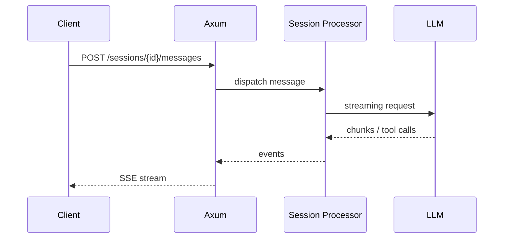
```mermaid
sequenceDiagram
    participant Client
    participant Axum
    participant SP as Session Processor
    participant LLM
    Client->>Axum: POST /sessions/{id}/messages
    Axum->>SP: dispatch message
    SP->>LLM: streaming request
    LLM-->>SP: chunks / tool calls
    SP-->>Axum: events
    Axum-->>Client: SSE stream
```

**Figure 8:** HTTP API Request Flow — REST + SSE lifecycle

---

# Part III: Data & Knowledge Systems

---

## 8. Code Index

### 8.1 Overview

The code index provides fast, local, read-only code intelligence. It is built
on tree-sitter parsing and Tantivy full-text search, with a SQLite metadata
store.

### 8.2 Supported Languages

Rust, Python, TypeScript/JavaScript, Go, C/C++, Java, OpenSCAD, Terraform,
CMake, Gradle, Maven, and more (15+ grammars compiled-in).

### 8.3 Architecture

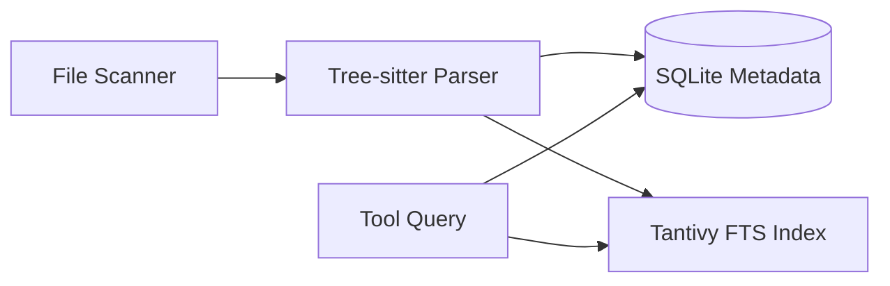
```mermaid
graph LR
    Scan[File Scanner] --> Parse[Tree-sitter Parser]
    Parse --> Store[(SQLite Metadata)]
    Parse --> Index[Tantivy FTS Index]
    Query[Tool Query] --> Index
    Query --> Store
```

**Figure 9:** Code Index Pipeline — File scan → parse → index → search

### 8.4 Code Index Tools

| Tool | Purpose |
|------|---------|
| `codeindex_search` | Full-text search across indexed code |
| `codeindex_symbols` | Search for symbols by name |
| `codeindex_references` | Find references to a symbol |
| `codeindex_dependencies` | Query file-level imports/dependents |
| `codeindex_status` | Show index status |
| `codeindex_reindex` | Trigger a full re-index |

All code index tools are **hardwired always-allowed** because they are read-only
and local-only.

### 8.5 Semantic Code Graph

The code index also maintains a **semantic code graph** — a typed edge graph
over indexed symbols that captures relationships such as `calls`, `imports`,
`inherits`, `references`, `mixes_in`, and `implements`. Edges are either
`EXTRACTED` (from tree-sitter parse data) or `INFERRED` (heuristic).

The graph is built on demand via `/codeindex graph build` (or
`/codeindex graph lang <language>` for a per-language subgraph) and persisted
in the `graph_edges` SQLite table.

#### Graph Tools

| Tool | Purpose |
|------|---------|
| `codeindex_godnodes` | Top-N most-connected symbols (highest degree) |
| `codeindex_path` | Shortest path (by hop count) between two symbols |
| `codeindex_explain` | Node metadata and incoming/outgoing edges for a symbol |
| `codeindex_communities` | Community detection via label propagation |

All graph tools use non-blocking `try_*` variants with retry and return a
`codeindex_busy` response when the index is locked (e.g. during a reindex).

#### Graph Status

`/codeindex show` reports graph-level statistics alongside index stats:
edge count (total, extracted, inferred), node count, per-kind edge counts,
and community count.

### 8.6 Incremental Updates

A file watcher detects changes and incrementally updates the index. Language
filtering is available via `/codeindex lang <language>`.

---

## 9. Memory System

### 9.1 Three Tiers

| Tier | Storage | Use Case |
|------|---------|----------|
| **File blocks** | Markdown files in `.ragent/memory/` or `~/.ragent/memory/` | Long-form notes, patterns, preferences |
| **Structured store** | SQLite via `memory_store` / `memory_recall` | Facts, errors, workflows with tags/confidence |
| **Semantic search** | Optional embeddings (`all-MiniLM-L6-v2`) | Similarity-based recall |

### 9.2 Memory Operations

| Tool | Purpose |
|------|---------|
| `memory_read` | Read a memory block file |
| `memory_write` | Write/append to a memory block file |
| `memory_replace` | Replace a string in a named block |
| `memory_store` | Store a structured memory entry |
| `memory_recall` | Full-text search structured memories |
| `memory_search` | Semantic/keyword search across memories |
| `memory_forget` | Delete memories by filter |
| `memory_migrate` | Split a flat MEMORY.md into blocks |
| `conversation_search` | Keyword/turn-range/stats search over the current session |
| `session_search` | Cross-session full-text search with filters and context |

### 9.3 Automatic Extraction

After each assistant turn the system can extract:

- Project facts and patterns
- Errors and their resolutions
- User preferences
- Workflows and standard operating procedures

Extracted memories are tagged with category, confidence, and source.

### 9.4 Decay, Compaction, and Knowledge Graph

- Memories decay in relevance over time unless accessed or reinforced.
- Compaction summarises old memories.
- A lightweight knowledge graph links related memories by tag and reference.

---

## 10. Spec Management

### 10.1 Overview

Ragent includes a built-in specification lifecycle for tracking features,
requirements, and implementation tasks.

### 10.2 Directory Layout

Specs live in `specs/<SpecId>/`:

```
specs/
└── testspec/
    ├── SPEC.md          # EARS requirements and status
    ├── PLAN.md          # Implementation tasks and Phase -1 gates
    ├── TASKS.md         # Ordered task list extracted from PLAN.md
    ├── TESTPLAN.md      # Manual test-plan with TC-NNN test cases
    ├── CONSTITUTION.md  # Optional: project constitution with nine articles
    ├── data-model.md    # Optional: data-model artifact (gated by sdd.data_model)
    ├── contracts/       # Optional: API contracts directory (gated by sdd.contracts)
    ├── quickstart.md    # Key validation scenarios derived from SPEC.md
    ├── FEEDBACK.md      # Optional: production feedback notes
    ├── JTBD.md          # Optional: Jobs-To-Be-Done analysis
    └── REPORT.md        # Optional audit/completion report
```

### 10.3 Spec Status Lifecycle

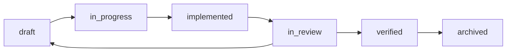
```mermaid
graph LR
    draft[draft] --> in_progress[in_progress]
    in_progress --> implemented[implemented]
    implemented --> in_review[in_review]
    in_review --> verified[verified]
    in_review --> draft
    verified --> archived[archived]
```

### 10.4 Spec Tools

| Tool | Purpose |
|------|---------|
| `spec_list` | List specifications |
| `spec_read` | Read a spec by ID |
| `spec_search` | Search specs by keyword |
| `spec_coverage` | Generate requirement coverage report |
| `spec_task_update` | Update a plan task status |

### 10.5 Slash Commands

| Command | Purpose |
|---------|---------|
| `/spec create <name> <title> [--from-research <name>]` | Create a new spec (SPEC.md + PLAN.md + TESTPLAN.md) |
| `/spec specify <name> <feature> [--from-research <name>]` | Generate SPEC.md only (EARS spec with `[NEEDS CLARIFICATION]` markers); optionally creates a git branch when `sdd.branch_per_spec` is enabled |
| `/spec plan <name> <tech-context>` | Generate or regenerate PLAN.md from existing SPEC.md using technology context as guidance |
| `/spec tasks <name>` | Generate TASKS.md (ordered task list from PLAN.md) and quickstart.md (validation scenarios from SPEC.md) |
| `/spec update <specname>` | Re-read `SPEC.md` and regenerate `PLAN.md` + `TESTPLAN.md` (preserves unchanged task IDs) |
| `/spec add <id> <requirement>` | Add an incremental requirement to an existing spec |
| `/spec feedback <spec-id> <note>` | Append a production feedback note to `FEEDBACK.md` |
| `/spec impl <id>` / `/spec implement <id>` | Transition spec to `in_progress` and generate plan |
| `/spec jtbd <specname> [--force] [--agent <name>]` | Perform JTBD analysis and write `JTBD.md` in the spec folder |
| `/spec list [--status <status>] [--prefix <prefix>]` | List specs with optional filtering |
| `/spec search <query>` | Search specs by keyword |
| `/spec show <id>` | Read a spec |
| `/spec validate [specname]` | Validate EARS compliance, clarification markers, and consistency (ambiguity, contradiction, gap detection) |
| `/spec status <id> [<new-status>]` | Show or transition spec status |
| `/spec task <id> [<task-id>] [<new-status>]` | List, show, or update task status |
| `/spec coverage <id>` | Generate requirement coverage report |
| `/spec activate <id>` | Activate a spec for context injection into agent prompts |
| `/spec deactivate` | Deactivate the currently active spec |
| `/spec delete <id> [--yes]` | Delete a spec directory |

### 10.6 Research Linkage

Specs can reference research outputs via the `--from-research` flag on
`/spec create` and `/spec specify`. When provided, the spec's `SPEC.md`
receives a `research:` key in its YAML frontmatter linking to the research
artifact, and a `## Related Research` section is injected into the body
summarising the linked research output.

### 10.7 SDD Configuration Flags

The following configuration flags in `ragent.json` under the `sdd` key control
opt-in Spec-Driven Development capabilities:

| Flag | Default | Purpose |
|------|---------|---------|
| `branch_per_spec` | `false` | Create a `spec/<name>` git branch during `/spec specify` |
| `data_model` | `false` | Generate `data-model.md` during `/spec plan` |
| `contracts` | `false` | Generate `contracts/` directory during `/spec plan` |
| `feedback_loop` | `false` | Surface `FEEDBACK.md` notes during `/spec plan` regeneration |

### 10.8 Consistency Validation

`/spec validate` performs three categories of consistency checks in addition
to EARS compliance:

- **Ambiguity detection** — flags vague terms (e.g. "fast", "efficient") and
  undefined references in requirement text.
- **Contradiction detection** — identifies conflicting requirements that
  specify opposing constraints.
- **Gap detection** — identifies requirements lacking acceptance criteria.

Consistency warnings are included in the validation report alongside EARS
errors and `[NEEDS CLARIFICATION]` marker warnings.

### 10.9 Clarification Markers

During `/spec specify`, the LLM is instructed to insert
`[NEEDS CLARIFICATION]` markers for ambiguous or underspecified requirements.
These markers are detected during validation and block the `approved` status
transition until resolved.

### 10.10 Production Feedback Loop

`/spec feedback <spec-id> <note>` appends advisory notes to
`specs/<spec-id>/FEEDBACK.md`. When the `sdd.feedback_loop` config flag is
enabled, these notes are automatically surfaced in the `/spec plan` prompt
so that production feedback (metrics, incidents, user reports) informs plan
regeneration.

### 10.11 Constitutional Amendment Process

When a spec directory contains a `CONSTITUTION.md`, amendments require
explicit rationale documentation, a backwards-compatibility assessment, and
a dated changelog entry within the file. The constitution parser validates
the nine-article structure and the amendment process.

---

# Part III: Data & Knowledge Systems (continued)

## 11. Research System

### 11.1 Overview

The `/research` slash command and `ragent research` CLI create structured
research items under `research/<name>/`. Each item contains captured sources
(web pages, local files, prior specs) and a single `RESEARCH.md` document.

### 11.2 Source Gathering

A research session runs in phases:

1. **Setup** — validate name and create the skeleton `RESEARCH.md`.
2. **Web** — issue `websearch` queries and fetch pages via `webfetch`. Every
   HTML page captured as a web source must have been extracted by the
   `readability-rs` crate (the research web-gather phase verifies the
   `extraction_method` signal reported by `mf_fetch`, or re-runs readability
   on the raw HTML when the legacy `webfetch` tool is used). Pages where
   readability extraction failed — and would only be available via the
   html2text / raw tag-strip fallbacks — are rejected with a
   `readability extraction failed …` fetch error instead of being accepted.
   PDF and YouTube sources bypass readability entirely by design. YouTube
   sources are captured as the video's caption transcript: `mf_fetch`
   parses the watch page's `ytInitialPlayerResponse` (brace-balanced,
   string-aware JSON extraction), reads the caption tracks from
   `captions.playerCaptionsTracklistRenderer.captionTracks`, and fetches
   the default (or first English) track. A fetch that fails at the tool
   level (e.g. `mf_fetch` reporting `content_ok = false` or an `error`,
   such as "no caption tracks available for this YouTube video") is
   rejected as an explicit `FetchFailed` event carrying the real reason —
   placeholder error text never enters the research corpus as a source
   body.
3. **Local** — scan project files with `glob`/`grep`/`read`. Each captured
   file produces an excerpt showing the matching lines plus one line of
   context on either side, and a `relevance` note that names the matched
   keyword(s) and the first matching line.
4. **Specs** — cross-reference prior specs under `specs/`.
5. **Synthesize** — (TUI only, when an active model is configured) send the
   captured source bodies to the LLM and ask for Summary, Findings,
   In-Project Cross-References, and Open Questions. The session emits a
   `SynthesizeResult` event so the UI can distinguish LLM-synthesized output
   from the mechanical fallback.
6. **Assemble** — combine frontmatter, analysis, and References Index.
7. **Finalize** — mark the item `Complete` and refresh `research/INDEX.md`.

Supporting files under `research/<name>/sources/` (e.g. `web-01.md`,
`local-02.md`) contain the **actual** captured body — web pages render into
plain text, local files become keyword-anchored excerpts — so a reader can
audit the evidence without re-running the search.

### 11.3 AI-Driven Synthesis

When the TUI builds a `ResearchSession` with an active provider/model, an
`LlmAnalysisEngine` is wired in. The engine sends a single prompt containing
truncated source bodies and requests structured markdown sections. The result
is parsed and used to populate the final `RESEARCH.md`.

If the LLM call fails or returns empty output, the session falls back to a
**mechanical digest** that is still useful:

- **Summary** — names the captured web titles (top 3), local file paths
  (top 3), and cross-referenced specs, and is transparent that no LLM
  analysis was applied.
- **Findings** — one bullet per source with the matched keywords, an
  excerpt, and a relevance note.
- **In-Project Cross-References** — table of local files with relevance
  notes.
- **Open Questions** — suggests gaps (missing web sources, missing local
  files, etc.) and recommends re-running with a configured LLM.

Synthesis failures are logged at `error` level (not `warn`) and surfaced via
the `SynthesizeResult { outcome: FallbackError, detail }` event so the user
can see why the LLM path failed.
### 11.4 Output Document

Every `RESEARCH.md` contains:

- YAML frontmatter with `name`, `title`, `status`, `created`, `modified`, `sources`
  (the `title` is a reduced-length version of the `## Summary` content, capped at
  80 characters, so the headline reflects the synthesis rather than the original
  prompt)
  - `# Title:` heading
  - `## Topic`
  - `## Summary`
  - `## Findings` (numbered)
  - `## In-Project Cross-References` (table)
  - `## Open Questions`
  - `## References Index` (table)

  Section order in the report layout: Topic → Search Queries → Executive
  Summary → **Top 10 Implications → Open Questions** → Findings → Findings
  Relationship Diagram → In-Project Cross-References → References Index.
  Open Questions sits directly under Top 10 Implications so unresolved gaps
  surface immediately after the ranked consequences.

  The quality-assurance render sections (Contradiction Graph, Loci Analysis,
  Depth Investigation, Cross-Locus Reconcile, Source Tensions, Synthesis
  Audit, Corpus Critic) are written to a per-research companion file
  `research/<name>/CORPA.md` instead of `RESEARCH.md`. The companion is
  created alongside the skeleton and rewritten on every `write_document`;
  it ends with a `## Sources Reference` copy of the References Index table so
  `[#N]` source indices resolve in both files.

### 11.5 Slash Commands

| Command | Purpose |
|---------|---------|
  | `/research create <name> <topic>` | Gather sources and write `RESEARCH.md` |
  | `/research create <name> <topic> --iterations N --depth shallow|standard|deep --format ...` | Iterative research with controls |
  | `/research create <name> --from-url <URL>` | Fetch the URL, use it as the research subject and capture it as the primary source |
  | `/research create <name> --from-file <PATH>` | Extract a local document and use it as the research subject |
  | `/research create ... --use-low-relevance` | Retain low-relevance web sources |
  | `/research continue <name> [message]` | Resume an in-progress research item |
  | `/research list` | List research items |
  | `/research open <name>` | Show the path to `RESEARCH.md` |
  | `/research show <name>` | Show metadata |
  | `/research search <query>` | Search across all `RESEARCH.md` files |
  | `/research delete <name>` | Delete a research item |
  | `/research archive <name>` | Archive a research item |

### 11.6 Iterative Research Loop (`researchext`)

The research engine now supports an iterative, stateful loop:

1. **Plan** — decompose the topic into focused sub-questions.
2. **Gather** — capture sources for pending sub-questions in parallel.
3. **Synthesize** — produce structured findings from evidence.
4. **Verify** — ensure each claim traces back to a supporting source.
5. **Critique** — score the result and detect missing-link gaps.
6. **Iterate or stop** — continue until complete, out of budget, or no longer improving.

State is persisted to `research/<name>/state.json` so sessions can be resumed with
`/research continue`. The loop emits structured events for plan updates, sub-question
status changes, source captures/failures, critic scores, verification results,
follow-up queries, and iteration completion.

### 11.7 Output Formats

The `--format` flag selects the artifact produced at the end of a session:

| Format | Description |
|---|---|
| `report` | Full multi-section `RESEARCH.md` (default). |
| `executive-summary` | One-page summary. |
| `comparison-table` | Comparison table across key entities. |
| `source-bibliography` | Standalone bibliography of all captured sources. |
| `imrad` | Introduction, Methods, Results, Discussion structure for academic-style reports. |

### 11.8 Research Tiers

The `--tier` flag selects the depth of analysis:

| Tier | Description |
|---|---|
| `light` | Minimal analysis — web gathering + mechanical digest only. |
| `full` | Full analysis pipeline — contradiction graph, loci analysis, reconcile, corpus critic, synthesis, QA (default). |
| `dissertation` | Extended pipeline — includes depth investigations, source tensions, evidence digest, and width sweeps. |

### 11.9 HTTP Research API

The research system is exposed via REST endpoints (all auth-protected):

- `GET /research` — list all research items as JSON (`{items: [...], count: N}`).
- `POST /research` — create + run a research session. Returns `202 Accepted`
  immediately with a `Location` header pointing to `GET /research/{name}/events`.
  The research run executes in a background `tokio::spawn` task.
- `GET /research/{name}` — show a single research item. Pass `?full=true` to
  include extended metadata fields (`topic`, `queries`, `output_format`,
  `model`).
- `DELETE /research/{name}?confirm=delete-{name}` — delete a research item
  (requires confirmation token).
- `GET /research/{name}/events` — SSE stream of live research events. When no
  active run exists but the item is on disk, returns a JSON status blob. Each
  SSE event is a JSON object `{"kind": "...", "payload": {...}}` with event
  type `research`.

The `POST /research` request body mirrors `ResearchRunRequest`:
`name`, `topic`, `title`, `from_urls`, `from_files`, `sources_dir`,
`template`, `depth`, `tier`, `iterations`, `format`, `use_local`, `use_specs`,
`use_low_relevance`, `no_scholarly`, `use_pdf`, `fetch_concurrency`,
`local_concurrency`, `fetch_timeout_secs`, `web_phase_timeout_secs`,
`local_phase_timeout_secs`, `search_max_retries`, `search_retry_base_delay_ms`,
`search_circuit_breaker_threshold`, `max_web_results`, `max_local_sources`,
`max_synthesis_sources`.

---
# Part IV: Agent Customization & Extension

---

## 11. Custom Agents

### 11.1 Storage Locations

Custom agents can be defined in JSON using the Open Agentic Schema Framework
(OASF):

- `~/.ragent/agents/` — user-global
- `.ragent/agents/` — project-local (higher priority)

### 11.2 Agent Schema

```json
{
  "name": "rust-reviewer",
  "description": "Reviews Rust code for idioms and safety",
  "model": "anthropic/claude-sonnet-4-20250514",
  "system_prompt": "You are a meticulous Rust reviewer...",
  "tools": ["read", "edit", "bash", "codeindex_search"],
  "permissions": [
    { "permission": "file:write", "pattern": "crates/**", "action": "allow" }
  ]
}
```

### 11.3 Template Variables

System prompts and file contexts support variables:

| Variable | Expansion |
|----------|-----------|
| `{{WORKING_DIR}}` | Current working directory |
| `{{FILE_TREE}}` | Project file tree |
| `{{AGENTS_MD}}` | Discovered AGENTS.md content |
| `{{DATE}}` | Current UTC date |

### 11.4 Loading and Diagnostics

Use `/agents` to list loaded agents, view diagnostics, and confirm custom
profiles are parsed correctly. Custom agents display a `[custom]` badge in the
agent picker.

---

## 12. Skills System

### 12.1 Overview

Skills are loadable YAML packs that inject tools, system prompts, and file
context into an agent session. They are useful for domain-specific workflows
(e.g., Rust embedded development, Terraform infrastructure).

At startup the agent builds a `SkillCatalog` — a lightweight, metadata-only
list of skill names, descriptions, and trigger phrases. The catalog is cheap to
produce and lets the agent advertise available skills without loading full
skill bodies into the system prompt. Full `SkillInfo` bodies are loaded on
demand when the skill is invoked (`SkillRegistry::catalog()` for discovery,
`SkillRegistry::get()` for activation).

### 12.2 Skill Locations

- Bundled skills in `assets/skills/`
- Custom skills in `~/.ragent/skills/` or `.ragent/skills/`

### 12.3 Skill Format

```yaml
name: rust-embedded
prompt: |
  You are an expert in embedded Rust (no_std, RTIC, embassy).
context_files:
  - "assets/skills/rust-embedded/context.md"
tools:
  - read
  - edit
  - bash
  - codeindex_search
```

### 12.4 Activation

Skills can be loaded via slash command or the `/skills` picker.

---

## 13. Prompt Optimization

### 13.1 Overview

The `/opt` slash command (and `POST /opt` endpoint) transforms a plain prompt
into one of 12 structured frameworks without an LLM call.

### 13.2 Methods

| Method | Description |
|--------|-------------|
| `co_star` | Context, Objective, Scope, Task, Action, Result |
| `crispe` | Context, Role, Intent, Steps, Persona, Examples |
| `cot` | Chain-of-Thought step-by-step reasoning |
| `draw` | Image prompt structure |
| `rise` | Role, Intent, Scope, Examples |
| `o1_style` | Stylized creative tokens and constraints |
| `meta` | Meta Prompting — generate the internal prompt |
| `variational` | Multiple prompt candidates + selection criteria |
| `q_star` | Iterative query refinement |
| `openai` | OpenAI/GPT system+user adapter |
| `claude` | Anthropic Claude adapter |
| `microsoft` | Microsoft Azure AI adapter |

### 13.3 Example

```
/opt co_star Explain Rust lifetimes
```

---

# Part V: Multi-Agent Coordination

---

## 14. Teams

### 14.1 Core Concepts

A **team** is a named workspace with:

- A roster of teammates (each with an agent type and task)
- A shared task list stored in `tasks.json`
- A per-member mailbox stored in `mailbox.json`
- A team configuration in `team.json`

### 14.2 Team Lifecycle

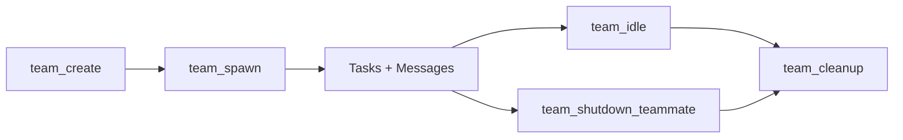
```mermaid
graph LR
    Create[team_create] --> Spawn[team_spawn]
    Spawn --> Work[Tasks + Messages]
    Work --> Idle[team_idle]
    Work --> Shutdown[team_shutdown_teammate]
    Idle --> Cleanup[team_cleanup]
    Shutdown --> Cleanup
```

### 14.3 Team Tools (20)

| Tool | Purpose |
|------|---------|
| `team_create` | Create team |
| `team_spawn` | Spawn teammate |
| `team_status` | Team status |
| `team_message` | Direct message |
| `team_broadcast` | Broadcast to active teammates |
| `team_read_messages` | Read mailbox |
| `team_memory_read` / `team_memory_write` | Team memory access |
| `team_submit_plan` | Submit plan for approval |
| `team_approve_plan` | Lead approve/reject plan |
| `team_task_create` | Add task |
| `team_task_claim` | Claim task |
| `team_task_complete` | Complete task |
| `team_assign_task` | Lead assigns task |
| `team_idle` | Signal idle |
| `team_shutdown_teammate` | Shutdown teammate (graceful/immediate) |
| `team_shutdown_ack` | Acknowledge shutdown |
| `team_cleanup` | Remove team state |

### 14.4 Team Slash Commands

| Command | Purpose |
|---------|---------|
| `/team create <name>` | Create a new team |
| `/team open <name>` | Open an existing team |
| `/team close` | Close current team |
| `/team clear` | Reset current team state |
| `/team delete <name>` | Delete a team |
| `/team cleanup` | Tear down current team |
| `/team message <to> <text>` | Send direct message |

### 14.5 Task Dependencies

Tasks can declare `depends_on` task IDs. A task cannot be claimed until all its
dependencies are completed.

### 14.6 Plan Approval Workflow

1. Teammate calls `team_submit_plan`.
2. Lead reviews and calls `team_approve_plan` (approved=true/false).
3. On approval, teammate proceeds with implementation.

### 14.7 Blueprints

#### Blueprint Storage Locations

- `~/.ragent/blueprints/teams/<name>/`
- `.ragent/blueprints/teams/<name>/`

#### Blueprint Directory Structure

```
<blueprint>/
├── spawn-prompts.json   # Agent type definitions
├── task-seed.json       # Initial task list
└── context.md           # Shared context
```

#### spawn-prompts.json Format

```json
{
  "agents": [
    {
      "name": "security-reviewer",
      "agent_type": "general",
      "prompt": "Review the target files for security issues..."
    }
  ]
}
```

#### task-seed.json Format

```json
{
  "tasks": [
    { "title": "Scan for injection risks", "description": "..." }
  ]
}
```

#### Blueprint Slash Commands

| Command | Purpose |
|---------|---------|
| `/team create <name> --blueprint <bp>` | Create team from blueprint |

#### Work Context Propagation

When a team is created with a blueprint, the work context is prepended to every
teammate's spawn prompt. This context includes target directories, expected
outputs, and any constraints.

#### Blueprint Best Practices

- Keep prompts under ~500 words.
- Reference files by path rather than pasting content.
- Spawn one teammate per independent work item.
- Use `/team_wait` after spawning to avoid racing ahead.

---

## 15. Swarm Mode

### 15.1 How Swarm Works

The `/swarm <prompt>` slash command decomposes a user request into parallel
subtasks and spawns multiple agents to work on them concurrently. A synthesis
agent combines the outputs into a final answer.

### 15.2 Swarm Slash Commands

| Command | Purpose |
|---------|---------|
| `/swarm <prompt>` | Decompose and run parallel swarm |
| `/swarm status` | Show active swarm tasks |
| `/swarm kill` | Cancel active swarm |

### 15.3 Decomposition Format

Swarm decomposition returns a JSON or Markdown list of subtasks:

```json
{
  "tasks": [
    { "id": "1", "agent": "explore", "prompt": "Find all auth-related files" },
    { "id": "2", "agent": "code-review", "prompt": "Review auth logic for issues" }
  ]
}
```

### 15.4 Swarm State

Swarm state is tracked in memory and via the team store when teammates are
used. The TUI active-agents panel shows per-agent status and progress.

### 15.5 Limitations

- Swarm requires a provider with enough throughput for parallel calls.
- Cloud providers may hit rate limits; exponential retry backoff mitigates this.
- Synthesis depends on the quality of subtask outputs.

---

## 16. Autopilot Mode

### 16.1 How Autopilot Works

Autopilot runs the agent loop without requiring user approval for each step. It
is useful for long-running, low-risk tasks.

### 16.2 Autopilot Slash Commands

| Command | Purpose |
|---------|---------|
| `/autopilot on` | Enable autopilot |
| `/autopilot off` | Disable autopilot |
| `/autopilot on --max-tokens N` | Enable with token budget |
| `/autopilot on --max-time N` | Enable with time budget (seconds) |

### 16.3 Safety Limits

| Limit | Default | Description |
|-------|---------|-------------|
| Max iterations | 50 | Hard cap on tool/turn loops |
| Max tokens | configurable | Total token budget |
| Max time | configurable | Wall-clock budget |
| Permissions | auto-approve | Only within allowed rule set |

### 16.4 Completion Signalling

Autopilot ends when:

- The agent calls `agent_complete(summary)`.
- A safety limit is reached.
- The user sends `/autopilot off` or `Esc`.

### 16.4.1 `new_agent` parameter contract

`new_agent` spawns a sub-agent with a bounded task. The sub-agent should finish
with `agent_complete`.

### 16.5 Status Display

Autopilot state is shown in the status bar as `AUTOPILOT` with iteration and
token counters.

---

## 16A. Cron Scheduling

Ragent supports scheduling agent runs with a cron-like system. Users can
schedule one-shot or repeating events, each with a designated agent type and an
initial prompt. Events are persisted to SQLite and evaluated by a background
scheduler while the TUI session is running.

### 16A.1 Schedule Grammar

Three schedule forms are supported:

| Form | Behaviour | Example |
|------|-----------|---------|
| `at <timestamp>` | One-shot. Fires once at the specified time. | `/cron add nightly general at 2025-01-15T09:00 "Run tests"` |
| `from <timestamp> every <duration>` | Repeating. First fire at the timestamp, then every duration. | `/cron add nightly general from 2025-01-15T09:00 every 30m "Run tests"` |
| `every <duration>` | Repeating, no explicit start. First fire is duration from now. | `/cron add nightly general every 2h "Run tests"` |

Durations are a positive integer + unit:

| Unit | Meaning | Aliases |
|------|---------|---------|
| `m` | minutes | `min`, `mins` |
| `h` | hours | `hr`, `hrs` |
| `d` | days | `day`, `days` |
| `w` | weeks | `wk`, `wks` |
| `mo` | months (30 days) | `month`, `months` |

Timestamps accept ISO-8601 (e.g. `2025-01-15T09:00:00Z` or
`2025-01-15T09:00:00+02:00`) or natural-language shortcuts resolved against
the user's local timezone:

| Shortcut | Meaning |
|----------|---------|
| `5pm` | Next 5pm (today if not yet passed, else tomorrow) |
| `5:30pm` / `5:30 pm` | Next 5:30pm |
| `17:00` | Next 17:00 (24-hour clock) |
| `5am tomorrow` | 5am on the following day |
| `12pm` | Noon |
| `12am` | Midnight |

### 16A.2 Slash Commands

| Command | Description |
|---------|-------------|
| `/cron add <cronname> <agent> <schedule> "<prompt>"` | Schedule a new event (`cronname` becomes the event ID) |
| `/cron remove <event_id>` | Remove a scheduled event |
| `/cron enable <event_id>` | Enable a previously disabled event |
| `/cron disable <event_id>` | Disable an event (skipped by the scheduler) |
| `/cron list` | List all events with human-readable schedule descriptions |
| `/cron detail <event_id>` | Show full details of a single event (untruncated prompt) |
| `/cron log [event_id]` | Show execution log (optionally filtered by event id) |
| `/cron help` | Show usage |

The model can also manage cron events directly via the LLM-callable tools
`cron_add`, `cron_remove`, `cron_list`, `cron_enable`, and `cron_disable`.

### 16A.3 Scheduler

A background scheduler task runs while the TUI session is active, ticking every
30 seconds. On each tick, it queries all enabled events whose `next_due` has
passed and spawns a background agent run for each. For repeating events,
`next_due` is advanced by one duration interval. For one-shot events, the event
is marked as fired.

### 16A.4 Execution Logging

Every execution is logged as a single JSON line appended to
`<working_dir>/log/cron-<timestamp>.jsonl`, mirroring the edit-log convention.
Each entry records:

- Event id
- Agent type
- Prompt
- Outcome (`"success"`, `"error"`, or `"skipped"`)
- Error message (if any)
- Completion timestamp

### 16A.5 Guards

- **Disabled events** are skipped with a `"skipped"` outcome.
- **Unknown agent types** are logged with an `"error"` outcome.
- **Double-fire prevention**: if a repeating event's previous execution is
  still running, the current due cycle is skipped and logged as `"skipped"`.

### 16A.6 Past-Start Advancement

When a `from <timestamp> every <duration>` event has a start timestamp in the
past, `next_due` is advanced by whole duration intervals until it is strictly in
the future. The original `start_at` timestamp is preserved unchanged.

---

## 17. Orchestrator & Multi-Agent Coordination

### 17.1 Core Components

| Component | Responsibility |
|-----------|----------------|
| `Coordinator` | High-level task decomposition and dispatch |
| `AgentPool` | Manages active sub-agents |
| `ConflictResolver` | Detects and resolves conflicting edits |
| `TransportAdapters` | Bridges TUI, HTTP, and mailbox transports |

### 17.2 Coordinator API

The coordinator exposes methods for:

- `decompose(prompt)` → list of subtasks
- `dispatch(subtasks)` → spawn agents
- `collect(results)` → aggregate outputs
- `synthesize(results)` → final response

### 17.3 HTTP API Endpoints

Orchestrator operations are available via `/sessions/{id}/messages` when the
session is configured with the `orchestrator` agent.

### 17.4 Conflict Resolution

When multiple agents edit the same file, the conflict resolver:

1. Detects overlapping edits.
2. Applies non-overlapping edits highest-end-offset-first.
3. Reports conflicts for manual resolution.

### 17.5 Transport Adapters

| Adapter | Use |
|---------|-----|
| TUI | Real-time UI updates |
| HTTP SSE | Remote clients |
| Mailbox | Team teammate notifications |

### 17.6 Current Status

The orchestrator is functional for swarm decomposition and simple parallel
workflows. Advanced conflict resolution across arbitrary file sets is under
active development.

---

# Part VI: External Integrations

---

## 18. GitHub & GitLab Integration

### 18.1 GitHub Authentication & Slash Commands

Authentication uses `GITHUB_TOKEN`. GitHub Enterprise is supported via the
`github_api_base` config.

### 18.2 GitHub Issue Tools

| Tool | Purpose |
|------|---------|
| `github_list_issues` | List repository issues |
| `github_get_issue` | Read an issue |
| `github_create_issue` | Create an issue |
| `github_update_issue` | Update an issue |
| `github_close_issue` | Close an issue |

### 18.3 GitHub Pull Request Tools

| Tool | Purpose |
|------|---------|
| `github_list_prs` | List PRs |
| `github_get_pr` | Read a PR |
| `github_create_pr` | Create a PR |
| `github_merge_pr` | Merge a PR |
| `github_close_pr` | Close a PR |

### 18.4 GitHub Auto-Detection

The local git remote is inspected for `github.com` or a configured GitHub
Enterprise host. When detected, GitHub tools are exposed automatically.

### 18.5 GitLab Authentication & Slash Commands

Authentication uses `GITLAB_TOKEN` or `gitlab.com` OAuth. Self-managed GitLab
is supported via `gitlab_api_base`.

### 18.6 GitLab Issue Tools

| Tool | Purpose |
|------|---------|
| `gitlab_list_issues` | List project issues |
| `gitlab_get_issue` | Read an issue |
| `gitlab_create_issue` | Create an issue |
| `gitlab_close_issue` | Close an issue |

### 18.7 GitLab Merge Request Tools

| Tool | Purpose |
|------|---------|
| `gitlab_list_prs` | List MRs |
| `gitlab_get_pr` | Read an MR |
| `gitlab_create_pr` | Create an MR |

### 18.8 GitLab CI/CD Pipeline Tools

| Tool | Purpose |
|------|---------|
| `gitlab_get_pipeline` | Read a pipeline |
| `gitlab_list_jobs` | List pipeline jobs |
| `gitlab_get_job` | Read a job |
| `gitlab_retry_job` | Retry a job |
| `gitlab_cancel_job` | Cancel a job |

### 18.9 GitLab Project Tools

| Tool | Purpose |
|------|---------|
| `gitlab_list_projects` | List accessible projects |
| `gitlab_get_project` | Read project metadata |

### 18.10 GitLab Auto-Detection

GitLab tools are auto-enabled when a `gitlab.com` or configured self-managed
host is detected in the git remote.

---

## 19. MCP Integration (Model Context Protocol)

### 19.1 Discovery

Ragent can discover MCP servers automatically. Known server types include:

- `filesystem`
- `git`
- `github`
- `fetch`
- `sqlite`
- `postgres`
- `brave-search`
- `everything`
- `puppeteer`

### 19.2 Configuration

MCP servers are configured in `ragent.json`:

```jsonc
{
  "mcp": {
    "servers": [
      {
        "name": "fetch",
        "command": "uvx",
        "args": ["mcp-server-fetch"]
      }
    ]
  }
}
```

### 19.3 Tool Bridging

MCP tools are wrapped as `mcp_tool` and exposed to the agent with dynamically
generated JSON schemas. The wrapper handles:

- stdio transport
- request/response correlation
- error translation

### 19.4 Status

MCP support is functional for stdio servers. Auto-discovery and configuration
editing are supported via `/mcp` slash commands.

---

## 19A. Gmail & Messaging Channels

### 19A.1 Gmail Tool (`gmail`)

The `gmail` tool provides Gmail integration via the Gmail REST API with OAuth2
tokens stored encrypted in the ragent SQLite credential store (never in
`ragent.json`).

Actions: `search`, `read`, `draft`, `send`, `auth` (import an existing OAuth2
token set), `status`, `logout`.

Client credentials resolve with the following precedence:

1. Values passed to the `auth` action.
2. Tokens previously stored via `auth`.
3. `gmail.client_id` / `gmail.client_secret` in `ragent.json` (supports
   `env:` indirection).
4. `GMAIL_CLIENT_ID` / `GMAIL_CLIENT_SECRET` environment variables.

On HTTP 401 the tool attempts a refresh-token exchange and retries once.

```jsonc
{
  "gmail": {
    "client_id": "env:GMAIL_CLIENT_ID",
    "client_secret": "env:GMAIL_CLIENT_SECRET"
  }
}
```

### 19A.2 Channel Messenger Tool (`send_channel_message`)

The `send_channel_message` tool sends short messages to external notification
channels. Supported channels:

- **Telegram** — bot API `sendMessage`
- **Discord** — incoming webhook

Actions: `send` (targets `telegram`, `discord`, or `all`), `status`.

```jsonc
{
  "channels": {
    "enabled": true,
    "telegram": {
      "bot_token": "env:TELEGRAM_BOT_TOKEN",
      "chat_id": "-1001234567890"
    },
    "discord": {
      "webhook_url": "https://discord.com/api/webhooks/..."
    }
  }
}
```

Both tools are registered under the `network:send` permission category and
degrade gracefully (honest errors with a `next_action` hint) when not
configured.

---

## 19B. Durable Initiatives & Skill Management

### 19B.1 Initiative Tool (`initiative`)

The `initiative` tool manages durable, cross-session goals with milestone
tracking. Unlike session-scoped `todo_*` items, initiatives are persisted in
the project-scoped `initiatives` SQLite table and survive compaction, session
restarts, and machine reboots. Any session running in the same working
directory sees the same initiatives.

Actions: `create`, `read`, `update`, `checkpoint`, `list`, `close`.

```jsonc
initiative action="create" id="api-v2" title="Ship API v2"
           milestones=["design","implement","deprecate v1"]
initiative action="checkpoint" id="api-v2" milestone="ms-1" progress=33
           note="Design doc merged"
initiative action="list"                       // active only (default)
initiative action="list" status="all"          // includes closed
initiative action="close" id="api-v2" status="completed"
```

`checkpoint` marks a milestone complete (recording `completed_at`), bumps the
overall progress percentage, and appends the free-text `note` as a timestamped
`Checkpoint:` line in the description so there is a durable audit trail.
`close` requires `status` of `completed` (auto-fills progress to 100) or
`abandoned` (keeps the recorded progress).

Active initiatives are injected into the system prompt on every turn under
`## Active Initiatives`, listing id, progress, and the next pending milestones
so the agent stays aware of long-term goals across turns and sessions.

Registered under the `storage:write` permission category.

### 19B.2 Skill Management Tool (`skill_manage`)

The `skill_manage` tool exposes runtime control of the skill registry
(SPEC §12) without requiring a session restart.

Actions:

- `list` — enumerate registered skills (name, scope, invocation flags,
  description). Optional `scope` filter; `include_bodies=true` also prints each
  skill's prompt body.
- `read` — return one skill's fully processed prompt body. `arguments` are
  substituted into `$ARGUMENTS`-style placeholders, exactly as a `/skill`
  invocation would.
- `load` — (re)discover skills from disk and return the named skill's prompt,
  the same content the model receives on `/skill` invocation. Use it to
  "inject" a skill added or edited after session start.
- `reload` — drop cached skill bodies, re-discover from disk, and report
  which skills were added/removed since the previous scan, plus the bundled
  baseline count.

```jsonc
skill_manage action="list"
skill_manage action="read" name="rust-error-handling" arguments="ctx"
skill_manage action="load" name="rust-error-handling"
skill_manage action="reload"
```

Registered under the `skill:manage` permission category.

---

# Part VII: Operations & Reference

---

## 20. Auto-Update Mechanism

An automatic update check is on the roadmap. The TUI already reserves the `/update`
and `/update install` slash commands, but they currently return a "not implemented"
message. When completed, this subsystem will:

- Query a GitHub releases endpoint for the latest version tag.
- Compare against the compile-time version baked into the binary.
- Offer a one-command download-and-replace flow for supported platforms.

Until then, users should update via `cargo install` or by downloading the latest
release binary manually.

---

## 21. Harness Enhancements

This section captures cross-cutting harness-layer behaviours that the
implementation exposes for operators and CI/CD pipelines.

### 21.1 Skill Catalog (`SkillCatalog`)

The agent does not load full skill bodies into the system prompt at session
start. Instead, `SkillRegistry::load()` first discovers skill metadata and
produces a compact `SkillCatalogEntry` for each skill via
`SkillRegistry::catalog()`. The catalog contains only the skill name,
description, trigger phrase, scope, and invocation flags; it is cheap to build
and keeps the startup context small. Full skill bodies (prompts, context
files, and tool lists) are loaded lazily when a skill is invoked.

### 21.2 Per-Run Cost Summary (`RunCostSummary`)

At the end of each `process_user_message` turn, the agent accumulates token
usage records, applies the built-in (or configured) per-model price table, and
publishes `Event::RunCostSummary` on the event bus. Consumers such as the TUI
and the HTTP SSE stream use this event to surface per-run spend without having
to accumulate per-request `TokenUsage` events themselves. The summary includes
input tokens, output tokens, estimated USD cost, model identifier, and
wall-clock duration.

### 21.3 Dry-Run Readiness Report

The `ragent --dry-run` / `ragent config check` flow builds a
`ReadinessReport` by loading and merging configuration, resolving provider/model
auth state, discovering skills via the skill catalog, enumerating visible tools,
and performing lightweight MCP connectivity checks — all without invoking the
LLM or executing any tool. The report is rendered as human-readable text by
default and as JSON when `--json` is supplied. See `QUICKSTART.md` for usage
examples.

---

# Appendices

---

## Appendix A: Version History

| Version | Date | Highlights |
|---------|------|------------|
| v1.0.28 | 2026-08-14 | SDD back-fill: `/spec specify` (SPEC.md only with clarification markers), `/spec plan` (PLAN.md from tech context), `/spec tasks` (TASKS.md + quickstart.md), `/spec feedback` (FEEDBACK.md notes); consistency validation (ambiguity, contradiction, gap detection); `CONSTITUTION.md` with amendment process; `data-model.md` and `contracts/` artifacts; SDD config flags (`sdd.branch_per_spec`, `sdd.data_model`, `sdd.contracts`, `sdd.feedback_loop`); production feedback loop in `/spec plan`; research frontmatter linking with `## Related Research` section |
| v1.0.23 | 2026-08-11 | `/spec update` regenerates `PLAN.md` + `TESTPLAN.md` from edited `SPEC.md`; `/spec create` emits `TESTPLAN.md` manual test plan; `/spec add` regenerates plans after incremental add; `/spec jtbd` Jobs-To-Be-Done analysis; research readability extraction mandatory; YouTube transcript capture fixed |
| v1.0.22 | 2026-08-09 | Fixed time-sensitive `test_parse_natural_time_5pm_tomorrow` CI failure (date-based assertion) |
| v1.0.21 | 2026-08-09 | Fixed CI clippy failure (`#[allow(clippy::too_many_arguments)]` on `log_cron_execution`) |
| v1.0.20 | 2026-08-09 | LLM-callable cron tools (`cron_add`/`cron_remove`/`cron_list`/`cron_enable`/`cron_disable`); `/cron` slash-command enhancements; natural-language timestamp parsing; sub-agent model resolution fix |
| v1.0.19 | 2026-08-09 | Cron capability added (`/cron` slash command with scheduler, execution logging, and guards) |
| v1.0.18 | 2026-08-08 | Perplexity Sonar backend for `mf_search`; edit-log per-tool success/failure analysis |
| v1.0.17 | 2026-08-08 | `collapse_whitespace` matching for `edit`/`multi_edit`; persistent edit-log toggle (Alt+E); model-independent context-compaction trigger; per-turn "compression skipped" guard |
| v0.1.0-beta.28 | 2026-08-01 | Fixed GitHub release workflow permissions (`contents: write`); reverted `check-and-test` to debug builds and added swap/timeout to avoid OOM; `memory_store` now returns a clear `stored` result |
| v0.1.0-beta.27 | 2026-08-01 | CI runner optimisation: `ubuntu-latest-4-cores`, disabled debuginfo, free-disk-space cleanup |
| v0.1.0-beta.26 | 2026-08-01 | Version bump |
| v0.1.0-beta.25 | 2026-08-01 | Disabled `.rpm` package builds in release workflow |
| v0.1.0-beta.24 | 2026-08-01 | Disabled `.deb` package builds in release workflow |
| v0.1.0-beta.23 | 2026-08-01 | Added `.github/workflows/release.yml` triggered on `v*` tags; packages built with `cargo-deb`/`cargo-generate-rpm` and published via `softprops/action-gh-release@v2` |
| v0.1.0-beta.22 | 2026-07-31 | `/provider` always allows editing API keys; `/model` jumps straight to model list; key/token fields unmasked; research `--use-low-relevance` |
| v0.1.0-beta.21 | 2026-07-30 | Compaction bail paths publish `AgentNotice`; post-compaction continuation nudge; autopilot stops after `agent_complete`; router downstream model/tier status bar; synthetic `Finish`; autopilot status indicator |
| v0.1.0-beta.20 | 2026-07-29 | Research `--from-file` local-document seeding; control-character sanitisation; `html2text` panic catch-up |
| v0.1.0-beta.19 | 2026-07-28 | Clean trailing newlines on startup messages |
| v0.1.0-beta.18 | 2026-07-28 | Startup blocking fixed: MCP, code-index, provider health checks run in background; `/startup` timings; first keystroke after cost banner not swallowed; code-index WAL mode and direct `file_id` queries |
| v0.1.0-beta.17 | 2026-07-27 | `@<path>` instruction-file includes; `open` tool completion; durable `initiative` and `skill_manage` tools |
| v0.1.0-beta.16 | 2026-07-26 | `conversation_search` and `session_search` tools; message FTS5 and optional embeddings |
| v0.1.0-beta.15 | 2026-07-25 | `browser` tool with CDP automation (14 actions) |
| v0.1.0-beta.14 | 2026-07-24 | `apply_patch` Codex-style patch tool; TUI read-tool header fixes |
| v0.1.0-beta.13 | 2026-07-23 | JCode cost accounting; tool widget fixes |
| v0.1.0-beta.12 | 2026-07-22 | `Event::RunCostSummary` per-run cost summary with persistence and `--include-cost` export; research `mf_fetch`/PDF/YouTube/excluded counts |
| v0.1.0-beta.11 | 2026-07-21 | Tavily backend moved into `mf_search` multi-engine framework |
| v0.1.0-beta.10 | 2026-07-20 | Version bump |
| v0.1.0-beta.9 | 2026-07-19 | `/websearch` diagnostics; Tavily and LangSearch search backends; research source provenance |
| v0.1.0-beta.8 | 2026-07-18 | Version bump |
| v0.1.0-alpha.130 | 2026-07-04 | TODO side panel (Alt+T); agentic-loop performance upgrade (PERFPLAN.md milestones A–F, 26 findings + 5 measurement tasks); MockLlmClient criterion benchmarks; `/perf` TUI alias |
| v0.1.0-alpha.129 | 2026-07-04 | Compression made permanent (removed `compression`/`compression-ml` feature flags); context-compression pipeline always compiled in |
| v0.1.0-alpha.128 | 2026-07-04 | Eliminated all 279 compiler warnings across build, tests, benches, and examples |
| v0.1.0-alpha.116 | 2026-06-23 | Agent-loop persistence/performance fixes; COMMSPLAN team unification, mailbox delivery semantics, unified whitespace-tolerant `edit`/`multiedit`/`memory_replace` matcher, swarm retry backoff |
| v0.1.0-alpha.113 | 2026-06-20 | Research-system TUI integration wired real gatherers and completion reporting; improved keyword matching and table rendering; corrected spec status to `in_progress` |
| v0.1.0-alpha.112 | 2026-06-20 | Corrected research-system spec status from `implemented` to `draft` |
| v0.1.0-alpha.111 | 2026-06-20 | `ask_user` promoted to standalone event-driven tool with multiple-choice `options`; removed standalone `question` tool |
| v0.1.0-alpha.110 | 2026-06-20 | Removed internal LLM subsystem (Candle, LiteRT-LM, `/internal-llm` commands, `internal_llm` feature) |
| v0.1.0-alpha.109 | 2026-06-16 | In-process Foundry Local backend, `in_process` provider option, task tool family guidance |
| v0.1.0-alpha.108 | 2026-06-15 | Foundry Local internal-LLM backend; fixed empty SSE stream by polling `/models/loaded` |
| v0.1.0-alpha.107 | 2026-06-15 | Compression pipeline threshold gating on `auto_threshold` |
| v0.1.0-alpha.106 | 2026-06-14 | Microsoft Foundry Local provider integration; Headroom compression lifecycle events |
| v0.1.0-alpha.105 | 2026-06-08 | Headroom compression pipeline, Model Router Provider, compression config, YOLO persistence, `/compress`, TUI toggle persistence |
| v0.1.0-alpha.104 | 2026-07-15 | Amazon Bedrock provider, xAI Grok provider, `/spec impl` and `/spec implement` slash commands |
| v0.1.0-alpha.88 | 2025-01-22 | Fixed context compaction bug in `compact_history_with_atomic_tool_calls`; resolved premature loop break when trimming tool call pairs |
| v0.1.0-alpha.87 | 2025-01-22 | Fixed `read` tool instructions (clarified `end_line` is absolute); strengthened remote push prohibitions in `AGENTS.md`; reorganized SPEC.md sections and numbering |
| v0.1.0-alpha.86 | 2025-01-21 | Azure Resource (File) provider — file-based endpoint catalog, `azureresources.json` schema, TUI integration, integration tests |
| v0.1.0-alpha.82 | 2026-05-20 | Azure AI Foundry provider fixes, `/config show` slash command |
| v0.1.0-alpha.79 | 2026-05-18 | Azure endpoint logging in TUI log panel |
| v0.1.0-alpha.76 | 2026-05-18 | Azure AI Foundry provider added |
| v0.1.0-alpha.75 | 2026-05-18 | SPEC.md mermaid diagram syntax fixes |
| v0.1.0-alpha.73 | 2026-05-18 | `/model` selection fix, version number display |
| v0.1.0-alpha.72 | 2026-05-18 | gen-spec-pdf.sh script, Spec Management section |
| v0.1.0-alpha.71 | 2026-05-18 | Startup ASCII art banner with compile timestamp |
| v0.1.0-alpha.70 | 2026-05-17 | Concurrency improvements, todo fixes |
| v0.1.0-alpha.68 | 2026-05-15 | `/codeindex lang` filtering, benchmark data cleanup |
| v0.1.0-alpha.61 | 2025-01-17 | Instruction file discovery logging |
| v0.1.0-alpha.60 | 2025-01-16 | `.local/share/ragent` in AGENTS.md search path |
| v0.1.0-alpha.57 | 2025-01-16 | MS Office/LibreOffice fixes, todo summary updates |
| v0.1.0-alpha.49 | 2025-01-17 | Permission dialog live countdown, config parse error enhancement, codeindex hardwired permissions, crate extraction milestones |
| v0.1.0-alpha.48 | 2025-01-17 | Permission milestones complete, bash security layers, more permissions fixes |
| v0.1.0-alpha.47 | 2025-01-17 | Crate reorganisation (`ragent-types`, `ragent-config`, `ragent-storage`, `ragent-llm`) |

---

## Appendix B: Documentation

All documentation markdown files are located in `docs/` except for these root files:

| File | Purpose |
|------|---------|
| `README.md` | Project overview |
| `QUICKSTART.md` | Quick start guide |
| `SPEC.md` | This specification |
| `AGENTS.md` | Agent guidelines |
| `CHANGELOG.md` | Change log |
| `RELEASE.md` | Release notes |
| `STATS.md` | Project statistics |

---

## Appendix C: Project Contact & Repository

- **Repository:** https://github.com/thawkins/ragent
- **License:** MIT
- **Author:** Tim Hawkins

---

## Appendix D: Changelog (v0.1.0-alpha.104 → v0.1.0-alpha.116)

### Added
- `@<path>` include directive for instruction files — `AGENTS.md`/`CLAUDE.md`/`.ragent.md`/`INSTRUCTIONS.md` can pull in other markdown files with `@path/to/file.md` (or a quoted form for paths with spaces). The `@` must appear in the first column of the line (no leading whitespace); a leading `@@` is an escape sequence that collapses to a single literal `@`. Directives are expanded transitively before the content is loaded into the system prompt; paths resolve relative to the containing file's directory. Cycle detection (visited-path set) and a depth cap (`MAX_INCLUDE_DEPTH = 16`) prevent infinite loops; absolute paths and `../` escapes outside the working dir / global ragent data dir are rejected with an inline marker comment; missing/unreadable files emit a marker comment rather than failing.
- COMMSPLAN team subsystem hardening (M1–M4)
  - M1: Advisory-lock-protected file stores (`*.json.lock` + UUID temp files) for `Mailbox`, `TaskStore`, and `TeamStore`
  - M2: Single-source team implementation — team runtime (7 modules) and 20 team tools are native to `ragent-agent`; `ragent-team` is a thin re-export shim. CI guard `scripts/check-team-duplication.sh`
  - M3: `team_wait` liveness fixes, `team_idle` publishes `TeammateIdle`, unified shutdown path with `immediate` parameter
  - M4: Mailbox peek/ack at-least-once semantics, `team_assign_task` notifications, `team_broadcast` per-recipient results, `team_message` recipient validation, `team_read_messages` snake_case schema
- Unified whitespace-tolerant replacement matcher — `edit`, `multiedit`, and `memory_replace` now share `ragent_tools_core::replace`, tolerating CRLF, trailing/leading whitespace, collapsed whitespace, blank-line edges, and final-newline mismatches
- Swarm teammate retry backoff — exponential with jitter (`1 s, 2 s, 4 s, 8 s` capped at 30 s)
- Microsoft Foundry Local provider integration — first-class TUI support, `[local]` badge, health checks, config merging (`auto_start`, `device`, `models_path`)
- Microsoft Foundry Local internal-LLM backend (`FoundryLocalExecutor`) and in-process backend (`FoundryLocalInProcClient`)
- Headroom compression pipeline — BM25 scoring, CCR store, aggressive/conservative/default modes, `/compress` slash command
- Headroom compression lifecycle events — `CompressionStarted`/`CompressionFinished` with `original_tokens`, `compressed_tokens`, `compression_ratio`, `did_compress`
- Model Router Provider — 15-dimension classifier for automatic model selection
- Amazon Bedrock provider — SigV4 signing, dual Anthropic Messages / Converse APIs, 9 default models, credential discovery
- xAI Grok provider — `xai` provider for the xAI Grok API
- Research System — `/research` slash commands, `ragent research` CLI, `GET/POST/DELETE /research` HTTP endpoints, spec linkage via `--from-research` and `research:` lines in `PLAN.md`
- `ragent-research` crate — `ResearchName`, `Source`, `ResearchStatus`, `ResearchItem`, web/local gatherers, plan-dep parser
- `ask_user` standalone tool — event-driven question prompts with optional multiple-choice `options`
- `/spec impl` and `/spec implement` slash commands
- YOLO mode persistence — saved to `ragent.json` and restored on startup
- `compression` config block in `ragent.json`
- `/config save` and `/config list` slash commands — snapshot global `ragent.json` to `saves/` and restore from an interactive picker, with atomic writes and config-cache invalidation
- Unicode-safe truncation in compaction serializer — fixes a char-boundary panic that could crash the agent loop on multi-byte input
- `RAGENT_FOUNDRY_LOCAL_FORCE_WEB` environment escape hatch

### Removed
- Internal LLM subsystem — Candle GGUF, LiteRT-LM, `/internal-llm` slash commands, `InternalLlmConfig`, `internal_llm` Cargo feature, and all related tests/docs
- Standalone `question` tool (functionality moved into `ask_user`)

### Changed
- `ask_user` promoted from alias to standalone event-driven tool; permission auto-approval key renamed from `question` to `ask_user`
- `multiedit` now resolves every edit against original content, detects byte-range overlap, and applies non-overlapping edits highest-end-offset-first so JSON order no longer matters
- `edit` / `multiedit` / `memory_replace` diagnostics now report edit index, file, last matching pass, and a best-effort closest-line hint
- Relative indentation preservation — `reindent_with` now uses the common leading whitespace of all matched file lines and leaves blank lines untouched
- `team_read_messages` now peeks unread messages and acknowledges only after building `ToolOutput` (at-least-once delivery)
- `team_broadcast` reports per-recipient `succeeded`/`failed` arrays instead of aborting on first failure
- `team_assign_task` rejects `Stopped`/`Failed` teammates and pushes a mailbox notification to the assignee
- `team_message` validates recipient state before delivery
- `team_shutdown_teammate` gained `immediate: bool` parameter (default `false`)
- Foundry Local provider routing branches on `provider.foundry_local.in_process` (default `false`)
- `provider.foundry_local.device` values validated to `auto`, `cpu`, `gpu`, or `npu`
- HuggingFace provider discovery now tolerates missing token and falls back to the static catalog on empty discovery
- `agent_complete` and `list_agents` are hardwired auto-approved
- Built-in agents no longer hardcode Anthropic Claude; they auto-resolve the first available model
- Provider setup dialog scrolls and supports all 12 providers
- TUI `/codeindex`, `/internal-llm` (before removal), and `/tools` toggles persist to project-local `.ragent/ragent.json`
- Compression pipeline gates on `auto_threshold` (default 0.80) before running
- `last_input_tokens` now updates directly from `CompressionFinished` events

### Fixed
- Agent-loop persistence and performance issues — fixed session/cache/storage races and reduced session-processor hot-path overhead (alpha.116)
- Research-system spec status corrected from overstated `implemented` to `draft` (alpha.112)
- Research-system spec status corrected from `draft` to `in_progress` to reflect shipped framework tasks (alpha.113)
- `/research create` now wires real web/local/spec gatherers and reports completion in the TUI
- Research keyword matching improved for punctuation-heavy topics
- `/research list|show|search` table rendering preserves fixed-width formatting
- Microsoft Foundry Local empty SSE stream after model preparation — readiness now polls `/models/loaded`
- Context window display lag after compression — `ctx:` refreshes immediately from `CompressionFinished` events
- `old_str not found` on blank-line / final-newline edge differences
- Collapsed-whitespace false `MultipleMatches` in replacement matcher
- Swarm synthesis task timeouts on cloud LLM providers due to lockstep linear retries
- Team subsystem TOCTOU data-loss races via lock-file-protected stores

## Appendix E: Earlier Changelog (2025-01-16 → 2025-04-21)

### Added (v0.1.0-alpha.82 → v0.1.0-alpha.86)
- Azure Resource (File) provider — New `azure_resource` provider reads endpoint definitions from `azureresources.json` in `~/.config/ragent/` or `.ragent/`
- TUI integration for Azure Resource provider — Dedicated picker in provider setup dialog, last-selection persistence, stale-selection cleanup
- Azure Resource integration tests — Provider listing, persistence round-trip, ModelInfo conversion, backend resolution
- Azure Resource documentation — `docs/userdocs/azure-resource.md` with schema reference and troubleshooting
- File format specification — `specs/AzureResource/FILEFORMAT.md` documenting the complete `azureresources.json` format
- `agent_complete` summary display — TUI widget output now shows task completion summaries

### Added (v0.1.0-alpha.76 → v0.1.0-alpha.82)
- Azure AI Foundry provider — New `azure_foundry` provider for Microsoft Azure AI Foundry models
- Azure endpoint logging — Full resolved endpoint URL displayed in TUI log panel
- `/config show` slash command — Displays current resolved configuration
- gen-spec-pdf.sh script — Pandoc + Chromium-based Markdown-to-PDF conversion
- Startup ASCII art banner — Application name in ASCII art with compile timestamp
- `/codeindex lang` filtering — Optional language parameter for code index results
- Instruction file discovery logging — Tracks AGENTS.md-style file discovery with summary

### Changed (v0.1.0-alpha.82 → v0.1.0-alpha.86)
- Provider count updated from 10 to 12 (added `bedrock`, `xai`)

### Changed (v0.1.0-alpha.68 → v0.1.0-alpha.75)
- Improved TUI slash-command autocomplete with safe `Esc` handling
- SPEC.md mermaid diagram syntax fixes — All 14 diagrams now render correctly
- Benchmark data cleanup — Removed unused dataset files

### Fixed (v0.1.0-alpha.76 → v0.1.0-alpha.82)
- Azure endpoint logging now shows full URL with model name
- `/model` selection handling fixed

### Earlier Changes (v0.1.0-alpha.47 → v0.1.0-alpha.68)
- Permission dialog countdown timer with live TUI updates (120-second timeout)
- Config parse error reporting with file path, line, column, and caret marker
- Codeindex tools hardwired as always-allowed (read-only, no permission prompts)
- Crate extraction milestones: `ragent-types`, `ragent-config`, `ragent-storage`, `ragent-llm`
- `ollama_cloud` provider with dynamic model discovery and vision support
- `gemini` provider with massive context windows (up to 2M tokens)
- `huggingface` provider with dynamic model discovery and rate limit tracking
- GitLab integration with issues, merge requests, pipelines, and jobs
- Team coordination tools (20 tools for team lifecycle, tasks, messaging)
- MCP (Model Context Protocol) client support
- Skills system for loadable skill packs
- Custom agent profiles via OASF format
- Autopilot mode for autonomous operation
- Prompt optimization (`/opt` command with 12 methods)
- Memory system with three tiers (file blocks, SQLite store, semantic search)
- Journal system for insights and decisions
- Background agent spawning and management
- Swarm mode for parallel task decomposition
- Plan agent with human-in-the-loop approval
- Enhanced bash security with 7 layers and word-boundary matching
- Permission system now supports per-agent rules and YOLO mode
- **Research System** (`/research` slash command, `ragent research` CLI, `GET/POST/DELETE /research` HTTP endpoints, with spec linkage via `--from-research` and `research:` lines in `PLAN.md`)

---

## Research Configuration

The `/research create` synthesis prompt (in `crates/ragent-research/src/analysis.rs`)
honours two optional `ragent.json` keys under a top-level `research` object. Both
are opt-in and default to the legacy behaviour, so existing configurations continue
to work unchanged.

### `research.few_shot` (boolean, default `false`)

When `true`, the synthesis prompt appends up to two short exemplar findings
after the output-template instructions so the model can calibrate the exact
label structure, `[#N]` citations, and **Sources Cited / Date Spread**
paragraph. Exemplars are format-calibration only — the prompt instructs the
model not to copy their content into its answer and to derive findings from
the supplied sources. Keep this `false` on small-context models to avoid
consuming the context window.

### `research.analysis_persona` (string, optional)

When present, replaces the default `system` message persona
(`"You are a careful research analyst. ..."`) verbatim. Use this to tailor
voice, audience, and domain framing, e.g.
`"You are a senior security research analyst for a venture-capital audience."`.
When absent, the default analyst persona is used.

### Example stanza

```jsonc
{
  "research": {
    "few_shot": true,
    "analysis_persona": "You are a senior research analyst for a venture-capital audience. Read the provided sources and produce a structured markdown analysis. Use only the evidence in the sources; do not invent facts."
  }
}
```

### Implementation status

The prompt-builder knobs (`SynthesisPromptConfig.few_shot_examples`,
`SynthesisPromptConfig.persona`) and the `LlmAnalysisEngine::with_persona`
builder are implemented in `crates/ragent-research/src/analysis.rs`. Wiring
the `ragent.json` keys through to the engine (reading the config at session
construction and calling `with_persona` / populating `few_shot_examples`) is
tracked as a follow-up; until that wiring lands, the keys are documented so
callers and integrators know the intended surface.

## Appendix F: Changelog (v0.1.0-beta.1 → v0.1.0-beta.28)

### Added (beta.2–beta.28)
- **Release packaging** — Tag-triggered `release.yml` workflow builds the `ragent` binary and generates `.deb`/`.rpm` packages; the release body is extracted from `CHANGELOG.md` and published via `softprops/action-gh-release@v2` (beta.23)
- **CI hardening** — `ubuntu-latest-4-cores` runner, disabled debuginfo, `free-disk-space` cleanup, and `contents: write` permission fix for GitHub Release creation (beta.25–beta.28)
- **Provider setup UX** — `/provider` always opens the key-entry dialog so existing API keys can be edited; `/model` skips the provider picker when a provider is already configured; API-key and GitLab-token fields shown unmasked in a wider dialog (beta.22)
- **Research seeding & enrichment** — `--from-file` local-document seeding (PDF, DOCX, XLSX, PPTX, ODT, ODS, ODP, TXT, MD); `--from-url` URL seeding; `--use-low-relevance` flag; PDF and YouTube text extraction; excluded-source counts; `search_tool`/`search_engine` provenance; `mf_fetch` used as the preferred fetch path (beta.9–beta.22)
- **Research resilience** — Control-character sanitisation in `RESEARCH.md`; `html2text` panic caught and degraded to raw text; source citations stripped of redundant `mf_fetch:` header (beta.12–beta.20)
- **Context compaction reliability** — Bail paths publish `AgentNotice` instead of silently failing; post-compaction continuation nudge threaded across loop iterations; compaction prompt cap reduced to 60 k chars; pre-serialised head reused for token-cost calculation (beta.18, beta.21)
- **Autopilot & router fixes** — Autopilot auto-continue suppressed after `agent_complete`; TUI status bar shows downstream model/tier for `router`; synthetic `Finish { Stop }` injected when a provider stream ends without terminal signal; autopilot status indicator (beta.21)
- **Startup responsiveness** — MCP server connections, code-index open/watcher/reindex, and provider health checks moved to background tasks; `/startup` slash command shows per-stage timing; first printable keystroke after the run-cost banner is no longer swallowed (beta.18–beta.19)
- **Code-index performance** — SQLite `WAL` mode, `synchronous = NORMAL`, `temp_store = MEMORY`; direct `file_id` symbol queries; reindex chunk yield reduced to 1 ms; per-phase timing logs (beta.18)
- **Tool expansion** — `apply_patch` Codex-style patch tool; `open` cross-platform reveal/URL tool; `browser` CDP automation tool; `conversation_search`/`session_search`; `bg` background shell task manager; `initiative` durable goals; `skill_manage` runtime skill control; `gmail` and `send_channel_message` external integrations; six `mf_*` MasterFetch tools (beta.12–beta.17)
- **Cost accounting** — `Event::RunCostSummary` published per turn; persisted to SQLite `run_cost_summaries`; TUI banner overlay; `--include-cost` session export flag; HTTP SSE `run_cost_summary` event (beta.12)
- **Telemetry & operator tools** — OpenTelemetry metrics export, `/telemetry` slash family, ALT-O telemetry panel, `sudo` askpass broker, `askpass` environment wiring (beta.2–beta.5)
- **Instruction-file includes** — `@<path>` directive with cycle detection, depth cap, escape sequences, and path containment checks (beta.17)

### Changed (beta.2–beta.28)
- Provider registry now exposes 13 IDs including `router`; `foundry_local` is no longer a standalone registry entry (its functionality is accessed via the router/backend configuration)
- Tool count grew to ~150 registered tools across 18 categories, including aliases for commonly hallucinated names (`update_file`, `run_code`, `ask_user`, `multiedit`)
- Web-search stack now prefers the multi-engine `mf_search` tool (DuckDuckGo, Brave, Tavily, LangSearch) over legacy `websearch`
- `.deb` and `.rpm` packaging temporarily disabled in CI while build paths are reviewed (beta.24–beta.25)

### Fixed (beta.8–beta.28)
- `memory_store` tool output now includes `"stored": true`, and the TUI result summary falls back to `id` presence so successful writes are not reported as "memory not stored"
- CI `check-and-test` job reverted from `--release` to debug builds (`cargo check/test --workspace`) and gained an 8 GiB swapfile step plus a 45-minute timeout to avoid runner OOM kills
- Skill discovery tests isolated by `SkillScope` and `bundled_count()` to avoid test fragility
- Doctest build breakages in `session::permissions` and `tool::ToolRegistry`
- TUI read-tool header now uses pending args when `ToolCallStart` is dropped, and shows `📄 missing path` for malformed calls
- `RUSTSEC-2025-0052` (`async-std` discontinued) advisory ignored in `cargo-deny` configuration (beta.26)

