## Executive Summary

Ragent is an open-source AI coding agent for the terminal, written entirely in
Rust and distributed as a single statically-linked binary with zero external
runtime dependencies. It orchestrates multiple LLM providers — Anthropic,
OpenAI, GitHub Copilot, Ollama (local and cloud), and any OpenAI-compatible
endpoint — behind a unified streaming interface, giving developers a powerful,
provider-agnostic assistant that runs wherever a terminal does.

### What It Does

Ragent bridges the gap between conversational AI and hands-on software
engineering. An agent can read and write files, execute shell commands, search
codebases, manage Git and GitHub workflows, query language servers, read and
write office documents, and coordinate with other agents — all through a
large built-in tool library organised across multiple categories. Every tool
invocation passes through a multi-layered security and permission system that
gives the user full control over what the agent can and cannot do.

### How It Works

At its core, ragent follows a **session → agent → tool** loop. A session
processor manages the conversation with the LLM provider, the agent system
defines personality and capabilities via profiles, and the tool registry
dispatches execution requests. An asynchronous event bus (built on tokio)
connects all components, enabling real-time streaming of tokens, tool results,
and status updates to both the TUI and the HTTP API.

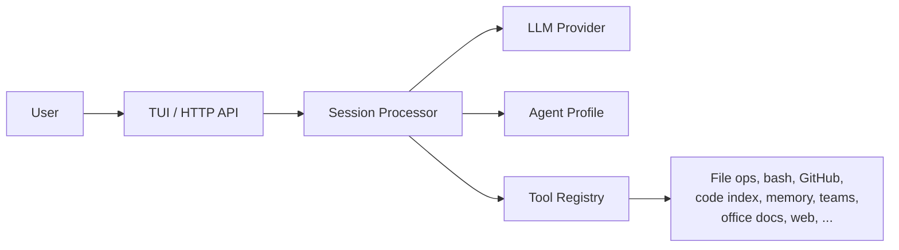
```mermaid
graph LR
    User[User] --> TUI[TUI / HTTP API]
    TUI --> SP[Session Processor]
    SP --> LLM[LLM Provider]
    SP --> AP[Agent Profile]
    SP --> TR[Tool Registry]
          TR --> Tools[File ops, bash, GitHub,<br/>code index, memory, teams,<br/>office docs, web, ...]

```

**Figure 1:** Core Execution Loop — High-level session/agent/tool flow

### Key Capabilities

| Capability | Summary |
|-----------|---------|
| **Multi-provider LLM** | 8 providers with automatic model discovery, health monitoring, streaming, vision, and reasoning levels |
| **Terminal UI** | Full-screen ratatui interface with streaming markdown, syntax highlighting, slash commands, and image support |
| **HTTP Server** | REST + SSE API (Axum) for headless operation and external integrations |
| **Tool System** | Broad tool coverage across file ops, shell, search, GitHub, GitLab, code index, memory, teams, sub-agents, office/PDF, web, and MCP |
| **Code Intelligence** | Tree-sitter parsing (15+ languages), Tantivy FTS, symbol/reference search, and code index queries |
| **Persistent Memory** | Three-tier system — file blocks, structured SQLite store, and optional embedding-based semantic search — with automatic extraction, decay, compaction, and a knowledge graph |
| **Teams & Swarms** | Multi-agent coordination with named teammates, shared task lists, mailbox messaging, and swarm decomposition for parallel work |
| **Security** | Permission rules (allow/deny/ask), 7-layer bash safety, file-path guards, secret redaction, resource limits, and YOLO mode for trusted environments |
| **Skills** | Loadable skill packs (bundled or custom YAML) that inject tools, prompts, and file context into agent sessions |
| **Custom Agents** | OASF-based agent profiles with configurable models, tools, permissions, and personality |
| **Autopilot** | Autonomous operation mode with configurable iteration limits and permission auto-approval |

### Who It's For

Ragent is designed for software developers and teams who want an AI assistant
that lives in their terminal, respects their security boundaries, and learns
from their workflow over time. It is equally suited to interactive pair-programming
sessions and headless CI/CD integration via its HTTP API.

### Technology

| Aspect | Detail |
|--------|--------|
| **Language** | Rust (edition 2024) |
| **Async runtime** | tokio |
| **TUI framework** | ratatui + crossterm |
| **HTTP framework** | Axum |
| **Database** | SQLite (rusqlite, compiled-in) |
| **Full-text search** | Tantivy |
| **Code parsing** | tree-sitter (15+ grammars compiled-in) |
| **Embeddings** | ONNX Runtime (optional, `all-MiniLM-L6-v2`) |
| **Binary size** | Single static binary, ~50 MB release |
| **Platforms** | Linux, macOS, Windows (cross-compiled) |

### Project Status

Ragent is in **alpha** (v0.1.0-alpha.86). The core architecture, tool system,
TUI, HTTP server, memory system, teams, and security layer are functional and
under active development. The specification below documents
the current state of all subsystems.

**Current Release Highlights:**
- **Azure Resource (File) provider** — New `azure_resource` provider reads endpoint definitions from `azureresources.json` in `~/.config/ragent/` or `.ragent/`, supporting multiple Azure endpoints with per-resource API keys, environment-variable auth, capability tags, and thinking configuration
- **Permission System Milestones Complete:**
  - Milestone 1: Core Permission System (7 tasks, 20 tests passing)
  - Milestone 2: Bash Security — 7 Layers (8 tasks, 27+ tests passing)
- Permission dialog countdown timer now redraws live in the TUI with a 120-second timeout and `EXPIRED` state
- Slash-command autocomplete now closes cleanly on `Esc` while preserving input and clamping the cursor safely
- Config parse errors now report the file path, line, column, problematic line, and a caret marker for faster recovery
- Codeindex tools are hardwired as always-allowed read-only tools and no longer trigger permission prompts
- Workspace crate reorganisation milestones extracted `ragent-types`, `ragent-config`, `ragent-storage`, and `ragent-llm`
- Broad tool coverage including comprehensive team coordination tools
- Native GitLab integration with issues, merge requests, and CI/CD pipeline management
- **Azure AI Foundry provider** — New `azure_foundry` provider for Microsoft Azure AI Foundry with OpenAI-compatible endpoints, dynamic model discovery, streaming, tool calling, vision, and reasoning levels
- **Azure endpoint logging** — Full endpoint URL displayed in TUI log panel for Azure AI Foundry requests
- **`/config show` slash command** — Displays current resolved configuration in the TUI
- **SPEC.md mermaid diagram fixes** — All 14 diagrams now pass syntax validation
- **gen-spec-pdf.sh script** — Pandoc + Chromium-based Markdown-to-PDF conversion for specifications
- **Startup ASCII art banner** — Application name rendered in ASCII art on TUI startup with compile timestamp
- **`/codeindex lang` filtering** — Optional language parameter for code index results (e.g., `/codeindex lang rust`)
- **Instruction file discovery logging** — Tracks which `AGENTS.md`-style files were found and where, with discovery summary logging

---


## Table of Contents

- [Executive Summary](#executive-summary)

### Part I: Foundation & Basics

1. [Overview](#overview)
2. [Architecture](#architecture)
3. [Core Features](#core-features)
4. [Security & Permissions](#security-permissions)
5. [Configuration](#configuration)

### Part II: User Interface & API

6. [Terminal User Interface (TUI)](#terminal-user-interface-tui)
7. [HTTP Server & API](#http-server-api)

### Part III: Data & Knowledge Systems

8. [Code Index](#code-index)
9. [Memory System](#memory-system)
10. [Spec Management](#spec-management)

### Part IV: Agent Customization & Extension

11. [Custom Agents](#custom-agents)
12. [Skills System](#skills-system)
13. [Prompt Optimization](#prompt-optimization)

### Part V: Multi-Agent Coordination

14. [Teams](#teams)
15. [Swarm Mode](#swarm-mode)
16. [Autopilot Mode](#autopilot-mode)
17. [Orchestrator & Multi-Agent Coordination](#orchestrator-multi-agent-coordination)

### Part VI: External Integrations

18. [GitHub & GitLab Integration](#18-github--gitlab-integration)
19. [MCP Integration (Model Context Protocol)](#mcp-integration-model-context-protocol)

### Part VII: Operations & Reference

20. [Auto-Update Mechanism](#auto-update-mechanism)

**Appendices**

- [Appendix A: Version History](#appendix-a-version-history)
- [Appendix B: Documentation](#appendix-b-documentation)
- [Appendix C: Project Contact & Repository](#appendix-c-project-contact--repository)
- [Appendix D: Changelog (2025-01-16)](#appendix-d-changelog-2025-01-16)

### List of Diagrams

| # | Diagram | Section | Description |
|---|---------|---------|-------------|
| 1 | [Core Execution Loop](#how-it-works) | Executive Summary | High-level session/agent/tool flow |
| 2 | [System Architecture](#2-architecture) | Architecture | Full crate and component topology |
| 3 | [Crate Dependency Graph](#22-crate-dependency-graph) | Workspace Crates | Inter-crate dependency relationships |
| 4 | [Event Bus Flow](#23-event-bus-flow) | Architecture | Internal pub/sub message routing |
| 5 | [Session & Tool Execution Flow](#35-session--tool-execution-flow) | Core Features | LLM call → permission → tool dispatch loop |
| 6 | [Provider Selection Flow](#36-provider-selection-flow) | Core Features | Multi-provider routing and health checks |
| 7 | [TUI Component Architecture](#44-tui-component-architecture) | Terminal User Interface | UI layout and event wiring |
| 8 | [HTTP API Request Flow](#54-http-api-request-flow) | HTTP Server & API | REST + SSE lifecycle |
| 9 | [Code Index Pipeline](#62-architecture) | Code Index | File scan → parse → index → search |
| 10 | [Permission Security Layers](#41-permission-security-layers) | Security & Permissions | 5-layer defense-in-depth |
| 11 | [Bash Security — 7 Layers](#42-bash-security--7-layers) | Security & Permissions | Bash command defense flow |
| 12 | [Permission Request Flow](#43-permission-request-flow) | Security & Permissions | From tool call to user decision |
| 13 | [Permission Rules Evaluation](#44-permission-rules-evaluation) | Security & Permissions | Rule matching and resolution |
| 14 | [Agent Execution Loop Phases](#37-agent-execution-loop-phases) | Core Features | One complete turn from input to response |

---


---

# Part I: Foundation & Basics

---

## 1. Overview

Ragent is an AI coding agent for the terminal, built in Rust. It provides multi-provider LLM orchestration, a built-in tool system, terminal UI, and client/server architecture — all compiled into a single statically-linked binary.

### 1.1 Key Characteristics

- **Multi-provider LLM support** — Anthropic, OpenAI, GitHub Copilot, Ollama, and Generic OpenAI-compatible APIs
- **Comprehensive tool system** — Extensive coverage across file operations, code analysis, GitHub/GitLab integration, web access, office documents, memory, teams, and more
- **Built-in TUI** — Full-screen ratatui interface with streaming chat, slash commands, and real-time updates
- **HTTP server** — REST + SSE API for external integrations
- **Zero external dependencies** — Self-contained binary with SQLite, Tantivy, and tree-sitter compiled in

---


## 2. Architecture

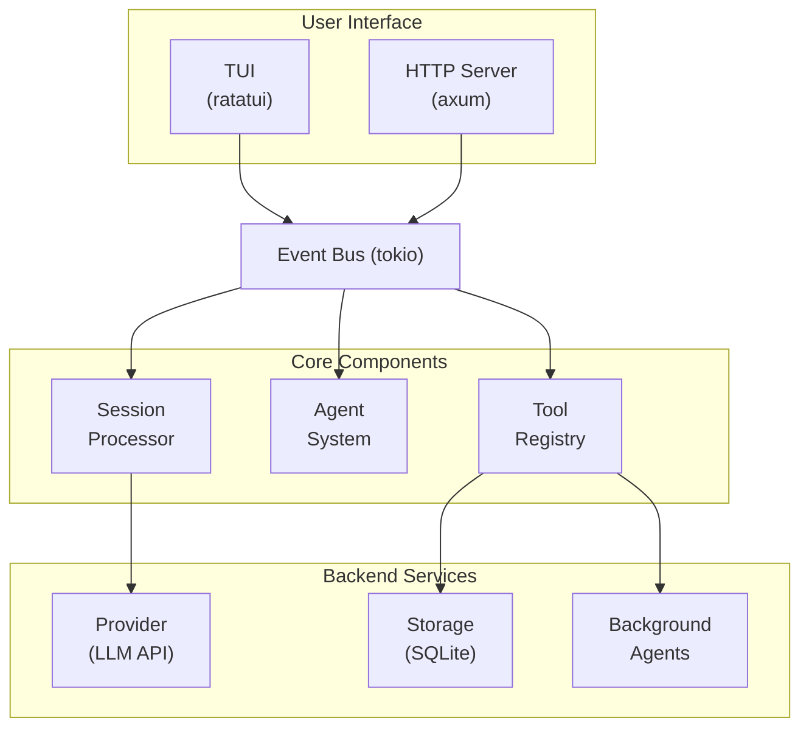
```mermaid
graph TB
    subgraph UI["User Interface"]
        TUI["TUI<br/>(ratatui)"]
        HTTP["HTTP Server<br/>(axum)"]
    end
    
    EventBus["Event Bus (tokio)"]
    
    subgraph Core["Core Components"]
        Session["Session<br/>Processor"]
        Agent["Agent<br/>System"]
        Tool["Tool<br/>Registry"]
    end
    
    subgraph Backend["Backend Services"]
        Provider["Provider<br/>(LLM API)"]
        Storage["Storage<br/>(SQLite)"]
        BgAgents["Background<br/>Agents"]
    end
    
    TUI --> EventBus
    HTTP --> EventBus
    EventBus --> Session
    EventBus --> Agent
    EventBus --> Tool
    Session --> Provider
    Tool --> Storage
    Tool --> BgAgents
```

**Figure 2:** System Architecture — Full crate and component topology

### 2.3 Event Bus Flow

The event bus is a central tokio broadcast channel that connects all subsystems. Every component publishes events and subscribes to events it cares about.

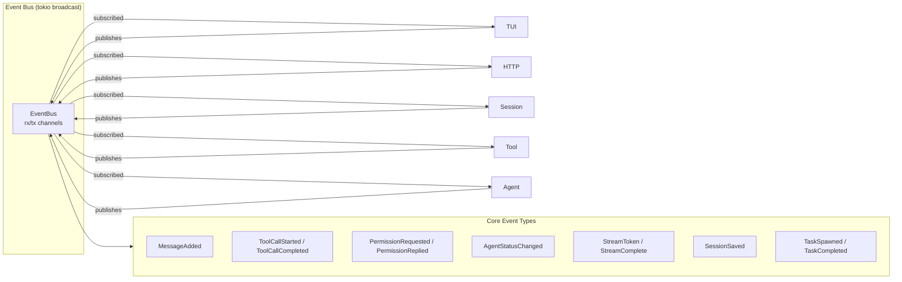
```mermaid
graph LR
    subgraph Events["Event Bus (tokio broadcast)"]
        EB[EventBus
        rx/tx channels]
    end

    TUI -- publishes --> EB
    HTTP -- publishes --> EB
    Session -- publishes --> EB
    Tool -- publishes --> EB
    Agent -- publishes --> EB
    EB -- subscribed --> TUI
    EB -- subscribed --> HTTP
    EB -- subscribed --> Session
    EB -- subscribed --> Tool
    EB -- subscribed --> Agent

    subgraph EventTypes["Core Event Types"]
        E1[MessageAdded]
        E2[ToolCallStarted / ToolCallCompleted]
        E3[PermissionRequested / PermissionReplied]
        E4[AgentStatusChanged]
        E5[StreamToken / StreamComplete]
        E6[SessionSaved]
        E7[TaskSpawned / TaskCompleted]
    end

    EB --> EventTypes
```

**Figure 4:** Event Bus Flow — Internal pub/sub message routing

**Event Flow Example — Tool Execution:**
1. `Session` sends tool call request to `Tool`
2. `Tool` publishes `ToolCallStarted` event
3. `TUI` receives event → updates log panel
4. `Tool` executes and publishes `ToolCallCompleted` with result
5. `Session` receives result → adds to conversation history
6. `Session` publishes `MessageAdded` → TUI updates chat panel

---

| Crate | LOC % | Purpose |
|-------|------:|---------|
| `ragent-agent` | 34.61% | Agent/runtime layer: sessions, orchestration, MCP, memory, tool registry |
| `ragent-codeindex` | 9.11% | Codebase indexing: tree-sitter parsing, SQLite store, Tantivy FTS, file watcher |
| `ragent-config` | 1.29% | Configuration types, defaults, and parsing |
| `ragent-llm` | 4.04% | Provider clients and model/provider registry |
| `ragent-prompt_opt` | 0.40% | Prompt optimization transformations |
| `ragent-server` | 2.47% | Axum HTTP routes and SSE streaming |
| `ragent-storage` | 1.70% | SQLite storage, snapshots, and encrypted credential persistence |
| `ragent-team` | 3.63% | Team runtime, team state, and team tools |
| `ragent-tools-core` | 3.56% | Core shell/file/search tools |
| `ragent-tools-extended` | 7.08% | Extended document/web/memory/codeindex tools |
| `ragent-tools-vcs` | 2.08% | GitHub and GitLab tool surface |
| `ragent-tui` | 20.92% | Ratatui terminal interface |
| `ragent-types` | 1.21% | Shared IDs, events, messages, and sanitization primitives |
| `ragent-specs` | — | Spec lifecycle management: discovery, validation, status transitions, review, archival |
| `ragent-bench` | — | Benchmark runner shared between TUI and CLI |

Percentages are based on a fresh count of current Rust `.rs` lines across workspace crates (167,466 total).

### 2.2 Crate Dependency Graph

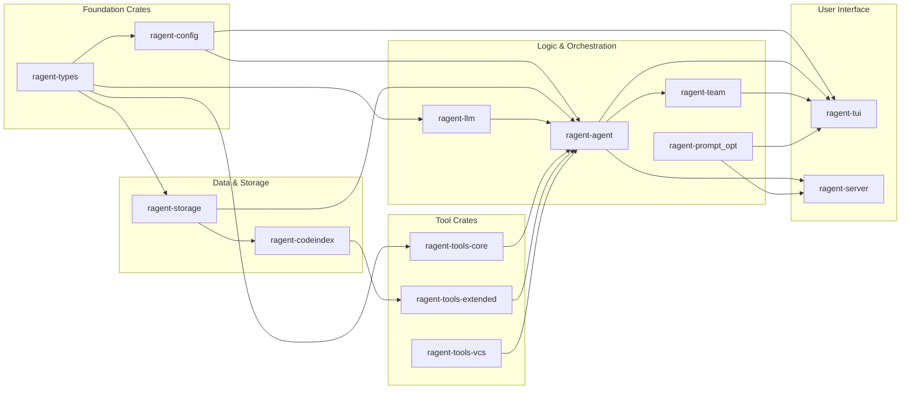
```mermaid
graph LR
    subgraph Foundation["Foundation Crates"]
        TYPES["ragent-types"]
        CONFIG["ragent-config"]
    end

    subgraph Data["Data & Storage"]
        STORAGE["ragent-storage"]
        CODEIDX["ragent-codeindex"]
    end

    subgraph Logic["Logic & Orchestration"]
        LLM["ragent-llm"]
        AGENT["ragent-agent"]
        TEAM["ragent-team"]
        PROMPT["ragent-prompt_opt"]
    end

    subgraph Interface["User Interface"]
        TUI["ragent-tui"]
        SERVER["ragent-server"]
    end

    subgraph Tools["Tool Crates"]
        TCORE["ragent-tools-core"]
        TEXT["ragent-tools-extended"]
        TVCS["ragent-tools-vcs"]
    end

    TYPES --> CONFIG
    TYPES --> STORAGE
    TYPES --> LLM
    TYPES --> TCORE
    CONFIG --> AGENT
    CONFIG --> TUI
    STORAGE --> AGENT
    STORAGE --> CODEIDX
    LLM --> AGENT
    TCORE --> AGENT
    TEXT --> AGENT
    TVCS --> AGENT
    CODEIDX --> TEXT
    AGENT --> TEAM
    AGENT --> SERVER
    AGENT --> TUI
    TEAM --> TUI
    PROMPT --> TUI
    PROMPT --> SERVER
```

**Figure 3:** Crate Dependency Graph — Inter-crate dependency relationships

**Dependency Rules:**
- Foundation crates (`types`, `config`) have no internal dependencies
- `storage` depends only on `types`
- `llm` depends on `types` and `config`
- Tool crates depend on `types` (and `codeindex` for extended tools)
- `agent` is the integration layer — it depends on most other crates
- `team` depends on `agent` types
- `tui` and `server` are terminal layers that depend on `agent` and `team`
- Circular dependencies are prohibited; the graph is strictly acyclic

---

---


## 3. Core Features

### 3.1 LLM Providers

#### Supported Providers

| Provider | ID | Authentication | Features |
|----------|-----|---------------|----------|
| **Anthropic** | `anthropic` | `ANTHROPIC_API_KEY` | Streaming, tools, vision, reasoning |
| **OpenAI** | `openai` | `OPENAI_API_KEY` | Streaming, tools, vision |
| **GitHub Copilot** | `copilot` | Auto-discovered from VS Code | Streaming, tools, vision, reasoning levels |
| **Ollama** | `ollama` | No key required | Local models, streaming |
| **Ollama Cloud** | `ollama_cloud` | `OLLAMA_API_KEY` | Remote Ollama servers, dynamic model discovery, vision |
| **Hugging Face** | `huggingface` | `HF_TOKEN` | Streaming, tools, vision, dynamic model discovery |
| **Generic OpenAI** | `generic_openai` | `GENERIC_OPENAI_API_KEY` | Any OpenAI-compatible endpoint |
| **Google Gemini** | `gemini` | `GEMINI_API_KEY` | Streaming, tools, vision, reasoning |
| **Azure Resource (File)** | `azure_resource` | File-based (`azureresources.json`) | Multiple Azure endpoints from a JSON catalog, per-resource auth, capability tags |
| **Azure AI Foundry** | `azure_foundry` | `AZURE_AI_FOUNDRY_API_KEY` | OpenAI-compatible endpoints, dynamic model discovery, streaming, tools, vision, reasoning |

#### Provider Features

- **Health indicators** — Real-time connectivity status (● green/✗ red/● yellow)
- **Model discovery** — Automatic model listing from provider APIs
- **Vision support** — Image attachments for supported models
- **Reasoning levels** — Copilot accepts `reasoning_effort` or `reasoning_level` with `low`/`medium`/`high`/`none`
- **Context window display** — Status bar shows context utilization percentage
- **Extended thinking** — Anthropic extended thinking/reasoning support
- **Usage tracking** — Token usage, quota percentage, and provider plan display where available
- **Dynamic model metadata** — Provider model pickers surface live-discovered context windows, capabilities, and Copilot premium request multipliers

#### Anthropic Models

| Model | Context | Max Output | Capabilities |
|-------|---------|------------|--------------|
| `claude-sonnet-4-20250514` | 200,000 | 64,000 | reasoning, streaming, vision, tool_use |
| `claude-3-5-haiku-latest` | 200,000 | 8,192 | streaming, vision, tool_use |

#### OpenAI Models

| Model | Context | Max Output | Capabilities |
|-------|---------|------------|--------------|
| `gpt-4o` | 128,000 | 16,384 | streaming, vision, tool_use |
| `gpt-4o-mini` | 128,000 | 16,384 | streaming, vision, tool_use |

#### Ollama Cloud Provider

The Ollama Cloud provider connects to remote Ollama servers using native `/api/chat` and `/api/tags` endpoints with Bearer token authentication.

**Configuration:**
- **Environment Variable:** `OLLAMA_API_KEY` — API key for authenticated Ollama Cloud instances
- **Default Endpoint:** `https://ollama.com`
- **Custom Endpoint:** Configurable via `base_url` in `ragent.json`

**Features:**
- **Dynamic Model Discovery** — Automatically fetches available models from `/api/tags` endpoint
- **Context Window Detection** — Queries `/api/show` to retrieve actual context length from model metadata
- **Vision Capability Detection** — Automatically detects vision support from model capabilities
- **Streaming Support** — Native SSE streaming via `/api/chat` endpoint
- **Tool Support** — Compatible with Ollama tool-calling format

**Model Listing:**
```bash
ragent models --provider ollama_cloud
```

**Configuration Example (`ragent.json`):**
```json
{
  "provider": {
    "ollama_cloud": {
      "thinking": {
        "enabled": true,
        "level": "low"
      },
      "models": {
        "llama3.2": {
          "thinking": {
            "enabled": true,
            "level": "high"
          }
        }
      }
    }
  }
}
```

#### Ollama (Local) Provider

The local Ollama provider connects to self-hosted Ollama instances (no authentication required for local servers).

**Configuration:**
- **Environment Variable:** `OLLAMA_HOST` (optional) — Custom server URL (default: `http://127.0.0.1:11434`)
- **No API Key Required** — Local Ollama servers run without authentication

**Features:**
- **Local Model Execution** — Run models on local hardware (CPU/GPU)
- **Dynamic Discovery** — Lists locally available models via `/api/tags` at runtime (placeholder defaults are only used as fallback metadata)
- **OpenAI-Compatible API** — Uses `/v1/chat/completions` endpoint
- **Streaming Support** — Full SSE streaming

**Model Listing:**
```bash
ragent models --provider ollama
```

#### Google Gemini Provider

The Google Gemini provider connects to Google's Gemini API for state-of-the-art multimodal models with extensive context windows.

**Authentication:** `GEMINI_API_KEY` environment variable

**Default Models:**

| Model | Context | Cost (Input/Output) | Capabilities |
|-------|---------|---------------------|--------------|
| `gemini-2.5-flash-preview-05-20` | 1,048,576 | $0.15 / $0.60 | reasoning, streaming, vision, tool_use |
| `gemini-2.5-pro-preview-05-06` | 1,048,576 | $1.25 / $10.00 | reasoning, streaming, vision, tool_use |
| `gemini-2.0-flash` | 1,048,576 | $0.10 / $0.40 | streaming, vision, tool_use |
| `gemini-2.0-flash-lite` | 1,048,576 | $0.075 / $0.30 | streaming, vision, tool_use |
| `gemini-1.5-flash` | 1,048,576 | $0.075 / $0.30 | streaming, vision, tool_use |
| `gemini-1.5-pro` | 2,097,152 | $1.25 / $5.00 | reasoning, streaming, vision, tool_use |

**Features:**
- **Streaming** — Real-time token-by-token response streaming
- **Tool Use** — Native function calling for all models
- **Vision** — Image understanding capabilities
- **Reasoning** — Available on Pro and Flash 2.5 models
- **Massive Context Windows** — Up to 2M tokens on 1.5 Pro

**API Base:** `https://generativelanguage.googleapis.com`

#### Hugging Face Provider

The HuggingFace provider connects to the HuggingFace Inference API, which exposes an OpenAI-compatible `/v1/chat/completions` endpoint. Supports both the free/Pro shared Inference API and dedicated Inference Endpoints.

**Authentication:**
- **Primary:** `HF_TOKEN` environment variable (standard HuggingFace token)
- **Legacy:** `HUGGING_FACE_HUB_TOKEN` (older HF token name)
- **Ragent convention:** `RAGENT_API_KEY_HUGGINGFACE` (auto-checked)

**Default Models:**

| Model | Context | Capabilities |
|-------|---------|--------------|
| `meta-llama/Llama-3.1-8B-Instruct` | 128,000 | streaming, tool_use |
| `meta-llama/Llama-3.1-70B-Instruct` | 128,000 | streaming, tool_use |
| `mistralai/Mixtral-8x7B-Instruct-v0.1` | 32,000 | streaming, tool_use |
| `Qwen/Qwen2.5-72B-Instruct` | 128,000 | streaming, tool_use |
| `microsoft/Phi-3-mini-4k-instruct` | 4,096 | streaming |

**Features:**
- **OpenAI-Compatible API** — Uses `/v1/chat/completions` endpoint (same as OpenAI)
- **Streaming Support** — Full SSE streaming with tool call deltas
- **Tool Use** — Function calling for models that support it (Llama 3.1+, Mixtral, Qwen)
- **Dynamic Model Discovery** — Queries HuggingFace Hub API for available text-generation models with warm inference endpoints (up to 50 models)
- **Model Loading Detection** — Detects 503 "model loading" responses with estimated wait time
- **Gated Model Handling** — Clear error messages for models requiring license acceptance
- **Rate Limit Tracking** — Parses `X-RateLimit-Limit`/`X-RateLimit-Remaining` headers
- **Tool Name Compatibility** — Internally prefixes tool names sent to the Hugging Face router to avoid streaming-mode name rejection, then maps responses back to canonical ragent tool names

**Provider-Specific Options:**

| Option | Type | Default | Description |
|--------|------|---------|-------------|
| `wait_for_model` | bool | `true` | Send `x-wait-for-model: true` header to wait for cold models |
| `use_cache` | bool | `true` | Enable server-side response caching |

**Inference Endpoints:**

For dedicated deployments, configure the custom endpoint URL:
```json
{
  "provider": {
    "huggingface": {
      "api": {
        "base_url": "https://my-endpoint.endpoints.huggingface.cloud"
      }
    }
  }
}
```

**Model Listing:**
```bash
ragent models --provider huggingface
```

#### Azure AI Foundry Provider

The Azure AI Foundry provider connects to Microsoft Azure AI Foundry models via OpenAI-compatible endpoints with `api-key` header authentication. Supports dynamic model discovery, streaming chat completions, tool calling, vision, and reasoning levels.

**Authentication:**
- **Primary:** `AZURE_AI_FOUNDRY_API_KEY` environment variable
- **Base URL:** `AZURE_AI_FOUNDRY_BASE` environment variable (optional, for custom endpoints)

**Configuration Example (`ragent.json`):**
```json
{
  "provider": {
    "azure_foundry": {
      "env": ["AZURE_AI_FOUNDRY_API_KEY"],
      "api": {
        "base_url": "https://your-endpoint.azure.com"
      },
      "thinking": {
        "enabled": true,
        "level": "low"
      }
    }
  }
}
```

**Features:**
- **OpenAI-Compatible API** — Uses `/v1/chat/completions` endpoint with `api-key` header
- **Dynamic Model Discovery** — Automatically fetches available models from Azure endpoint
- **Streaming Support** — Full SSE streaming
- **Tool Support** — Function calling compatible with OpenAI tool format
- **Vision Support** — Image understanding for vision-capable models
- **Reasoning Levels** — Supports `low`, `medium`, `high`, `none` reasoning effort (o1, o3-mini models)
- **Endpoint Logging** — Full resolved endpoint URL logged in TUI log panel for debugging

**Model Listing:**
```bash
ragent models --provider azure_foundry
```

#### Azure Resource (File) Provider

The `azure_resource` provider reads Azure endpoint definitions from a user-supplied `azureresources.json` file, enabling registration of multiple Azure-hosted LLM endpoints without rebuilding or reconfiguring ragent. Each entry in the file becomes a first-class model in the provider registry.

**File Locations (searched in order):**
1. `~/.config/ragent/azureresources.json` — user-global
2. `.ragent/azureresources.json` — project-local

**Authentication:**
- Per-resource `api_key` (discouraged) or `api_key_env` (preferred) inside each JSON entry
- `api_key_env` references an environment variable by name (e.g. `"AZURE_AI_FOUNDRY_API_KEY"`)

**Configuration Example (`azureresources.json`):**
```json
{
  "version": "1",
  "resources": [
    {
      "id": "kimi-k2.6",
      "name": "kimi-k2.6",
      "endpoint": "https://a1a-52048-dev-ais-shr1-eus2-1.openai.azure.com",
      "api_key_env": "AZURE_AI_FOUNDRY_API_KEY",
      "context_window": 128000,
      "capabilities": ["reasoning", "streaming", "vision", "tool_use"],
      "thinking": {
        "enabled": true,
        "level": "medium",
        "budget_tokens": 8192
      }
    }
  ]
}
```

**Features:**
- **Multi-Endpoint Support** — Register any number of Azure endpoints in a single file
- **Per-Resource Auth** — Each endpoint can use a different API key or environment variable
- **Capability Whitelist** — Explicit `capabilities` array enables only listed features; omitted entries get safe defaults (`streaming: true`, `tool_use: true`)
- **Thinking Config** — Per-model reasoning configuration with `enabled`, `level`, and `budget_tokens`
- **Context Window** — Customizable per-resource context window (default: 128,000)
- **File-Based Discovery** — No code changes needed to add or remove endpoints; edit the JSON and reload

**Model Listing:**
```bash
ragent models --provider azure_resource
```

**Validation:**
- `version` must be exactly `"1"`
- Each entry requires non-empty `id`, `name`, and `endpoint`
- Each entry requires at least one of `api_key` or `api_key_env`
- Duplicate IDs are deduplicated (first wins)
- Invalid entries are skipped with a warning

### 3.2 Tool System

#### File Operations Tools (26)

| Tool | Purpose |
|------|---------|
| `read` | Read file contents with line range support |
| `write` | Create new files |
| `edit` | Replace text in existing files |
| `create` | Create new file (alternative to write) |
| `rm` | Delete single files |
| `move_file` | Move/rename files and directories |
| `copy_file` | Copy files to new location |
| `mkdir` | Create directories (mkdir -p) |
| `append_file` | Append text to end of file |
| `file_info` | Get metadata (size, mtime, type) |
| `diff_files` | Compare two files |
| `glob` | Find files matching glob patterns |
| `list` | List directory contents |
  | `multiedit` | Atomic multi-file edits |
  | `patch` | Apply unified diff patches |
  | `file_ops_tool` | Combined file operations |
#### File Operation Aliases

The following are aliases for commonly requested operations:

| Alias | Maps To |
|-------|---------|
| `read` | `read` |
| `list_files`, `list_directory` | `list` |
| `find_files` | `glob` |
| `update_file` | `edit` |
| `file_search` | `grep` |

#### Execution Tools (10)

| Tool | Purpose |
|------|---------|
| `bash` | Execute shell commands with security restrictions |
| `bash_reset` | Reset bash shell state |
| `execute_python` | Run Python code snippets |
| `run_code` / `execute_code` / `execute_bash` / `run_shell_command` / `run_terminal_cmd` | Aliases for bash/code execution |

#### Interactive Tools (3)

| Tool | Purpose |
|------|---------|
| `question` / `ask_user` | Interactive user prompts |
| `think` | Record reasoning notes (no-op) |
| `todo_read` | Read TODO items |
| `todo_write` | Manage TODO items |

#### Utility Tools (3)

| Tool | Purpose |
|------|---------|
| `calculator` | Evaluate mathematical expressions |
| `get_env` | Read environment variables |

### 3.2.1 Tool System Categories Summary

| Category | Count | Description |
|----------|-------|-------------|
| **File Operations** | 26 | read, write, edit, create, rm, move, copy, mkdir, append, diff, multiedit, patch, etc. |
| **Execution** | 10 | bash, bash_reset, execute_python, aliases |
| **Search** | 4 | grep and aliases |
| **Web** | 3 | webfetch, websearch, http_request |
| **Office** | 6 | office_read/write/info, libre_read/write/info |
| **PDF** | 2 | pdf_read, pdf_write |
| **Code Index** | 6 | codeindex_search, symbols, references, dependencies, status, reindex |
| **GitHub** | 10 | Issues and PR management |
| **GitLab** | 19 | Issues, merge requests, pipelines, and jobs |
| **Memory** | 12 | memory_read/write/replace/store/recall/forget/search/migrate |
| **Team** | 21 | Team lifecycle, tasks, messaging, coordination |
| **Sub-agent** | 5 | new_task, cancel_task, list_tasks, wait_tasks, task_complete |
| **Plan** | 2 | plan_enter, plan_exit |
| **MCP** | 1 | mcp_tool (McpToolWrapper) |
| **Interactive** | 4 | question, think, todo_read/write |
| **Utility** | 3 | calculator, get_env |
#### Team Tools (21)

| Tool | Purpose |
|------|---------|
| `team_create` | Create new team |
| `team_spawn` | Spawn teammate agent |
| `team_cleanup` | Cleanup team resources |
| `team_status` | Get team status |
| `team_idle` | Signal idle state |
| `team_task_create` | Create team task |
| `team_task_claim` | Claim task to work on |
| `team_task_complete` | Mark task complete |
| `team_task_list` | List team tasks |
| `team_assign_task` | Assign task to specific teammate |
| `team_message` | Send message to team member |
| `team_broadcast` | Broadcast to all teammates |
| `team_read_messages` | Read mailbox messages |
| `team_shutdown_teammate` | Request teammate shutdown |
| `team_shutdown_ack` | Acknowledge shutdown request |
| `team_submit_plan` | Submit plan for approval |
| `team_approve_plan` | Approve teammate plan |
| `team_wait` | Wait for teammates to complete |
| `team_memory_read` | Read team memory |
| `team_memory_write` | Write to team memory |

### 3.3 Agent System

#### Built-in Agents

| Agent | Purpose | Tool Groups |
|-------|---------|-------------|
| `general` | General-purpose assistant | All tools |
| `coder` | Code-focused tasks | File, bash, search |
| `task` | Task execution | File, bash |
| `architect` | Design and planning | All tools |
| `ask` | Question answering | Read-only tools |
| `debug` | Debugging assistance | File, bash, search |
| `code-review` | Code review | Read, diff, github |
| `orchestrator` | Multi-agent coordination | All tools |

#### Agent Features

- **Custom agents** — User-defined agents via JSON (OASF format) or Markdown profiles
- **Template variables** — Dynamic injection of context (`{{WORKING_DIR}}`, `{{FILE_TREE}}`, `{{AGENTS_MD}}`, `{{GIT_STATUS}}`, `{{README}}`)
- **Permission rules** — Per-agent access control for file paths and commands
- **Memory scoping** — Project-level and user-level memory for agents

### 3.3.1 Git Platform Integrations

ragent provides native GitHub and GitLab integration tools for managing issues, pull/merge requests, CI/CD pipelines, and project metadata. Both integrations share a similar tool architecture and support repository auto-detection from git remotes. See [Section 18: GitHub & GitLab Integration](#18-github--gitlab-integration) for full details.

### 3.5 Session & Tool Execution Flow

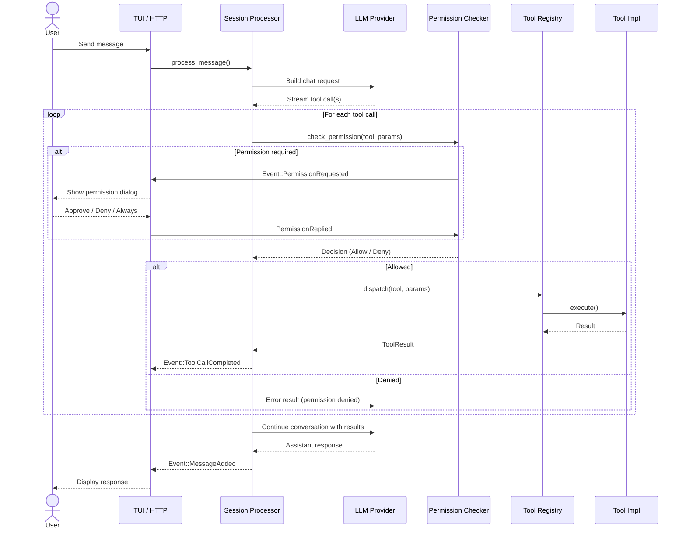
```mermaid
sequenceDiagram
    actor User
    participant TUI as TUI / HTTP
    participant SP as Session Processor
    participant LLM as LLM Provider
    participant PC as Permission Checker
    participant TR as Tool Registry
    participant Tool as Tool Impl

    User->>TUI: Send message
    TUI->>SP: process_message()
    SP->>LLM: Build chat request
    LLM-->>SP: Stream tool call(s)
    loop For each tool call
        SP->>PC: check_permission(tool, params)
        alt Permission required
            PC->>TUI: Event::PermissionRequested
            TUI-->>User: Show permission dialog
            User-->>TUI: Approve / Deny / Always
            TUI->>PC: PermissionReplied
        end
        PC-->>SP: Decision (Allow / Deny)
        alt Allowed
            SP->>TR: dispatch(tool, params)
            TR->>Tool: execute()
            Tool-->>TR: Result
            TR-->>SP: ToolResult
            SP-->>TUI: Event::ToolCallCompleted
        else Denied
            SP-->>LLM: Error result (permission denied)
        end
    end
    SP->>LLM: Continue conversation with results
    LLM-->>SP: Assistant response
    SP-->>TUI: Event::MessageAdded
    TUI-->>User: Display response
```

**Figure 5:** Session & Tool Execution Flow — LLM call → permission → tool dispatch loop

---

### 3.6 Provider Selection Flow

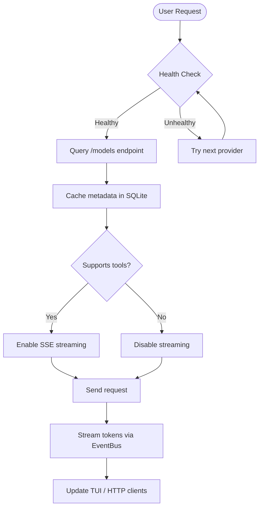
```mermaid
graph TD
    Start([User Request]) --> Health{Health Check}
    Health -- Healthy --> ModelDiscovery[Query /models endpoint]
    Health -- Unhealthy --> Fallback[Try next provider]
    ModelDiscovery --> CacheModel[Cache metadata in SQLite]
    CacheModel --> Capabilities{Supports tools?}
    Capabilities -- Yes --> Streaming[Enable SSE streaming]
    Capabilities -- No --> NonStreaming[Disable streaming]
    Streaming --> Execute[Send request]
    NonStreaming --> Execute
    Execute --> TokenStream[Stream tokens via EventBus]
    TokenStream --> TUI_Update[Update TUI / HTTP clients]
    Fallback --> Health
```

**Figure 6:** Provider Selection Flow — Multi-provider routing and health checks

---

### 3.7 Agent Execution Loop Phases

Each turn of an agent session follows a fixed pipeline of phases. The loop repeats until the LLM returns a final assistant message (no further tool calls), the user interrupts the session, or a safety limit (`max_steps`, token budget, or timeout) is reached.

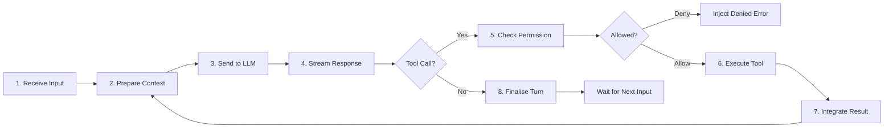
```mermaid
graph LR
    A[1. Receive Input] --> B[2. Prepare Context]
    B --> C[3. Send to LLM]
    C --> D[4. Stream Response]
    D --> E{Tool Call?}
    E -- Yes --> F[5. Check Permission]
    F --> G{Allowed?}
    G -- Deny --> H[Inject Denied Error]
    G -- Allow --> I[6. Execute Tool]
    I --> J[7. Integrate Result]
    J --> B
    E -- No --> K[8. Finalise Turn]
    K --> L[Wait for Next Input]
```

**Figure 16:** Agent Execution Loop Phases — One complete turn from input to response

#### Phase Descriptions

| Phase | What Happens | Key Components |
|-------|-------------|----------------|
| **1. Receive Input** | User message arrives via TUI (`Enter`) or HTTP POST. The session ID is resolved and the message is appended to the conversation history. | Session Processor, EventBus |
| **2. Prepare Context** | Build the chat request payload: system prompt (agent profile + AGENTS.md + injected variables), conversation history, available tool schemas, and any compaction/summarisation if near the context-window limit. | Agent Profile, Tool Registry, Context Compaction |
| **3. Send to LLM** | The configured provider client serialises the request (OpenAI, Anthropic, Gemini, etc. format), adds auth headers, and issues the HTTP request. | Provider Client, HTTP Client |
| **4. Stream Response** | Tokens arrive via SSE. The session processor forwards them to the EventBus as `StreamToken` events. If a tool call is emitted, streaming pauses and the loop transitions to Phase 5. | EventBus, SSE Stream |
| **5. Check Permission** | The permission checker evaluates the tool call against rules (hardwired → config → agent-specific → YOLO). Result can be `Allow`, `Deny`, or `Ask` (prompt user via TUI modal). | PermissionChecker, Permission Rules |
| **6. Execute Tool** | The tool registry dispatches the call to the tool implementation. The tool runs (file op, bash, web fetch, code index query, etc.) and returns a structured result. | Tool Registry, Tool Impl |
| **7. Integrate Result** | The tool result (or permission-denied error) is injected into the conversation history as a `tool` message. Control returns to Phase 2 for the next LLM call. | Session Processor |
| **8. Finalise Turn** | When the LLM produces a plain-text response with no tool calls, the assistant message is persisted, token usage is recorded, and the TUI displays the final output. | Storage, EventBus |

#### Safety Limits

The loop is bounded by configurable guards:

| Limit | Default | Behaviour When Hit |
|-------|---------|-------------------|
| `max_steps` | 500 | Halt and ask user whether to continue |
| Token budget | Provider/model specific | Pause and warn; user can approve continuation |
| Timeout | Per-request configurable | Abort the running request and surface error |
| Context window | Model-specific | Trigger automatic compaction before sending |

#### Streaming Semantics

Responses are streamed token-by-token so the user sees progress in real time:
1. `StreamToken` events fire for every chunk.
2. If a tool call is detected mid-stream, the UI shows a collapsible tool-call summary.
3. Tool results are streamed back as they complete (for async/multi-tool scenarios).
4. `StreamComplete` signals the end of the turn.

---

- **Persistent storage** — SQLite-backed conversation history
- **Session commands** — `ragent session list`, `resume`, `export`, `import`
- **Step numbering** — Session-prefixed step numbers (`[sid:step]`) for traceability
- **Context compaction** — Automatic pre-send context management near window limits

---


## 4. Security & Permissions

### 4.1 Permission Security Layers

The permission system is a multi-layered defense-in-depth architecture that controls every tool invocation.

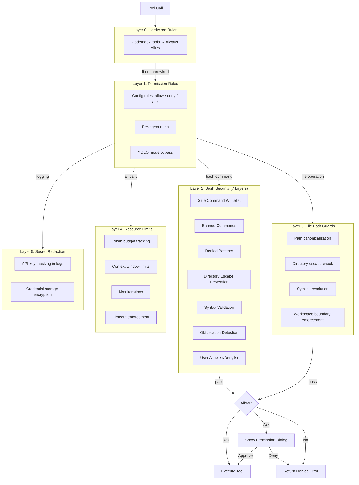
```mermaid
graph TD
    subgraph Layer0["Layer 0: Hardwired Rules"]
        H1[CodeIndex tools → Always Allow]
    end

    subgraph Layer1["Layer 1: Permission Rules"]
        R1[Config rules: allow / deny / ask]
        R2[Per-agent rules]
        R3[YOLO mode bypass]
    end

    subgraph Layer2["Layer 2: Bash Security (7 Layers)"]
        B1[Safe Command Whitelist]
        B2[Banned Commands]
        B3[Denied Patterns]
        B4[Directory Escape Prevention]
        B5[Syntax Validation]
        B6[Obfuscation Detection]
        B7[User Allowlist/Denylist]
    end

    subgraph Layer3["Layer 3: File Path Guards"]
        F1[Path canonicalization]
        F2[Directory escape check]
        F3[Symlink resolution]
        F4[Workspace boundary enforcement]
    end

    subgraph Layer4["Layer 4: Resource Limits"]
        L1[Token budget tracking]
        L2[Context window limits]
        L3[Max iterations]
        L4[Timeout enforcement]
    end

    subgraph Layer5["Layer 5: Secret Redaction"]
        S1[API key masking in logs]
        S2[Credential storage encryption]
    end

    ToolCall["Tool Call"] --> Layer0
    Layer0 -->|if not hardwired| Layer1
    Layer1 -->|bash command| Layer2
    Layer1 -->|file operation| Layer3
    Layer1 -->|all calls| Layer4
    Layer1 -->|logging| Layer5
    Layer2 -->|pass| Decision{Allow?}
    Layer3 -->|pass| Decision
    Decision -->|Yes| Execute["Execute Tool"]
    Decision -->|Ask| UserPrompt["Show Permission Dialog"]
    UserPrompt -->|Approve| Execute
    UserPrompt -->|Deny| Reject["Return Denied Error"]
    Decision -->|No| Reject
```

**Figure 10:** Permission Security Layers — 5-layer defense-in-depth

---

### 4.2 Bash Security — 7 Layers

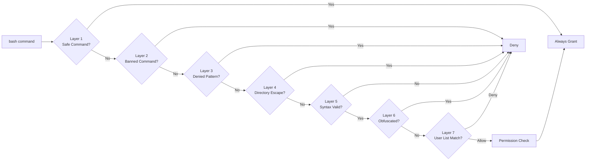
```mermaid
graph LR
    A[bash command] --> B{Layer 1<br/>Safe Command?}
    B -- Yes --> Z[Always Grant]
    B -- No --> C{Layer 2<br/>Banned Command?}
    C -- Yes --> X[Deny]
    C -- No --> D{Layer 3<br/>Denied Pattern?}
    D -- Yes --> X
    D -- No --> E{Layer 4<br/>Directory Escape?}
    E -- Yes --> X
    E -- No --> F{Layer 5<br/>Syntax Valid?}
    F -- No --> X
    F -- Yes --> G{Layer 6<br/>Obfuscated?}
    G -- Yes --> X
    G -- No --> H{Layer 7<br/>User List Match?}
    H -- Deny --> X
    H -- Allow --> Y[Permission Check]
    Y --> Z
```

**Figure 11:** Bash Security — 7 Layers — Bash command defense flow

**Layer Details:**

| Layer | Name | Description | Test Count |
|-------|------|-------------|-----------:|
| 1 | Safe Command Whitelist | 51 commands auto-approved (cat, ls, git, cargo, etc.) | 15 |
| 2 | Banned Commands | 22 commands always blocked (mkfs, fdisk, useradd, etc.) | 6 |
| 3 | Denied Patterns | 46 destructive patterns (rm -rf /, fork bombs, etc.) | 8 |
| 4 | Directory Escape Prevention | Blocks cd/pushd outside workspace | 4 |
| 5 | Syntax Validation | Runs `sh -n -c` with 1s timeout | 3 |
| 6 | Obfuscation Detection | Detects base64\|bash, python exec, hex escapes | 5 |
| 7 | User Allowlist/Denylist | User-configurable via `/bash allow/deny` | 4 |

---

### 4.3 Permission Request Flow

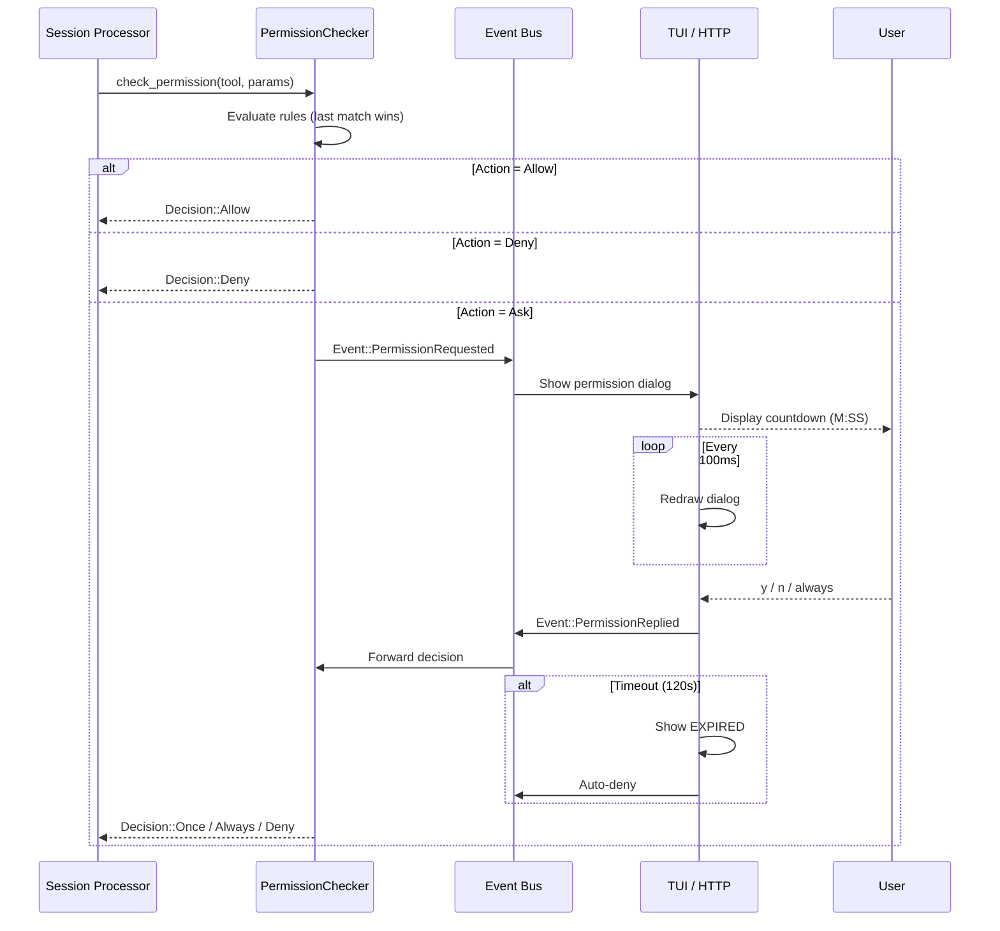
```mermaid
sequenceDiagram
    participant SP as Session Processor
    participant PC as PermissionChecker
    participant EB as Event Bus
    participant TUI as TUI / HTTP
    participant User as User

    SP->>PC: check_permission(tool, params)
    PC->>PC: Evaluate rules (last match wins)
    alt Action = Allow
        PC-->>SP: Decision::Allow
    else Action = Deny
        PC-->>SP: Decision::Deny
    else Action = Ask
        PC->>EB: Event::PermissionRequested
        EB->>TUI: Show permission dialog
        TUI-->>User: Display countdown (M:SS)
        loop Every 100ms
            TUI->>TUI: Redraw dialog
        end
        User-->>TUI: y / n / always
        TUI->>EB: Event::PermissionReplied
        EB->>PC: Forward decision
        alt Timeout (120s)
            TUI->>TUI: Show EXPIRED
            TUI->>EB: Auto-deny
        end
        PC-->>SP: Decision::Once / Always / Deny
    end
```

**Figure 12:** Permission Request Flow — From tool call to user decision

---

### 4.4 Permission Rules Evaluation

Rules are evaluated in order, with **last match wins** semantics:

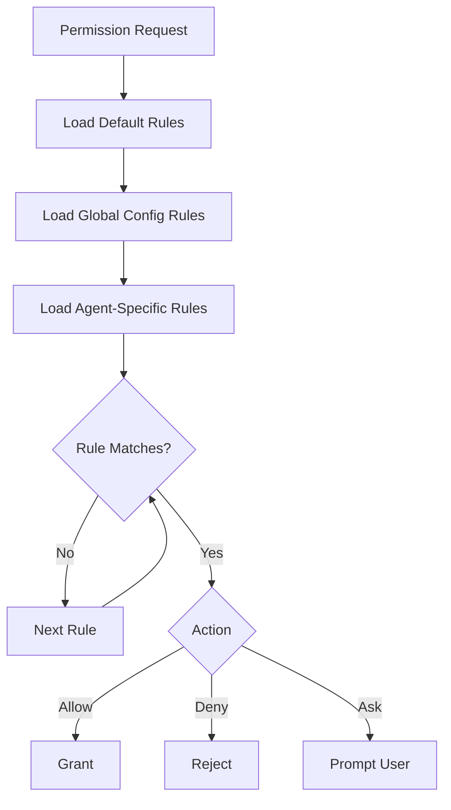
```mermaid
graph TD
    A[Permission Request] --> B[Load Default Rules]
    B --> C[Load Global Config Rules]
    C --> D[Load Agent-Specific Rules]
    D --> E{Rule Matches?}
    E -->|No| F[Next Rule]
    F --> E
    E -->|Yes| G{Action}
    G -->|Allow| H[Grant]
    G -->|Deny| I[Reject]
    G -->|Ask| J[Prompt User]
```

**Figure 13:** Permission Rules Evaluation — Rule matching and resolution

**Default Rules:**
- Read operations → Allow
- Edit operations → Ask
- Bash execution → Ask
- Web access → Ask
- Todo management → Allow

---


## 5. Configuration

### 5.1 Configuration Files

| File | Purpose |
|------|---------|
| `ragent.json` | Project-level configuration |
| `ragent.jsonc` | Project-level (with comments) |
| `~/.config/ragent/config.json` | User-global configuration |

### 5.2 Configuration Schema

```jsonc
{
  "provider": {
    "anthropic": {
      "env": ["ANTHROPIC_API_KEY"],
      "thinking": { "enabled": true, "level": "low" },
      "models": {
        "claude-sonnet-4-20250514": {
          "thinking": { "enabled": true, "level": "high", "budget_tokens": 16000 }
        }
      }
    },
    "openai": { /* ... */ },
    "copilot": { /* ... */ },
    "ollama": { /* ... */ },
    "generic_openai": { /* ... */ },
    "azure_foundry": {
      "env": ["AZURE_AI_FOUNDRY_API_KEY"],
      "api": { "base_url": "https://your-endpoint.azure.com" },
      "thinking": { "enabled": true, "level": "low" }
    }
  },
  "defaultAgent": "coder",
  "permissions": [],
  "skill_dirs": [],
  "code_index": {
    "enabled": true,
    "max_file_size": 1048576
  },
  "memory": {
    "auto_extract": { "enabled": false, "require_confirmation": true },
    "semantic": { "enabled": false, "dimensions": 384 },
    "compaction": { "enabled": true, "block_size_limit": 4096 },
    "eviction": { "auto": false, "stale_days": 30 }
  },
  "hidden_tools": ["github_list_issues", "gitlab_list_mrs"],
  "bash": {
    "allowlist": [],
    "denylist": []
  },
  "hooks": [
    { "trigger": "on_session_start", "command": "echo 'Session started'" }
  ]
}
```

Additional top-level configuration keys:

- `hidden_tools` — List of tool names to hide from LLM tool definitions and system-prompt tool listings. Hidden tools remain registered and executable; they are simply not advertised to the model. When configs are merged across layers, `hidden_tools` is unioned so entries from both global and project configs are honoured.
- `provider.<id>.thinking` — Provider-wide default reasoning configuration used when a selected model has no more specific override.
- `provider.<id>.models.<model>.thinking` — Per-model default reasoning configuration. Precedence is user selection → agent default → model config → provider config → built-in default.

Thinking configuration uses the shared `ThinkingConfig` type:

- `level` — `auto`, `off`, `low`, `medium`, or `high`
- `enabled` — explicit on/off switch for providers that separate enablement from effort
- `budget_tokens` — optional Anthropic thinking budget
- `display` — optional Anthropic display mode (`full`, `summarized`, `omitted`)

`ThinkingLevel` defaults to `auto`. In the TUI, `/thinking` changes the current session's effective reasoning level while model picker defaults still follow the precedence above.

### 5.3 Environment Variables

| Variable | Purpose |
|----------|---------|
| `ANTHROPIC_API_KEY` | Anthropic API key |
| `OPENAI_API_KEY` | OpenAI API key |
| `GENERIC_OPENAI_API_KEY` | Generic OpenAI-compatible key |
| `GITHUB_COPILOT_TOKEN` | GitHub Copilot token |
| `OLLAMA_HOST` | Ollama server URL |
| `RAGENT_LOG_LEVEL` | Log level (trace/debug/info/warn/error) |
| `RAGENT_YES` | Auto-approve all permissions |

### 5.4 Configuration Error Reporting

Configuration parsing errors are surfaced with actionable diagnostics rather than
only a generic parse failure. When JSON or JSONC parsing fails, ragent reports:

- the full config file path,
- the line and column number,
- the problematic source line, and
- a caret (`^`) pointing at the error position.

This applies to normal config loading and explicit `--config` CLI usage, helping
users fix malformed configuration files quickly.

---

# Part V: External Integrations

---


## 6. Terminal User Interface (TUI)

### 6.1 TUI Windows and Overlay Panels

The ragent TUI is built on a multi-layer architecture with a main chat screen, modal overlays, popup windows, and sidebar panels. Each window serves a specific purpose in the user workflow.

#### 6.1.1 Main Screen (Chat)

The primary interface where all conversation happens.

| Component | Description |
|-----------|-------------|
| **Status Bar (Line 1)** | Shows session ID, agent name, working directory, git branch, and current status message |
| **Status Bar (Line 2)** | Displays provider/model, quota or token usage, context utilization, active tasks, and service indicators such as code index |
| **Messages Panel** | Scrollable conversation history with syntax highlighting and formatted tool calls |
| **Input Area** | Multi-line text input with autocomplete support for slash commands and file references |
| **Log Panel** | Toggleable panel showing step-numbered tool calls with pretty-printed JSON |
| **Active Agents Subpanel** | Sidebar showing running background agents with progress indicators |
| **Teams Subpanel** | Sidebar displaying team members, their status, and message counts |

**Access**: This is the default screen when ragent starts (after initial setup).

---

#### 6.1.2 Provider Setup Dialog (Modal)

Multi-step wizard for configuring LLM providers.

| Step | Description |
|------|-------------|
| **Select Provider** | Choose from Anthropic, OpenAI, GitHub Copilot, Ollama, Ollama Cloud, or Generic OpenAI |
| **Enter API Key** | Secure input with masked characters and endpoint URL entry for Generic OpenAI |
| **Device Flow** | GitHub Copilot OAuth flow with user code and verification URL |
| **Select Model** | Browse available models with metadata (context window, cost, capabilities, and Copilot premium request multiplier where available) |
| **Select Agent** | Choose default agent personality |
| **Reset Provider** | Remove stored credentials for a provider |
| **Done** | Confirmation screen showing configured provider and model |

**Access**: `/provider` command, or auto-triggered at first startup

---

#### 6.1.3 Agents Popup Window

A floating popup window showing active background agents and their status.

**Purpose**: Monitor and switch between multiple concurrent agent sessions.

**Features**:
- List of active agents with session IDs
- Agent status indicators (running, idle, error)
- Message count per agent
- Click to focus specific agent session
- Close button to dismiss

**Access**: Click "Agents" button or press `a`

---

#### 6.1.4 Teams Popup Window

A floating popup for team coordination when managing multiple teammates.

**Purpose**: Coordinate work across a team of specialized agents.

**Features**:
- Team member list with status
- Message counts (sent/received per teammate)
- Focus indicator for active teammate
- Task assignment interface
- Broadcast messaging capability

**Access**: Click "Teams" button or press `F10`

---

#### 6.1.5 Slash Command Autocomplete Menu

An inline popup menu that appears when typing `/` in the input area.

**Purpose**: Quick discovery and selection of slash commands.

**Features**:
- Real-time filtering as you type
- Command descriptions
- Skill vs. builtin command indicators
- Keyboard navigation (↑/↓) and Enter to select
- `Esc` closes the menu while preserving the partially typed input and keeping the cursor within valid bounds

**Access**: Type `/` in input area

---

#### 6.1.6 File Reference Autocomplete Menu (`@` Menu)

An inline popup for selecting files when using `@` references.

**Purpose**: Quickly reference files in the conversation.

**Features**:
- Fuzzy file search across project
- Directory navigation mode
- Hidden file toggle
- Recently used files prioritized
- Preview of selected file

**Access**: Type `@` in input area, optionally followed by partial filename

---

#### 6.1.7 History Picker Overlay

A scrollable overlay for browsing and reusing previous inputs.

**Purpose**: Quickly recall and resend previous prompts.

**Features**:
- Chronological list of previous inputs
- Search/filter capability
- Enter to insert, Esc to cancel
- Persistent across sessions (stored in SQLite)

**Access**: `/history` command or Up arrow with empty input

---

#### 6.1.8 Permission Dialog (Modal)

Centered modal for approving or denying permission requests.

**Purpose**: Security gate for file writes, shell commands, and external access.

**Features**:
- Permission type indicator (file:write, bash:execute, etc.)
- Target path or command preview
- One-time (y/n) or always allow options
- Question mode with text input for user prompts

**Access**: Auto-triggered when tool requires permission

---

#### 6.1.9 Context Menu (Right-Click)

A small popup menu for text operations.

**Purpose**: Standard text editing operations in any pane.

**Features**:
- Cut selected text
- Copy to clipboard
- Paste from clipboard
- Context-aware (disabled when no selection)

**Access**: Right-click in any pane

---

#### 6.1.10 MCP Discovery Dialog (Overlay)

An overlay for discovering Model Context Protocol servers.

**Purpose**: Extend tool capabilities via MCP servers.

**Features**:
- Numbered list of discovered MCP servers
- Server metadata display
- Number input to connect
- Connection feedback

**Access**: `/mcp discover` command

---

#### 6.1.11 Output View Overlay

A scrollable panel for viewing raw agent or team member output.

**Purpose**: Inspect unformatted output from specific agents or team members.

**Features**:
- Session output viewer
- Team member output viewer
- Scrollable content
- Syntax highlighting for code

**Access**: Auto-triggered for certain tool outputs or team member responses

---

#### 6.1.12 Memory Browser Overlay

A full-panel overlay for browsing memory blocks.

**Purpose**: View and manage persistent memory across sessions.

**Features**:
- List of global and project memory blocks
- Size indicators (with warnings for blocks near limit)
- Expand/collapse to view full content
- Keyboard navigation (j/k, Enter, Esc)
- Search and filter capabilities

**Access**: `/memory` command

---

#### 6.1.13 Plan Approval Dialog (Modal)

A centered dialog for approving or rejecting plans from the plan agent.

**Purpose**: Human-in-the-loop approval for plan agent proposals.

**Features**:
- Plan text display with scrollable content
- Approve/Reject buttons
- Cursor navigation between options
- On approve: switches to plan agent and executes
- On reject: returns to previous agent

**Access**: Auto-triggered when plan agent submits a plan

---

#### 6.1.14 Force-Cleanup Confirmation Modal

A confirmation dialog for destructive team cleanup operations.

**Purpose**: Prevent accidental data loss when force-cleaning team resources.

**Features**:
- Warning message with team name
- List of active members that will be affected
- Explicit confirmation required
- Cancel option

**Access**: Triggered by `/team cleanup` when team has active members

---

#### 6.1.15 Keybindings Help Panel (Overlay)

A scrollable help panel showing all keyboard shortcuts.

**Purpose**: Quick reference for TUI controls.

**Features**:
- Categorized keybindings
- Context-aware help (shows relevant shortcuts)
- Search within help
- Scroll with arrow keys

**Access**: `?` key when input is empty, or `/help` command

---

#### 6.1.16 Session/Message Widget Overlays

Various inline widgets rendered within the message panel.

| Widget | Purpose |
|--------|---------|
| **MessageWidget** | Renders individual chat messages with markdown formatting, syntax highlighting, and inline tool call summaries |
| **Tool Result Summaries** | Collapsible sections showing tool execution results |
| **File Diff Widgets** | Side-by-side or inline diffs for file edits |
| **Image Widgets** | Renders attached images with dimensions and preview |

---

#### 6.1.17 Window State Summary

| State Field | Window | Access |
|-------------|--------|--------|
| `provider_setup` | Provider Setup Dialog | `/provider`, startup |
| `show_agents_window` | Agents Popup | Click "Agents" button, `a` key |
| `show_teams_window` | Teams Popup | Click "Teams" button, `F10` key |
| `slash_menu` | Slash Command Menu | Type `/`; `Esc` closes without clearing the partially typed command |
| `file_menu` | File Reference Menu | Type `@` |
| `history_picker` | History Picker | `/history`, Up arrow |
| `permission_queue` | Permission Dialog | Auto (tool permission) |
| `context_menu` | Right-Click Menu | Right-click |
| `mcp_discover` | MCP Discovery | `/mcp discover` |
| `output_view` | Output View | Auto (tool output) |
| `memory_browser` | Memory Browser | `/memory` |
| `plan_approval_pending` | Plan Approval | Auto (plan submission) |
| `pending_forcecleanup` | Force-Cleanup Modal | `/team cleanup` (with active) |
| `show_shortcuts` | Keybindings Help | `?` (empty input), `/help` |

---

### 6.2 Slash Commands

| Command | Purpose |
|---------|---------|
| **Core** ||
| `/about` | Show application info, version, and authors |
| `/help` | Show available slash commands |
| `/quit`, `/exit` | Exit ragent |
| **Session & Agent** ||
| `/agent <name>` | Switch to specific agent |
| `/agents` | List all agents (built-in and custom) |
| `/clear` | Clear conversation history |
| `/compact` | Summarize and compact conversation history |
| `/resume` | Resume agent from halted state |
| `/system <prompt>` | Override agent system prompt |
| **Provider & Model** ||
| `/model` | Switch active model on current provider |
| `/thinking auto\|off\|low\|medium\|high` | Switch the active reasoning level for the selected model |
| `/provider` | Change LLM provider |
| `/provider_reset` | Reset provider and remove stored credentials |
| `/llmstats` | Show LLM response time and token throughput |
| `/cost` | Show token usage and estimated cost |
| **Context & Config** ||
| `/context refresh` | Clear cached file tree, git status, README |
| `/browse_refresh` | Refresh @ file-picker project index |
| `/reload [all\|config\|mcp\|skills\|agents]` | Reload customizations |
| `/init` | Analyze project and write to PROJECT_ANALYSIS.md |
| **Tasks** ||
| `/tasks` | List active background tasks |
| `/cancel <id>` | Cancel a background task |
| `/bench list` | List supported benchmark suites and profiles |
| `/bench init <suite-or-all-or-full>` | Initialize benchmark data under `benches/data/<suite>` in sample or full mode |
| `/bench show` | Show benchmark defaults and the selected model |
| `/bench run <target>` | Start a background benchmark run for a suite, profile, or `all` target and write workbook results |
| `/bench status` | Show active or last benchmark run status |
| `/bench open last` | Show the latest benchmark workbook path(s) and summary |
| `/bench cancel` | Cancel the active benchmark run |
| `/abort` | Abort current running agent |
| **Tools** ||
| `/tools` | List available tools with parameters |
| `/bash allow <cmd>` | Add command to bash allowlist |
| `/bash deny <cmd>` | Add command to bash denylist |
| `/bash reset` | Reset bash shell state |
| **Code Index** ||
| `/codeindex on\|off` | Toggle code indexing |
| `/codeindex reindex` | Force full re-index |
| `/codeindex status` | Show index status |
| **Spec Management** ||
| `/spec create <id> <feature>` | Generate SPEC.md + PLAN.md via explore agent |
| `/spec list [status]` | List specs with optional status filter |
| `/spec search <query>` | Full-text search across SPEC.md, PLAN.md, and REVIEW.md |
| `/spec validate [spec-id]` | Validate EARS compliance; all specs if no ID |
| `/spec status <id> <status>` | Transition a spec to a new lifecycle status |
| `/spec task <id>` | List tasks for a spec |
| `/spec activate <id>` | Activate a spec for context injection into agent prompts |
| `/spec deactivate` | Deactivate the active spec |
| `/spec coverage <id>` | Show requirement coverage report with linked tasks |
| **Memory** ||
| `/memory` | Open memory browser |
| **Team** ||
| `/team create <name>` | Create new team |
| `/team open <name>` | Open existing team |
| `/team close` | Close team session |
| `/team delete <name>` | Delete team |
| `/team clear` | Clear team state |
| `/team tasks` | Show team tasks table |
| `/team status` | Show team status |
| `/team message <to> <content>` | Send message to teammate |
| `/team broadcast <content>` | Broadcast to all teammates |
| `/team spawn <agent>` | Spawn teammate agent |
| `/team cleanup` | Cleanup team resources |
| **MCP** ||
| `/mcp discover` | Discover MCP servers |
| `/mcp list` | List connected MCP servers |
| `/mcp call <server> <tool>` | Call MCP tool |
| **Optimization** ||
| `/opt <method> <prompt>` | Optimize prompt |
| `/opt help` | Show optimization methods |
| **Swarm & Autopilot** ||
| `/swarm <prompt>` | Auto-decompose goal into parallel subtasks |
| `/swarm status` | Check swarm execution status |
| `/autopilot on [--max-tokens N] [--max-time N]` | Enable autonomous operation |
| `/autopilot off` | Disable autonomous operation |
| `/autopilot status` | Show autopilot status |
| `/yolo` | Toggle YOLO mode (bypass all restrictions) |
| **Agent Modes & Planning** ||
| `/mode <role>` | Set agent role: architect, coder, reviewer, debugger, tester, off |
| `/plan <description>` | Delegate planning to the plan agent |
| **GitHub Integration** ||
| `/github login` | Authenticate with GitHub |
| `/github logout` | Remove GitHub credentials |
| `/github status` | Show GitHub connection status |
| **GitLab Integration** ||
| `/gitlab setup` | Configure GitLab connection (instance URL + PAT) |
| `/gitlab logout` | Remove GitLab credentials |
| `/gitlab status` | Show GitLab connection status |
| **Todos** ||
| `/todos` | Show TODO items |
| **Skills** ||
| `/skills` | List registered skills |
| **Server & Diagnostics** ||
| `/webapi enable` | Enable HTTP REST API |
| `/webapi disable` | Disable HTTP REST API |
| `/doctor` | Run system diagnostics |
| `/update` | Check for updates |
| `/update install` | Install updates |
| **UI & History** ||
| `/log` | Toggle log panel visibility |
| `/history` | Browse previous inputs |
| `/inputdiag` | Input diagnostics |
| `/compact` | Compact context window |
| `/agent_compact` | Compact agent description |

### Benchmark Runner

The TUI exposes a native benchmark workflow through `/bench` using the currently selected
provider/model and the shared `ragent-bench` crate.

- **Data roots:** `benches/data/<suite>/`
- **Result workbooks:** `benches/<suite>/<YYYY-MM-DD UTC>/<provider>/<model>.xlsx`
- **Virtual target:** `all` expands to every registered benchmark suite for both `/bench init` and `/bench run`
- **Virtual target:** `full` is reserved for complete upstream dataset ingestion across every suite and stays gated until all suites implement full-data initialization
- **Profiles:** `quick`, `standard`, and `agentic`
- **Init modes:** default `/bench init` writes local sample fixtures; `/bench init <suite> --full` performs full upstream dataset ingestion when the suite supports it
- **Background UX:** `/bench run ...` starts a background task, `/bench status` reports active or
  completed state, `/bench open last` prints the latest workbook path(s), and `/bench cancel`
  requests shutdown
- **Resume:** `--resume` reuses an existing same-day workbook only when benchmark, model, and
  config-hash sidecars match exactly

The benchmark workbook schema is fixed across suites (`run`, `metrics`, `cases`, `artifacts`) so
HumanEval, MBPP, RepoBench, SWE-bench, and the native Phase 6 suites can be compared directly.

### 6.3 Key Bindings

| Key | Action |
|-----|--------|
| `Enter` | Send message |
| `Ctrl+C` | Interrupt current operation |
| `Esc` | Clear input / Close overlay |
| `Tab` | Cycle focus between panels |
| `↑/↓` | Scroll message/log panels |
| `PgUp/PgDn` | Page scroll |
| `Home/End` | Jump to start/end |
| `Alt+V` | Paste image from clipboard |
| `Right-click` | Context menu (Cut/Copy/Paste) |
| `p` | Open provider setup |
| `?` (empty input) | Show keybindings help |

### 6.4 TUI Component Architecture

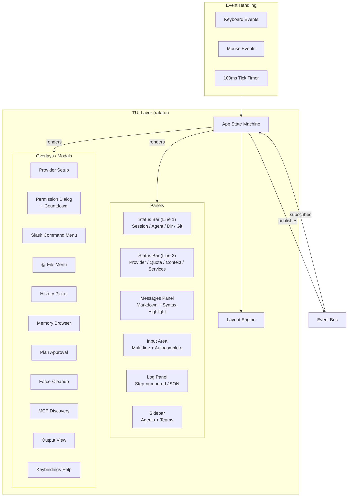
```mermaid
graph TB
    subgraph TUILayer["TUI Layer (ratatui)"]
        App["App State Machine"]
        App --> Layout["Layout Engine"]
        
        subgraph Panels["Panels"]
            StatusBar1["Status Bar (Line 1)\nSession / Agent / Dir / Git"]
            StatusBar2["Status Bar (Line 2)\nProvider / Quota / Context / Services"]
            Messages["Messages Panel\nMarkdown + Syntax Highlight"]
            Input["Input Area\nMulti-line + Autocomplete"]
            LogPanel["Log Panel\nStep-numbered JSON"]
            Sidebar["Sidebar\nAgents + Teams"]
        end
        
        subgraph Overlays["Overlays / Modals"]
            ProviderSetup["Provider Setup"]
            PermissionDlg["Permission Dialog\n+ Countdown"]
            SlashMenu["Slash Command Menu"]
            FileMenu["@ File Menu"]
            HistoryPicker["History Picker"]
            MemoryBrowser["Memory Browser"]
            PlanApproval["Plan Approval"]
            ForceCleanup["Force-Cleanup"]
                          MCPDiscovery["MCP Discovery"]
                          OutputView["Output View"]
                          Keybindings["Keybindings Help"]
                          end
    end

    subgraph EventHandling["Event Handling"]
        KeyEvents["Keyboard Events"]
        MouseEvents["Mouse Events"]
        Tick["100ms Tick Timer"]
    end

    EventHandling --> App
    App -- renders --> Panels
    App -- renders --> Overlays
    App -- publishes --> EventBus["Event Bus"]
    EventBus -- subscribed --> App
```

**Figure 7:** TUI Component Architecture — UI layout and event wiring

---

- **Streaming responses** — Real-time token streaming from LLM
- **Responsive two-line status bar** — Adapts between full, compact, and minimal layouts based on terminal width
- **Provider-aware usage display** — Shows quota percentage when available, otherwise token totals and context usage; Copilot plan labels and Ollama context labels are surfaced when known
- **Step-numbered tool calls** — Cross-session tool call correlation
- **Pretty-printed JSON** — Formatted tool parameters in log panel
- **Image attachments** — Visual support with clipboard paste
- **Mouse support** — Full mouse interaction
- **Auto-complete** — Slash command and agent name completion

---


## 7. HTTP Server & API

### 7.1 Server Commands

```bash
ragent serve              # Start server on default port (9100)
ragent serve --port 8080  # Custom port
```

### 7.2 API Endpoints

#### Health & Status

| Method | Endpoint | Description |
|--------|----------|-------------|
| `GET` | `/health` | Health check - returns "ok" |

#### Configuration & Providers

| Method | Endpoint | Description |
|--------|----------|-------------|
| `GET` | `/config` | Get current application configuration |
| `GET` | `/providers` | List configured provider IDs |

#### Sessions

| Method | Endpoint | Description |
|--------|----------|-------------|
| `GET` | `/sessions` | List all sessions |
| `POST` | `/sessions` | Create new session |
| `GET` | `/sessions/{id}` | Get session details |
| `DELETE` | `/sessions/{id}` | Archive/delete a session |
| `GET` | `/sessions/{id}/messages` | Get messages for a session |
| `POST` | `/sessions/{id}/messages` | Send message (returns SSE stream) |
| `POST` | `/sessions/{id}/abort` | Abort an active session |
| `POST` | `/sessions/{id}/permission/{req_id}` | Reply to a permission request |

#### Tasks (Background Agents)

| Method | Endpoint | Description |
|--------|----------|-------------|
| `GET` | `/sessions/{id}/tasks` | List tasks for a session |
| `POST` | `/sessions/{id}/tasks` | Spawn a new background task |
| `GET` | `/sessions/{id}/tasks/{tid}` | Get task details |
| `DELETE` | `/sessions/{id}/tasks/{tid}` | Cancel a task |

#### Server-Sent Events (SSE)

| Method | Endpoint | Description |
|--------|----------|-------------|
| `GET` | `/events` | Global SSE event stream (all sessions) |
| `GET` | `/sessions/{id}/messages` | Session-specific SSE stream |

#### Agents

| Method | Endpoint | Description |
|--------|----------|-------------|
| `GET` | `/agents` | List available agents |
| `GET` | `/agents/{name}` | Get agent details |

#### Tools

| Method | Endpoint | Description |
|--------|----------|-------------|
| `GET` | `/tools` | List available tools |
| `POST` | `/tools/{name}` | Execute tool |

#### Prompt Optimization

| Method | Endpoint | Description |
|--------|----------|-------------|
| `POST` | `/opt` | Optimize prompt (requires Bearer token) |

#### Memory API

| Method | Endpoint | Description |
|--------|----------|-------------|
| `GET` | `/memory/blocks` | List memory blocks |
| `GET` | `/memory/blocks/{scope}/{label}` | Get specific block |
| `PUT` | `/memory/blocks/{scope}/{label}` | Create/update block |
| `DELETE` | `/memory/blocks/{scope}/{label}` | Delete block |
| `POST` | `/memory/store` | Store structured memory |
| `POST` | `/memory/search` | Search memories |
| `GET` | `/memory/search` | Search memories (query params) |

#### Orchestrator API

| Method | Endpoint | Description |
|--------|----------|-------------|
| `POST` | `/orchestrate` | Submit a job to the orchestrator |
| `GET` | `/orchestrate/{job_id}` | Get job status and results |
| `DELETE` | `/orchestrate/{job_id}` | Cancel a running orchestration job |

#### Response Types

**BlockResponse (Memory blocks):**

```json
{
  "scope": "project",
  "label": "conventions",
  "content": "Use snake_case...",
  "read_only": false,
  "created_at": "2025-01-15T10:30:00Z",
  "updated_at": "2025-01-15T12:00:00Z"
}
```

**MemoryResponse (Structured memories):**

```json
{
  "id": "mem_abc123",
  "content": "The project uses PostgreSQL...",
  "category": "tech_stack",
  "confidence": 0.85,
  "tags": ["database", "infrastructure"],
  "created_at": "2025-01-15T10:30:00Z",
  "last_accessed": "2025-01-16T08:00:00Z"
}
```

**Search Request Body (`/memory/search`):**

```json
{
  "query": "database configuration",
  "limit": 10,
  "semantic": true,
  "filters": {
    "category": "tech_stack",
    "min_confidence": 0.5
  }
}
```

### 7.3 Authentication

- Bearer token generated on server startup
- Token displayed in console: `Server token: {token}`
- Include in requests: `Authorization: Bearer {token}`

---

### 7.4 HTTP API Request Flow

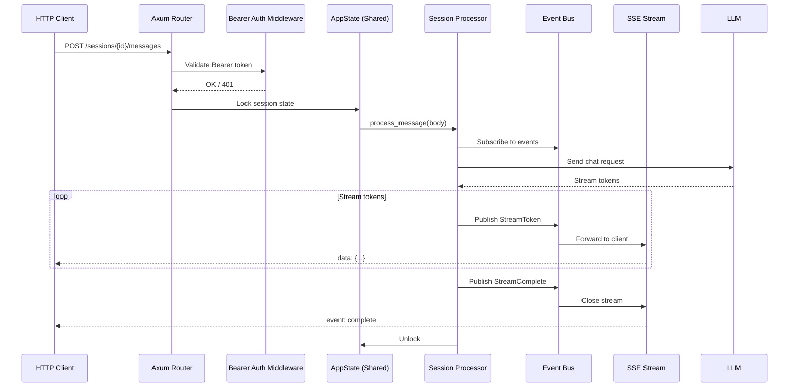
```mermaid
sequenceDiagram
    participant Client as HTTP Client
    participant Axum as Axum Router
    participant Auth as Bearer Auth Middleware
    participant State as AppState (Shared)
    participant Session as Session Processor
    participant EventBus as Event Bus
    participant SSE as SSE Stream

    Client->>Axum: POST /sessions/{id}/messages
    Axum->>Auth: Validate Bearer token
    Auth-->>Axum: OK / 401
    Axum->>State: Lock session state
    State->>Session: process_message(body)
    Session->>EventBus: Subscribe to events
    Session->>LLM: Send chat request
    LLM-->>Session: Stream tokens
    loop Stream tokens
        Session->>EventBus: Publish StreamToken
        EventBus->>SSE: Forward to client
        SSE-->>Client: data: {...}
    end
    Session->>EventBus: Publish StreamComplete
    EventBus->>SSE: Close stream
    SSE-->>Client: event: complete
    Session->>State: Unlock
```

**Figure 8:** HTTP API Request Flow — REST + SSE lifecycle

---

---


---

# Part II: Data & Knowledge Systems

---


## 8. Code Index

### 8.1 Overview

The Code Index is a built-in codebase indexing, search, and retrieval system that provides agents with deep, structured understanding of the codebase. Unlike simple text search (grep), it extracts symbols, their relationships, and enables semantic code exploration.

**Key Features:**
- **Zero external dependencies** — Everything compiles into the ragent binary (tree-sitter, SQLite, Tantivy)
- **User-controllable** — Enable/disable at any time via `/codeindex on|off`
- **Non-intrusive** — Zero overhead when disabled
- **Incremental updates** — Only re-indexes changed files using content hashing (Blake3)
- **Real-time file watching** — Automatic re-indexing on file changes
- **Fast search** — Sub-100ms symbol lookup across large codebases

### 8.2 Architecture

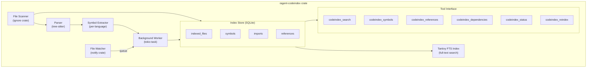
```mermaid
graph TB
    subgraph CodeIndex["ragent-codeindex crate"]
        Scanner["File Scanner<br/>(ignore crate)"]
        Parser["Parser<br/>(tree-sitter)"]
        Extractor["Symbol Extractor<br/>(per-language)"]
        Watcher["File Watcher<br/>(notify crate)"]
        Worker["Background Worker<br/>(tokio task)"]
        
        subgraph IndexStore["Index Store (SQLite)"]
            Files["indexed_files"]
            Symbols["symbols"]
            Imports["imports"]
            References["references"]
        end
        
        FTS["Tantivy FTS Index<br/>(full-text search)"]
        
        subgraph Tools["Tool Interface"]
            T1["codeindex_search"]
            T2["codeindex_symbols"]
            T3["codeindex_references"]
            T4["codeindex_dependencies"]
            T5["codeindex_status"]
            T6["codeindex_reindex"]
        end
    end
    
    Scanner --> Parser
    Parser --> Extractor
    Extractor --> Worker
    Scanner --> IndexStore
    Watcher -->|queue| Worker
    Worker --> IndexStore
    IndexStore --> FTS
    IndexStore --> Tools
```

**Figure 9:** Code Index Pipeline — File scan → parse → index → search

**Components:**
| Component | Purpose |
|-----------|---------|
| **File Scanner** | Walk directory trees, respect `.gitignore`, compute content hashes |
| **File Watcher** | Real-time filesystem change detection via `notify` crate |
| **Parser** | Tree-sitter AST parsing with per-language grammar support |
| **Symbol Extractor** | Per-language AST walkers extract symbols, imports, and references |
| **Index Store** | SQLite persistence for files, symbols, imports, references |
| **Search Engine** | Tantivy full-text index + structured SQLite queries |
| **Tree Cache** | LRU cache of parse trees for incremental re-parsing |
| **Background Worker** | Async indexing worker with debounce, dedup, and batching |

### 8.3 Supported Languages

| Language | Extensions | Symbols Extracted |
|----------|------------|-------------------|
| **Rust** | `.rs` | Functions, structs, enums, traits, impls, modules, consts, statics, type aliases, macros |
| **Python** | `.py` | Functions, classes, methods, decorators, imports, async functions |
| **TypeScript** | `.ts`, `.tsx` | Functions, classes, interfaces, types, enums, namespaces, imports |
| **JavaScript** | `.js`, `.jsx` | Functions, classes, methods, arrow functions, imports |
| **Go** | `.go` | Functions, structs, interfaces, methods, imports, type definitions |
| **C/C++** | `.c`, `.cpp`, `.h`, `.hpp` | Functions, structs, unions, enums, classes, namespaces, includes |
| **Java** | `.java` | Classes, interfaces, enums, methods, constructors, annotations |
| **OpenSCAD** | `.scad` | Modules, functions, variable declarations, include/use statements, call references |
| **Terraform** | `.tf`, `.tfvars` | Resource blocks, data blocks, module calls, variables, locals, outputs, provider blocks |
| **CMake** | `.cmake`, `CMakeLists.txt` | Functions, macros, blocks, foreach/while loops, if conditions, commands, include/add_subdirectory |
| **Gradle (Groovy)** | `.gradle` | Classes, methods, functions, closures, imports, annotations, DSL block calls |
| **Gradle (Kotlin)** | `.gradle.kts` | Classes, functions, properties, type aliases, imports, companion objects, DSL calls |
| **Maven** | `pom.xml` | Project coordinates, dependencies, modules, plugins, profiles, properties, repositories |

### 8.4 Data Model

#### Indexed Files
```rust
struct FileEntry {
    path: String,          // Relative path from project root
    language: String,      // "rust", "python", "typescript", etc.
    content_hash: String,    // Blake3 hash for change detection
    indexed_at: String,    // ISO 8601 timestamp
    file_size: i64,        // Bytes
}
```

#### Symbols
```rust
struct Symbol {
    name: String,          // Symbol name
    kind: SymbolKind,      // Function, Struct, Enum, Trait, etc.
    visibility: Visibility, // Public, Private, Restricted
    file_path: String,     // Source file path
    start_line: u32,       // 1-based line number
    start_col: u32,        // 1-based column
    end_line: u32,         // End line
    end_col: u32,          // End column
    doc: Option<String>,   // Doc comment / documentation
}
```

**SymbolKind Taxonomy:**
| Kind | Description |
|------|-------------|
| `function` | Named function or method |
| `struct` | Struct or class definition |
| `enum` | Enum type |
| `trait` | Trait or interface definition |
| `impl` | Implementation block |
| `const` | Constant definition |
| `static` | Static variable |
| `type_alias` | Type alias |
| `module` | Module or namespace |
| `macro` | Macro definition |
| `field` | Struct/class field |
| `variant` | Enum variant |

### 8.6 Control

```bash
/codeindex on           # Enable indexing
/codeindex off          # Disable indexing
/codeindex status       # Show current status
/codeindex reindex      # Force full re-index
/codeindex clear        # Delete all indexed data
```

Configuration in `ragent.json`:

```jsonc
{
  "code_index": {
    "enabled": true,
    "index_dir": ".ragent/code_index",  // Custom location
    "max_file_size": 1048576,             // 1MB default
    "extra_exclude_dirs": ["vendor", "node_modules", "target"],
    "extra_exclude_patterns": ["*.min.js", "*.d.ts"]
  }
}
```

### 8.7 Code Index Tools

All tools are available to agents and can be called directly in conversations.
Because they perform local, read-only analysis, the codeindex tool family is
hardwired as always allowed and bypasses interactive permission prompts.

#### `codeindex_search`

Full-text search across symbols, documentation, and code.

**Parameters:**
| Parameter | Type | Description |
|-----------|------|-------------|
| `query` | string | Search query (supports boolean operators) |
| `language` | string? | Filter by language (e.g., "rust") |
| `file_pattern` | string? | Filter by file path pattern (e.g., "src/**/*.rs") |
| `max_results` | integer? | Maximum results (default: 20, max: 100) |

**Example:**
```json
{
  "query": "config parser",
  "language": "rust",
  "file_pattern": "crates/ragent-agent/**/*.rs",
  "max_results": 10
}
```

**Returns:** List of search results with symbol info, file path, and relevance score.

---

#### `codeindex_symbols`

Query symbols from the codebase index with optional filters.

**Parameters:**
| Parameter | Type | Description |
|-----------|------|-------------|
| `name` | string? | Filter by symbol name (substring match) |
| `kind` | string? | Filter by symbol kind ("function", "struct", "enum", etc.) |
| `file_path` | string? | Filter by file path substring |
| `language` | string? | Filter by programming language |
| `visibility` | string? | Filter by visibility ("public", "private", "restricted") |
| `limit` | integer? | Maximum results (default: 50, max: 200) |

**Example:**
```json
{
  "name": "parse",
  "kind": "function",
  "language": "rust",
  "limit": 20
}
```

**Returns:** Structured symbol information with signatures and documentation.

---

#### `codeindex_references`

Find all references to a symbol by name across the indexed codebase.

**Parameters:**
| Parameter | Type | Description |
|-----------|------|-------------|
| `symbol` | string | The symbol name to find references for |
| `limit` | integer? | Maximum results (default: 50, max: 200) |

**Example:**
```json
{
  "symbol": "AgentConfig",
  "limit": 100
}
```

**Returns:** File locations grouped by file, with reference kind (call, type, field_access).

---

#### `codeindex_dependencies`

Query file-level dependencies from the code index.

**Parameters:**
| Parameter | Type | Description |
|-----------|------|-------------|
| `path` | string | File path to query dependencies for |
| `direction` | string? | "imports" (what this file uses) or "dependents" (what uses this file) |

**Example:**
```json
{
  "path": "crates/ragent-agent/src/agent/mod.rs",
  "direction": "dependents"
}
```

**Returns:** List of file paths that depend on (or are imported by) the target file.

---

#### `codeindex_status`

Show current status and statistics of the codebase index.

**No parameters.**

**Returns:**
- Files indexed
- Symbols extracted
- Languages detected
- Index size on disk
- Timestamps

**Example Output:**
```json
{
  "files_indexed": 128,
  "symbols_extracted": 3427,
  "languages": {
    "rust": 89,
    "python": 23,
    "typescript": 16
  },
  "index_size_bytes": 2457600,
  "last_updated": "2026-04-14T09:30:00Z"
}
```

---

#### `codeindex_reindex`

Trigger a full re-index of the codebase. Use after major file changes or when search results seem stale.

**No parameters.**

**Note:** This can take several minutes for large codebases. Progress is shown in the TUI.

---


## 9. Memory System

The memory system provides persistent, structured storage of facts, patterns, preferences, and insights across sessions. It operates across three tiers with automatic extraction, decay, compaction, and optional semantic search.

### 9.1 Three-Tier Architecture

| Tier | Storage | Access | Purpose |
|------|---------|--------|---------|
| **File Blocks** | `~/.ragent/memory/` and `.ragent/memory/` | `memory_read` / `memory_write` | Human-readable markdown notes organised by topic |
| **Structured Store** | SQLite (`memory` table) | `memory_store` / `memory_recall` / `memory_forget` | Typed, tagged, confidence-scored facts with full-text search |
| **Semantic Search** | ONNX embeddings (optional) | `memory_search` | Embedding-based similarity search via `all-MiniLM-L6-v2` |

### 9.2 Memory Tools

| Tool | Purpose |
|------|---------|
| `memory_read` | Read a named memory block (e.g. `memory_read(label="patterns")`) |
| `memory_write` | Write or append to a memory block with optional YAML frontmatter |
| `memory_replace` | Replace a specific string within a named memory block |
| `memory_store` | Store a structured memory with category, tags, and confidence score |
| `memory_recall` | Full-text search across structured memories with filtering |
| `memory_forget` | Delete memories by ID, age, confidence, category, or tags |
| `memory_search` | Semantic similarity search (embeddings-based) |
| `memory_migrate` | Analyse a flat `MEMORY.md` and propose splitting into named blocks |

### 9.3 Memory Browser

The TUI provides a full-panel memory browser accessible via `/memory`:

- Lists global and project memory blocks
- Shows size indicators with warnings for blocks near the 64 KB limit
- Expand/collapse to view full content
- Keyboard navigation (`j`/`k`, `Enter`, `Esc`)
- Search and filter capabilities

### 9.4 Structured Memory Categories

| Category | Description | Example |
|----------|-------------|---------|
| `fact` | Objective information about the project | "Uses tokio for async runtime" |
| `pattern` | Recurring code or workflow patterns | "Prefer `anyhow::Result` in main" |
| `preference` | User working preferences | "Use 4-space indentation" |
| `insight` | Deeper understanding or analysis | "Codebase follows clean architecture" |
| `error` | Known issues and their resolutions | "Don't use `git checkout` to rewind files" |
| `workflow` | Standard operating procedures | "Update CHANGELOG.md before pushing" |

### 9.5 Auto-Extraction

When `memory_extraction_enabled` is true in the configuration, the agent automatically extracts memories from conversations. Key facts, patterns, and insights are identified and stored with appropriate categories and confidence scores.

### 9.6 HTTP API Endpoints

| Method | Endpoint | Purpose |
|--------|----------|---------|
| `GET` | `/memory/blocks` | List all memory blocks |
| `GET` | `/memory/blocks/{label}` | Read a specific memory block |
| `DELETE` | `/memory/blocks/{label}` | Delete a memory block |
| `POST` | `/memory/search` | Semantic search across memories |
| `POST` | `/memory/store` | Store a structured memory |
| `POST` | `/memory/forget` | Delete memories matching criteria |

---


## 10. Spec Management

### 10.1 Overview

The Spec Management system provides a structured workflow for writing, tracking, and enforcing software specifications alongside code. It ensures that every significant feature or change is preceded by a clear, reviewable specification that lives in version control under the `specs/` directory.

**Key Features:**
- **Directory conventions** — Standardised `specs/<spec-id>/` layout with `SPEC.md` and `PLAN.md`
- **EARS templates** — Boilerplate generation with numbered requirement placeholders
- **Validation** — Automated checks for spec completeness and EARS syntax compliance
- **Status tracking** — State machine for spec lifecycle (draft → review → approved → implemented → verified → archived)
- **Plan linkage** — Mandatory `PLAN.md` pairing with every `SPEC.md`
- **Tool integration** — Slash commands and programmatic APIs for spec operations
- **Reporting** — Listing, filtering, and coverage summaries across a project

### 10.2 Directory Structure

```
specs/
├── <spec-id>/
│   ├── SPEC.md          # EARS-formatted specification
│   └── PLAN.md          # Implementation plan with linked tasks
├── <another-spec>/
│   ├── SPEC.md
│   └── PLAN.md
└── ...
```

**Rules enforced by the system:**
- Every spec lives in a subdirectory of `specs/` named after the spec identifier
- Each spec directory must contain both `SPEC.md` and `PLAN.md`
- Spec IDs use only alphanumeric characters, hyphens, and underscores

### 10.3 Spec Lifecycle Status

| Status | Meaning | Allowed Next States |
|--------|---------|---------------------|
| `draft` | Initial creation, requirements being written | `in_review` |
| `in_review` | Under peer review | `draft` (with feedback), `approved` |
| `approved` | Review passed, ready for implementation | `in_progress` |
| `in_progress` | Being implemented | `implemented` |
| `implemented` | Code complete, awaiting verification | `verified` |
| `verified` | Tests pass, acceptance criteria met | `archived` |
| `archived` | Retired spec | `draft` (reopen) |

### 10.4 Slash Commands

| Command | Purpose |
|---------|---------|
| `/spec create <id> <feature>` | Generate `SPEC.md` + `PLAN.md` via explore agent |
| `/spec list [status]` | List specs with optional status filter |
| `/spec search <query>` | Full-text search across `SPEC.md`, `PLAN.md`, and `REVIEW.md` |
| `/spec validate [spec-id]` | Validate EARS compliance; all specs if no ID |
| `/spec status <id> <status>` | Transition a spec to a new lifecycle status |
| `/spec task <id>` | List tasks for a spec |
| `/spec activate <id>` | Activate a spec for context injection into agent prompts |
| `/spec deactivate` | Deactivate the active spec |
| `/spec coverage <id>` | Show requirement coverage report with linked tasks |

### 10.5 Programmatic Tools

Five spec tools are available to agents for programmatic access:

| Tool | Purpose |
|------|---------|
| `spec_list` | List all specs with optional status filter |
| `spec_read` | Read a spec by ID — returns full markdown, requirements, tasks, and metadata |
| `spec_search` | Full-text search across spec content |
| `spec_coverage` | Generate a requirement coverage report |
| `spec_task_update` | Update the status of a task within a spec |

### 10.6 EARS Notation

Requirements are written in EARS (Easy Approach to Requirements Syntax) notation. The system validates that every requirement conforms to one of five templates:

1. **Ubiquitous** — `The <system> shall <requirement>.`
2. **Event-Driven** — `When <event>, the <system> shall <requirement>.`
3. **State-Driven** — `While <state>, the <system> shall <requirement>.`
4. **Optional** — `Where <feature> is <configured>, the <system> shall <requirement>.`
5. **Unwanted** — `If <condition>, the <system> shall <requirement>.`

### 10.7 Active Spec Context Injection

When a spec is activated via `/spec activate <id>`:
- The spec's requirements and tasks are injected into the agent's system prompt
- The agent receives structured context about the spec's goals and acceptance criteria
- This keeps the agent aligned with the specification during implementation

---


## 11. Custom Agents

Custom agents extend ragent's built-in agent personalities with user-defined profiles. Agents are stored as JSON (OASF format) or Markdown files and loaded automatically at startup.

### 11.1 Discovery Paths

Custom agents are discovered from two locations, with project-local taking precedence:

| Priority | Directory |
|----------|-----------|
| 1 (lower) | `~/.ragent/agents/` |
| 2 (higher) | `[PROJECT]/.ragent/agents/` |

### 11.2 File Formats

#### OASF JSON Format

```json
{
  "name": "my-reviewer",
  "description": "Code reviewer focused on security",
  "version": "1.0.0",
  "schema_version": "0.7.0",
  "modules": [{
    "type": "ragent/agent/v1",
    "payload": {
      "system_prompt": "You are an expert code reviewer...",
      "mode": "primary",
      "max_steps": 30,
      "thinking": { "enabled": true, "level": "high" },
      "permissions": [
        { "permission": "file:write", "pattern": "src/**", "action": "allow" }
      ],
      "skills": ["security-review", "rust-linting"]
    }
  }]
}
```

#### Markdown Format

Uses YAML frontmatter between `---` delimiters with the markdown body as the system prompt:

```markdown
---
name: my-reviewer
version: 1.0.0
model: anthropic/claude-sonnet-4-20250514
skills:
  - security-review
permissions:
  - permission: file:write
    pattern: src/**
    action: allow
---

You are an expert code reviewer focused on security vulnerabilities...
```

### 11.3 Agent Configuration Fields

| Field | Type | Description |
|-------|------|-------------|
| `system_prompt` | string | The agent's personality and instructions |
| `mode` | string | `primary` (main agent) or `secondary` (helper) |
| `max_steps` | integer | Maximum tool calls per turn |
| `thinking` | object | Reasoning configuration: `{ enabled, level, budget_tokens }` |
| `permissions` | array | Per-agent permission rules |
| `skills` | array | Skills this agent can invoke |
| `model` | string | Default model in `provider/model` format |
| `memory_scope` | string | `user`, `project`, or `none` |

### 11.4 Agent Diagnostics

Use `/agents` to list all loaded agents including custom ones. Custom agents are marked with a yellow `[custom]` badge. Diagnostics show any load errors or skipped files.

### 11.5 OASF Annotations

OASF records support taxonomy annotations for discoverability:

- `skills` — OASF skill taxonomy (e.g. `software_engineering/code_review`)
- `domains` — OASF domain taxonomy (e.g. `technology/software_development`)
- `locators` — Source code or registry references

---


## 12. Skills System

Skills are loadable instruction packs that inject tools, prompts, and file context into agent sessions. Each skill is defined by a `SKILL.md` file with YAML frontmatter and a markdown body.

### 12.1 Skill Discovery

Skills are discovered from multiple sources with priority order:

| Priority | Scope | Path |
|----------|-------|------|
| 0 | Bundled | Built into ragent binary |
| 1 | Enterprise | Managed settings |
| 2 | OpenSkills Global | `~/.agent/skills/`, `~/.claude/skills/` |
| 3 | Personal | `~/.ragent/skills/<name>/SKILL.md` |
| 4 | OpenSkills Project | `.agent/skills/`, `.claude/skills/` |
| 5 | Project | `.ragent/skills/<name>/SKILL.md` |

Higher-priority scopes override lower ones when names conflict.

### 12.2 Skill Structure

```
.ragent/skills/
  deploy/
    SKILL.md            # Skill instructions and frontmatter (required)
    scripts/            # Helper scripts the skill can invoke
    templates/          # Template files for the agent to fill in
    examples/           # Example outputs showing expected format
    resources/          # Reference materials
```

### 12.3 SKILL.md Frontmatter

```yaml
---
name: deploy
version: 1.0.0
description: Deploy the application to staging
argument_hint: "[environment]"
user_invocable: true
disable_model_invocation: false
allowed_tools:
  - bash
  - write
model: "anthropic/claude-sonnet-4-20250514"
context: fork
agent: general-purpose
---

# Deploy Skill

When the user types `/deploy [environment]`, deploy the application...
```

### 12.4 Skill Fields

| Field | Description |
|-------|-------------|
| `name` | Unique identifier (lowercase, hyphens, max 64 chars) |
| `description` | What the skill does; used for auto-invocation matching |
| `argument_hint` | Shown during autocomplete (e.g. `"[environment]"`) |
| `user_invocable` | If `false`, hidden from `/` menu; only agent can invoke |
| `disable_model_invocation` | If `true`, only user can invoke via `/name` |
| `allowed_tools` | Tools the agent can use without permission when this skill is active |
| `model` | Override model when this skill is active |
| `context` | `fork` to run in a forked subagent context |
| `agent` | Subagent type when `context` is `fork` |

### 12.5 Invocation

Skills are invoked by including `/skillname` in a message or by the agent auto-invoking based on description matching. Arguments after the skill name are passed to the skill body via template substitution.

### 12.6 Template Variables

Skill bodies support variable substitution:

| Variable | Description |
|----------|-------------|
| `$0` | Full argument string |
| `$1`, `$2`, ... | Individual arguments |
| `${RAGENT_SKILL_DIR}` | Directory containing the skill's `SKILL.md` |
| `${RAGENT_SESSION_ID}` | Current session ID |
| `${RAGENT_WORKING_DIR}` | Current working directory |

### 12.7 Bundled Skills

Ragent ships with 4 bundled skills:

| Skill | Purpose |
|-------|---------|
| `simplify` | Review recently changed files for code quality, reuse, and efficiency issues |
| `debug` | Troubleshoot current session by reading debug logs |
| `security-audit` | Security-focused code review |
| `test-coverage` | Analyse test coverage gaps |

### 12.8 Dynamic Context Injection

Skills can enable dynamic context with `allow_dynamic_context: true`. This allows `!command` syntax within the skill body to execute shell commands and inject their output into the context.

---


## 13. Prompt Optimization

The prompt optimization system transforms plain prompts into structured frameworks using template-based meta-prompts. No external API calls are needed — the optimization is performed by sending the framework's system prompt to the current LLM provider.

### 13.1 Optimization Methods

| Method | Name | Description |
|--------|------|-------------|
| `co_star` | CO-STAR | Context, Objective, Identity, Tone, Audience, Result |
| `crispe` | CRISPE | Capacity/Role, Request, Intent, Steps, Persona, Examples |
| `cot` | Chain-of-Thought | Step-by-step reasoning scaffold with self-checks |
| `draw` | DRAW | Professional AI image prompt optimizer |
| `rise` | RISE | Recursive Introspection — iterative self-improvement loop |
| `o1_style` | O1-STYLE | Thinking/step/reflection/reward structured reasoning |
| `meta` | Meta Prompting | Distil to a concise, high-signal meta-prompt |
| `variational` | VARI | Variational planning content-generation scaffold |
| `q_star` | Q* | XML Q*/A* intelligent iterative prompt optimizer |
| `openai` | OpenAI | Detailed GPT-style system prompt with guidelines |
| `claude` | Claude | Anthropic-style XML instruction generator with examples |
| `microsoft` | Microsoft | Azure AI optimised prompt with quality targets |

### 13.2 Usage

**TUI:**
```
/opt help                    # Show method table
/opt co_star Explain lifetimes
/opt cot Solve two-sum
/opt draw A futuristic city at sunset
```

**HTTP API:**
```bash
curl -s -X POST http://localhost:9100/opt \
  -H "Authorization: Bearer $RAGENT_TOKEN" \
  -H "Content-Type: application/json" \
  -d '{"method":"co_star","prompt":"Explain Rust lifetimes"}'
```

### 13.3 How It Works

1. The user selects a method and provides a raw prompt.
2. The system loads the method's meta-prompt (system message) from the template library.
3. The meta-prompt and user's input are sent to the current LLM provider.
4. The LLM returns the optimised, structured prompt.
5. The result is displayed in the TUI or returned via the HTTP API.

### 13.4 Completer Trait

The optimization is decoupled from any specific LLM backend via the `Completer` trait:

```rust
#[async_trait]
pub trait Completer: Send + Sync {
    async fn complete(&self, system: &str, user: &str) -> anyhow::Result<String>;
}
```

Implementations connect to the session's active provider and model.

### 13.5 Method Aliases

Methods can be referenced by multiple aliases for convenience:

| Method | Aliases |
|--------|---------|
| `co_star` | `costar`, `co-star` |
| `crispe` | `crisper` |
| `cot` | `chain_of_thought`, `chain-of-thought`, `chainofthought` |
| `o1_style` | `o1-style`, `o1` |
| `meta` | `meta_prompting`, `meta-prompting` |
| `variational` | `vari` |
| `q_star` | `qstar`, `q-star`, `q*` |
| `microsoft` | `ms`, `azure` |

---


## 14. Teams

The team system enables multi-agent coordination with named teammates, shared task lists, mailbox messaging, and task assignment. Teams are persisted on disk and can be created, opened, closed, and cleaned up through slash commands.

### 14.1 Core Concepts

| Concept | Description |
|---------|-------------|
| **Team** | A named group of agents with shared state and tasks |
| **Teammate** | An individual agent instance within a team |
| **Task** | A work item with title, description, status, and optional dependencies |
| **Mailbox** | Message queue per teammate for asynchronous communication |
| **Memory Scope** | Per-teammate persistent memory (`user`, `project`, or `none`) |

### 14.2 Team Lifecycle

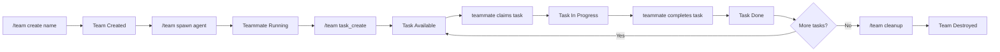
```mermaid
graph LR
    A["/team create name"] --> B[Team Created]
    B --> C["/team spawn agent"]
    C --> D[Teammate Running]
    D --> E["/team task_create"]
    E --> F[Task Available]
    F --> G[teammate claims task]
    G --> H[Task In Progress]
    H --> I[teammate completes task]
    I --> J[Task Done]
    J --> K{More tasks?}
    K -->|Yes| F
    K -->|No| L["/team cleanup"]
    L --> M[Team Destroyed]
```

### 14.3 Team Tools (21)

| Tool | Purpose |
|------|---------|
| `team_create` | Create a new team with a unique name |
| `team_spawn` | Spawn a teammate agent into the team |
| `team_cleanup` | Tear down a team and remove its on-disk resources |
| `team_status` | Get team member list, states, and task progress summary |
| `team_idle` | Signal that a teammate has no more tasks to work on |
| `team_task_create` | Add a new task to the team's shared task list |
| `team_task_claim` | Claim the next available task (or a specific task ID) |
| `team_task_complete` | Mark a claimed task as completed |
| `team_task_list` | List all tasks with status, assignment, and dependencies |
| `team_assign_task` | Assign a specific pending task to a named teammate |
| `team_message` | Send a direct message to one team member |
| `team_broadcast` | Send a message to all active teammates simultaneously |
| `team_read_messages` | Read unread messages from the teammate's mailbox |
| `team_shutdown_teammate` | Request graceful shutdown of a teammate (lead-only) |
| `team_shutdown_ack` | Acknowledge a shutdown request and terminate |
| `team_submit_plan` | Submit a plan to the team lead for approval |
| `team_approve_plan` | Approve or reject a teammate's submitted plan (lead-only) |
| `team_wait` | Block until teammates finish their current work |
| `team_memory_read` | Read from a teammate's persistent memory directory |
| `team_memory_write` | Write to a teammate's persistent memory directory |

### 14.4 Team Slash Commands

| Command | Purpose |
|---------|---------|
| `/team create <name>` | Create new team |
| `/team open <name>` | Open existing team |
| `/team close` | Close team session |
| `/team delete <name>` | Delete team |
| `/team clear` | Clear team state |
| `/team tasks` | Show team tasks table |
| `/team status` | Show team status |
| `/team message <to> <content>` | Send message to teammate |
| `/team broadcast <content>` | Broadcast to all teammates |
| `/team spawn <agent>` | Spawn teammate agent |
| `/team cleanup` | Cleanup team resources |

### 14.5 Task Dependencies

Tasks can declare dependencies on other tasks. A task cannot be claimed until all its dependencies are completed. This enables sequential workflows within parallel teams.

### 14.6 Plan Approval Workflow

Teammates can submit plans to the team lead for approval before starting implementation:

1. Teammate calls `team_submit_plan` with their intended approach
2. Lead receives the plan via `team_read_messages`
3. Lead calls `team_approve_plan` with `approved: true` or `approved: false`
4. If approved, teammate exits plan-pending mode and begins implementation
5. If rejected, teammate receives feedback and revises

---

### 14.7 Blueprints

Blueprints are pre-built team templates that define which teammates to spawn and what seed tasks to create. When a team is created with a blueprint, all teammates are spawned automatically with their role-specific prompts.

#### Blueprint Storage Locations

Blueprints are searched in priority order:

1. **Project-local:** `[PROJECT]/.ragent/blueprints/teams/<name>/`
2. **Global:** `~/.ragent/blueprints/teams/<name>/`

#### Blueprint Directory Structure

```text
.ragent/blueprints/teams/code-review/
  README.md              # Team description (copied to team directory)
  spawn-prompts.json     # Teammate definitions with role-specific prompts
  task-seed.json         # Initial tasks seeded on team creation
```

#### spawn-prompts.json Format

Defines teammates to auto-spawn when the team is created:

```json
[
  {
    "tool_name": "team_spawn",
    "teammate_name": "security-reviewer",
    "agent_type": "general",
    "prompt": "Perform a focused security review of the codebase..."
  },
  {
    "tool_name": "team_spawn",
    "teammate_name": "test-reviewer",
    "agent_type": "general",
    "prompt": "Review test coverage and identify gaps..."
  }
]
```

Fields:
- `tool_name` — Must be `"team_spawn"`
- `teammate_name` — Unique name for the teammate within the team
- `agent_type` — Agent type to use (`general`, `coder`, `architect`, etc.)
- `prompt` — Role-specific instructions prepended to the teammate's context
- `memory` — Optional persistent memory scope (`user`, `project`, or `none`)
- `model` — Optional model override in `provider/model` format

#### task-seed.json Format

Defines initial tasks created when the team is set up:

```json
[
  {
    "tool": "team_task_create",
    "input": {
      "title": "Audit authentication boundaries",
      "description": "Confirm session/auth checks protect privileged actions."
    }
  }
]
```

Both `"input"` and `"args"` keys are supported for tool arguments.

#### Blueprint Slash Commands

| Command | Purpose |
|---------|---------|
| `/team blueprint` | List all installed blueprints |
| `/team blueprint <name>` | Show detailed summary of a specific blueprint |
| `/team create <blueprint> [name]` | Create a new team from a blueprint (blueprint is required) |

The list view shows a table with blueprint name, scope (project/global), teammate count, task count, and description. The detail view shows the full README, teammate table, seed tasks, and usage instructions.

#### Work Context Propagation

When creating a team from a blueprint, the `context` parameter is critical — it tells every auto-spawned teammate exactly what code to target:

```bash
/team create code-review my-review-team
Review the crates/ragent-server directory for security issues
```

The context is prepended to each teammate's spawn prompt from the blueprint. Without it, teammates only receive their generic role prompt.

#### Blueprint Best Practices

- **Always use blueprints** for repeatable team patterns — they save time and reduce errors
- **Do not re-spawn blueprint teammates** — they are spawned automatically by `team_create`
- **Provide detailed context** when creating a team so teammates know exactly what to work on
- **Keep prompts focused** in `spawn-prompts.json` — each teammate should have a clear, scoped responsibility
- **Seed tasks with concrete goals** in `task-seed.json` so teammates have immediate work to claim

---


## 15. Swarm Mode

Swarm mode automatically decomposes a high-level goal into parallel subtasks, creates an ephemeral team, and coordinates execution. It is ideal for large tasks that can be broken into independent work items.

### 15.1 How Swarm Works

1. **Decomposition** — The LLM analyses the prompt and produces a JSON decomposition with 2–8 independent subtasks and optional dependency edges.
2. **Team Creation** — An ephemeral team named `swarm-<timestamp>` is created.
3. **Teammate Spawning** — One teammate is spawned per subtask with a tailored prompt.
4. **Dependency Resolution** — Tasks with `depends_on` are blocked until prerequisites complete.
5. **Progress Monitoring** — The TUI shows real-time status: spawning, blocked, in-progress, and completed counts.
6. **Auto-Completion** — When all tasks finish, the swarm auto-summarises results.

### 15.2 Swarm Slash Commands

| Command | Purpose |
|---------|---------|
| `/swarm <prompt>` | Decompose a goal into parallel subtasks and spawn a team |
| `/swarm status` | Show live progress of the active swarm |
| `/swarm cancel` | Cancel the active swarm and clean up |
| `/swarm help` | Show usage help |

### 15.3 Decomposition Format

The LLM returns a JSON object with an array of subtasks:

```json
{
  "tasks": [
    {
      "id": "s1",
      "title": "Short title",
      "description": "Detailed instructions for the agent...",
      "depends_on": [],
      "agent_type": "general",
      "model": null
    }
  ]
}
```

Each subtask has:
- `id` — Unique identifier (e.g. `s1`, `s2`)
- `title` — Short human-readable title
- `description` — Full instructions for the teammate
- `depends_on` — IDs of subtasks that must complete first
- `agent_type` — Optional agent type override (defaults to `general`)
- `model` — Optional model override in `provider/model` format

### 15.4 Swarm State

The TUI tracks swarm state including:
- `team_name` — Name of the ephemeral backing team
- `prompt` — Original user prompt
- `decomposition` — The LLM-produced task breakdown
- `spawned` — Whether all teammates have been spawned
- `completed` — Whether the orchestrator has collected all results

### 15.5 Limitations

- Only one swarm can be active at a time; start a new one after cancelling the current swarm.
- Requires a configured model with JSON mode support for reliable decomposition.
- Subtask descriptions must be detailed enough for agents to work without further clarification.

---


## 16. Autopilot Mode

Autopilot mode enables the agent to operate autonomously, continuing to iterate on a task without user intervention until the task is complete, a safety limit is reached, or the user stops it.

### 16.1 How Autopilot Works

1. **Activation** — User runs `/autopilot on` with optional token and time budgets.
2. **Autonomous Loop** — The agent processes messages, makes tool calls, and continues iterating automatically.
3. **Completion** — The agent calls `task_complete` with a summary, or the user runs `/autopilot off`.
4. **Safety Limits** — Hard stops prevent runaway execution.

### 16.2 Autopilot Slash Commands

| Command | Purpose |
|---------|---------|
| `/autopilot on [--max-tokens N] [--max-time N]` | Enable autonomous operation with optional limits |
| `/autopilot off` | Disable autonomous operation and return to interactive mode |
| `/autopilot status` | Show autopilot status, elapsed time, and remaining budget |

### 16.3 Safety Limits

| Limit | Default | Behaviour When Hit |
|-------|---------|-------------------|
| `max_steps` | 500 | Halt and ask user whether to continue |
| Token budget | Optional (`--max-tokens`) | Stop and display summary |
| Time limit | Optional (`--max-time` in seconds) | Stop and display summary |
| Context window | Model-specific | Trigger automatic compaction |

### 16.4 Completion Signalling

Agents in autopilot mode call `task_complete` to signal completion:

```
task_complete(summary: "Implemented feature X with tests and documentation")
```

This publishes a `TaskCompleted` event, displays the summary to the user, and exits autopilot mode.

### 16.5 Status Display

When active, the status bar shows:
- `⚡ autopilot` — Normal operation
- `autopilot: time limit reached` — Time budget exhausted
- `autopilot stopped: task complete` — Agent finished successfully

---


## 17. Orchestrator & Multi-Agent Coordination

The orchestrator provides primitives for coordinating multiple agents in a single workflow. It supports job dispatch, progress tracking, and result aggregation.

### 17.1 Core Components

| Component | Purpose |
|-----------|---------|
| `AgentRegistry` | Maintains a registry of available agents and their capabilities |
| `Coordinator` | Dispatches jobs to agents and collects results |
| `InProcessRouter` | Actor-style message routing between agents |
| `JobDescriptor` | Defines a job with required capabilities and payload |

### 17.2 Coordinator API

```rust
use ragent_agent::orchestrator::{Coordinator, JobDescriptor};

let coord = Coordinator::new(registry);

// Synchronous job (blocks until all agents respond)
let result = coord.start_job_sync(JobDescriptor {
    id: "job-1".to_string(),
    required_capabilities: vec!["search".to_string()],
    payload: "find TODOs".to_string(),
}).await?;

// Asynchronous job (returns job ID, subscribe to events)
let job_id = coord.start_job_async(desc).await?;
let mut events = coord.subscribe_job_events(&job_id).await?;
```

### 17.3 HTTP API Endpoints

| Method | Endpoint | Purpose |
|--------|----------|---------|
| `GET` | `/orchestrator/metrics` | Return live counter snapshot |
| `POST` | `/orchestrator/start` | Start a multi-agent job |
| `GET` | `/orchestrator/jobs/{id}` | Poll job status and results |

### 17.4 Conflict Resolution

The `policy` submodule provides conflict resolution strategies:

- **Last-write-wins** — Simple timestamp-based resolution
- **Human-in-the-loop** — Escalate conflicts to the user for decision
- **Merge strategies** — Automatic merging for compatible changes

### 17.5 Transport Adapters

The `transport` submodule supports pluggable communication:

- `InProcessRouter` — In-process actor-style messaging
- `HttpRouter` — HTTP-based inter-process communication
- `RouterComposite` — Combine multiple transport layers

### 17.6 Current Status

The orchestrator is at MVP level with in-process coordination. HTTP endpoints are available but the full distributed coordination (leader election, cluster formation) is planned for a future milestone.

---


## 18. GitHub & GitLab Integration

Ragent provides native GitHub and GitLab integration tools through the `ragent-tools-vcs` crate, enabling agents to manage issues, pull/merge requests, CI/CD pipelines, and project metadata. Both platforms share a similar tool architecture and support repository auto-detection from git remotes, but authenticate and name resources differently.

### 18.1 GitHub Authentication & Slash Commands

**Authentication:**
- **Token:** Stored securely in the ragent SQLite database
- **Auto-detected from VS Code:** If the GitHub Copilot extension is installed, ragent can reuse the existing Copilot token

**Slash Commands:**
| Command | Purpose |
|---------|---------|
| `/github login` | Authenticate with GitHub |
| `/github logout` | Remove GitHub credentials |
| `/github status` | Show GitHub connection status |

### 18.2 GitHub Issue Tools

| Tool | Description | Parameters |
|------|-------------|------------|
| `github_issues_list` | List issues with filtering | `state` (open/closed/all), `labels`, `limit` |
| `github_issues_get` | Get issue details | `number` |
| `github_issues_create` | Create a new issue | `title`, `body`, `labels`, `assignees` |
| `github_issues_comment` | Add comment to an issue | `number`, `body` |
| `github_issues_close` | Close an issue | `number`, `comment` (optional) |

### 18.3 GitHub Pull Request Tools

| Tool | Description | Parameters |
|------|-------------|------------|
| `github_pr_list` | List pull requests | `state`, `base`, `limit` |
| `github_pr_get` | Get PR details and diff | `number` |
| `github_pr_create` | Create a new pull request | `title`, `body`, `base`, `head`, `draft` |
| `github_pr_merge` | Merge a pull request | `number`, `method` (merge/squash/rebase) |
| `github_pr_review` | Submit a PR review | `number`, `event` (approve/comment/request_changes), `body` |

### 18.4 GitHub Auto-Detection

Owner and repository are automatically detected from the git remote:

```text
git remote get-url origin
→ https://github.com/owner/repo.git  → owner="owner", repo="repo"
→ git@github.com:owner/repo.git      → owner="owner", repo="repo"
```

Falls back to explicit `--owner` and `--repo` parameters if detection fails.

---

### 18.5 GitLab Authentication & Slash Commands

**Configuration:**
- **Instance URL:** The GitLab instance URL (e.g., `https://gitlab.com` or a self-hosted instance)
- **Personal Access Token (PAT):** Stored securely in the ragent SQLite database via `/gitlab setup`

**Slash Commands:**
| Command | Purpose |
|---------|---------|
| `/gitlab setup` | Configure GitLab connection (instance URL + PAT) |
| `/gitlab logout` | Remove stored GitLab credentials |
| `/gitlab status` | Show GitLab connection status |

### 18.6 GitLab Issue Tools

| Tool | Description | Parameters |
|------|-------------|------------|
| `gitlab_issues_list` | List issues with filtering | `project_id`, `state` (opened/closed/all), `labels`, `limit` |
| `gitlab_issues_get` | Get issue details | `project_id`, `issue_iid` |
| `gitlab_issues_create` | Create a new issue | `project_id`, `title`, `body`, `labels`, `assignee_ids` |
| `gitlab_issues_comment` | Add comment to an issue | `project_id`, `issue_iid`, `body` |
| `gitlab_issues_close` | Close an issue | `project_id`, `issue_iid` |

### 18.7 GitLab Merge Request Tools

| Tool | Description | Parameters |
|------|-------------|------------|
| `gitlab_mr_list` | List merge requests | `project_id`, `state`, `target_branch`, `limit` |
| `gitlab_mr_get` | Get MR details and diff | `project_id`, `mr_iid` |
| `gitlab_mr_create` | Create a new merge request | `project_id`, `title`, `body`, `source_branch`, `target_branch` |
| `gitlab_mr_merge` | Merge a merge request | `project_id`, `mr_iid`, `squash` |

### 18.8 GitLab CI/CD Pipeline Tools

| Tool | Description | Parameters |
|------|-------------|------------|
| `gitlab_pipeline_list` | List pipelines | `project_id`, `status`, `limit` |
| `gitlab_pipeline_get` | Get pipeline details | `project_id`, `pipeline_id` |
| `gitlab_ci_list` | List CI jobs for a pipeline | `project_id`, `pipeline_id` |
| `gitlab_ci_get` | Get CI job details and logs | `project_id`, `job_id` |

### 18.9 GitLab Project Tools

| Tool | Description | Parameters |
|------|-------------|------------|
| `gitlab_project_get` | Get project metadata | `project_id` or `path_with_namespace` |

### 18.10 GitLab Auto-Detection

When operating inside a Git repository with a GitLab remote, ragent can auto-detect the `project_id` or `path_with_namespace` from the git remote configuration:

```text
git remote get-url origin
→ https://gitlab.com/owner/repo.git  → path_with_namespace="owner/repo"
→ git@gitlab.com:owner/repo.git      → path_with_namespace="owner/repo"
```

Falls back to explicit `project_id` or `path_with_namespace` parameters if detection fails.


---

## 19. MCP Integration (Model Context Protocol)

*(Section pending — see Table of Contents for planned content)*

---


## 20. Auto-Update Mechanism

*(To be documented)*

---

# Appendices

---

## Appendix A: Version History

| Version | Date | Highlights |
|---------|------|------------|
| v0.1.0-alpha.86 | 2026-05-21 | Azure Resource (File) provider — file-based endpoint catalog, `azureresources.json` schema, TUI integration, integration tests |
| v0.1.0-alpha.82 | 2026-05-20 | Azure AI Foundry provider fixes, `/config show` slash command |
| v0.1.0-alpha.79 | 2026-05-18 | Azure endpoint logging in TUI log panel |
| v0.1.0-alpha.76 | 2026-05-18 | Azure AI Foundry provider added |
| v0.1.0-alpha.75 | 2026-05-18 | SPEC.md mermaid diagram syntax fixes |
| v0.1.0-alpha.73 | 2026-05-18 | `/model` selection fix, version number display |
| v0.1.0-alpha.72 | 2026-05-18 | gen-spec-pdf.sh script, Spec Management section |
| v0.1.0-alpha.71 | 2026-05-18 | Startup ASCII art banner with compile timestamp |
| v0.1.0-alpha.70 | 2026-05-17 | Concurrency improvements, todo fixes |
| v0.1.0-alpha.68 | 2026-05-15 | `/codeindex lang` filtering, benchmark data cleanup |
| v0.1.0-alpha.61 | 2025-01-17 | Instruction file discovery logging |
| v0.1.0-alpha.60 | 2025-01-16 | `.local/share/ragent` in AGENTS.md search path |
| v0.1.0-alpha.57 | 2025-01-16 | MS Office/LibreOffice fixes, todo summary updates |
| v0.1.0-alpha.49 | 2025-01-17 | Permission dialog live countdown, config parse error enhancement, codeindex hardwired permissions, crate extraction milestones |
| v0.1.0-alpha.48 | 2025-01-17 | Permission milestones complete, bash security layers, more permissions fixes |
| v0.1.0-alpha.47 | 2025-01-17 | Crate reorganisation (ragent-types, ragent-config, ragent-storage, ragent-llm) |

---

## Appendix B: Documentation

All documentation markdown files are located in `docs/` except for these root files:

| File | Purpose |
|------|---------|
| `README.md` | Project overview |
| `QUICKSTART.md` | Quick start guide |
| `SPEC.md` | This specification |
| `AGENTS.md` | Agent guidelines |
| `CHANGELOG.md` | Change log |
| `RELEASE.md` | Release notes |
| `STATS.md` | Project statistics |

---

## Appendix C: Project Contact & Repository

- **Repository:** https://github.com/thawkins/ragent
- **License:** MIT
- **Author:** Tim Hawkins

---

## Appendix D: Changelog (2025-01-16 → 2025-04-21)

### Added (v0.1.0-alpha.82 → v0.1.0-alpha.86)
- Azure Resource (File) provider — New `azure_resource` provider reads endpoint definitions from `azureresources.json` in `~/.config/ragent/` or `.ragent/`
- `azureresources.json` file format — JSON schema with version, resources array, per-entry auth (api_key/api_key_env), capabilities whitelist, thinking config, and context window
- TUI integration for Azure Resource provider — Dedicated picker in provider setup dialog, last-selection persistence, stale-selection cleanup
- Azure Resource integration tests — Provider listing, persistence round-trip, ModelInfo conversion, backend resolution
- Azure Resource documentation — `docs/userdocs/azure-resource.md` with schema reference and troubleshooting
- File format specification — `specs/AzureResource/FILEFORMAT.md` documenting the complete `azureresources.json` format
- `task_complete` summary display — TUI widget output now shows task completion summaries

### Added (v0.1.0-alpha.76 → v0.1.0-alpha.82)
- Azure AI Foundry provider — New `azure_foundry` provider for Microsoft Azure AI Foundry models
- Azure endpoint logging — Full resolved endpoint URL displayed in TUI log panel
- `/config show` slash command — Displays current resolved configuration
- gen-spec-pdf.sh script — Pandoc + Chromium-based Markdown-to-PDF conversion
- Startup ASCII art banner — Application name in ASCII art with compile timestamp
- `/codeindex lang` filtering — Optional language parameter for code index results
- Instruction file discovery logging — Tracks AGENTS.md-style file discovery with summary

### Changed (v0.1.0-alpha.82 → v0.1.0-alpha.86)
- Provider count updated from 7 to 8 (added `azure_resource`)

### Changed (v0.1.0-alpha.68 → v0.1.0-alpha.75)
- Improved TUI slash-command autocomplete with safe `Esc` handling
- SPEC.md mermaid diagram syntax fixes — All 14 diagrams now render correctly
- Benchmark data cleanup — Removed unused dataset files

### Fixed (v0.1.0-alpha.76 → v0.1.0-alpha.82)
- Azure endpoint logging now shows full URL with model name
- `/model` selection handling fixed

### Earlier Changes (v0.1.0-alpha.47 → v0.1.0-alpha.68)
- Permission dialog countdown timer with live TUI updates (120-second timeout)
- Config parse error reporting with file path, line, column, and caret marker
- Codeindex tools hardwired as always-allowed (read-only, no permission prompts)
- Crate extraction milestones: `ragent-types`, `ragent-config`, `ragent-storage`, `ragent-llm`
- `ollama_cloud` provider with dynamic model discovery and vision support
- `gemini` provider with massive context windows (up to 2M tokens)
- `huggingface` provider with dynamic model discovery and rate limit tracking
- GitLab integration with issues, merge requests, pipelines, and jobs
- Team coordination tools (21 tools for team lifecycle, tasks, messaging)
- MCP (Model Context Protocol) client support
- Skills system for loadable skill packs
- Custom agent profiles via OASF format
- Autopilot mode for autonomous operation
- Prompt optimization (`/opt` command with 12 methods)
- Memory system with three tiers (file blocks, SQLite store, semantic search)
- Journal system for insights and decisions
- Background agent spawning and management
- Swarm mode for parallel task decomposition
- Plan agent with human-in-the-loop approval
- Enhanced bash security with 7 layers and word-boundary matching
- Permission system now supports per-agent rules and YOLO mode

---
