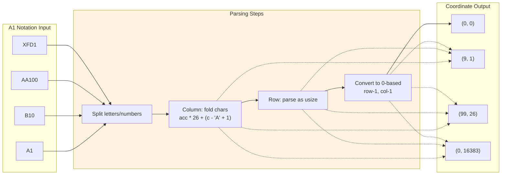

# A1 Notation Cell Referencing

### From: libreoffice_read

A1 notation is the de facto standard for identifying cells and ranges in spreadsheet applications, representing a hybrid addressing scheme that combines alphabetic column identifiers with numeric row identifiers. This notation system, ubiquitous in Excel, Google Sheets, and OpenDocument Calc, presents interesting parsing challenges due to its bi-radix nature: columns use a base-26 alphabetical system (A-Z, AA-AZ, BA-BZ, etc.) while rows use standard decimal numbering starting from 1. The implementation's `cell_ref()` function demonstrates the algorithmic handling of this notation, converting column strings through iterative multiplication and offset calculation—each character contributes `char_value * 26^position` to the zero-based column index. This mirrors the mathematical structure of bijective base-26 numeration, where there is no digit representing zero, requiring careful handling of the 'A' offset. Range parsing extends single cell reference to pairs, validating the colon-separated format and producing coordinate tuples that enable array slicing operations. The practical significance of A1 notation extends beyond user interface conventions; it serves as a durable interchange format for specifying data regions in APIs, configuration files, and documentation. The `parse_range()` function's implementation with `saturating_sub` operations for zero-based indexing demonstrates defensive programming practices for coordinate transformation. Range specifications enable memory-efficient data extraction by allowing selective reading of spreadsheet regions rather than loading entire sheets, particularly valuable for large datasets where only header rows or specific data blocks are relevant. The notation's limitations—maximum column counts (XFD in modern Excel, corresponding to 16384 columns) and row limits—have shaped spreadsheet application architectures and data modeling practices, influencing how large datasets are partitioned across multiple sheets or files.

## Diagram

## External Resources

- [Microsoft Excel cell reference documentation](https://support.microsoft.com/en-us/office/overview-of-formulas-in-excel-ecfdc708-9162-49e8-b993-c311f47ca173) - Microsoft Excel cell reference documentation
- [Bijective numeration - mathematical basis for A1 columns](https://en.wikipedia.org/wiki/Bijective_numeration) - Bijective numeration - mathematical basis for A1 columns

## Sources

- [libreoffice_read](../sources/libreoffice-read.md)
