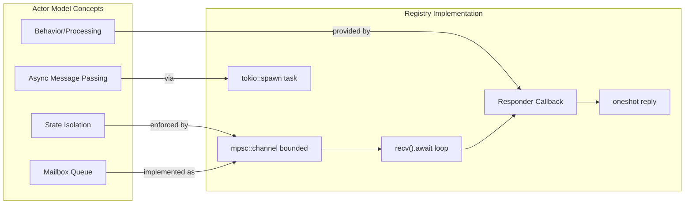

# Actor-Model Message Passing

### From: registry

The actor model provides a foundational concurrency paradigm where autonomous entities communicate exclusively through asynchronous message passing, eliminating shared mutable state and its associated synchronization complexity. This implementation adopts actor-model principles through Tokio's MPSC channels, where each in-process agent receives a dedicated mailbox (channel receiver) and a corresponding sender stored in the registry for external dispatch. The strict separation of sender and receiver types enforces unidirectional flow while Rust's ownership system prevents accidental sharing of the receiving end.

The mailbox processing loop exemplifies actor runtime implementation. Spawned as an independent Tokio task with 'static lifetime, it owns the receiver and processes messages sequentially, providing automatic serialization of agent state access. The loop pattern—while let Some(req) = rx.recv().await—gracefully handles channel closure (returning None) as a shutdown signal, enabling clean agent lifecycle management through channel dropping. This structure inherently provides backpressure through the bounded channel capacity (100 messages), preventing memory exhaustion under load while maintaining responsiveness.

The integration of one-shot reply channels within orchestration requests elegantly extends the actor model to request-response patterns without violating actor principles. Rather than synchronous RPC, the requesting entity sends a message containing its own reply channel—an actor-model pattern sometimes called 'futures as messages.' The responding agent remains unaware of the requester's identity, preserving encapsulation, while the registry's spawned task bridges the responder callback to the reply channel.

This hybrid approach—registry-managed mailboxes with user-provided responder logic—differs from pure actor systems like Erlang/OTP or Akka where actors are uniform runtime entities. Here, agents are abstract capabilities with optional mailbox infrastructure, supporting both actor-style and direct callback integration. This flexibility accommodates Rust's zero-cost abstraction goals while providing ergonomic async patterns for agent implementers.

## Diagram

## External Resources

- [Akka Typed Actors documentation](https://doc.akka.io/docs/akka/current/typed/actors.html) - Akka Typed Actors documentation
- [Erlang process and message passing model](https://www.erlang.org/doc/reference_manual/processes.html) - Erlang process and message passing model
- [Tokio tutorial on message passing with channels](https://tokio.rs/tokio/tutorial/channels) - Tokio tutorial on message passing with channels

## Sources

- [registry](../sources/registry.md)
