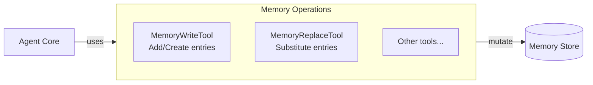

# Agent Memory Operations

### From: memory_replace

Agent memory operations form the foundational capability that allows AI agents to persist, modify, and retrieve information across execution contexts. The presence of specialized tools like `MemoryReplaceTool` indicates a sophisticated memory subsystem where different mutation operations have distinct semantics. Replacement operations specifically suggest a capability to substitute existing memory entries, which may involve lookups by key or identifier, atomic swap semantics, or versioning considerations. In agent architectures, memory operations often need to be observable, revertible, or subject to access controls, which explains why even simple operations warrant dedicated tool implementations. The grouping of replacement with write operations implies these share fundamental characteristics—both modify memory state—while potentially differing in their preconditions and postconditions. Understanding these memory operation semantics is crucial for building reliable agent behaviors that can reason about their own state changes.

## Diagram

## External Resources

- [Research on LLM-based agent memory and tool use](https://arxiv.org/abs/2309.02427) - Research on LLM-based agent memory and tool use

## Sources

- [memory_replace](../sources/memory-replace.md)
