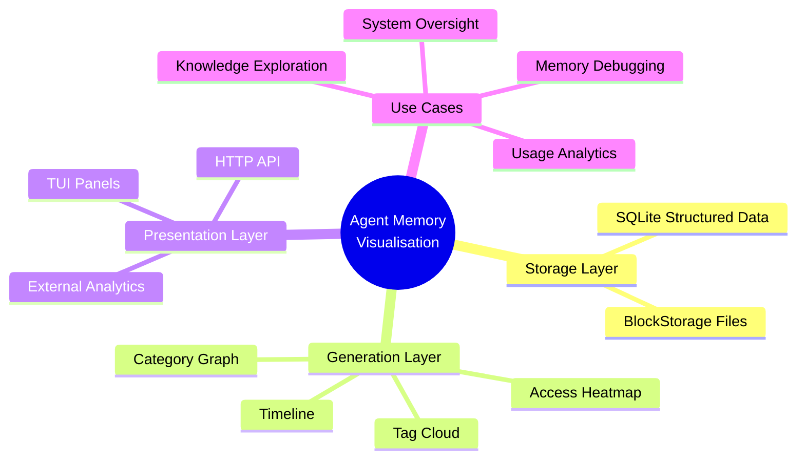

# Agent Memory Visualisation Architecture

### From: visualisation

The visualisation module embodies an architectural pattern increasingly common in autonomous agent systems: the separation of raw memory storage from presentation-optimized data structures. This pattern recognizes that agent memory systems optimize for durability, retrieval efficiency, and semantic search, while human operators require aggregated, summarized, and relationally-organized views for comprehension and oversight. The module's four visualisation types—graph, timeline, tag cloud, and heatmap—represent distinct cognitive lenses onto the same underlying data, each optimized for different operator inquiries: structural relationships (graph), temporal narrative (timeline), topical distribution (tag cloud), and usage patterns (heatmap).

This multi-view architecture enables what information visualization researchers term "overview first, zoom and filter, then details-on-demand"—the generate_visualisation bundle provides overview data for initial assessment, while the underlying Storage interface supports drill-down to specific memories. The read-only nature of visualisation generation (all functions take immutable references) ensures presentation logic cannot corrupt stored memories, establishing a safe audit trail boundary. The 10,000-item query limits and truncation heuristics represent deliberate resource governance preventing unbounded computation on large corpora, with tradeoffs between completeness and responsiveness.

The module's placement within ragent-core suggests visualisation is considered a core capability rather than peripheral feature, indicating agent systems where human oversight and interpretability are first-class requirements rather than afterthoughts. This aligns with emerging AI safety and governance frameworks emphasizing observability in autonomous systems. The JSON-serializable output format enables flexible frontend implementations—terminal dashboards, web-based monitoring interfaces, or integration with external analytics platforms—without backend modification. The BlockStorage trait object parameter, though unused, anticipates future visualisation of rich content types (images, documents) requiring storage beyond SQLite's binary blob limitations, demonstrating forward-compatible API design.

## Diagram

## External Resources

- [Information visualization principles and techniques](https://en.wikipedia.org/wiki/Information_visualization) - Information visualization principles and techniques
- [Nielsen Norman Group on overview-first interaction design](https://www.nngroup.com/articles/overview-first/) - Nielsen Norman Group on overview-first interaction design
- [AI observability and monitoring research](https://arxiv.org/abs/2309.02427) - AI observability and monitoring research

## Sources

- [visualisation](../sources/visualisation.md)
