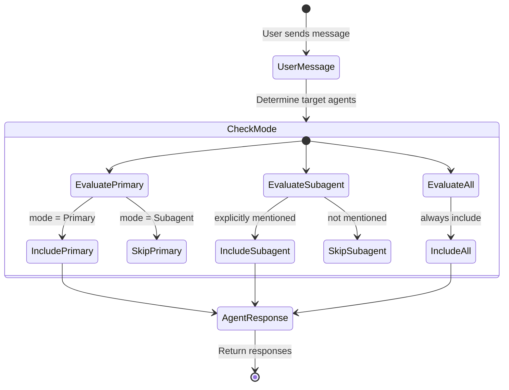

# Agent Mode Routing

### From: custom

Agent mode routing is a conversation participation pattern that controls which agents receive user messages in multi-agent systems, implementing a publish-subscribe filtering mechanism. The three modes—Primary, Subagent, and All—define clear contracts for agent visibility and invocation. Primary agents act as default handlers, automatically receiving all user input unless specifically routed elsewhere, suitable for main assistants and general-purpose agents. Subagent mode implements on-demand activation, where agents only participate when explicitly mentioned by name or targeted by routing logic, enabling specialized tools that don't clutter the default conversation flow. All mode provides maximum flexibility, allowing agents to participate in both automatic and explicit routing contexts. This design prevents the "too many cooks" problem in multi-agent systems where every agent responding to every message creates chaos. The mode is specified at agent definition time and enforced by the session processor's message distribution logic. The implementation uses an enum with clear variant names rather than string matching at the routing site, providing compile-time exhaustiveness checking.

## Diagram

## External Resources

- [Enterprise Integration Patterns: Publish-Subscribe Channel](https://www.enterpriseintegrationpatterns.com/patterns/messaging/PublishSubscribeChannel.html) - Enterprise Integration Patterns: Publish-Subscribe Channel
- [Microsoft Azure Publisher-Subscriber pattern documentation](https://learn.microsoft.com/en-us/azure/architecture/patterns/publisher-subscriber) - Microsoft Azure Publisher-Subscriber pattern documentation

## Sources

- [custom](../sources/custom.md)
