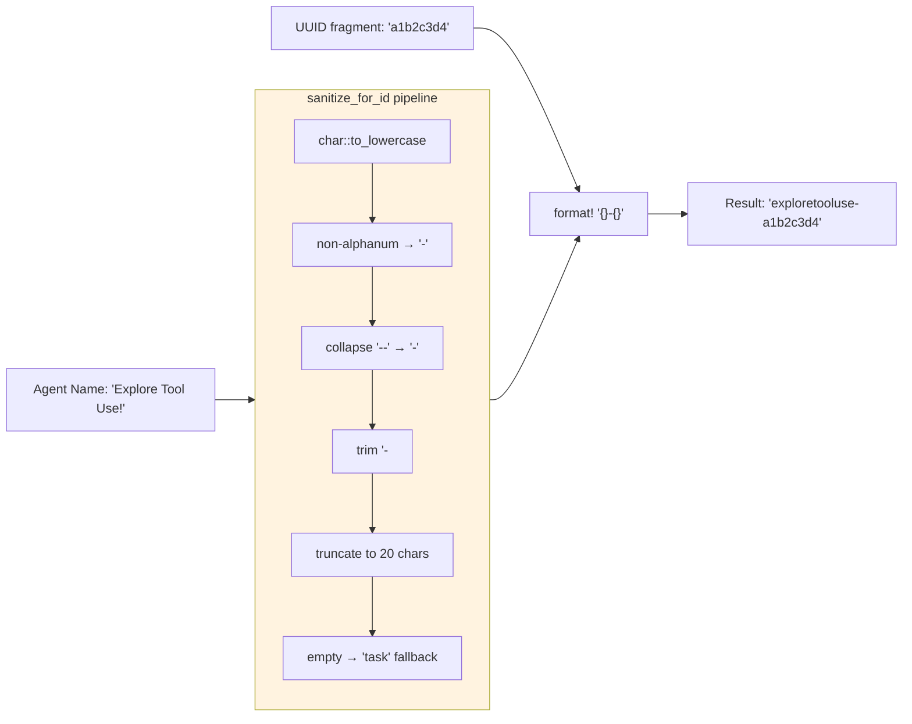

# Agent Name Sanitization

### From: mod

Agent name sanitization addresses the practical need for human-readable identifiers in system logs, task IDs, and event streams while ensuring compatibility with identifier constraints and security considerations. The sanitize_for_id function implements a transformation pipeline that converts arbitrary agent names into normalized strings suitable for use in task IDs, where they combine with UUID fragments to create identifiers like "explore-a1b2c3d4" rather than opaque UUIDs. The algorithm processes character-by-character, converting alphanumeric and underscore characters to lowercase while replacing all other characters with hyphens, then collapsing consecutive hyphens and trimming leading/trailing punctuation. This produces URL-friendly, filesystem-safe identifiers that remain recognizable to developers debugging multi-agent workflows.

The implementation demonstrates defensive programming through multiple edge case handling: consecutive special characters are collapsed to single hyphens preventing ugly sequences like "explore--tool--use", empty results fall back to the generic "task" string ensuring valid IDs even for edge inputs like pure whitespace or special characters, and length limits (20 characters) prevent excessively long IDs while preserving meaningful prefixes. The lowercase normalization ensures case-insensitive consistency, important for systems that might treat "Explore" and "explore" as distinct agents. The UUID suffix (first segment only, 8 characters) provides sufficient uniqueness for collision avoidance while keeping IDs readable, a deliberate trade-off between global uniqueness guarantees and developer experience.

This pattern appears in production systems where observability and debugging convenience matter: when reviewing logs with hundreds of spawned tasks, "explore-a1b2c3d4" and "build-9f8e7d6c" convey meaning that "a1b2c3d4-e5f6-7890-abcd-ef1234567890" obscures. The sanitization also provides mild security benefits by preventing injection attacks through agent names, though this is not its primary purpose. The comprehensive test suite validates Unicode handling (multibyte character boundaries), special character sequences, length enforcement, and fallback behavior, ensuring robustness across international agent names and unexpected inputs. The function's placement at module level rather than method reflects its utility across multiple spawning paths and potential future use in other identifier generation contexts.

## Diagram

## External Resources

- [Unicode normalization forms](https://unicode.org/reports/tr15/) - Unicode normalization forms
- [Rust Unicode normalization crate](https://docs.rs/unicode-normalization/latest/unicode_normalization/) - Rust Unicode normalization crate

## Sources

- [mod](../sources/mod.md)
