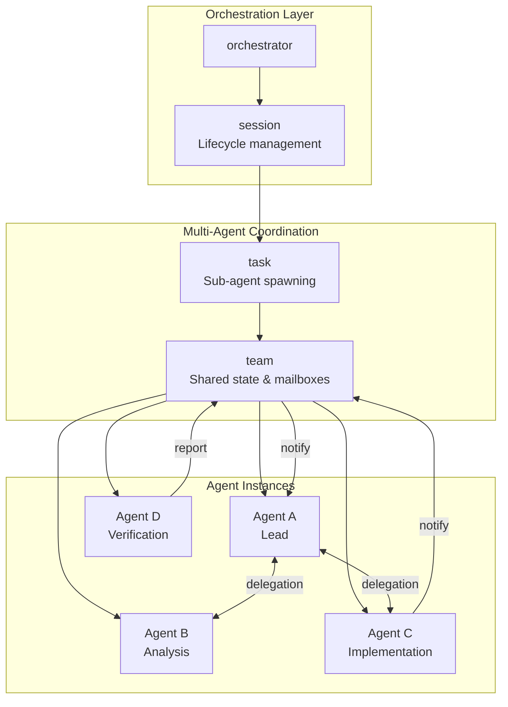

# Agent Orchestration Architecture

### From: lib

Agent orchestration refers to the systematic coordination of multiple AI agents to accomplish complex tasks through structured workflows, resource allocation, and inter-agent communication. The ragent-core library implements a sophisticated orchestration framework through its `orchestrator`, `session`, `task`, and `team` modules, enabling patterns ranging from single-agent execution to hierarchical multi-agent systems. The architecture supports sub-agent spawning for parallel task decomposition, where a parent agent can delegate specific subtasks to child agents with isolated contexts and resources. This pattern is essential for managing complexity in large-scale code operations, where different aspects of a task—such as analysis, implementation, and verification—can proceed concurrently under coordinated supervision.

The team coordination capabilities extend beyond simple task delegation to include shared state management through distributed task lists and mailbox-based messaging systems. This enables emergent collaborative behaviors where agents can negotiate work assignment, share intermediate results, and maintain collective awareness of project state. The orchestration layer handles critical concerns including agent lifecycle management (creation, monitoring, termination), resource isolation to prevent interference between agents, and fault tolerance mechanisms for handling agent failures. The design reflects patterns from distributed systems engineering applied to cognitive architectures, treating agents as computational nodes in a fault-tolerant cluster rather than isolated interactive processes.

The session-based model provides temporal scoping for agent operations, allowing clear boundaries around context windows, permission grants, and audit trails. Sessions can be persisted, resumed, or forked, supporting long-running development workflows that span multiple user interactions. The integration with resource limits (`resource` module) ensures that orchestration scales responsibly, preventing unbounded process spawning that could destabilize the host system. This comprehensive approach to orchestration positions ragent as capable of handling enterprise-scale development automation where reliability, observability, and controlled concurrency are essential requirements.

## Diagram

## External Resources

- [Microsoft Research on AutoGen multi-agent framework](https://www.microsoft.com/en-us/research/publication/autogen-enabling-next-gen-llm-applications-via-multi-agent-conversation/) - Microsoft Research on AutoGen multi-agent framework
- [Academic survey on large language model based autonomous agents](https://arxiv.org/abs/2308.08469) - Academic survey on large language model based autonomous agents

## Sources

- [lib](../sources/lib.md)
