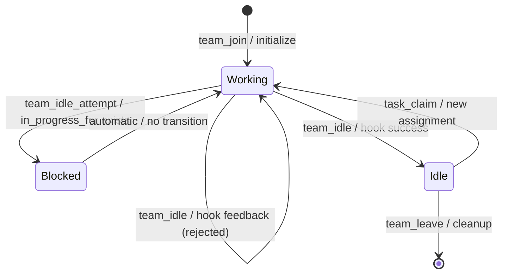

# Agent State Machines in Distributed Systems

### From: team_idle

The `TeamIdleTool` exemplifies the application of finite state machine (FSM) patterns to AI agent lifecycle management, where agents transition between discrete statuses like `Working` and `Idle` through guarded, atomic operations. State machines provide the formal foundation for reasoning about distributed system behavior: they eliminate ambiguous intermediate conditions, enable exhaustive testing of transition paths, and support verification of safety properties (e.g., 'an agent never has both an in-progress task and idle status'). In this implementation, the `MemberStatus` enum represents the state space, while the `execute` method's control flow encodes valid transitions with their preconditions and side effects.

The specific state machine pattern employed extends beyond simple FSMs to hierarchical or colored Petri nets through the introduction of contextual guards. The idle transition is not merely `Working -> Idle` but `Working -> Idle if and only if no tasks in_progress_for this agent`. This creates a dependency between the agent's membership state and the task system's state, forming a composite state machine across multiple stores. The pattern recognizes that realistic agent systems require cross-cutting concerns: an agent's availability cannot be determined in isolation but must reflect commitments made to other subsystems. The `current_task_id` field tracking within `TeamStore` further enriches this model, maintaining bidirectional associations between agents and their active commitments.

Production deployments of agent state machines must address the 'split-brain' problem where network partitions or crashes create inconsistent views. The ragent implementation uses file-based persistence with presumably atomic rename operations (common Rust pattern for safe writes) to ensure that state transitions are durable before acknowledgement. The hook mechanism adds non-determinism to the transition logic—external scripts can observe and potentially veto state changes—requiring careful handling of idempotency and exactly-once semantics. Future extensions might include timeout-based automatic transitions (agents marked idle after heartbeat expiration), escalation chains for blocked transitions, or composite states representing agent specialization modes.

## Diagram

## External Resources

- [Finite-state machine theory on Wikipedia](https://en.wikipedia.org/wiki/Finite-state_machine) - Finite-state machine theory on Wikipedia
- [Rust state machine patterns](https://doc.rust-lang.org/book/ch17-03-oo-design-patterns.html) - Rust state machine patterns
- [Distributed systems consistency patterns research](https://www.usenix.org/system/files/conference/atc14/atc14-paper-vedurada.pdf) - Distributed systems consistency patterns research

## Related

- [Hook-Based Extensibility Patterns](hook-based-extensibility-patterns.md)
- [Task-Claim Coordination Protocols](task-claim-coordination-protocols.md)

## Sources

- [team_idle](../sources/team-idle.md)
