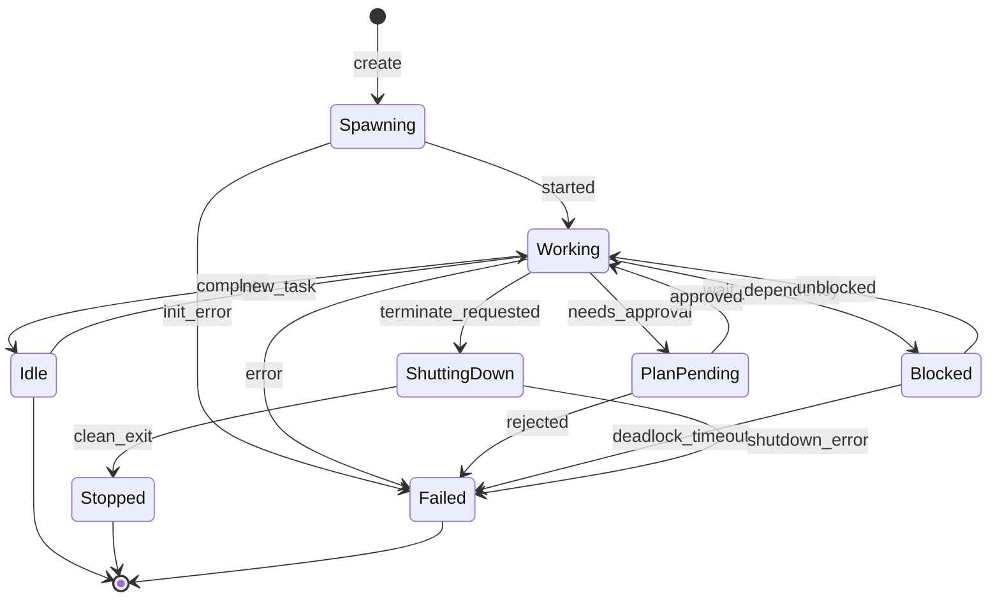

# Agent State Machines

### From: team_wait

Agent state machines provide explicit modeling of entity lifecycle and operational modes, enabling type-safe state tracking and transition validation. The MemberStatus enum in this system represents a classic state machine with eight distinct states capturing the complete journey from initialization through operational activity to terminal completion.

The state machine design reveals careful consideration of observability and coordination needs. The distinction between Spawning and Working enables detection of initialization stalls, while PlanPending supports human-in-the-loop approval workflows. Blocked captures dependency-waiting scenarios without consuming active resources. The terminal states differentiate graceful completion (Idle, Stopped) from error conditions (Failed), enabling appropriate retry and alerting policies.

TeamWaitTool's filtering logic demonstrates state machine consumption patterns: it treats Idle, Failed, and Stopped as 'completion-equivalent' for synchronization purposes, while monitoring Working, Spawning, PlanPending, and ShuttingDown as 'in-progress' states requiring wait. This coarse classification simplifies the coordination logic while preserving the fine-grained states for other purposes like monitoring and debugging. The emoji mapping in summarise_store provides immediate visual recognition of state distributions, leveraging the enum's structured nature for human-readable output generation.

## Diagram

## External Resources

- [Rust async fundamentals: State machines](https://rust-lang.github.io/async-fundamentals-initiative/background/state-machines.html) - Rust async fundamentals: State machines
- [State design pattern explained](https://refactoring.guru/design-patterns/state) - State design pattern explained
- [W3C State Chart XML specification for state machine standardization](https://www.w3.org/TR/scxml/) - W3C State Chart XML specification for state machine standardization

## Sources

- [team_wait](../sources/team-wait.md)
