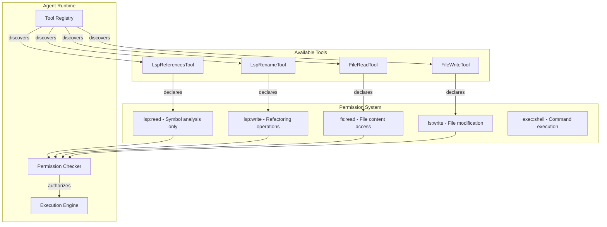

# Agent Tool Architecture and Permission Categories

### From: lsp_references

The architecture of tools in agent systems like ragent-core reflects fundamental design decisions about security, composability, and user control. LspReferencesTool's implementation of `permission_category` returning "lsp:read" demonstrates a capability-based security model where tools declare their access requirements rather than having permissions inferred from their implementation. This declarative approach enables multiple stakeholders—system administrators, workspace owners, and end users—to review and restrict tool capabilities through configuration rather than code analysis. The colon-separated namespace suggests a hierarchical permission system where "lsp" is a broad category and "read" specifies a non-mutating operation.

This permission model addresses critical security concerns in autonomous agent systems. Without such controls, a compromised or misinstructed agent could potentially exfiltrate source code, modify files destructively, or execute arbitrary commands. By requiring explicit permission grants, the system ensures that agents operate within well-defined boundaries. The "read" suffix specifically indicates that LspReferencesTool only observes code structure without modification, distinguishing it from hypothetical "lsp:write" tools that might perform automated refactoring. This distinction matters for deployment scenarios where code integrity is paramount, such as in regulated industries or when operating on production codebases.

The tool trait design enables composition and extension without modification. New tools can implement the same interface, declare their own permission categories, and integrate into existing agent workflows. The asynchronous execution model, indicated by `async_trait`, allows the agent to perform other work while waiting for potentially slow LSP operations. The separation of `name`, `description`, and `parameters_schema` enables dynamic UI generation and self-documentation, supporting both human-in-the-loop scenarios and fully autonomous operation where agents must understand their own capabilities. This architecture echoes patterns from successful plugin systems while adapting them for the unique demands of AI agent deployment.

## Diagram

## External Resources

- [Capability-based security on Wikipedia](https://en.wikipedia.org/wiki/Capability-based_security) - Capability-based security on Wikipedia
- [async_trait crate for async methods in traits](https://docs.rs/async-trait/latest/async_trait/) - async_trait crate for async methods in traits

## Sources

- [lsp_references](../sources/lsp-references.md)
