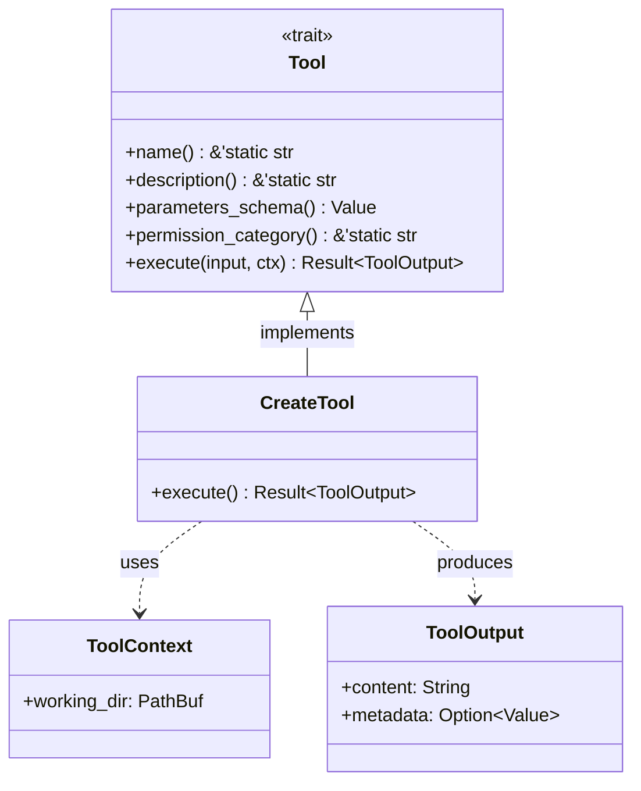

# Agent Tool Architecture

### From: create

Agent Tool Architecture refers to the design pattern where autonomous or semi-autonomous software agents interact with their environment through discrete, composable tools rather than direct system calls. The CreateTool implementation exemplifies this architecture, where the `Tool` trait provides a standardized interface enabling agents to discover, validate, and execute capabilities without hardcoded knowledge of specific operations. This abstraction layer is fundamental to building flexible agent systems that can be extended with new capabilities without modifying core agent logic.

The architecture typically involves several key components: tool definitions with JSON Schema parameter specifications, permission categorization for security enforcement, and structured output formats for result consumption. CreateTool demonstrates all three: `parameters_schema` returns JSON Schema describing required "path" and "content" strings, `permission_category` returns "file:write" for access control systems, and `execute` returns `ToolOutput` with both display content and machine-readable metadata. This standardization enables sophisticated agent behaviors like automatic tool selection based on task requirements, permission-aware execution planning, and result aggregation across multiple tool invocations.

In production systems, this architecture supports critical features like audit logging (every tool execution is traceable), capability sandboxing (agents can be restricted to specific tool categories), and error recovery (failed tool executions can be retried or alternatives selected). The async nature of the Tool trait acknowledges that real-world tools often involve I/O operations that should not block agent reasoning threads. This pattern has gained prominence with the rise of Large Language Model (LLM) based agents, where the tool abstraction provides a clean boundary between language model reasoning and external world interaction, though the pattern predates LLMs in robotic and software automation contexts.

## Diagram

## External Resources

- [JSON Schema specification for parameter validation](https://json-schema.org/) - JSON Schema specification for parameter validation
- [Toolformer: Language Models Can Teach Themselves to Use Tools](https://arxiv.org/abs/2302.04761) - Toolformer: Language Models Can Teach Themselves to Use Tools

## Sources

- [create](../sources/create.md)

### From: github_issues

Agent Tool Architecture represents a software design pattern where autonomous or semi-autonomous systems expose capabilities through discrete, composable units called tools, each implementing a standardized interface for discovery and invocation. This architecture enables dynamic capability extension, where agents can learn about available tools at runtime and compose them to accomplish complex tasks. The pattern shown in this codebase defines tools as Rust structs implementing a Tool trait with five core methods: name() for unique identification, description() for LLM-friendly explanations, parameters_schema() for JSON Schema validation, permission_category() for access control, and execute() for actual operation. This design draws from broader concepts in function calling for large language models, robotic process automation, and service-oriented architectures.

The architectural benefits of this pattern are substantial for AI agent systems. Standardization allows a central agent loop to discover tools without compile-time knowledge of specific implementations, enabling plugin architectures where new capabilities can be added without modifying core agent code. The JSON Schema parameters enable automatic validation of inputs, generation of user interfaces, and structured prompting for LLMs to produce correctly-formatted arguments. Permission categorization supports multi-tenant environments where different agents or users have varying access levels, with "github:read" and "github:write" categories preventing unauthorized mutations. The ToolOutput structure with content and metadata fields supports both human-readable presentation and machine-processable structured data for downstream automation.

Implementation considerations for agent tool architectures include async execution support for I/O-bound operations, error handling strategies that provide actionable feedback to both users and calling LLMs, and metadata propagation for tracing and audit logging. The async_trait usage in this code enables non-blocking HTTP requests while maintaining clean trait interfaces. Error contexts from anyhow help LLMs understand failures and potentially suggest recovery actions. Metadata fields in ToolOutput could support operation tracking, cost attribution, or result caching. This architecture pattern is foundational to modern AI agent frameworks including LangChain, AutoGPT, and OpenAI's Function Calling API, representing a convergence of traditional software engineering with emerging AI system design paradigms.
