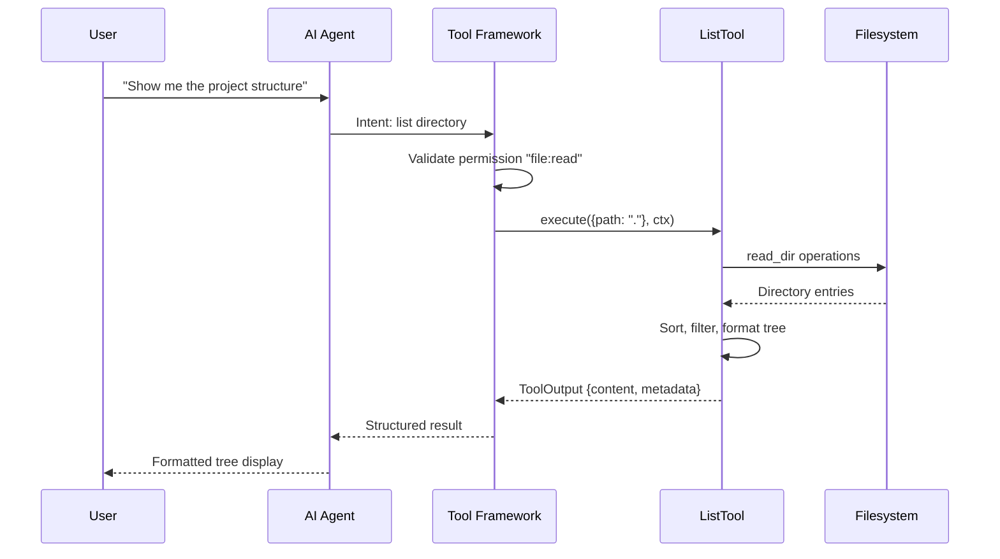

# Agent Tool Framework Architecture

### From: list

Agent tool frameworks represent an emerging architectural pattern in artificial intelligence systems, structured around the principle that language models and other AI components should interact with external capabilities through well-defined, composable interfaces rather than monolithic integration. This pattern has gained prominence with the rise of large language models (LLMs) that can generate structured outputs—including tool invocations—based on natural language understanding of user goals. The core abstraction is the `Tool` trait visible in `list.rs`, which establishes a contract consisting of identity (name), capability description, input schema, permission classification, and execution behavior. This contract enables dynamic discovery, runtime validation, and security-gated invocation of capabilities, creating an extensible system where new tools can be added without modifying core agent logic.

The architectural separation of concerns in such frameworks mirrors classical plugin systems while addressing AI-specific requirements. The schema definition via JSON Schema (implemented through `serde_json::Value` in `list.rs`) serves dual purposes: constraining LLM-generated invocations to valid parameter sets, and enabling automatic UI generation for human oversight. The permission category system (`"file:read"` in this implementation) implements mandatory access control that prevents capability escalation—even if an LLM erroneously decides to invoke a tool, the framework can enforce that the user has granted only read permissions, not write or execute. This addresses a critical safety concern in autonomous agent systems where AI components may have instrumental incentives to seek additional capabilities.

Execution context management in tool frameworks requires careful state isolation and resource accounting. The `ToolContext` struct passed to `execute` in `list.rs` encapsulates working directory and likely other environmental parameters, ensuring that tool implementations remain pure functions of their inputs and context rather than depending on global state. This design supports reproducibility, testing, and sandboxing—essential properties when tools may be invoked by autonomous systems or untrusted code. The async execution model enables concurrent tool invocations while respecting I/O bottlenecks, with the `ToolOutput` result type providing structured return values that can be consumed by the agent's observation loop or presented to users.

The evolution of agent tool frameworks reflects broader trends in software architecture toward composition over inheritance, declarative interfaces, and defensive programming. The `list.rs` implementation demonstrates production-grade concerns: error propagation with context, input validation, resource limits (depth control), and output formatting for dual human-machine consumption. These patterns derive from experience with production agent systems where edge cases—permission denied errors, circular symlinks, enormous directories—must be handled gracefully rather than crashing the agent loop. The framework's design enables incremental complexity: simple tools like `ListTool` can be implemented in single files, while complex capabilities can compose multiple tools or invoke external services through the same interface. This scalability supports both rapid prototyping and enterprise deployment scenarios.

## Diagram

## External Resources

- [OpenAI documentation on function calling and tool use in LLMs](https://platform.openai.com/docs/guides/function-calling) - OpenAI documentation on function calling and tool use in LLMs
- [Anthropic research on building effective AI agents with tool use](https://www.anthropic.com/research/building-effective-agents) - Anthropic research on building effective AI agents with tool use
- [Research paper on tool learning with foundation models](https://arxiv.org/abs/2302.07842) - Research paper on tool learning with foundation models

## Sources

- [list](../sources/list.md)
