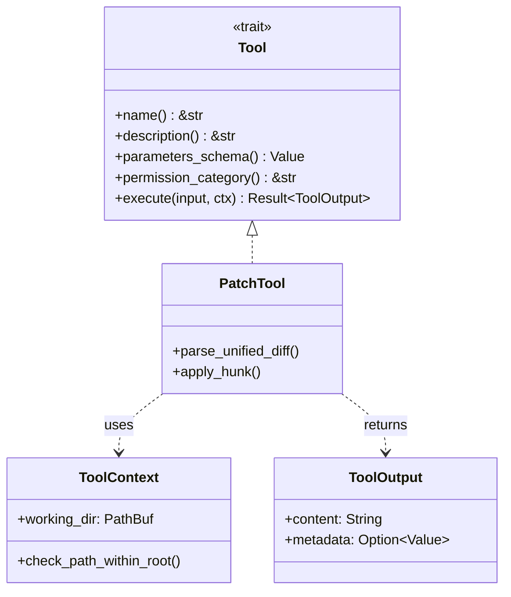

# Agent Tool Framework Integration

### From: patch

Agent tool framework integration refers to the architectural patterns that enable autonomous software agents to safely and flexibly invoke capabilities like file modification through a structured, discoverable, and permission-controlled interface. The PatchTool exemplifies this integration by implementing the Tool trait, which establishes a contract between the agent runtime and the tool implementation: standardized methods for name identification, description for LLM context window inclusion, JSON Schema parameter validation, permission category classification, and async execution with structured output. This abstraction enables dynamic tool discovery where agents can enumerate available capabilities and their requirements without hardcoded dependencies on specific tool implementations.

The JSON Schema returned by parameters_schema serves dual purposes: it validates incoming requests against structural constraints (preventing runtime errors from malformed parameters), and it provides machine-readable documentation that can be included in prompts to large language models, enabling zero-shot tool usage without explicit training on each tool's interface. The schema for PatchTool specifies required and optional fields with semantic descriptions, allowing agents to understand that path can override the default target while fuzz controls matching tolerance. This self-describing capability is essential for agentic systems that must compose tools dynamically to solve novel problems, as the LLM can reason about tool selection and parameter construction based on schema information rather than hardcoded invocation patterns.

Permission categories implement defense in depth for autonomous systems, ensuring that tool invocation requires explicit authorization checks even if the agent has been compromised or misdirected through prompt injection. The "file:write" category groups PatchTool with other filesystem-modifying operations, allowing policy engines to grant or deny access based on context, user identity, or risk assessment. ToolOutput's structured return type (content string plus optional metadata JSON) supports both human-readable summaries for logging and display, and machine-parseable data for downstream workflow automation. The metadata field in PatchTool's implementation captures files modified, hunks applied, and lines changed—metrics that enable agents to assess operation success, detect unexpected scope creep, and make decisions about subsequent actions based on the magnitude of changes effected.

## Diagram

## External Resources

- [OpenAI function calling documentation on structured tool interfaces](https://platform.openai.com/docs/guides/function-calling) - OpenAI function calling documentation on structured tool interfaces
- [JSON Schema specification for parameter validation](https://json-schema.org/) - JSON Schema specification for parameter validation

## Sources

- [patch](../sources/patch.md)
