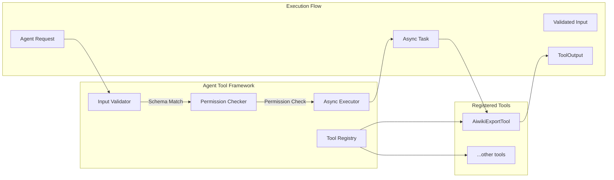

# Agent Tool Framework

### From: aiwiki_export

An agent tool framework is a software architecture pattern that enables intelligent systems to discover and invoke capabilities through standardized interfaces. This concept represents a evolution from monolithic AI systems toward composable, extensible architectures where functionality is packaged as discrete, self-describing units. The framework pattern emerged from the need to safely extend AI agent capabilities without modifying core system code, enabling third-party development and domain-specific customization while maintaining security boundaries and predictable behavior.

The ragent-core implementation demonstrates several key principles of robust tool frameworks. Interface contracts, expressed through Rust traits, define the minimum requirements for tool implementations while allowing arbitrary complexity in specific tools. Self-description through schema definitions enables automatic UI generation, input validation, and documentation—AiwikiExportTool's `parameters_schema()` method returns a JSON Schema that client applications can use to build appropriate input forms. Permission categorization provides coarse-grained access control that aligns with organizational security policies, while the async execution model supports long-running operations without blocking agent responsiveness.

Tool frameworks must balance flexibility with consistency to be effective. The AiwikiExportTool illustrates this balance: it has full freedom in its implementation details and export logic, but must conform to standard patterns for naming, error handling, and output formatting. This consistency enables the broader system to present a unified interface to users regardless of which specific tool is executing. The framework also handles cross-cutting concerns like logging, metrics, and cancellation that individual tools shouldn't need to implement, allowing developers to focus on domain logic. As AI systems become more integrated into workflows, such frameworks are increasingly important for managing complexity and ensuring reliable operation.

## Diagram

## External Resources

- [LangChain Tools - Similar concept in Python ecosystem](https://langchain.com/docs/modules/agents/tools/) - LangChain Tools - Similar concept in Python ecosystem
- [OpenAPI Specification - Industry standard for API description](https://spec.openapis.org/oas/latest.html) - OpenAPI Specification - Industry standard for API description
- [Tokio - Rust async runtime used by many agent frameworks](https://tokio.rs/) - Tokio - Rust async runtime used by many agent frameworks

## Sources

- [aiwiki_export](../sources/aiwiki-export.md)
