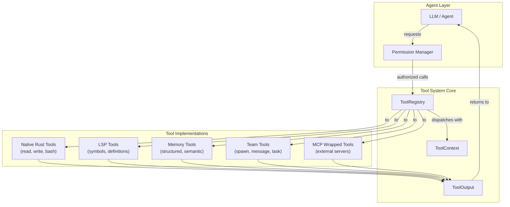

# Agent Tool System Architecture

### From: mod

An agent tool system architecture defines how AI agents interact with external capabilities through structured interfaces, representing a fundamental pattern in modern AI engineering. In the ragent-core implementation, this architecture separates tool definition from execution, uses JSON Schema for parameter validation and LLM integration, and establishes security boundaries through permission categories and path containment. This design enables agents to safely perform actions ranging from file system operations to complex multi-agent coordination.

The architecture follows a layered approach: at the base, individual tools implement domain-specific logic (file editing, shell execution, web requests); the ToolRegistry provides discovery and dispatch; ToolContext carries execution dependencies; and higher-level systems manage permission grants and result processing. This layering allows independent evolution of tool implementations without affecting the core framework. The extensive tool catalog (70+ tools) demonstrates scalability of this approach, covering file operations, code intelligence via LSP, document processing, memory systems, task management, and team coordination.

Critical architectural decisions include: using async/await for I/O-bound operations; Arc and RwLock for thread-safe shared state; Option types for optional capabilities; and trait objects for dynamic dispatch to heterogeneous tool implementations. The security model combines static permission categories (declared per-tool) with dynamic path validation, preventing both unauthorized capability use and directory traversal attacks. This architecture supports both local tool execution and remote MCP server integration through a unified interface.

## Diagram

## External Resources

- [Anthropic research on building effective AI agents](https://www.anthropic.com/research/building-effective-agents) - Anthropic research on building effective AI agents
- [OpenAI function calling API documentation](https://platform.openai.com/docs/guides/function-calling) - OpenAI function calling API documentation
- [LangChain tool concepts and architecture patterns](https://python.langchain.com/docs/concepts/tools/) - LangChain tool concepts and architecture patterns

## Sources

- [mod](../sources/mod.md)
