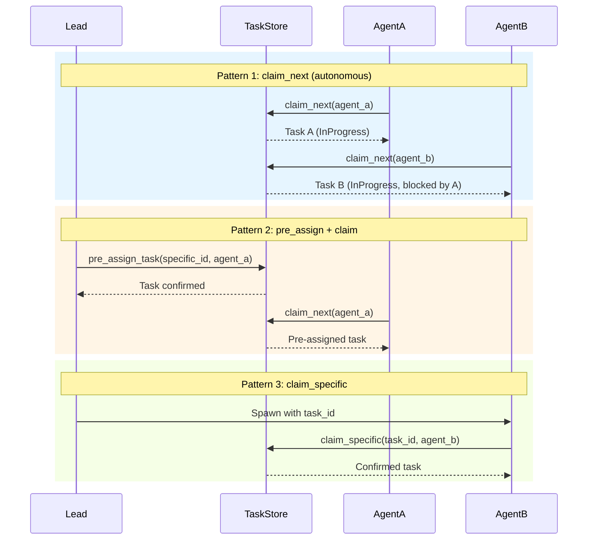

# Agent Work Assignment Patterns

### From: task

The ragent task system implements multiple work assignment patterns that accommodate different coordination styles between team leads and autonomous agents, embodied in the distinct methods `claim_next()`, `claim_specific()`, and `pre_assign_task()`. These patterns reflect real-world team management approaches: pull-based queue consumption, directed assignment, and pre-allocated work reservation. The flexibility allows ragent deployments to match their organizational structure, from fully autonomous agent swarms to tightly controlled workflows with human oversight.

The `claim_next()` pattern implements a work queue where agents request the next available unblocked task. This pull-based model suits autonomous agents that can select work based on current availability, with automatic dependency resolution ensuring tasks are attempted in valid order. The implementation includes a guard preventing multiple claims—agents can only hold one in-progress task at a time, enforced by checking for existing assignments before granting new claims. This prevents work hoarding and encourages completion before new work acquisition.

`claim_specific()` enables directed assignment where a lead or external system identifies exactly which task an agent should perform. This supports use cases like specialized agent capabilities (only certain agents can handle security reviews) or incident response (critical task to specific expert). The implementation validates that the task is claimable and not assigned to others, with rich error messages when preconditions fail. `pre_assign_task()` extends this to workflow initialization—leads can reserve tasks before spawning agents, ensuring that when an agent starts and calls `claim_next()`, it receives its intended assignment rather than competing for pool tasks. Together these patterns create a coordination language for multi-agent systems that balances autonomy with direction.

## Diagram

## External Resources

- [Enterprise Integration Patterns: Competing Consumers pattern (claim_next)](https://www.enterpriseintegrationpatterns.com/patterns/messaging/CompetingConsumers.html) - Enterprise Integration Patterns: Competing Consumers pattern (claim_next)
- [Point-to-Point Channel pattern (claim_specific/pre_assign)](https://www.enterpriseintegrationpatterns.com/patterns/messaging/PointToPointChannel.html) - Point-to-Point Channel pattern (claim_specific/pre_assign)

## Related

- [Multi-Agent Coordination](multi-agent-coordination.md)

## Sources

- [task](../sources/task.md)
