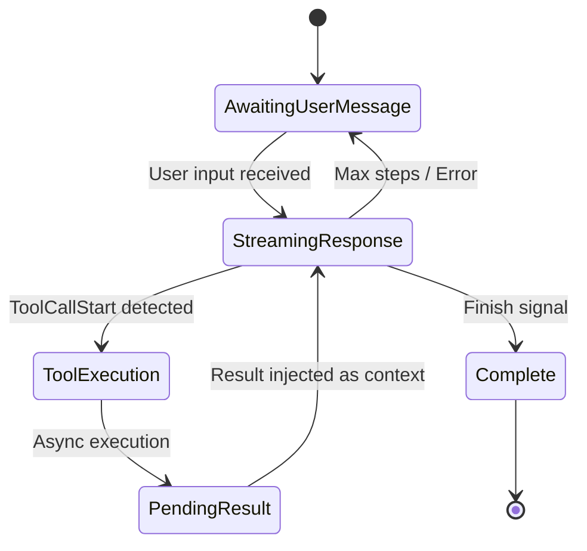

# Agentic Conversation Loop

### From: processor

The agentic conversation loop represents a fundamental paradigm in modern AI systems where language models engage in iterative reasoning and action rather than single-turn response generation. This pattern, implemented by `SessionProcessor`, structures interactions as cycles of observation, reasoning, tool invocation, and result integration until task completion criteria are met. The loop transforms static chat interfaces into autonomous agents capable of multi-step problem solving.

The implementation reveals several critical loop components: message persistence for state continuity, streaming LLM integration for real-time responsiveness, tool registry management for capability extension, and event broadcasting for UI synchronization. The processor manages loop termination through multiple mechanisms including explicit completion signals from the model (`FinishReason`), step counting against `max_steps` configuration, and cancellation flags for user-initiated interruption. This multi-criteria approach ensures robustness against various failure modes including model hallucinations, infinite loops, and resource exhaustion.

The loop's sophistication extends to handling partial states through streaming deltas (`TextDelta`, `ReasoningDelta`, `ToolCallDelta`), enabling progressive UI updates rather than blocking until complete responses. Tool execution introduces asynchronous complexity requiring coordination between streaming consumption and blocking tool invocations, addressed through the `PendingToolCall` state tracking. The result re-injection pattern—where tool outputs become subsequent context—implements the core recursive mechanism that enables compound task decomposition, where each tool result may trigger additional reasoning and tool chains.

## Diagram

## External Resources

- [ReAct: Synergizing Reasoning and Acting in Language Models (Yao et al.)](https://arxiv.org/abs/2210.03629) - ReAct: Synergizing Reasoning and Acting in Language Models (Yao et al.)
- [Anthropic's research on building effective agents](https://www.anthropic.com/research/building-effective-agents) - Anthropic's research on building effective agents

## Sources

- [processor](../sources/processor.md)
