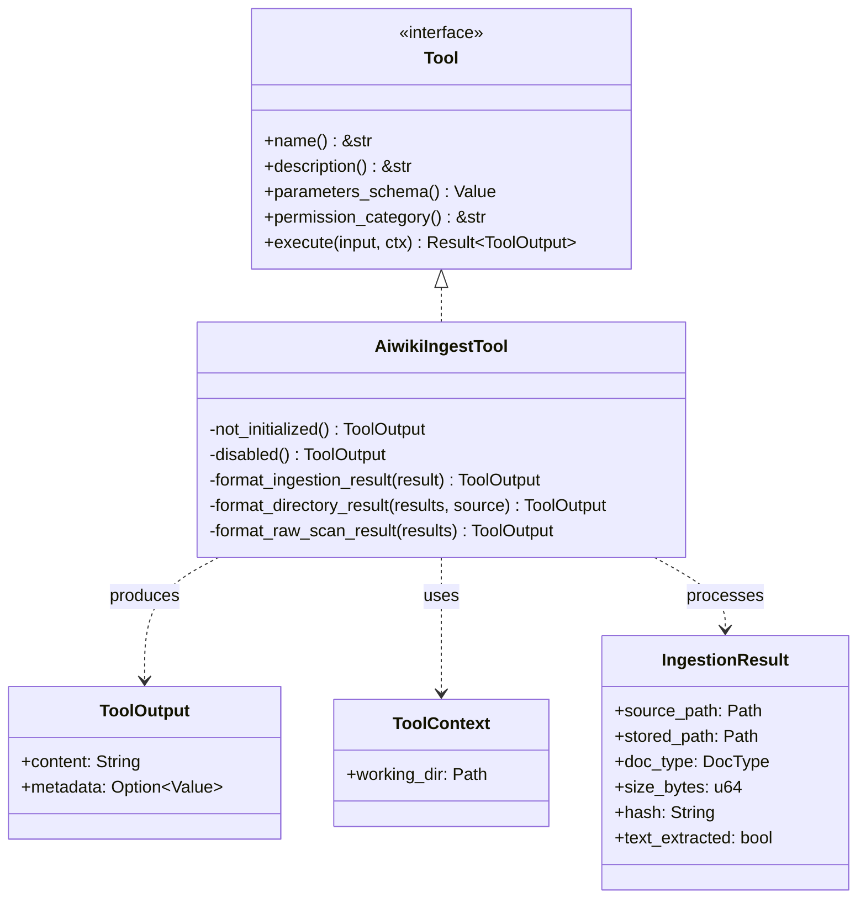

# AI Agent Tool Architecture

### From: aiwiki_ingest

The AI agent tool architecture represents a design pattern for extending the capabilities of language model-based agents through structured, discoverable, and permission-controlled interfaces. This architecture treats tools as first-class abstractions with well-defined schemas, descriptive metadata, and categorized permissions that enable both autonomous agent selection and human oversight. The `Tool` trait implemented by `AiwikiIngestTool` exemplifies this pattern, requiring implementations to provide a name, human-readable description, JSON Schema parameter specification, permission category, and execution logic.

Central to this architecture is the use of JSON Schema for parameter validation and interface documentation. By declaring expected parameters with types, descriptions, and default values, tools become self-documenting and enable automatic generation of user interfaces, API documentation, and agent prompt engineering. The schema-driven approach allows agents to understand tool capabilities without hardcoded logic, facilitating dynamic tool discovery and composition. The `parameters_schema` method returns a complete JSON Schema object that describes the `path`, `move_file`, and `subdirectory` parameters with their constraints and semantics.

Permission categories like `aiwiki:write` implement fine-grained access control that aligns with security best practices for agent systems. Rather than granting blanket execution rights, this model allows administrators to scope tool availability based on operational contexts and risk profiles. The architecture also emphasizes structured output through the `ToolOutput` type, which separates human-readable content from machine-processable metadata. This dual-output design supports both direct user interaction and downstream automation, with metadata fields enabling error classification, result aggregation, and integration with monitoring systems. The async execution model accommodates I/O-bound operations without blocking agent event loops.

## Diagram

## External Resources

- [JSON Schema specification for structured data validation](https://json-schema.org/) - JSON Schema specification for structured data validation
- [OpenAI function calling documentation for agent tools](https://platform.openai.com/docs/guides/function-calling) - OpenAI function calling documentation for agent tools
- [Capability-based security model for access control](https://en.wikipedia.org/wiki/Capability-based_security) - Capability-based security model for access control

## Sources

- [aiwiki_ingest](../sources/aiwiki-ingest.md)
