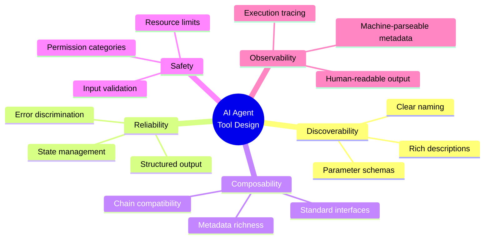

# AI Agent Tool Design Patterns

### From: lsp_diagnostics

AI agent tool design patterns encompass the architectural principles and implementation strategies demonstrated by LspDiagnosticsTool for creating capabilities that AI systems can discover, understand, and invoke effectively. The tool exemplifies the structured tool use pattern that has emerged as a best practice in large language model applications, where explicit tool definitions replace implicit capabilities embedded in prompts. This approach provides deterministic interfaces that agents can invoke with structured parameters, receiving guaranteed output formats that can be parsed and reasoned about programmatically. The design moves beyond simple text generation to enable composable, verifiable tool chains.

The specific patterns visible in LspDiagnosticsTool include clear naming conventions (`lsp_diagnostics`), comprehensive description strings that explain both functionality and prerequisites, JSON Schema parameter specifications that constrain valid inputs, permission categorization for access control, and structured output with both human-readable content and machine-parseable metadata. These elements together create a discoverable, verifiable interface. The description's explicit note about requiring prior LSP server activation through other tools (`lsp_symbols` or `lsp_hover`) demonstrates awareness of stateful dependencies that agents must manage, a common challenge in multi-tool workflows.

Error handling patterns in agent tools require particular attention, as agents must distinguish between temporary failures (retryable), permanent errors (requiring alternative approaches), and success with empty results. LspDiagnosticsTool implements nuanced error reporting: missing LSP managers produce explicit contextual errors with remediation guidance, path resolution failures propagate with detailed context, and empty diagnostic sets return successful results with explanatory content rather than errors. This discrimination enables agents to implement appropriate recovery strategies rather than treating all non-success outcomes identically.

The metadata-rich output design—where `ToolOutput` contains both display content and a JSON metadata field with structured diagnostic data—supports flexible consumption patterns. Human operators reviewing agent actions see formatted, readable output, while the agent itself or downstream automation can process the structured metadata for decision-making. This dual-mode output is essential for debugging agent behavior and for building higher-level capabilities that aggregate diagnostic information across multiple files or analysis passes. The pattern of including counts and collection data in metadata (`total` and `diagnostics` fields) enables progress tracking and result validation that would be impossible with text-only output.

## Diagram

## External Resources

- [OpenAI function calling and tool use documentation](https://platform.openai.com/docs/guides/function-calling) - OpenAI function calling and tool use documentation
- [Anthropic research on building effective AI agents](https://www.anthropic.com/research/building-effective-agents) - Anthropic research on building effective AI agents
- [LangGraph framework for agent workflow composition](https://langchain-ai.github.io/langgraph/) - LangGraph framework for agent workflow composition

## Related

- [JSON Schema Parameter Validation](json-schema-parameter-validation.md)

## Sources

- [lsp_diagnostics](../sources/lsp-diagnostics.md)
