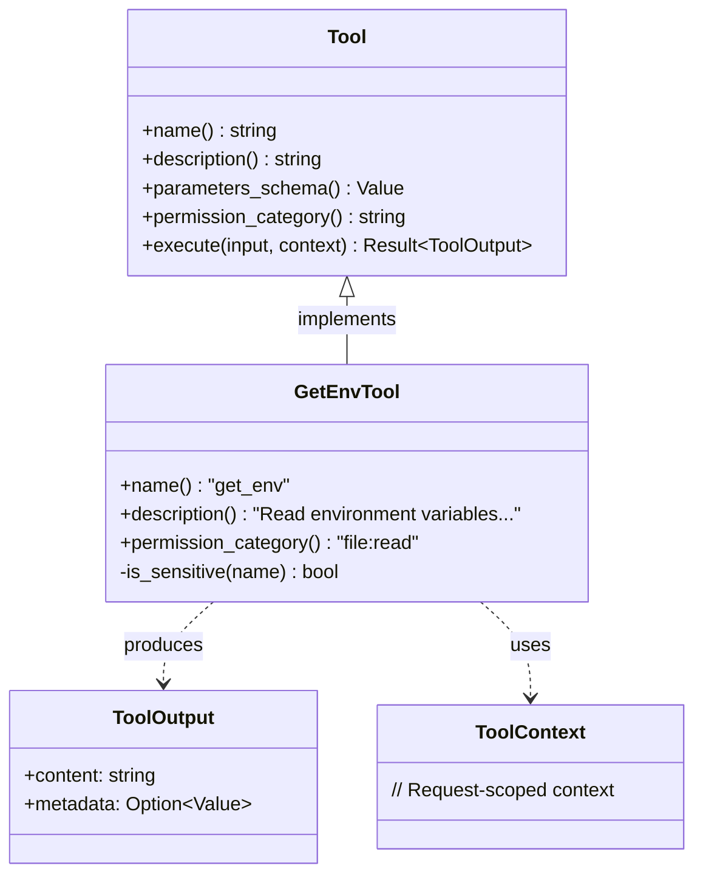

# AI Agent Tool Frameworks

### From: get_env

AI agent tool frameworks are software architectures that enable large language models and other AI systems to interact with external systems through structured, programmable interfaces. These frameworks emerged from the realization that language models, despite their reasoning capabilities, needed grounded access to real-world data and action capabilities to solve practical problems. The paradigm was popularized by OpenAI's Function Calling feature (2023) and the broader ReAct (Reasoning and Acting) research pattern, which demonstrated that providing models with tool descriptions in JSON Schema format enables autonomous tool selection and parameter generation.

The architectural pattern seen in GetEnvTool—where tools implement a common trait with metadata methods (`name`, `description`, `parameters_schema`) and an execution method—has become standard across frameworks including LangChain, Microsoft's Semantic Kernel, and various open-source agent projects. This uniformity enables composability: tools can be developed independently and combined into agent systems with different capabilities. The `ToolContext` parameter (unused in GetEnvTool but present in the trait) typically carries request-scoped information like authentication state, tracing identifiers, and cancellation tokens, supporting production deployment concerns.

Security and permission management in tool frameworks presents unique challenges distinct from traditional API design. Where APIs typically authenticate once and authorize based on identity, AI agents may make hundreds of tool calls within a single conversation, with the model dynamically deciding which tools to invoke based on user prompts. This creates a tension between capability (giving agents broad tool access enables more powerful automation) and safety (broad access increases risk of unintended actions or prompt injection attacks). GetEnvTool's `permission_category` method reflects an emerging pattern of coarse-grained capability grouping, allowing operators to grant or deny tool categories rather than individual tools.

The async execution model in GetEnvTool addresses the concurrency requirements of modern agent systems, where multiple tool calls may be dispatched in parallel to minimize latency. Rust's async/await syntax, combined with structured concurrency patterns, prevents resource exhaustion and ensures cancellation propagates correctly. The `ToolOutput` return type's separation of `content` (human-readable display) from `metadata` (machine-readable structured data) supports dual-audience design where agents consume structured data for reasoning while presenting human-readable summaries to end users. This pattern anticipates multi-modal agent systems where outputs may be rendered as text, voice, or visualizations depending on context.

## Diagram

## External Resources

- [OpenAI Function Calling documentation](https://platform.openai.com/docs/guides/function-calling) - OpenAI Function Calling documentation
- [Microsoft Semantic Kernel AI development framework](https://www.semantic-kernel.ai/) - Microsoft Semantic Kernel AI development framework
- [ReAct: Synergizing Reasoning and Acting in Language Models research paper](https://arxiv.org/abs/2210.03629) - ReAct: Synergizing Reasoning and Acting in Language Models research paper

## Sources

- [get_env](../sources/get-env.md)
