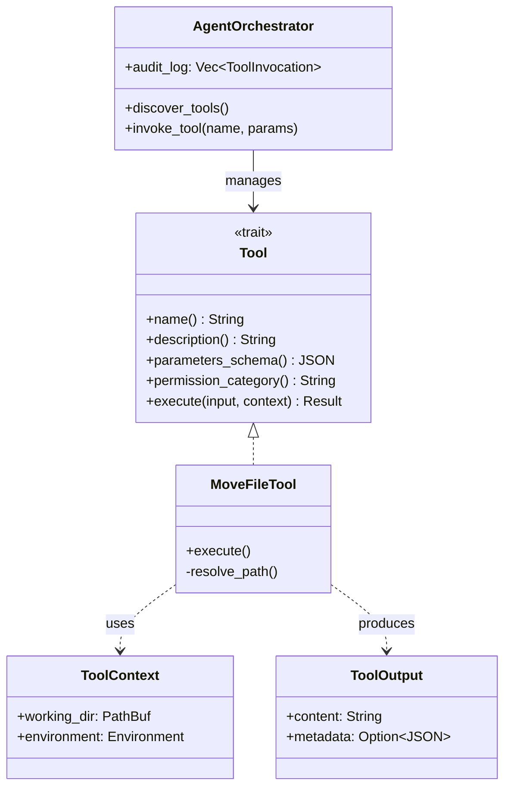

# AI Agent Tool Interfaces

### From: move_file

AI agent tool interfaces represent an emerging software architecture pattern where autonomous systems interact with computing resources through structured, discoverable APIs rather than direct code execution or shell commands. MoveFileTool exemplifies this pattern through its implementation of the Tool trait, providing standardized methods for name identification, capability description, parameter schema validation, permission classification, and execution. This abstraction layer enables agents to reason about available capabilities, compose operations into complex workflows, and maintain audit trails of all external actions—a critical requirement for safe autonomous operation.

The design of these interfaces draws from multiple disciplines: REST API patterns for resource-oriented operations, function calling schemas from language model frameworks, and capability-based security from operating system research. The JSON Schema-based parameter definition in MoveFileTool enables runtime validation and automatic generation of tool descriptions for language model consumption, allowing agents to understand that source and destination parameters are required strings representing filesystem paths. This self-documenting structure reduces integration friction and supports dynamic tool discovery where agents adapt to available capabilities in their execution environment.

The operational implications of agent tool interfaces extend to observability, reliability, and governance. Each tool invocation produces structured output with metadata suitable for logging and analysis, supporting incident investigation and compliance requirements that would be difficult with ad-hoc script execution. The permission_category system enables fine-grained access policies that can be enforced by middleware or human approval workflows, addressing concerns about autonomous systems making irreversible changes. As AI agents assume greater responsibility in software development, data analysis, and system administration, these interface patterns provide the foundation for trustworthy human-agent collaboration through clear contracts, bounded capabilities, and comprehensive activity records.

## Diagram

## External Resources

- [OpenAI function calling API patterns](https://platform.openai.com/docs/guides/function-calling) - OpenAI function calling API patterns
- [Anthropic research on effective agent architectures](https://www.anthropic.com/research/building-effective-agents) - Anthropic research on effective agent architectures
- [JSON Schema specification for structured validation](https://json-schema.org/) - JSON Schema specification for structured validation

## Sources

- [move_file](../sources/move-file.md)
