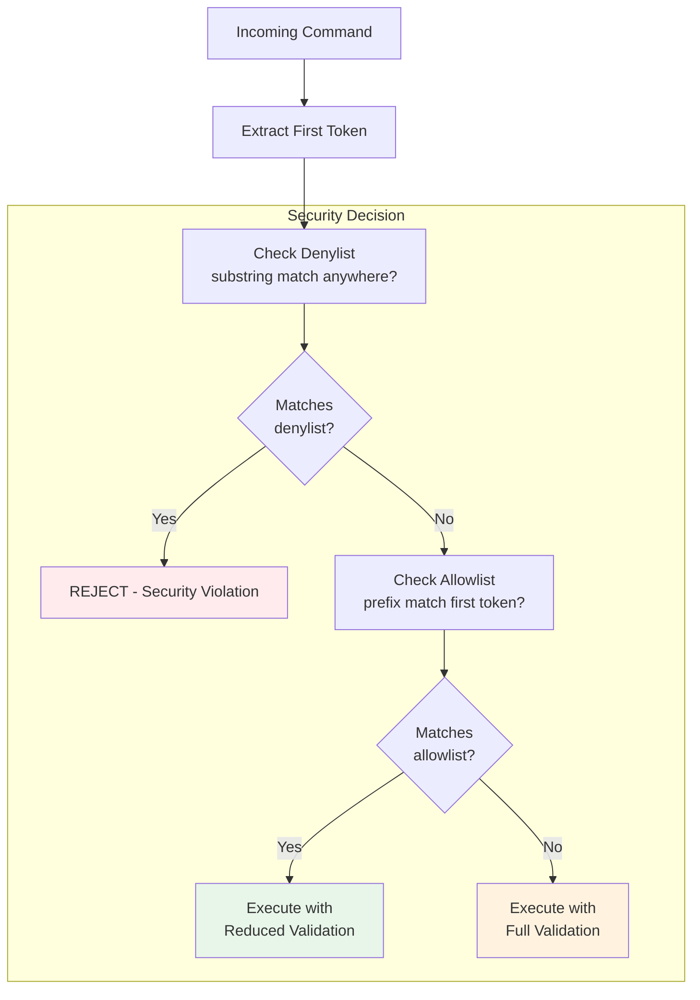

# Allowlist/Denylist Pattern

### From: bash_lists

The allowlist/denylist pattern (also known as whitelist/blacklist) is a fundamental security design where two complementary lists define permitted and prohibited entities. In ragent's bash_lists implementation, this pattern is specialized for command-line security: the allowlist contains command prefixes that exempt matched commands from additional validation, while the denylist contains substring patterns that unconditionally reject any command containing them. This dual-list design creates a four-way decision matrix: commands matching both lists (typically denylist wins), only allowlist (executed with reduced validation), only denylist (rejected), or neither (subject to default validation). The semantic distinction—prefix matching for allowlist versus substring matching for denylist—enables precise yet flexible policy expression.

The pattern's implementation in this module reveals important security engineering tradeoffs. Exact string comparison for allowlist entries on the first token provides predictable, fast matching appropriate for command validation hot paths. Substring matching for denylists, while more computationally expensive (O(n*m) in worst case), catches dangerous patterns regardless of command structure, essential for security-critical blocking. The precedence rules—denylist checked before or with higher priority than allowlist—follow the security principle that explicit prohibitions should override explicit permissions. This pattern appears throughout computing, from email spam filtering to API rate limiting, but requires careful UX design to avoid confusion: users must understand that allowlist entries bypass other checks, making them powerful but potentially dangerous if misused.

## Diagram

## External Resources

- [OWASP Input Validation Cheat Sheet - whitelist vs blacklist guidance](https://cheatsheetseries.owasp.org/cheatsheets/Input_Validation_Cheat_Sheet.html) - OWASP Input Validation Cheat Sheet - whitelist vs blacklist guidance
- [NIST Computer Security Resource Center - blacklist/whitelist terminology](https://csrc.nist.gov/glossary/term/blacklist) - NIST Computer Security Resource Center - blacklist/whitelist terminology

## Related

- [Runtime Security Policy Management](runtime-security-policy-management.md)
- [Command Injection Prevention](command-injection-prevention.md)

## Sources

- [bash_lists](../sources/bash-lists.md)
