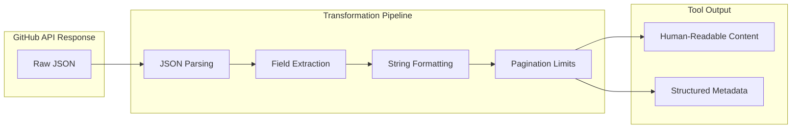

# API Response Transformation and Formatting

### From: github_issues

API response transformation and formatting encompasses the sophisticated data processing pipelines that convert raw GitHub API JSON into human-readable, contextually appropriate output formats for agent consumption. This codebase demonstrates multiple transformation patterns: GithubListIssuesTool flattens paginated issue arrays into formatted text lines with smart pluralization, GithubGetIssueTool constructs rich Markdown documents with hierarchical headers and metadata tables, and creation tools generate concise confirmation messages with actionable URLs. These transformations bridge the gap between machine-oriented API structures and human cognitive models, making API data accessible to both end users and language models that consume tool output. The implementations show careful attention to edge cases like missing fields, empty collections, and length-limited displays.

The transformation strategies employ Rust's iterator ecosystem extensively, using filter_map for optional field extraction, collect for vector construction, and format! macros for string templating. The GithubGetIssueTool implementation is particularly elaborate, making sequential API calls to fetch both issue details and comments, then composing a structured Markdown document with conditional sections for labels, assignees, and comment threads. The decision to limit displayed comments to 10 with explicit indication of truncation demonstrates user experience consideration for readability. Metadata preservation in ToolOutput's optional metadata field enables downstream processing—like result caching, link extraction, or analytics—without cluttering the primary human-readable content.

These formatting patterns reflect broader principles in tool design and developer experience. Consistent output formats help users build mental models of tool behaviors, while structured metadata preserves machine-actionable information. The Markdown generation aligns with modern documentation practices and renders well in chat interfaces, web dashboards, and IDE integrations. Future enhancements might include output format options (JSON for scripting, compact for mobile, rich HTML for web), localization support for international teams, or semantic formatting that helps LLMs parse tool outputs for multi-step reasoning. The careful null handling with unwrap_or defaults prevents panic crashes while maintaining informative placeholder text, ensuring robustness across the diverse data quality encountered in real-world API responses.

## Diagram

## External Resources

- [GitHub Issues API endpoint documentation](https://docs.github.com/en/rest/issues/issues) - GitHub Issues API endpoint documentation
- [CommonMark Markdown specification](https://commonmark.org/) - CommonMark Markdown specification

## Sources

- [github_issues](../sources/github-issues.md)
