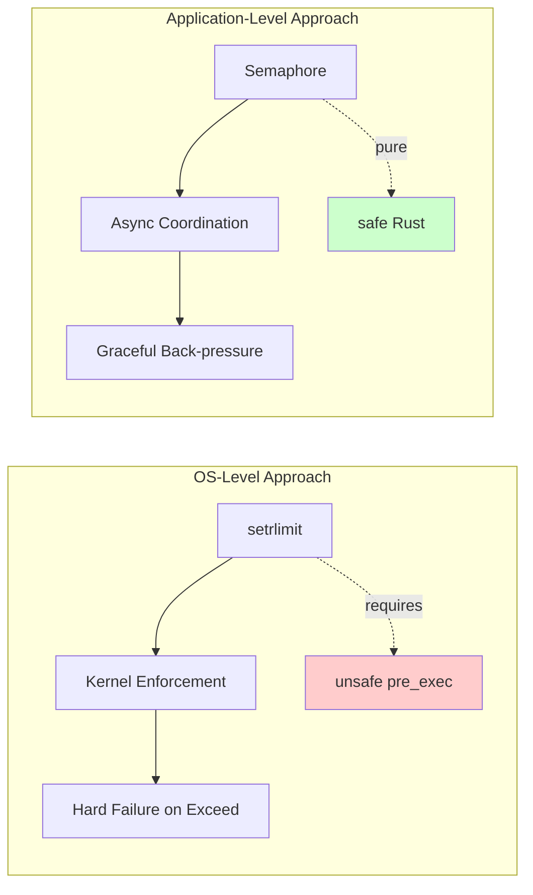

# Application-Level Resource Limits

### From: resource

Application-level resource limits represent a software engineering approach to resource management where constraints are enforced within the program rather than relying on operating system mechanisms. This technique becomes necessary when OS-level controls are unavailable, unsafe, or insufficiently granular for the application's needs. In this codebase, the developers explicitly rejected Unix setrlimit and prlimit-based approaches because implementing them correctly would require unsafe code through the pre_exec hook, violating the workspace's safety policy. Instead, semaphores provide cooperative scheduling that integrates naturally with async Rust's execution model. The approach offers several advantages: graceful degradation under load through back-pressure rather than hard failures, portability across operating systems without platform-specific code, and fine-grained control that can be tuned per-workload rather than system-wide. The trade-off is that application-level limits rely on correct implementation throughout the codebase—all spawn sites must acquire permits—whereas OS limits provide enforcement at the kernel boundary.

## Diagram

## External Resources

- [Linux setrlimit system call documentation](https://man7.org/linux/man-pages/man2/setrlimit.2.html) - Linux setrlimit system call documentation
- [Unix-specific process extensions including pre_exec](https://doc.rust-lang.org/std/os/unix/process/trait.CommandExt.html) - Unix-specific process extensions including pre_exec

## Related

- [Safety-First System Design](safety-first-system-design.md)

## Sources

- [resource](../sources/resource.md)
