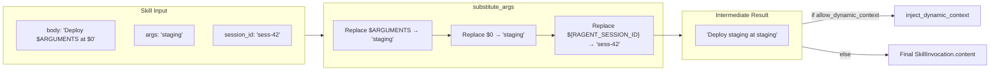

# Argument Substitution

### From: invoke

Argument substitution provides the foundational templating mechanism for skill parameterization, transforming static skill definitions into dynamic tools responsive to invocation context. The system processes skill bodies through substitute_args, replacing placeholders with values derived from invocation arguments, session identifiers, and skill directory paths. Placeholder syntax supports multiple patterns: $ARGUMENTS for the entire argument string, $0 through $N for positional parameters, ${RAGENT_SESSION_ID} for session provenance, and ${RAGENT_SKILL_DIR} for filesystem context awareness.

The substitution implementation balances flexibility with predictability. Unlike shell expansion which can surprise with word splitting and globbing, the ragent-core substitution follows strict literal replacement semantics—argument strings are inserted as-provided without additional parsing. This design choice supports skill definitions containing code snippets, natural language instructions, or structured data without escaping complexity. The session_id and skill_dir parameters enable skills to be context-aware without requiring the invoking code to manually construct these values into argument strings, reducing boilerplate and error rates.

Architectural integration of argument substitution reveals careful separation of concerns. Substitution occurs as the first processing phase in invoke_skill, producing an intermediate string that may subsequently undergo dynamic context injection if enabled. This ordering ensures that dynamically injected content can itself contain argument placeholders without creating injection vulnerabilities—commands see fully-resolved argument values. The test suite validates substitution across scenarios including empty arguments, session ID propagation, and positional parameter handling. Edge cases like multiline arguments and special character preservation demonstrate robustness suitable for production deployment handling diverse user inputs and system-generated identifiers.

## Diagram

## External Resources

- [POSIX shell parameter expansion specification for comparison](https://pubs.opengroup.org/onlinepubs/9699919799/utilities/V3_chap02.html) - POSIX shell parameter expansion specification for comparison

## Related

- [Dynamic Context Injection](dynamic-context-injection.md)

## Sources

- [invoke](../sources/invoke.md)
