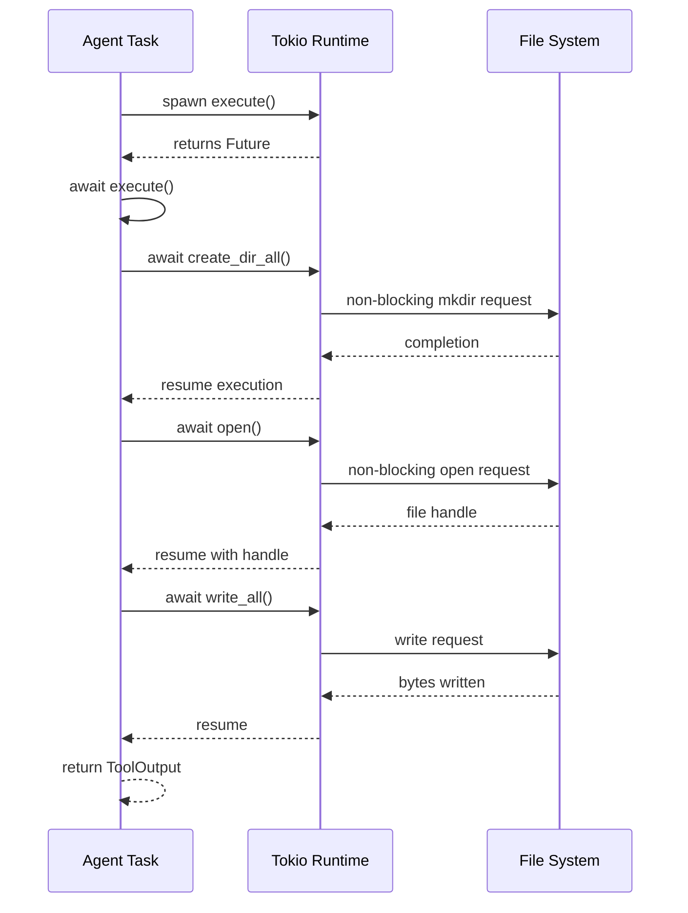

# Async/Await Pattern in Rust

### From: append_file

The async/await pattern in Rust represents a fundamental approach to writing non-blocking concurrent code, serving as the foundation for the `AppendFileTool` implementation. Rust's async model separates the definition of asynchronous computation (using `async` blocks and functions) from its execution (using `.await` and an async runtime like Tokio). This design provides zero-cost abstractions where asynchronous code compiles to state machines comparable to hand-written callback code, without the overhead of green threads or garbage collection.

In `AppendFileTool`, the `execute` method is marked with `async fn`, indicating it returns a `Future` that must be awaited to produce the actual `Result<ToolOutput>`. Each `.await` point in the method—on `create_dir_all`, `open`, and `write_all`—represents a potential suspension point where the task yields control if the operation is not immediately ready. This allows the Tokio runtime to schedule other tasks, ensuring the agent remains responsive even during I/O-bound operations. The `#[async_trait::async_trait]` attribute on the `impl Tool for AppendFileTool` enables async methods in the trait, as Rust's native trait system does not yet support `async fn` in traits directly.

The pattern requires careful attention to ownership and lifetime constraints. The `write_all` call borrows `content.as_bytes()`, requiring the `content` string to remain valid through the await point. Tokio's I/O traits use pinned futures to ensure memory safety across await boundaries. For AI agent systems, this pattern is essential because agents typically orchestrate multiple concurrent operations—file I/O, network requests, model inference—that must interleave efficiently without blocking the main execution context.

## Diagram

## External Resources

- [Asynchronous Programming in Rust official book](https://rust-lang.github.io/async-book/) - Asynchronous Programming in Rust official book
- [Rust async keyword documentation](https://doc.rust-lang.org/std/keyword.async.html) - Rust async keyword documentation
- [async-trait crate for async methods in traits](https://docs.rs/async-trait/latest/async_trait/) - async-trait crate for async methods in traits

## Sources

- [append_file](../sources/append-file.md)

### From: resolve

The async/await pattern in Rust represents a fundamental approach to writing non-blocking, concurrent code that maintains the ergonomics of synchronous programming while enabling efficient resource utilization. In this resolution module, async/await permeates the architecture, with `resolve_ref` marked as `pub async fn` and multiple await points for file system operations, HTTP requests, and spawned blocking tasks. Rust's implementation differs from languages like JavaScript or Python through its zero-cost abstraction guarantee—async functions are compiled to state machines without runtime allocation overhead, and the `await` keyword yields control to the runtime's executor rather than blocking the thread. The pattern requires an async runtime (Tokio in this case) to poll futures to completion, creating a cooperative multitasking environment where I/O-bound operations can interleave efficiently. The codebase demonstrates sophisticated async patterns including `spawn_blocking` for CPU-intensive work, which moves computation to a thread pool to prevent blocking the async executor, and structured concurrency through Result propagation across await boundaries.
