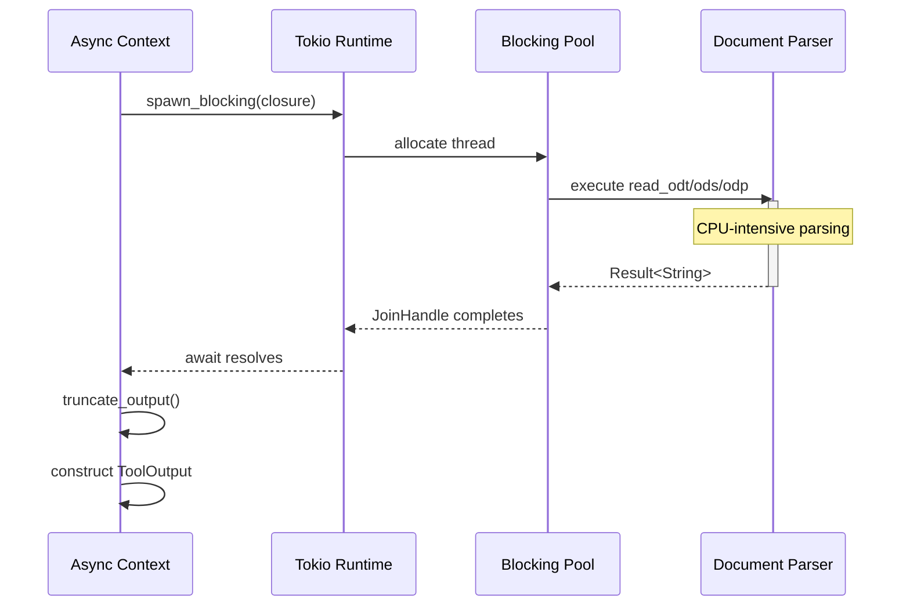

# Async-Await with CPU-Bound Work Offloading

### From: libreoffice_read

The integration of asynchronous programming with CPU-intensive operations presents a critical challenge in Rust's concurrency model, addressed in this implementation through `tokio::task::spawn_blocking`. Rust's async/await enables efficient I/O multiplexing where tasks yield control at await points, but document parsing—particularly XML parsing and spreadsheet processing—involves significant CPU computation without natural await points. Executing such work directly in async contexts would block the executor thread, degrading system responsiveness and throughput. The `spawn_blocking` API creates a dedicated thread pool for CPU-bound work, communicating results back to the async context through `JoinHandle` futures. This pattern, visible in the `execute` method implementation, encapsulates the entire format-specific reading logic in a closure moved to a blocking task, with the outer async function awaiting completion. The `move` keyword ensures data ownership transfers correctly to the spawned task, avoiding lifetime complications with stack references. Error handling propagates through multiple layers: the blocking task returns `Result<String>`, the `JoinHandle` may contain a panic payload requiring `context()` conversion, and the double `??` operator unwraps both outer and inner results. This architecture enables the tool to participate in async agent systems without compromising overall concurrency—other async tasks continue processing while documents are being parsed. The pattern reflects broader Rust async ecosystem conventions where I/O and CPU work are explicitly separated, with `spawn_blocking` serving as the bridge between zero-cost async abstractions and unavoidable synchronous computation. The implementation's choice of `spawn_blocking` over alternatives like `tokio::task::spawn` with yield points or async-friendly parsers indicates prioritization of code clarity and library maturity over theoretical purity.

## Diagram

## External Resources

- [Tokio spawning guide - blocking tasks](https://tokio.rs/tokio/tutorial/spawning) - Tokio spawning guide - blocking tasks
- [Async: What is blocking? - Alice Ryhl](https://ryhl.io/blog/async-what-is-blocking/) - Async: What is blocking? - Alice Ryhl
- [Tokio spawn_blocking documentation](https://docs.rs/tokio/latest/tokio/task/fn.spawn_blocking.html) - Tokio spawn_blocking documentation

## Sources

- [libreoffice_read](../sources/libreoffice-read.md)
