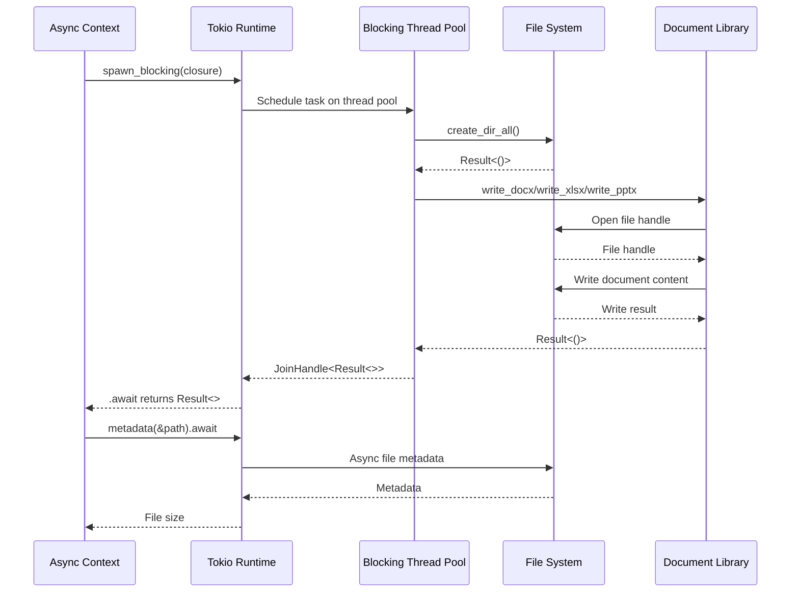

# Async File I/O with Blocking Task Offloading

### From: office_write

The OfficeWriteTool demonstrates proper handling of blocking file I/O operations within an asynchronous Rust application through the use of Tokio's spawn_blocking mechanism. Since document generation involves significant computational work and synchronous file system operations through external libraries, executing these directly within an async function would block the async runtime's event loop, degrading overall system performance. The implementation addresses this by cloning the necessary data—the output path and content—and spawning a blocking task that performs the actual document creation. This pattern uses `tokio::task::spawn_blocking` with a closure that returns a `Result<()>` and is joined with `.await` to integrate with the surrounding async code. The closure captures moved data to satisfy Rust's ownership requirements, ensuring that the path and content outlive the blocking operation. Error handling propagates through multiple layers: IO errors from directory creation, potential panics in the blocking task converted to JoinErrors, and library-specific errors from document generation. The `context` method from anyhow provides descriptive error messages at each layer, distinguishing between task spawning failures and actual document writing failures. This architecture allows the tool to maintain responsiveness in concurrent agent environments while safely performing heavy document generation work.

## Diagram

## External Resources

- [Tokio spawn_blocking documentation](https://docs.rs/tokio/latest/tokio/task/fn.spawn_blocking.html) - Tokio spawn_blocking documentation
- [Tokio guide on bridging sync and async code](https://tokio.rs/tokio/topics/bridging) - Tokio guide on bridging sync and async code

## Sources

- [office_write](../sources/office-write.md)
