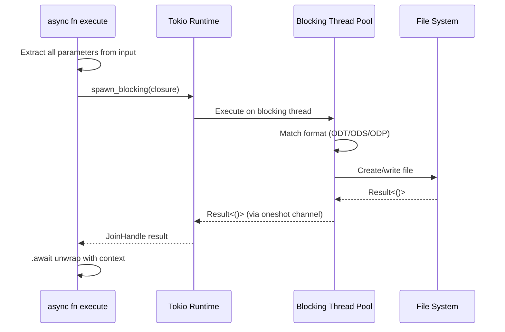

# Async I/O with Blocking Task Offloading

### From: libreoffice_write

The LibreWriteTool implementation demonstrates a critical pattern in Rust async programming: offloading blocking I/O operations to a dedicated thread pool to maintain runtime responsiveness. Rust's async/await syntax enables efficient cooperative multitasking, but file system operations and CPU-intensive tasks can block the executor if run directly in async contexts. The code addresses this through `tokio::task::spawn_blocking`, which moves the entire document generation and writing operation to Tokio's blocking thread pool. This design decision reflects a fundamental trade-off in async Rust: the overhead of thread synchronization is acceptable to prevent file I/O from stalling other concurrent tasks. The implementation carefully structures the code to extract all necessary data from the `input` Value and `ctx` before the spawn_blocking call, avoiding lifetime issues that would arise from capturing references across thread boundaries. The `move` closure ensures ownership of the extracted values (path, content, rows, metadata) transfers to the blocking task. Error handling propagates through multiple layers: the blocking task returns a `Result`, which is then unwrapped with `await` (producing a `Result<Result<()>>`), with the outer error representing task panics and the inner error representing operation failures. The `.context()` calls provide descriptive error messages at each failure point, aiding debugging in production environments. This pattern is essential for any async system that performs file operations, as it preserves the latency benefits of async I/O for network-bound operations while correctly handling the inherently blocking nature of file system interactions.

## Diagram

## External Resources

- [Tokio spawn_blocking documentation](https://docs.rs/tokio/latest/tokio/task/fn.spawn_blocking.html) - Tokio spawn_blocking documentation
- [Async: What is blocking? - Alice Ryhl](https://ryhl.io/blog/async-what-is-blocking/) - Async: What is blocking? - Alice Ryhl

## Related

- [Error Handling Patterns](error-handling-patterns.md)

## Sources

- [libreoffice_write](../sources/libreoffice-write.md)
