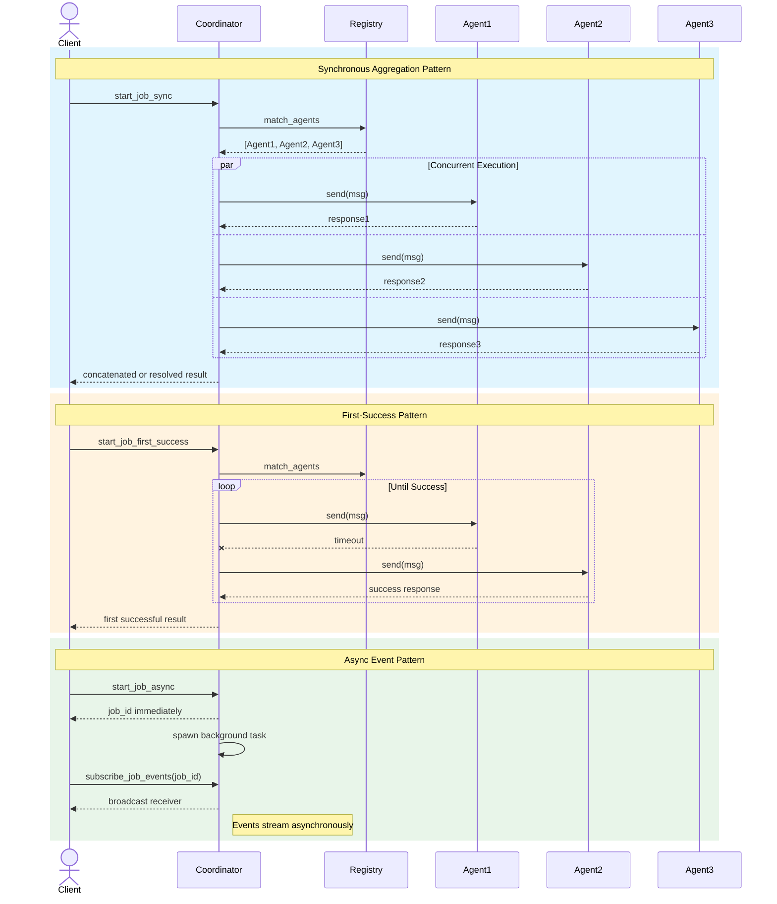

# Async Job Execution Patterns

### From: coordinator

The Coordinator implements three distinct asynchronous job execution patterns, each optimized for different latency, reliability, and consistency requirements. These patterns demonstrate sophisticated understanding of distributed systems trade-offs and Rust's async/await capabilities for composable concurrency.

The synchronous aggregation pattern (`start_job_sync`) implements a scatter-gather approach: the Coordinator fans out requests to all matched agents concurrently using Tokio's `spawn`, awaits all completions, then applies aggregation logic. This pattern maximizes throughput for parallelizable workloads where complete information is required, such as distributed map-reduce or ensemble model predictions. The implementation handles partial failure explicitly—individual agent timeouts don't fail the entire job, but complete absence of successful responses triggers error conditions.

The first-success pattern (`start_job_first_success`) implements failover chaining with early termination. Agents are attempted sequentially in deterministic order, with successful non-error responses returned immediately. This pattern optimizes for latency in redundant systems where agents are functionally equivalent, such as replicated services or hot-standby configurations. The pragmatic success detection (checking for "error:" prefix) acknowledges the reality of string-based agent protocols while suggesting evolution toward structured Result types.

The asynchronous event-driven pattern (`start_job_async`) decouples job submission from completion, enabling fire-and-forget workflows and long-running computations. Jobs execute in spawned Tokio tasks, with progress exposed through broadcast channels. This supports reactive architectures where clients subscribe to event streams rather than blocking, and enables the Coordinator to handle thousands of concurrent jobs without thread exhaustion. The pattern uses DashMap for shared state and Tokio's broadcast for multi-consumer event distribution.

## Diagram

## External Resources

- [Tokio asynchronous programming tutorial](https://tokio.rs/tokio/tutorial/async) - Tokio asynchronous programming tutorial
- [Patterns of Distributed Systems by Martin Fowler](https://martinfowler.com/articles/patterns-of-distributed-systems/) - Patterns of Distributed Systems by Martin Fowler
- [Rust Future and async/await fundamentals](https://doc.rust-lang.org/std/future/) - Rust Future and async/await fundamentals

## Sources

- [coordinator](../sources/coordinator.md)
