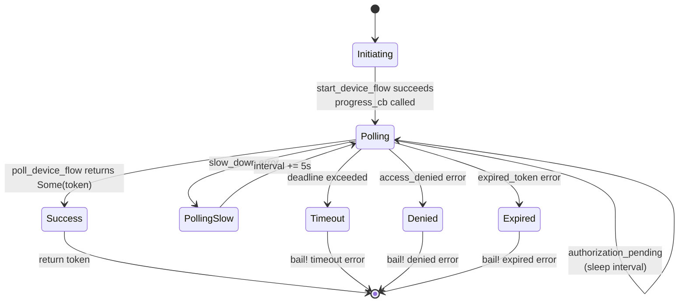

# Async Polling Patterns

### From: auth

Polling-based coordination in asynchronous Rust requires careful handling of timing, cancellation, and backpressure to create responsive and resource-efficient applications. The `device_flow_login` function in this module demonstrates a sophisticated polling implementation that balances responsiveness with respect for rate limits. The core pattern involves an async loop with `tokio::time::sleep` for non-blocking delays, allowing other tasks to progress during polling intervals. The implementation incorporates multiple adaptive mechanisms: a deadline-based timeout using `std::time::Instant` comparisons prevents infinite polling loops when authorization never completes, while dynamic interval adjustment responds to `slow_down` errors from the OAuth server by incrementing the polling interval. This backpressure handling is crucial for maintaining good citizenship with external APIs and avoiding rate limit exhaustion. The error handling distinguishes between transient conditions (`authorization_pending`, `slow_down`) requiring continued polling and terminal failures (`expired_token`, `access_denied`) that abort the flow. The use of `std::time::Duration` for time calculations while using tokio for async sleeping demonstrates proper separation between time arithmetic and async runtime operations. This pattern generalizes to many distributed systems scenarios including leader election, configuration propagation, and health checking, where deterministic timeout behavior and graceful degradation are essential.

## Diagram

## External Resources

- [Tokio async programming tutorial](https://tokio.rs/tokio/tutorial/async) - Tokio async programming tutorial
- [Asynchronous Programming in Rust](https://rust-lang.github.io/async-book/) - Asynchronous Programming in Rust
- [AWS Builder's Library: Timeouts, retries, and backoff](https://aws.amazon.com/builders-library/timeouts-retries-and-backoff-with-jitter/) - AWS Builder's Library: Timeouts, retries, and backoff

## Sources

- [auth](../sources/auth.md)
