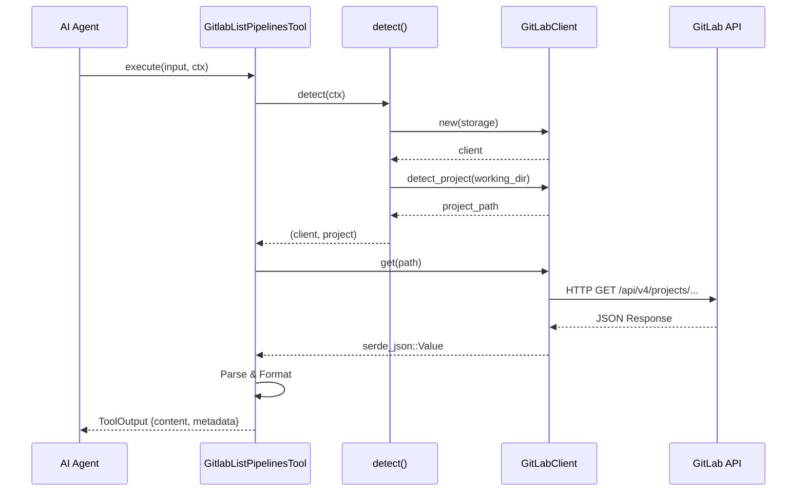

# Async Rust Patterns for API Clients

### From: gitlab_pipelines

Async Rust patterns for API clients leverage the language's zero-cost abstraction for concurrent I/O operations, enabling efficient handling of network latency and multiple outstanding requests. The async/await syntax, stabilized in Rust 2018 edition, transforms complex callback-based or future-chaining code into sequential-looking blocks that compile to state machines. This paradigm is essential for API clients where operations are dominated by network waiting time rather than CPU computation.

This implementation demonstrates several idiomatic patterns: the async_trait crate enables trait methods to be async, working around Rust's limitation that trait methods cannot directly declare async (until native async traits stabilize). The anyhow crate provides ergonomic error handling with automatic context propagation through the ? operator and .context() method, essential for debugging distributed system failures where errors may originate from HTTP transport, API semantics, or data parsing. The pattern of creating clients, building request paths with format! string interpolation, and awaiting responses appears consistently across all tool implementations.

Error handling in async Rust requires particular attention to Send and Sync bounds for cross-thread safety. The Result type aliasing from anyhow simplifies signature complexity while preserving rich error information. The code demonstrates defensive programming with Option handling (unwrap_or patterns with defaults), explicit error contexts for API response parsing, and graceful degradation for missing optional fields. These patterns collectively produce robust clients that fail explicitly and informatively rather than silently or catastrophically.

## Diagram

## External Resources

- [Asynchronous Programming in Rust official book](https://rust-lang.github.io/async-book/) - Asynchronous Programming in Rust official book
- [Tokio async runtime for Rust](https://tokio.rs/) - Tokio async runtime for Rust
- [anyhow crate documentation for flexible error handling](https://docs.rs/anyhow/latest/anyhow/) - anyhow crate documentation for flexible error handling

## Related

- [Error Handling Patterns](error-handling-patterns.md)

## Sources

- [gitlab_pipelines](../sources/gitlab-pipelines.md)
