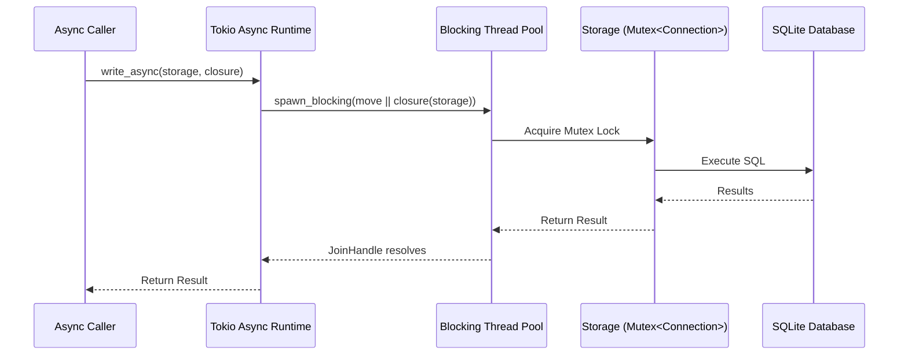

# Async-Sync Bridge Pattern

### From: mod

The async-sync bridge pattern addresses the fundamental impedance mismatch between Rust's async ecosystem and synchronous I/O operations, particularly relevant for SQLite which lacks native async APIs. Ragent storage implements this pattern through the write_async method, which executes blocking database operations on Tokio's dedicated blocking thread pool while presenting an async interface to callers. This architectural choice prevents async task starvation, where a blocking operation would prevent the executor from polling other tasks, maintaining application responsiveness under concurrent load.

The implementation uses std::sync::Arc for shared ownership of the Storage instance across thread boundaries, with the closure capturing necessary data by move. The spawn_blocking call transitions from async context to synchronous execution, runs the database operation, and returns a JoinHandle that resolves to the operation's Result. Error propagation preserves anyhow's error handling semantics across the boundary. This pattern differs from alternatives like sqlx's async-native drivers (which simulate asynchrony) or dedicated async database pools, instead embracing SQLite's synchronous nature while integrating with async applications.

The design trade-offs include some thread pool contention under extreme write load, mitigated by SQLite's single-writer serialization anyway, and the overhead of thread context switching for each write operation. However, the pattern provides correctness guarantees (SQLite's ACID semantics are preserved), simplicity (no async runtime in database code), and compatibility with rusqlite's rich feature set including extensions and custom functions. For read operations, the module uses direct synchronous calls under the Mutex, appropriate since SQLite permits concurrent readers and the Mutex provides sufficient synchronization. This hybrid approach exemplifies pragmatic Rust async architecture, using the right abstraction for each concern rather than forcing uniformity.

## Diagram

## External Resources

- [Tokio spawning tasks and blocking operations](https://tokio.rs/tokio/tutorial/spawning) - Tokio spawning tasks and blocking operations
- [Tokio task module documentation for async task management](https://docs.rs/tokio/latest/tokio/task/index.html) - Tokio task module documentation for async task management
- [Understanding blocking in async Rust (Alice Ryhl)](https://ryhl.io/blog/async-what-is-blocking/) - Understanding blocking in async Rust (Alice Ryhl)

## Sources

- [mod](../sources/mod.md)

### From: local

The async/sync bridge pattern addresses the fundamental impedance mismatch between synchronous and asynchronous execution contexts in Rust programs. Rust's async ecosystem is built on the `Future` trait and executor model, where async functions return immediately with a `Future` that must be `.await`ed to make progress. However, many APIs and use cases require synchronous execution—notably, trait methods in the `EmbeddingProvider` interface that must return `Result<Vec<f32>>` directly rather than `impl Future<Output = Result<Vec<f32>>>`. The LocalEmbeddingProvider faces this challenge with the `reqwest` HTTP client, which provides only async APIs when the `blocking` feature is disabled. The solution creates a temporary Tokio runtime using `Runtime::new()` and uses `block_on()` to drive async futures to completion from synchronous code.

This pattern carries significant trade-offs and implementation constraints. Creating a runtime is expensive, involving thread pool initialization and resource allocation, so the implementation confines this to the one-time model download scenario rather than the hot `embed()` path. The `block_on()` method enters the Tokio runtime and polls the future until completion, blocking the current thread entirely—this is acceptable for initialization but would violate async runtime expectations if used during normal operation. Error handling becomes more complex as `reqwest` errors must be converted to `anyhow::Result` through multiple `with_context()` layers. The temporary runtime approach also risks nested runtime panics if called from within an existing async context, though the lazy initialization timing typically avoids this in practice.

Alternative approaches considered in Rust ecosystem design include: enabling `reqwest`'s `blocking` feature for a dedicated synchronous client (adds dependency complexity), using `ureq` or `attohttpc` as pure-sync alternatives (reduces ecosystem consistency), or restructuring the `EmbeddingProvider` trait to be async-native (propagates complexity to all implementations). The chosen approach balances pragmatism with minimal API disruption. The `block_on()` pattern with explicit runtime creation is a recognized Rust idiom for bridge scenarios, documented in Tokio's guidelines for integrating async libraries into sync contexts. The implementation's careful scoping—using the bridge only for the cold-path download operation—minimizes the architectural impact while maintaining clean trait boundaries.
