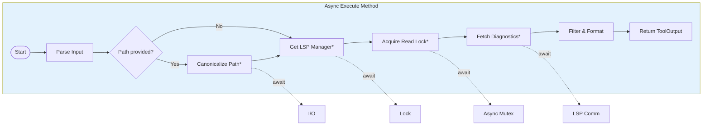

# Async Tool Execution in Rust

### From: lsp_diagnostics

Async tool execution in Rust represents a fundamental architectural pattern employed by LspDiagnosticsTool to perform non-blocking I/O operations when interacting with LSP servers. The `execute` method is marked as `async`, allowing it to await on potentially slow operations like filesystem path canonicalization and LSP manager read locks without blocking the executor thread. This asynchronous design is essential for scalable agent systems that may manage multiple concurrent tool executions across different capabilities. The source code demonstrates mature async Rust patterns including the use of `async_trait` for trait-based async methods and careful lifetime management across await points.

The implementation reveals sophisticated handling of async resource access patterns, particularly evident in the diagnostic retrieval code that acquires an asynchronous read lock on the LSP manager. The pattern `let guard = lsp.read().await` followed by scoped method invocation on the guard represents the standard approach for concurrent access to shared state in async Rust. This design allows multiple diagnostic queries to proceed concurrently while ensuring exclusive access during state mutations. The use of `tokio` or a similar async runtime is implied by these patterns, though not explicitly visible in the source excerpt.

Error handling in async contexts requires careful consideration, and the source code demonstrates best practices through its use of `anyhow::Context` for attaching descriptive context to errors and `with_context` for lazy error message formatting. The `?` operator propagates errors through the async call stack, while `.await` points are strategically placed to minimize held resources across suspension points. The conversion between different error types—such as IO errors from filesystem operations and custom errors from LSP communication—is handled transparently by the `anyhow` framework, simplifying what would otherwise require explicit error type conversions.

The significance of async execution for AI agent tooling extends beyond performance optimization to fundamental responsiveness guarantees. Agents operating in interactive environments or real-time collaboration scenarios cannot tolerate blocking operations that freeze the entire system. Async execution enables the agent to maintain conversational responsiveness while background tasks like comprehensive codebase analysis proceed concurrently. The structured approach to async tool design in ragent-core, exemplified by LspDiagnosticsTool, provides a template for implementing additional capabilities that respect these responsiveness constraints while maintaining correct sequential semantics where required.

## Diagram

## External Resources

- [Asynchronous Programming in Rust official book](https://rust-lang.github.io/async-book/) - Asynchronous Programming in Rust official book
- [async-trait crate for async methods in traits](https://docs.rs/async-trait/latest/async_trait/) - async-trait crate for async methods in traits
- [Tokio async runtime documentation](https://docs.rs/tokio/latest/tokio/) - Tokio async runtime documentation

## Sources

- [lsp_diagnostics](../sources/lsp-diagnostics.md)

### From: pdf_write

This concept encompasses patterns for integrating blocking or CPU-intensive operations within asynchronous Rust applications. The pdf_write.rs implementation demonstrates the canonical approach: implementing `Tool` with `async_trait`, then delegating actual work to `tokio::task::spawn_blocking`. This separation preserves async runtime responsiveness while accommodating PDF generation's inherently blocking nature—file I/O, image decoding, and PDF compression all involve system calls or sustained computation that would stall async executors. The pattern requires careful data ownership: input data must be cloned into the blocking task (`path_clone`, `content_clone`, `working_dir`), as the async context cannot lend references across await points to potentially long-running blocking code.

The architectural layering reveals important distinctions in Rust's async ecosystem. The `Tool` trait provides abstract interface—synchronous methods for metadata (`name`, `description`, `parameters_schema`), async method for execution. This design permits tool registries with heterogeneous implementations, some truly async (HTTP requests), others blocking-wrapped (PDF generation). The `Result<ToolOutput>` return type with `anyhow` error propagation enables rich error context without exposing implementation details to callers. Metadata in `ToolOutput` (byte count, estimated pages) supports observability and downstream processing without parsing generated files.

Trade-offs of this approach include memory overhead from data cloning and thread pool contention if many blocking tasks execute simultaneously. Alternatives include: pure async I/O (limited by PDF library support), process isolation (spawning subprocess for generation), or dedicated thread pools with backpressure. The chosen approach balances simplicity and performance for expected workloads. The `spawn_blocking` pattern appears throughout Rust's async ecosystem for database operations, image processing, and cryptographic operations, establishing it as idiomatic practice despite introducing synchronization complexity (the `.await` on `JoinHandle` and subsequent `?` for Result unwrapping).
