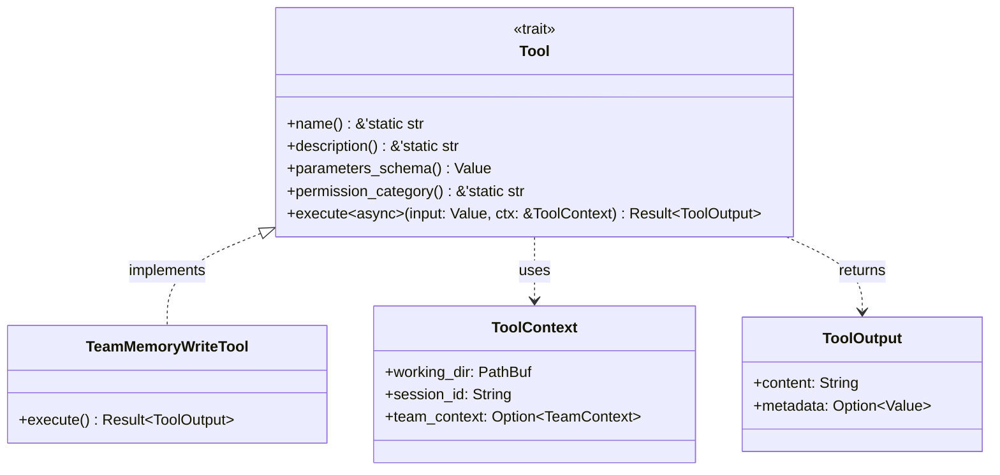

# Async Tool Trait Pattern

### From: team_memory_write

The async tool trait pattern enables generic, composable tool abstractions that execute within asynchronous Rust runtimes. The Tool trait's use of async_trait procedural macros bridges the gap between trait object safety and async execution, allowing dynamic dispatch to tool implementations while supporting non-blocking I/O operations essential for responsive agent systems. This pattern is fundamental to the ragent architecture, enabling the framework to treat diverse capabilities—from file operations to API calls to code execution—through a unified interface that integrates with Tokio or other async runtimes.

The trait's design balances flexibility with structure through associated methods for identity (name, description), interface contract (parameters_schema), security metadata (permission_category), and execution logic (execute). The JSON Schema return from parameters_schema enables dynamic UI generation, automatic validation, and structured LLM prompting without requiring tool-specific code in calling components. This self-describing interface supports runtime tool discovery, where agents can be presented with available tools complete with usage instructions derived directly from implementation schemas.

The execute method's signature—taking owned Value parameters and borrowed ToolContext—optimizes for typical usage patterns where JSON inputs are deserialized fresh for each invocation while contextual information is shared across multiple tools in a single request. The Result<ToolOutput> return type using anyhow enables ergonomic error propagation while permitting rich success responses. The async bound on execute acknowledges that virtually all meaningful tool operations involve I/O, whether filesystem, network, or inter-process communication, and that blocking execution would severely constrain system throughput in multi-agent scenarios. This architectural commitment to async-everywhere positions the framework for scalable deployment.

## Diagram

## External Resources

- [async-trait crate - macro enabling async trait methods](https://docs.rs/async-trait/latest/async_trait/) - async-trait crate - macro enabling async trait methods
- [Asynchronous Programming in Rust - official book](https://rust-lang.github.io/async-book/) - Asynchronous Programming in Rust - official book
- [Tokio - async runtime commonly used with this pattern](https://tokio.rs/) - Tokio - async runtime commonly used with this pattern

## Sources

- [team_memory_write](../sources/team-memory-write.md)
