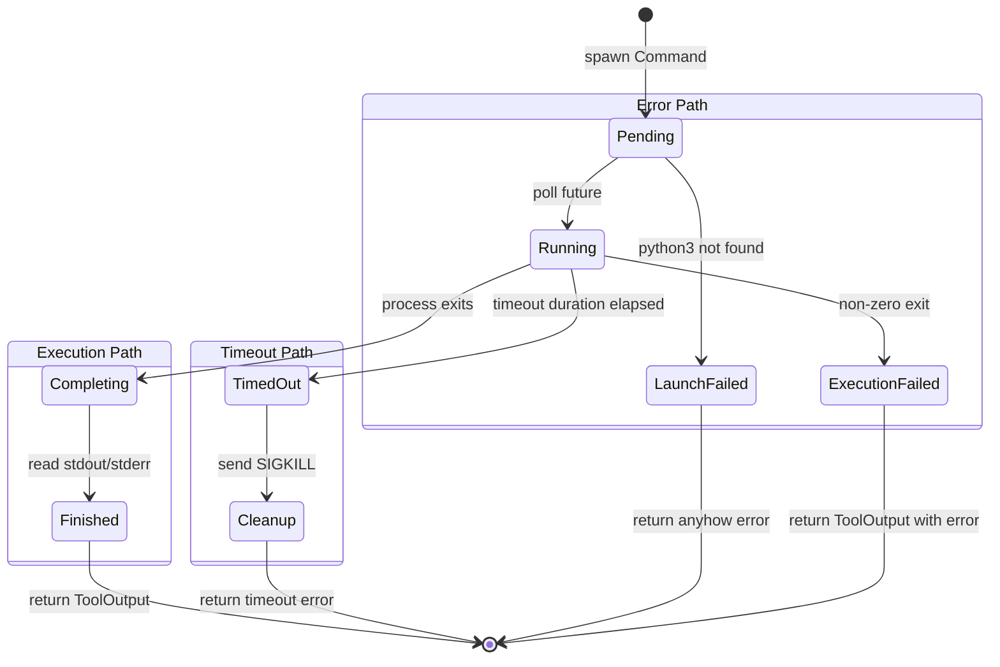

# Asynchronous Process Management

### From: execute_python

Asynchronous process management in Rust addresses the fundamental challenge of executing external programs without blocking the executing thread, critical for systems that must maintain responsiveness while performing I/O-bound operations. ExecutePythonTool leverages Tokio's `Command` type, which returns futures rather than blocking on process completion, allowing the agent runtime to continue processing other tasks during Python execution. This pattern is essential for AI agent systems where multiple user sessions or concurrent tool invocations must share limited computational resources efficiently. The `timeout` combinator demonstrates composable async primitives, wrapping the process future with a deadline that completes independently of the underlying process's cooperation, preventing indefinite blocking from hung Python interpreters.

The implementation details reveal careful attention to resource lifecycle management in async contexts. The temporary file cleanup using `let _ = tokio::fs::remove_file(&tmp_path).await` executes unconditionally before result processing, ensuring that even if Python crashes or times out, filesystem resources are released. This pattern addresses a common async pitfall where early returns or ? operators might skip cleanup code; by structuring cleanup before the result match, the tool maintains resource safety. The use of `Instant` for timing measurements provides monotonic clock guarantees unaffected by system time adjustments, producing reliable duration metrics for performance analysis and billing purposes.

Rust's ownership model provides unique advantages for async process management compared to languages with garbage collection or manual memory management. The `tmp_path` variable's lifetime is clearly bounded to the async block, with the compiler preventing use-after-free if cleanup were accidentally omitted. The `output` method on Tokio's Command consumes the command builder, preventing accidental reuse that might lead to confusing state. Error handling through `anyhow::Context` maintains async compatibility while providing ergonomic error propagation with context about which operation failed. These language-level guarantees complement Tokio's runtime safety, producing systems where common async bugs—use-after-await, lost wakeups, or data races—are caught at compile time rather than manifesting as production failures.

## Diagram

## External Resources

- [Asynchronous Programming in Rust book](https://rust-lang.github.io/async-book/) - Asynchronous Programming in Rust book
- [Tokio documentation on sync/async integration](https://tokio.rs/tokio/topics/bridging) - Tokio documentation on sync/async integration
- [Without Boats blog on Rust async design rationale](https://without.boats/blog/why-async-rust/) - Without Boats blog on Rust async design rationale

## Sources

- [execute_python](../sources/execute-python.md)
