# Asynchronous Tool Execution with Shared State

### From: mcp_tool

Asynchronous execution is fundamental to responsive agent systems that must manage multiple concurrent operations without blocking. The `McpToolWrapper` implementation leverages Rust's async/await syntax and Tokio's runtime to enable non-blocking tool invocation, with the `execute` method marked as `async fn` and the `Tool` trait implemented using `#[async_trait::async_trait]`. This async design is necessary because MCP tool calls typically involve network I/O to external servers, and blocking the agent's execution thread would severely limit throughput and responsiveness.

The shared state management in this module illustrates sophisticated concurrent programming patterns. The `Arc<RwLock<McpClient>>` field provides thread-safe shared ownership of the MCP client across multiple `McpToolWrapper` instances. `Arc` (atomic reference counting) enables multiple wrappers to hold references to the same client without determining ownership at compile time—essential since the number of tools and their lifetimes are dynamic. `RwLock` provides interior mutability with read-write semantics: multiple tool executions can read from the client concurrently (acquiring read locks), while exclusive write access is available when the client needs reconfiguration.

The specific lock acquisition pattern in `execute`—`self.client.read().await`—is noteworthy for its efficiency implications. By acquiring a read lock for the duration of the `call_tool` invocation and releasing it immediately after, the wrapper minimizes contention while ensuring exclusive access to the client's request channel. The `await` point where the lock is held represents a potential scheduling decision point for Tokio, allowing other tasks to progress while this execution awaits network I/O. The serialization of results to pretty-printed JSON occurs after lock release, avoiding unnecessary holding of shared resources during CPU-bound work. These careful sequencing choices reflect the performance sensitivity of agent systems that may invoke hundreds of tools in complex reasoning chains.

## Diagram

```mermaid
stateDiagram-v2
    [*] --> Idle : create wrapper
    
    Idle --> AcquiringLock : execute() called
    
    AcquiringLock --> LockedRead : read().await succeeds
    AcquiringLock --> Waiting : lock contested
    Waiting --> LockedRead : read lock available
    
    LockedRead --> CallingMCP : call_tool() begins
    CallingMCP --> WaitingIO : await network response
    WaitingIO --> CallingMCP : response received
    CallingMCP --> Serializing : call_tool() completes
    
    Serializing --> Idle : release lock, return ToolOutput
    
    note right of AcquiringLock
        Multiple concurrent executions
        can acquire read locks simultaneously
    end note
    
    note right of WaitingIO
        Lock held during await,
        but other read operations
        can proceed concurrently
    end note
```

## External Resources

- [Tokio asynchronous runtime for Rust](https://tokio.rs/) - Tokio asynchronous runtime for Rust
- [Tokio RwLock documentation for async-aware read-write locks](https://docs.rs/tokio/latest/tokio/sync/struct.RwLock.html) - Tokio RwLock documentation for async-aware read-write locks

## Sources

- [mcp_tool](../sources/mcp-tool.md)
