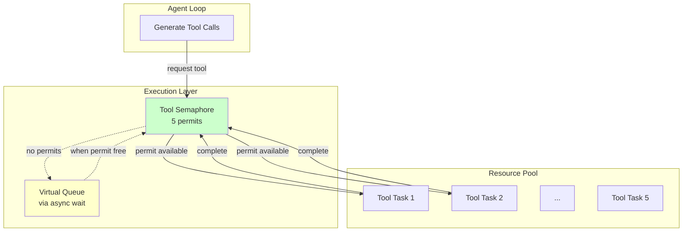

# Back-Pressure in Agent Systems

### From: resource

Back-pressure is a flow control mechanism where downstream systems signal upstream components to slow production when capacity is exceeded, preventing unbounded queue growth and resource exhaustion. In agent systems, this concept is particularly crucial because agents may generate tool execution requests faster than the system can safely process them, especially when multiple tools can run concurrently within a single reasoning step. The tool execution semaphore with its limit of 5 concurrent operations implements explicit back-pressure: when all permits are held, subsequent acquire attempts asynchronously wait, naturally throttling the agent's execution pace. This contrasts with systems that queue unlimited work, which eventually fail through memory exhaustion or timeout cascades. The design recognizes that agent workloads are inherently bursty—single prompts may trigger multiple independent tool calls—and that unbounded parallelism would harm latency through context switching and resource contention as much as it would risk stability. The back-pressure propagates through the await points, allowing the async runtime to schedule other work while tool executions complete.

## Diagram

## External Resources

- [Reactive Manifesto back-pressure definition](https://www.reactivemanifesto.org/glossary#Back-Pressure) - Reactive Manifesto back-pressure definition
- [Back-pressure explained for software engineers](https://medium.com/@jayphelps/backpressure-explained-the-flow-of-data-through-software-2350b3e77ce7) - Back-pressure explained for software engineers

## Related

- [Application-Level Resource Limits](application-level-resource-limits.md)
- [Fork Bomb Prevention](fork-bomb-prevention.md)

## Sources

- [resource](../sources/resource.md)
