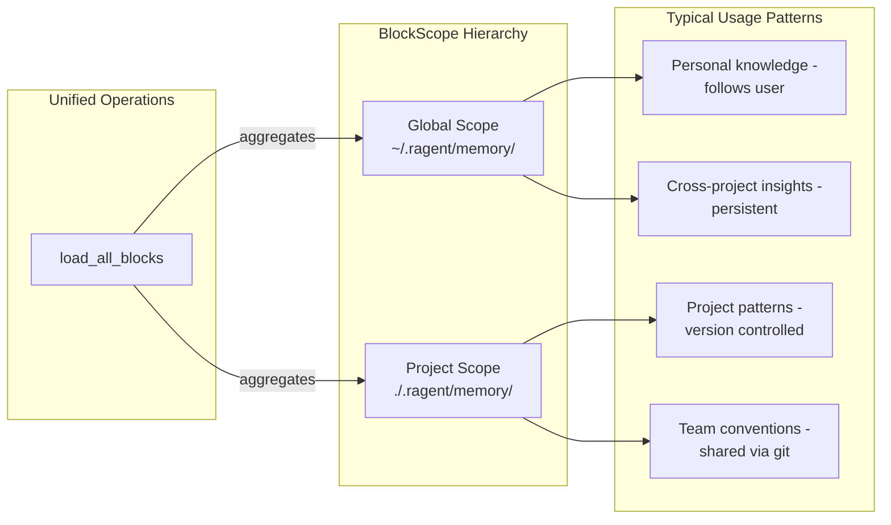

# BlockScope

### From: storage

BlockScope is a fundamental concept in the ragent memory architecture that defines the visibility and storage location of memory blocks. The system implements a two-tier scope hierarchy: Project scope for blocks that are specific to a particular code project or working directory, and Global scope for blocks that should persist across all projects. This scoping mechanism enables sophisticated knowledge management where project-specific patterns, conventions, and observations remain local to that project, while universal knowledge, reusable patterns, and cross-project insights can be shared globally.

The Project scope stores blocks in a `.ragent/memory/` subdirectory of the working directory, making them naturally version-controllable alongside the project code and portable when the repository is cloned elsewhere. This placement supports team collaboration through standard version control workflows, where memory blocks can be committed, reviewed, and shared just like source code. The Global scope, conversely, resides in `~/.ragent/memory/` within the user's home directory, creating a personal knowledge base that follows the developer across all their projects. This design recognizes that some knowledge transcends individual projects—general Rust patterns, common CLI workflows, or personal coding preferences.

The scope abstraction is implemented as an enum (imported from the `block` module) and pervades the BlockStorage API, with nearly every operation requiring a scope parameter. This pervasive scope awareness enables operations like `load_all_blocks` to aggregate blocks from both scopes, creating a unified view of all relevant memory. The scope also affects how blocks are serialized and deserialized, as it's embedded in the MemoryBlock struct and persisted in the YAML frontmatter. Legacy memory loading provides migration paths for older files that predate the formal block system, with the scope parameter determining where to look for these legacy MEMORY.md files. The dual-scope architecture represents a thoughtful balance between project-local and personal-global knowledge management.

## Diagram

## External Resources

- [Scope concept in computer science for variable visibility](https://en.wikipedia.org/wiki/Scope_(computer_science)) - Scope concept in computer science for variable visibility
- [Martin Fowler on local vs global knowledge in development](https://martinfowler.com/articles/scratch.html) - Martin Fowler on local vs global knowledge in development

## Sources

- [storage](../sources/storage.md)
