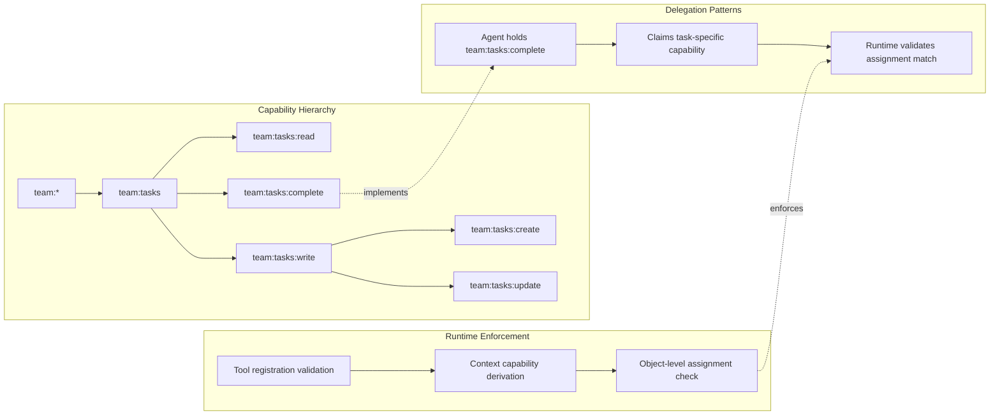

# Capability-Based Security for Agent Tools

### From: team_task_complete

Capability-based security in agent tool frameworks represents an authorization model where access rights are granted through explicit, unforgeable capabilities rather than identity-based permissions or ambient authority. This source code demonstrates the pattern through the `permission_category` method returning `"team:tasks"`, which functions as a capability declaration that the runtime can use to make authorization decisions. Unlike traditional access control where agents might present credentials for verification, capability systems grant rights by handing out references that are inherently authoritative—possession of the capability constitutes authorization.

The permission category `"team:tasks"` suggests a hierarchical capability namespace where capabilities can be organized by resource type and operation scope. The colon-separated format implies potential for granular sub-capabilities like `"team:tasks:read"` or `"team:tasks:admin"` that would enable fine-grained access control. This design enables principle of least privilege—agents receive only the capabilities they need for their assigned functions, limiting damage from compromised or malfunctioning agents. The declarative nature of permissions (returned by method rather than configured externally) enables static analysis and documentation generation.

Runtime enforcement of capabilities likely occurs at multiple levels in this architecture. The tool registration system probably validates that agents possess claimed capabilities before allowing tool execution. The `team_context` resolution logic implements dynamic capability derivation—agents operating within a team context gain capabilities associated with their team membership, while session-based execution has more limited rights. The task assignment system enforces object-level capabilities, where completion rights are bound to specific task instances and delegated to particular agents. This multi-layer approach combines coarse-grained capability categories with fine-grained runtime checks.

The security model has significant implications for multi-agent system design. Capability-based approaches prevent confused deputy problems where agents might be tricked into exercising their authority on behalf of malicious requests—agents only hold capabilities for their legitimate purposes, not broad authority. The pattern also supports delegation and attenuation, where agents can create restricted capabilities for sub-tasks or temporary access. The integration with filesystem permissions (through `working_dir` resolution) suggests capability mapping to operating system-level protections, though the abstraction enables portability across different security substrates. This approach contrasts with API key or token-based security that would require external validation services, instead embedding authorization in the architectural fabric.

## Diagram

## External Resources

- [Capability-based security model overview](https://en.wikipedia.org/wiki/Capability-based_security) - Capability-based security model overview
- [Cap'n Proto RPC capability system](https://capnproto.org/rpc.html#powerful-capabilities) - Cap'n Proto RPC capability system
- [Original capability systems research (Wobber et al.)](https://www.hpl.hp.com/techreports/Compaq-DEC/SRC-RR-154.pdf) - Original capability systems research (Wobber et al.)

## Sources

- [team_task_complete](../sources/team-task-complete.md)
