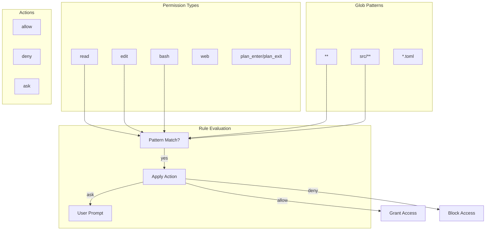

# Capability-Based Security for AI Agents

### From: oasf

Capability-based security in AI agent systems refers to access control models where agents are granted explicit permissions for specific actions rather than inheriting broad operational authority. The `RagentPermissionRule` structure implements this concept through a rule-based system combining permission types, glob patterns, and action directives. Each rule specifies what operation category (read, edit, bash, web, question, todo, plan_enter, plan_exit) can be performed on which resources (identified by glob patterns like `**` or `src/**`), with the action determining whether the operation is allowed, denied, or requires interactive confirmation.

This design addresses the unique security challenges of autonomous LLM-based agents that execute code and access external resources based on generated instructions. Traditional discretionary access control assumes human oversight for each action, but agents require predefined boundaries that constrain their operational envelope without blocking task completion. The three-tier action system (`allow`, `deny`, `ask`) provides graduated response options: unconditional permission for safe read-only operations, unconditional blocking for dangerous capabilities, and interactive escalation for operations that may be legitimate depending on context.

The glob pattern approach enables intuitive policy expression that mirrors developer mental models of project structure. A typical policy might allow read access to all files (`read,**,allow`) but restrict editing to source directories (`edit,src/**,allow`) and require confirmation for shell commands (`bash,**,ask`). This granularity prevents prompt injection or jailbreak attacks from immediately causing widespread damage while preserving agent utility for authorized workflows. The inheritance model where absent permission configurations default to system-wide policies supports both strict explicit opt-in security and convenient development configurations.

## Diagram

## External Resources

- [CWE-250: Execution with Unnecessary Privileges](https://cwe.mitre.org/data/definitions/250.html) - CWE-250: Execution with Unnecessary Privileges
- [OWASP Top 10 for LLM Applications](https://owasp.org/www-project-top-10-for-large-language-model-applications/) - OWASP Top 10 for LLM Applications

## Sources

- [oasf](../sources/oasf.md)
