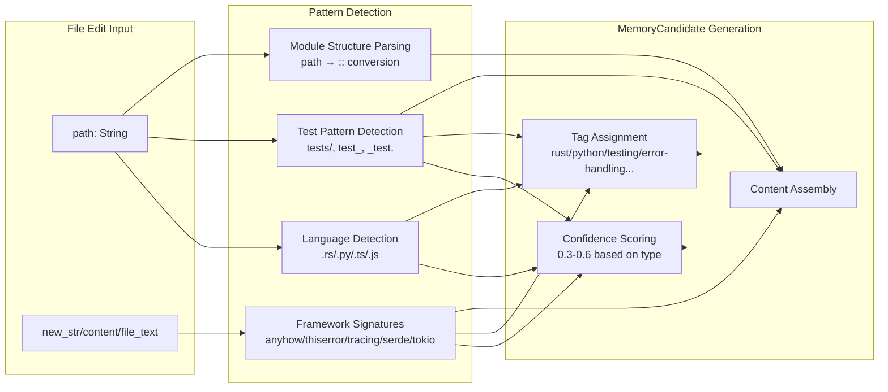

# Coding Pattern Recognition

### From: extract

Coding pattern recognition in the ExtractionEngine implements automated detection of software development conventions, frameworks, and structural organization from file system observations and content analysis. This concept transforms static file operations into semantic understanding of project characteristics, enabling the system to build contextual awareness without explicit configuration. The implementation recognizes patterns across multiple dimensions: language identification through file extensions (Rust via `.rs`, Python via `.py`, TypeScript/JavaScript via `.ts`, `.tsx`, `.js`, `.jsx`), framework usage through content signatures (`anyhow` and `thiserror` for error handling, `tracing` for logging, `serde` for serialization, `tokio` for async runtime), and organizational conventions through directory structure (test file locations, module hierarchies, configuration file placement). This multi-factor recognition enables rich MemoryCandidate generation that captures not just what files were edited but what development practices they represent.

The technical implementation demonstrates careful attention to content extraction versatility. The `extract_pattern_from_edit` function handles multiple tool variants (`edit`, `write`, `create`, `multiedit`, `str_replace_editor`) by examining tool-specific input fields (`new_str`, `content`, `file_text`) to access the actual content being written. This abstraction over diverse editor interfaces enables consistent pattern detection regardless of which specific editing tool was invoked. The path processing logic—stripping working directory prefixes to generate relative paths, detecting test directory conventions (`tests/`, `test_`, `_test.`, `.test.`), and parsing module structures (converting `/` path separators to Rust's `::` module syntax)—extracts structural conventions that guide future development decisions. Confidence calibration varies by detection type: test file patterns (0.6), generic source organization (0.5), configuration files (0.4), and documentation (0.3) receive differentiated scores reflecting their relative significance and stability.

The `detect_content_patterns` function implements framework-specific signature detection that goes beyond superficial syntax to identify architectural decisions. Recognizing `anyhow::Result` indicates adoption of flexible error propagation; `thiserror` suggests structured custom error types; `tracing::` integration indicates operational observability investment; `async fn` and `#[tokio::test]` mark async runtime adoption; `serde::` and derive macro patterns reveal serialization strategy. These detections capture meaningful project characteristics that would require substantial explicit documentation to convey, yet emerge naturally from content analysis. The broader significance of coding pattern recognition lies in its demonstration that development context—language choices, framework adoption, testing strategies, organizational conventions—can be inferred from operational traces with sufficient accuracy to support intelligent assistance. This capability enables agents to rapidly adapt to unfamiliar codebases, apply project-appropriate suggestions, and maintain consistency with established conventions, addressing the common friction of context switching between projects with different technological profiles.

## Diagram

## External Resources

- [Static program analysis techniques for code understanding](https://en.wikipedia.org/wiki/Static_program_analysis) - Static program analysis techniques for code understanding
- [Language-agnostic programming and polyglot development patterns](https://en.wikipedia.org/wiki/Language-agnostic) - Language-agnostic programming and polyglot development patterns
- [Rust API guidelines informing pattern detection heuristics](https://rust-lang.github.io/api-guidelines/) - Rust API guidelines informing pattern detection heuristics

## Sources

- [extract](../sources/extract.md)
