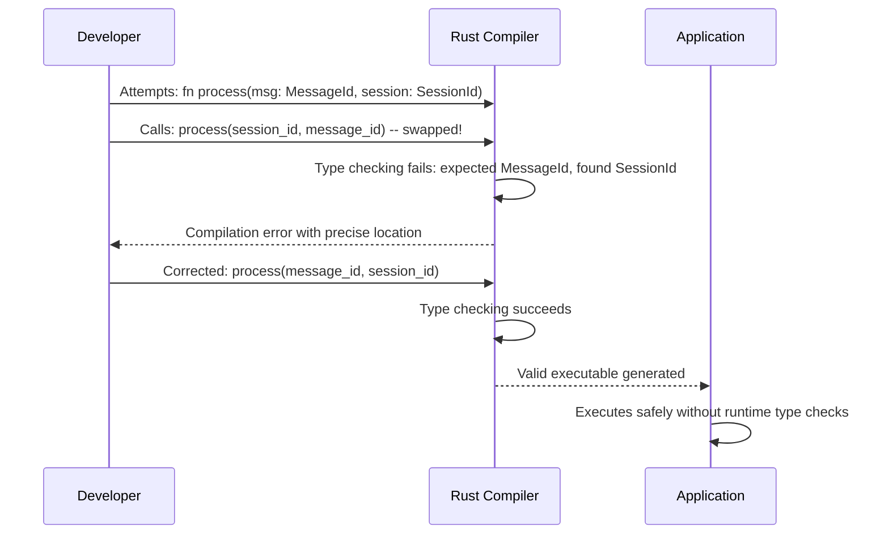

# Compile-Time Type Safety

### From: id

Compile-time type safety refers to the property of a type system that prevents certain categories of errors before program execution by enforcing constraints during compilation. The ragent identifier system exemplifies this principle by ensuring that identifiers of different semantic categories cannot be mixed, even when they share the same underlying representation. This safety is enforced entirely by the Rust compiler's type checker without any runtime checks or performance penalties. The practical benefit manifests in large codebases where dozens of string identifiers might flow through functions—traditional approaches relying on documentation or naming conventions allow accidental substitution of a session ID where a message ID is expected, potentially causing subtle bugs that manifest only in production. By making these distinctions part of the type system, the compiler becomes an active participant in correctness, rejecting invalid code before it can execute. This approach scales particularly well in API boundaries where type signatures communicate intent unambiguously and IDEs can provide precise autocompletion based on expected types.

## Diagram

## External Resources

- [Rust Book: Data types and type safety](https://doc.rust-lang.org/book/ch03-02-data-types.html) - Rust Book: Data types and type safety
- [Research: Quantifying detectable bugs in JavaScript (type safety impact study)](https://www.microsoft.com/en-us/research/publication/to-type-or-not-to-type-quantifying-detectable-bugs-in-javascript/) - Research: Quantifying detectable bugs in JavaScript (type safety impact study)

## Related

- [Newtype Pattern](newtype-pattern.md)
- [Defensive Programming](defensive-programming.md)

## Sources

- [id](../sources/id.md)
