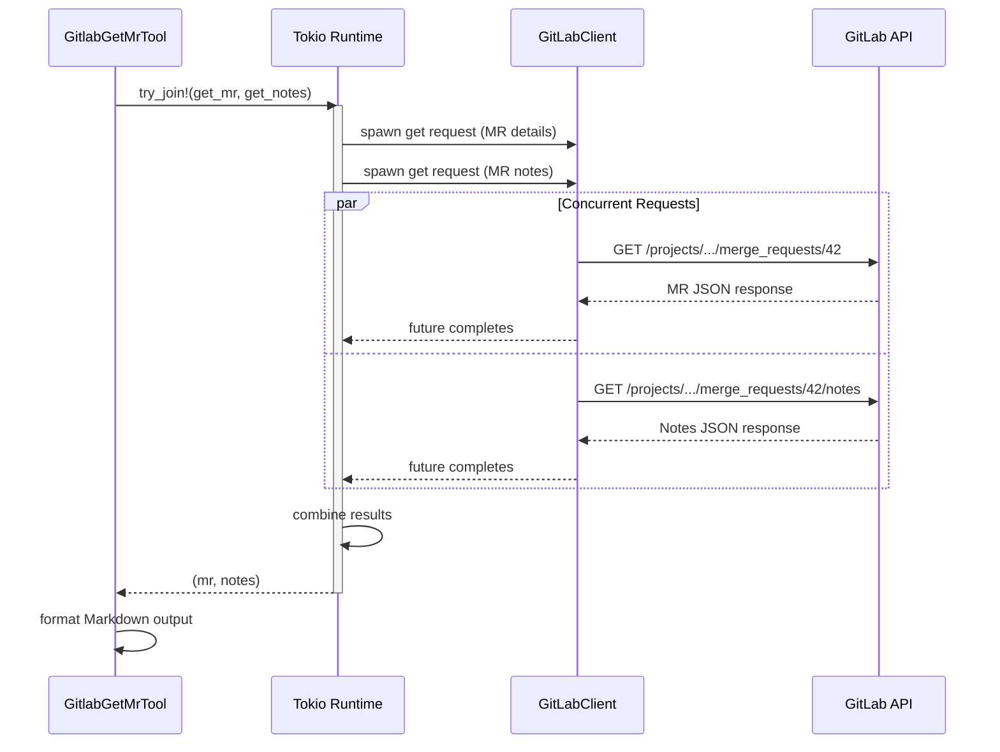

# Concurrent Asynchronous Operations

### From: gitlab_mrs

Concurrent asynchronous operations are a fundamental pattern in Rust's async ecosystem that enables efficient I/O multiplexing without blocking execution threads, critically important for responsive AI agent systems. The GitlabGetMrTool demonstrates this pattern through its use of tokio::try_join! to fetch merge request details and MR notes simultaneously rather than sequentially. This concurrency reduces latency from the sum of two API call durations to approximately the duration of the slower call, a significant optimization when tools may chain multiple API requests. The try_join! macro specifically implements fail-fast semantics—if either request fails, both are cancelled and the error is propagated immediately, preventing partial state and resource waste.

The implementation leverages Rust's ownership and Send/Sync traits to ensure thread-safe concurrency without data races. The GitLabClient instance is shared across concurrent requests through immutable references (&client), with interior mutability likely handled within the client for connection pooling and request state. Rust's async/await syntax desugars to state machines that the tokio runtime polls, suspending at await points and resuming when I/O completes, all without OS thread blocking. This model achieves throughput comparable to languages with green threads or callback-based I/O, but with compile-time safety guarantees and familiar sequential-looking code.

Error handling in concurrent contexts requires careful design—the anyhow::Result type with Context trait enables rich error messages that preserve the causal chain across await boundaries. The ? operator propagates errors through the async state machine transparently. For production systems, additional patterns like timeout wrapping, retry with exponential backoff, and circuit breakers would complement this base concurrency. The tool system architecture benefits from this async foundation by enabling parallel tool execution when dependencies permit, streaming partial results, and maintaining responsive user interfaces even during slow network operations. This concurrency model distinguishes Rust's approach from traditional thread-per-request servers, achieving better resource utilization essential for high-throughput agent systems.

## Diagram

## External Resources

- [Tokio async patterns and bridging sync/async code](https://tokio.rs/tokio/topics/bridging) - Tokio async patterns and bridging sync/async code
- [Asynchronous Programming in Rust book](https://rust-lang.github.io/async-book/) - Asynchronous Programming in Rust book

## Sources

- [gitlab_mrs](../sources/gitlab-mrs.md)
