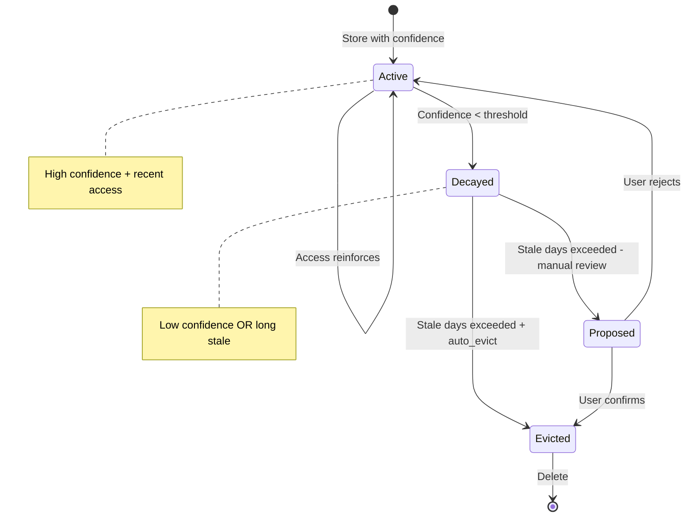

# Confidence-Based Memory Decay

### From: compact

Confidence-based memory decay implements an information lifecycle model where memory relevance degrades over time without reinforcing access, mimicking biological forgetting curves while providing deterministic eviction criteria. The ragent system combines two orthogonal dimensions: confidence magnitude representing the system's certainty in the memory's accuracy or utility, and recency of access indicating continued relevance to ongoing operations. Memories falling below configurable confidence thresholds after extended staleness periods become eviction candidates, preventing accumulation of obsolete or erroneous information that might mislead future reasoning. This dual-criterion approach prevents pathological behaviors that single-metric systems exhibit, such as evicting high-confidence archival knowledge or retaining confidently-wrong information due to recent accidental access.

The auto_evict parameter introduces important user agency into the forgetting process, distinguishing between fully automated maintenance and human-in-the-loop review. When auto_evict is disabled, the system logs proposed evictions to the journal without destructive action, enabling audit and potential reversal while still surfacing maintenance needs. This configurability supports diverse operational contexts from long-term archival systems where retention is paramount to ephemeral session contexts where aggressive cleanup improves performance. The fallback chain for establishing reference timestamps—last_accessed, then updated_at, then created_at—implements defensive programming against missing data while biasing toward conservative retention when uncertainty exists. Such engineering details reflect hard-won operational experience with distributed systems where incomplete telemetry is the norm rather than exception.

## Diagram

## External Resources

- [Ebbinghaus forgetting curve and spaced repetition research](https://en.wikipedia.org/wiki/Forgetting_curve) - Ebbinghaus forgetting curve and spaced repetition research
- [LRU-K replacement policy research for cache eviction optimization](https://dl.acm.org/doi/10.1145/276675.276685) - LRU-K replacement policy research for cache eviction optimization

## Sources

- [compact](../sources/compact.md)
