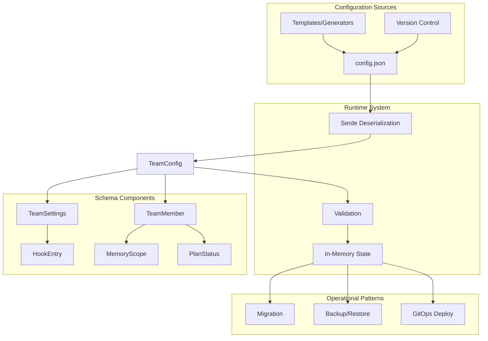

# Configuration-Driven Architecture

### From: config

Configuration-driven architecture is a design approach where system behavior is primarily determined by declarative configuration rather than imperative code, enabling dynamic adaptation and persistent state management. In ragent, the `config.json` file serves as the single source of truth for team composition, settings, and member states, with the `TeamConfig` struct defining the complete schema. This pattern enables teams to be paused, migrated, and resumed by simply preserving and restoring their configuration files.

The architecture leverages Serde for bi-directional mapping between Rust structs and JSON representations, with careful attention to backward compatibility through `#[serde(default)]` attributes that handle missing fields in older configuration versions. The module structure separates concerns into distinct configuration types: `TeamSettings` for policy and limits, `TeamMember` for agent-specific configuration, and `HookEntry` for extensibility. This modularization allows independent evolution of configuration sections without breaking overall parsing.

Configuration-driven design supports operational patterns like GitOps, where team definitions can be version-controlled, reviewed, and deployed through standard CI/CD pipelines. The `created_at` timestamps and status fields provide audit trails for compliance and debugging. By externalizing team structure from code, ragent enables non-developer users to define and modify teams through JSON editing, while developers can programmatically generate configurations from templates or databases. This flexibility is essential for scaling from single-developer experiments to enterprise deployments with hundreds of managed teams.

## Diagram

## External Resources

- [Infrastructure as Code principles](https://en.wikipedia.org/wiki/Infrastructure_as_code) - Infrastructure as Code principles
- [GitOps methodology for declarative systems](https://www.gitops.tech/) - GitOps methodology for declarative systems
- [JSON Schema for configuration validation](https://json-schema.org/) - JSON Schema for configuration validation

## Sources

- [config](../sources/config.md)

### From: test_agent

Configuration-driven architecture is a design approach where system behavior is externally controlled through configuration data rather than hardcoded logic, enabling adaptation without code changes. The ragent-core system exemplifies this through the `Config` struct's central role in agent resolution—behavior is parameterized by configuration rather than determined solely by agent name. This separation of mechanism (resolution logic) from policy (configuration values) creates flexible, maintainable systems.

The architecture's benefits appear in multiple aspects of the tested functionality. The `Config::default()` pattern provides sensible baselines while preserving the capability for customization. By threading configuration through the resolution process, the system enables environment-specific behavior, A/B testing of resolution strategies, and user-specific overrides without modifying core code. The test's use of independent configuration instances per test case demonstrates how this architecture supports isolation and parallelization in testing scenarios.

Configuration-driven approaches require careful design of configuration schemas and validation to prevent invalid states. The test file suggests ragent-core has invested in this design, with configuration being a required, type-safe parameter rather than an optional global. This prevents the configuration drift and implicit dependencies common in systems relying on global configuration state. The pattern scales well to complex deployment scenarios where agents might be configured through files, environment variables, or remote services, with the core system remaining agnostic to configuration source.
