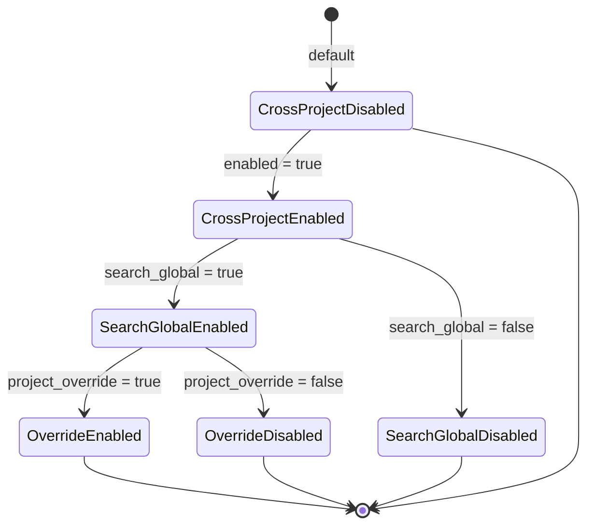

# Configuration-Driven Feature Flags

### From: cross_project

Configuration-driven feature flags represent a software engineering pattern where runtime behavior is controlled through structured configuration rather than compile-time conditionals or hardcoded logic. In Ragent's cross-project module, this pattern manifests through the `CrossProjectConfig` struct with three boolean flags: `enabled` (master switch for the feature), `search_global` (controls whether searches include global scope), and `project_override` (determines shadowing semantics). This granular control allows administrators and users to adopt cross-project memory incrementally, enabling the feature without committing to all its implications immediately. The pattern supports progressive disclosure of complexity, where users can start with simple project-local memory and gradually explore global sharing as their needs evolve.

The implementation demonstrates several best practices for feature flag systems. The configuration is deserialized from JSON, making it human-readable and version-controllable. Default behaviors are sensible and conservative—when in doubt, prefer project isolation over global sharing. The flags are orthogonal where possible, allowing `search_global` to be true while `project_override` is false, supporting use cases like "see global suggestions but don't let them override my project choices." This design anticipates organizational concerns about knowledge management, where teams may want visibility into global standards without mandatory adoption. The pattern also facilitates testing by allowing test functions to construct specific configuration states without file system manipulation, as seen in the `config_enabled`, `config_disabled`, and `config_no_override` helper functions.

## Diagram

## External Resources

- [Martin Fowler on Feature Toggles (Feature Flags)](https://martinfowler.com/articles/feature-toggles.html) - Martin Fowler on Feature Toggles (Feature Flags)
- [Serde serialization framework, likely used for config parsing](https://serde.rs/) - Serde serialization framework, likely used for config parsing

## Related

- [Cross-Project Memory Scope Resolution](cross-project-memory-scope-resolution.md)
- [Memory Block Shadowing](memory-block-shadowing.md)

## Sources

- [cross_project](../sources/cross-project.md)
